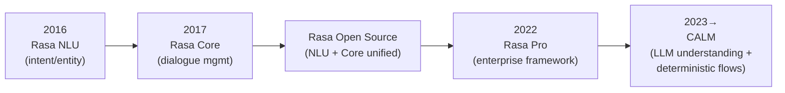
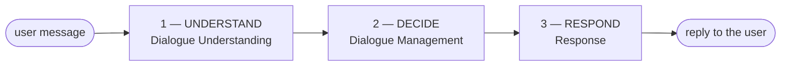
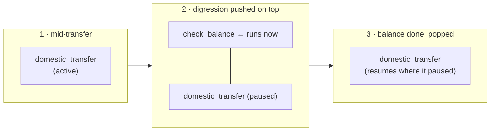
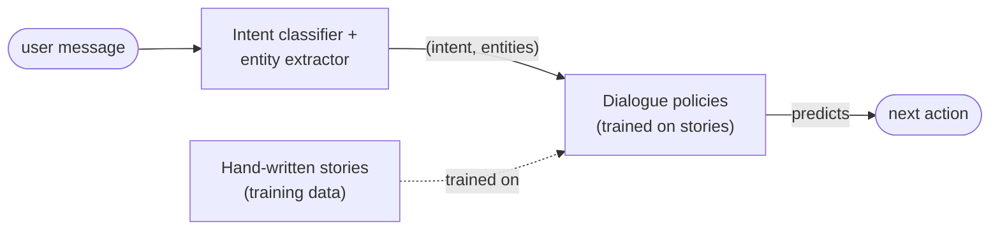
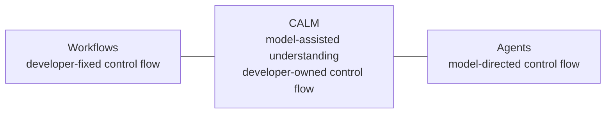
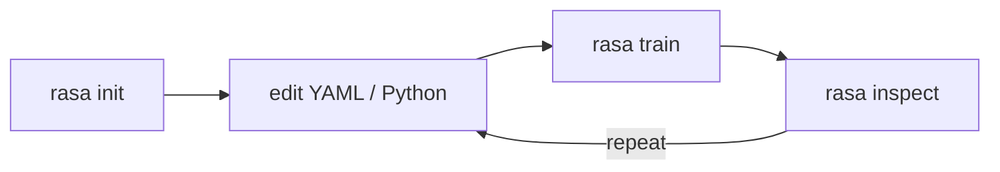
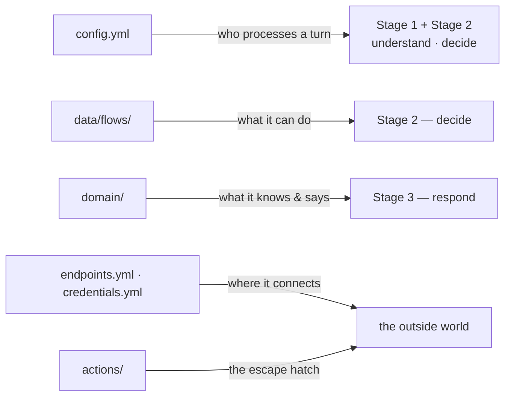

# Day 6 — Rasa CALM: Architecture & Project Anatomy

## Student Study Guide

This chapter introduces **Rasa** and its **CALM** architecture. It opens with what Rasa is, where it came from, and the problems it sets out to solve; surveys the product — its use cases, features, and the way it bridges onto an existing NLU system; then explains the CALM architecture, places it against the alternatives, and ends with the editions, the install, and a tour of a scaffolded project. The treatment is **orientation level**: configuration, flows and domain are covered in full on Day 7, flow design on Day 9, and custom actions on Day 8.

---

## §1 — Introduction to Rasa and CALM

### 1.1 A short history, from NLU to CALM

Rasa was founded in **2016 in Berlin** by Alan Nichol and Alex Weidauer.[^1] Its first product, **Rasa NLU**, was an open-source Python library released that year to give developers control over **natural-language understanding** — the task of reading a user's message and extracting its **intent** (what the user wants) and its **entities** (the values in the message). A year later came **Rasa Core**, a second library for **dialogue management** — deciding what the assistant should do next. The two were introduced together in the 2017 founding paper, whose stated purpose was "to make machine-learning based dialogue management and language understanding accessible to non-specialist software developers."[^2] NLU and Core were later unified into a single open-source package, **Rasa Open Source**.

In **2022** Rasa introduced **Rasa Pro**, a commercial, enterprise-grade framework built on that foundation, adding what production teams need beyond the open-source core — security scanning, Kubernetes deployment, multichannel connectors, tracing and analytics.[^3] Then in **2023** Rasa announced **CALM** — **Conversational AI with Language Models** — a new approach that uses a large language model as the assistant's understanding layer while keeping business logic deterministic.[^4] Rasa Pro is the home of CALM, and CALM is what this course teaches.



CALM **continues the founding legacy** rather than breaking from it. The 2016 motivation — giving developers real control over how an assistant understands language and manages a conversation — is unchanged; what changed is the machinery. Where the classic stack used a trained intent classifier and hand-written dialogue rules, CALM uses an LLM for understanding and declared flows for logic. Rasa frames it as a way to "shift from traditional intent-driven systems to LLM-based agents."[^5]

### 1.2 What Rasa is for, and the problems it solves

Rasa Pro is a framework for building scalable, **high-trust** conversational AI agents, using large language models to enable more contextually aware, agentic interactions.[^5] The load-bearing word is **high-trust**: the positioning is not "an LLM that chats" but an LLM assistant whose behaviour a regulated organisation can rely on and audit. Four recurring problems shape that design.

- **Brittle intent-and-tree bots.** The pre-LLM generation of assistants classified each message into one intent from a fixed catalogue and walked a hand-authored dialogue tree. Such systems break when a user phrases a request a new way, interrupts, or digresses, and every new phrasing is a fresh training-data task. This is the brittleness CALM's understanding layer is meant to remove.[^2][^5]
- **Ungoverned LLM behaviour.** A single LLM left to both understand *and* act can hallucinate, be talked out of a rule, or take an action no one authorised. Rasa's design response is to let the LLM understand but never execute business logic directly, so that declared business logic is always followed and CALM is resistant to hallucination, prompt injection, and jailbreaking by design (claim).[^5] What that guard does and does not cover is set out precisely in §2.2.
- **The enterprise need for control and auditability.** Rasa Pro exists because enterprises need much more than an open-source library to deploy, maintain, orchestrate, and secure their assistants.[^3] For a regulated, customer-facing deployment, the relevant property is that the logic the auditors will ask about is declared, reviewable, and executed literally rather than predicted.
- **Data control.** Rasa can run fully on-premise, with no calls to external LLMs,[^5] which addresses the data-residency requirement common in industries that require strict data governance.

In one sentence: **Rasa is a framework for building conversational AI assistants that combine the fluency of an LLM with deterministic, developer-controlled business logic** — so a team keeps control, reliability, and the option to run on its own infrastructure.

### 1.3 Product overview: use cases and features

**Use cases.** Rasa positions the product around many customer-facing domains. A few examples of the main targets:

- **Customer Experience & Support** — onboarding and guided help, FAQ and repetitive-issue resolution, billing questions, order tracking, account changes, and 24/7 support that handles routine contacts so human agents handle the harder ones.[^6]
- **Process Automation** — repetitive internal and operational workflows such as IT-helpdesk requests (password resets, access requests) and high-volume service-desk inquiries, absorbing peak demand without added headcount.[^7]
- **Sales & Marketing** — lead qualification, personalised recommendations, cross-sell at the point of purchase, and guided assistance through complex purchase flows.[^8]

Rasa's case studies cite customer outcomes such as N26 deflecting 30% of routine customer-service contacts (claim).[^6]

**Features.** Four capabilities matter for this course.

- **Flow orchestration with AI agents.** The assistant's tasks are written as **flows** (§2.3), and an LLM routes the conversation between them — choosing what should happen next while the flows themselves run deterministically.[^9]
- **Integration with existing NLU.** A classic intent-based NLU pipeline can run *alongside* CALM in the same assistant, so a team is not forced to choose one or the other. This is the bridge described in §1.4.[^10]
- **Real-time voice.** Rasa Pro documents voice assistants in two channel classes: **Voice Ready** channels exchange audio but process it as text via external speech-to-text and text-to-speech services, while **Voice Stream** channels process audio end to end and support real-time turn-taking and interruption ("barge-in"). Documented connectors include Twilio, Genesys Cloud, AudioCodes, Jambonz, and Browser Audio.[^11]
- **MCP and tool integration.** Beyond flows, Rasa's orchestration can route to external tools — including tools exposed over the **Model Context Protocol (MCP)** — and to knowledge retrieval; the mechanics are a later-day topic.[^9]

### 1.4 The advantage of bridging onto an existing NLU system

For an organisation that already runs an intent-based assistant in production, the strongest practical argument for Rasa is that adoption need not be a rip-and-replace. Rasa's **coexistence** feature runs an NLU-based system and CALM together in one assistant, so a team migrates one capability at a time. The value is three-fold: it **preserves the existing NLU investment** (the in-production pipeline and its intents keep working), it **de-risks adoption** by moving skill by skill with confidence built in production, and it **avoids any waterfall cutover**.[^10]

Mechanically, a **routing** layer sends each message to one system or the other, and routing is usually **sticky** — once a message is routed, the following messages stay with the same system until the task completes.[^12] Two routers are available: an **`IntentBasedRouter`**, which routes on the NLU pipeline's predicted intent, and an **`LLMBasedRouter`**, which uses an LLM to decide.[^10]

One real constraint comes with it: the two systems run side by side but cannot interrupt each other — an NLU-based skill cannot interrupt a CALM skill, or vice versa.[^10] The migration is incremental and low-risk, but the seam between the two systems is real.

### 1.5 What CALM is, in the context of the framework


**CALM is the dialogue system that runs a modern Rasa assistant.** Its defining idea is a division of labour: an LLM **understands** the user in the full context of the conversation, **deterministic flows decide** what to do, and **templated responses** phrase the reply — the LLM keeps the conversation fluent without guessing the business logic.[^13] The command generator, the dialogue stack, and the response layer that implement this division are the subject of §2.

### 1.6 Our setup for the course

**Version and documentation.** This course uses **Rasa Pro 3.17**, and every example targets it. The package, `rasa-pro`, is published on the public PyPI.[^14] The reference throughout is the official Rasa documentation at [rasa.com/docs](https://rasa.com/docs) (with its concepts layer at `/docs/learn` and reference layer at `/docs/reference`). Where a model name or default is mentioned, assume it reflects the current release.

---

## §2 — The CALM architecture: understand, decide, respond

Every user turn passes through three stages: the assistant **understands** the message, **decides** what to do next, and **responds**.[^13] Only the first stage uses an LLM; everything after it is deterministic.



Two terms recur and are worth fixing first. A **flow** is a business process written as an ordered series of steps — in Rasa, a YAML description of one task (*ask for amount → confirm → execute*). A **slot** is a named piece of information the assistant collects and remembers during a conversation: its working memory.

The division has four benefits, each revisited below:

- **Separation of concerns** — understanding, decision-making, and wording are three different jobs done by three different mechanisms (an LLM, the flow engine, templated responses), so each can be changed, reviewed, and tested on its own.
- **Determinism** — given the same commands and the same flows, the assistant does the same thing every time; there is no learned policy to drift.[^15]
- **Efficiency** — because the LLM only understands and routes rather than carrying the whole task, CALM can use smaller, cheaper models for the job.[^13]
- **Built-in conversational awareness** — the messy parts of real dialogue (a correction, a topic change, a request to clarify) are detected and handled by mechanisms CALM ships with, rather than scripted task by task (§2.3).[^13]

### 2.1 Stage 1 — Dialogue Understanding: the command generator

**Dialogue understanding** is the assistant's ability to interpret user input and determine the next best step in the conversation.[^16] It is the one stage where an LLM does the interpreting. The component that performs it is the **command generator**: on each user turn it reads the conversation in context and produces a short list of high-level **commands** describing how to advance the dialogue. It only proposes the next steps — it does not carry them out.[^16]

Crucially, it reads the **whole conversation**, not just the last message:[^16]

- the **conversation so far**, including the latest message,
- the **flows that could be relevant** — each flow advertises itself through a natural-language `description`,
- the **flow currently active**, and
- the **slots already filled**.

Making it concrete with an example. The customer of a bank writes:

> "I need to send 200 euros to my sister Giulia."

The command generator emits something like:

```text
start flow domestic_transfer
set slot recipient Giulia
set slot amount 200
```

Three commands, one turn — and **no intent label anywhere**. In a single pass over the full sentence it picked the business process *and* extracted two slot values.

**The command vocabulary.** Commands are drawn from a *fixed vocabulary* that the Rasa team maintains and tests; an assistant author does not invent new ones.[^17] The two a learner meets first are `start flow <name>` and `set slot <name> <value>`. The broader set includes:

| Command | What it expresses |
|---|---|
| `start flow <name>` | begin a task |
| `set slot <name> <value>` | record (or update) a piece of information |
| `cancel flow` | stop the current task |
| `disambiguate flows <a> <b> …` | the request matches more than one task; ask which |
| `search and reply` | answer a factual/FAQ question from a knowledge base |
| `offtopic reply` | handle social small-talk |
| `repeat message` | repeat the last thing the assistant said |

Two points worth fixing now. There is **no separate "correct slot" command**: when a user revises a value they already gave, the generator emits `set slot` again with the new value.[^17] And a request the assistant cannot serve is **not** signalled by a command — the *absence* of any usable command is what triggers the assistant's fallback handling (§2.3). The full vocabulary and its prompt are a Day 7 topic; today you need the *shape*, not the inventory.

**The generator can be an LLM or an NLU model.** The default command generator is LLM-based, but Rasa also provides an **`NLUCommandAdapter`** that turns the output of a classic intent classifier into the same commands.[^18] The two can run together — the **hybrid** approach behind the coexistence story of §1.4: the cheap, deterministic NLU model handles the inputs it already classifies well, and the LLM handles the rest. This is why "the command generator" is an architectural slot, not a single fixed model.

### 2.2 Structured output as an architectural guarantee

The command generator **is structured output as an architecture.** *Structured output* means constraining a model's generation to a declared schema and validating the result, so the *shape* of the output is guaranteed by construction. The *truth* is not — a perfectly-shaped object can still carry a hallucinated value — so semantic validation stays the application's job.

CALM goes one step further: the LLM's **only output channel** is a command list, and that list is **validated against the project**. It can reference only flows and slots that *actually exist* — it cannot invent new workflows.[^13] A hallucinated flow name simply does not survive validation. The consequence is the strongest sentence in the architecture:

> **There is no path from the model's imagination to a side effect.**

This is the mechanism behind CALM's resistance to hallucination, prompt injection, and jailbreaking (claim).[^5] Stated precisely, with the honest limit attached:

- An injected instruction **cannot** make the assistant *do* something outside its declared flows — commands are validated against a fixed schema and never executed as free text.[^13]
- It **could** still steer the generator toward a *wrong-but-valid* command — the wrong flow, or a wrong slot value.

So the architecture **shrinks the attack surface; it does not abolish the threat.** A validated command vocabulary is a real guard built into the frame, not a slogan — but it is the first guard, not the last.

### 2.3 Stage 2 — Dialogue Management: flows, FlowPolicy, and the dialogue stack

**Dialogue management** is the part of Rasa that decides the best next step from the user's input and the current conversation state.[^19] The move that defines CALM is here: a developer does not script every possible turn but declares **flows**, and dialogue management moves through them, staying within the boundaries of the business logic the flows define.[^19] The component that executes them is the **FlowPolicy**.[^15]

That boundary is what makes the behaviour **deterministic**: given the same commands and the same flow definitions, the same thing happens, every time. There is no learned policy, no probability, nothing to drift. The business logic the organization's auditors will ask about is **YAML, in version control, executed literally**.[^15]

**Anatomy of a flow.** A flow has a **name**, a **description**, and an ordered list of **steps**.[^20] The description is not decoration: it is the natural-language sentence the command generator reads to decide *when* to start the flow, so writing a clear description is part of writing the flow.[^20] The steps are built from a small set of building blocks:[^21]

| Step | What it does |
|---|---|
| `collect` | ask the user for a value and store it in a slot |
| `action` | run code (a custom action) or send a response |
| `set_slots` | assign slot values programmatically |
| `link` | hand off to another flow and end this one |
| `call` | run another flow (or a tool) inline, then return |
| conditions (`next` / `if` / `else`) | branch on slot values |

The official `transfer_money` tutorial flow shows them combined:[^22]

```yaml
flows:
  transfer_money:
    description: Help users send money to friends and family.
    steps:
      - collect: recipient
      - collect: amount
        description: the number of US dollars to send
      - action: action_check_sufficient_funds
        next:
          - if: not slots.has_sufficient_funds
            then:
              - action: utter_insufficient_funds
                next: END
          - else: final_confirmation
      - collect: final_confirmation
        id: final_confirmation
        next:
          - if: not slots.final_confirmation
            then:
              - action: utter_transfer_cancelled
                next: END
          - else: transfer_successful
      - action: utter_transfer_complete
        id: transfer_successful
```

Read plainly: ask who to pay, ask how much, check the balance, and *if* funds are short say so and stop, *otherwise* ask for confirmation, and *if* the user declines cancel, *otherwise* complete. The flow describes the task's logic — not every possible thing the user might say. (Flow syntax in depth is Day 9.)

**The dialogue stack.** Dialogue management keeps the active flows on a **dialogue stack**. When a flow starts it is placed on top, like stacking plates; the topmost flow is always the one being worked on, and once it finishes or is cancelled, control returns to the flow beneath it. The ordering is **last-in, first-out (LIFO)**: flows below the top are paused and resume once everything above them completes.[^13][^19]



A worked example: a customer is mid-transfer when they ask "Wait — what's my balance first?" The command generator emits `start flow check_balance`; that flow is pushed *above* the paused transfer, runs to completion, and is popped; the transfer resumes exactly where it paused. **Nobody wrote a story for "user asks balance mid-transfer."** In a classic stack that scenario is a training-data project; here the interruption-and-resumption behaviour falls out of the **LIFO stack** — a data structure, not a dataset. (The stack is treated in full on Day 9.)

**Conversation patterns.** When a user deviates — correcting, interrupting, changing topic, or asking for something out of scope — the work is absorbed by **conversation patterns**: reusable system flows CALM provides to repair the conversation when customers don't follow the expected path.[^23] There are thus two kinds of flow: the ones a team writes for its business logic, and the patterns CALM ships to handle the recurring, non-business-specific moments any conversation produces. Because the prepackaged patterns absorb the detours, a team's own flows stay focused on the high-level task steps instead of accounting for every possible detour.[^23] These system flows sort into five broad kinds of moment:

| Family | What it handles | Examples |
|---|---|---|
| **Conversation Repair** | the user breaks the expected path | correction, clarification, interruption |
| **Conversation Navigation** | the user steers the session | cancel, restart, complete |
| **External Support** | the turn needs something outside the flow | search, human handoff, chitchat |
| **Voice** | spoken-channel moments | repeat, silence |
| **System Error** | something fails internally | internal error, cannot-handle fallback |

Patterns are flows like any other, so they are edited like any other flow; each ships with a default a team is "free to customize."[^23] (Repair patterns are a Day 11 topic.)

### 2.4 Stage 3 — Response: templated answers, optionally rephrased

When a flow step says the assistant should speak, the words come from **templated responses declared in the domain**.[^13] The customer-facing sentence about the customer's money was written by a human, reviewed like code, and rendered with slot values — not generated. The wording is **fully owned**, and this is the part of the classic stack CALM carries over unchanged. Because conversation patterns speak through the same templated layer, the "fully owned" property extends to repair wording too.

A response template is more than a fixed string. It can **interpolate slot values** into the text, so one template greets each customer by name or quotes their actual balance. It can hold **several phrasings** under one name and vary between them, so the assistant does not read robotically. It can resolve to **different wording by condition or channel** — one phrasing when a slot holds a given value, another on a voice channel than in chat. And it can carry more than words: **buttons** (whose taps can set a slot directly), images, or a **custom payload** for a channel-specific interface.[^33]

One optional component sits here: the **Contextual Response Rephraser**, an LLM that can rewrite the templated text to fit the conversational moment.[^13]. Switching it on trades control for naturalness, and the trade is worth stating plainly:

- **What it buys** — replies that read as more natural and context-aware, while a team still owns the underlying template and can customise behaviour.
- **What it costs** — it reintroduces a **generation surface** on top of reviewed text, and with it the LLM failure modes the rest of the architecture works to bound: a risk of **hallucination** in the rephrased wording, exposure to **prompt injection**, a **privacy** consideration (the response text, possibly with slot values, is sent to a model), and added **latency** from an extra model call. Turning it on is a deliberate decision, not a default that is inherited.

### 2.5 Why this division matters

The three stages split responsibility deliberately: language understanding goes to the model, decisions and anything that touches money go to code, wording goes to templates.

> The model never picks an action, never executes anything, and never composes the sentence about the customer's balance. It emits validated commands, and deterministic machinery does the rest.

---

## §3 — How CALM compares: classic NLU, ReAct agents, and CALM

CALM is one of three broad ways to build a conversational assistant, and they differ in how much they lean on the LLM: the **classic** approach keeps it out of the loop, the **LLM-centric** (ReAct) approach hands it both understanding and action, and CALM takes the **hybrid** path — the LLM understands, deterministic logic executes. All three are architectures with different trade-offs, not a past-versus-future story.[^13]

### 3.1 The three approaches

**Classic NLU / intent-based.** Each user message is classified into exactly one **intent** (plus any **entities**) from a fixed catalogue, and hand-written **stories**, **rules**, or dialogue trees decide the next step. There is no LLM in the loop, which makes the system **deterministic, cheap, low-latency, and easy to trace**.[^13] Its limits are structural: it cannot understand a message that fits no intent; rigid trees break when a user deviates; accuracy degrades as intents overlap at scale; and every new phrasing needs new training data.



Two words are load-bearing, because they are exactly what CALM changes: the message is *compressed* to a label, and the next action is *predicted* by a learned policy.

**ReAct-style agents.** A single LLM does *both* jobs each turn — it understands the message **and** decides the next action — with the business logic living in the prompt. This is **flexible, open-ended, and needs minimal scaffolding**.[^13] Its limits mirror that freedom: decisions are inconsistent because the model guesses the logic on the fly; debugging is hard because the reasoning is unstructured text; cost and latency are high because a turn can mean several serial LLM calls; and performance degrades as tasks accumulate.[^13]

**CALM.** The LLM understands the message in full conversation context; **deterministic flows decide** the next step.[^13]

### 3.2 Six dimensions, three approaches

The three approaches compare across six dimensions, each a trade-off rather than a verdict:[^13]

| Dimension | Classic NLU / intent bots | ReAct-style agents | CALM assistants |
|---|---|---|---|
| **Suitable use cases** | Best where you cannot or need not use an LLM; deterministic outcomes | Best for open-ended, exploratory tasks where flexibility outweighs structure | Ideal for structured tasks with clear goals, balancing fluency and reliability |
| **Understanding the user** | Classifies the last message only, without full-conversation context | Combines understanding and action in one process | Uses an LLM to understand in conversation context, separate from execution |
| **Deciding the next step** | Predefined in large dialogue trees; breaks if users deviate | Embedded in LLM prompts; inconsistent, on-the-fly decisions | Defined in flows; the LLM routes between flows, which execute deterministically |
| **Scaling to many tasks** | Accuracy suffers as topics overlap | Performance degrades as tasks/agents are added | Scales reliably to many topics and flows |
| **Ease of troubleshooting** | Straightforward — every path is pre-planned | Tough — you read through unstructured reasoning text | Eased by separating reasoning from task execution |
| **Cost in production** | Very inexpensive, low latency | High cost and latency from serial LLM calls | Cost-efficient; can use smaller fine-tuned models |

Which architecture wins depends on which dimensions a mandate weights. Where **auditability, determinism, and ease of troubleshooting** dominate — a regulated, customer-facing, process-shaped mandate — CALM is the strong fit. Where raw **cost and latency** are the only axes that matter, classic NLU wins; where **open-ended flexibility** is the goal, a ReAct-style agent does.

### 3.3 Where CALM lands on the autonomy spectrum

Cutting across the comparison is an **autonomy spectrum**, running from **developer-fixed control flow (workflows)** at one end to **model-directed control flow (agents)** at the other.



CALM's position is precise: **toward the workflow end — model-assisted understanding, developer-owned control flow.** Stage 1 is the model's; stages 2 and 3 are the developer's.

A code-first alternative exists. A library such as **Pydantic AI** — for building typed LLM agents in Python — gives full Python flexibility, no framework to learn, no YAML dialect, and direct control of the loop; a code-first agent of that kind takes about thirty lines. For a research-style assistant, an internal one-off automation, or a task whose shape is discovered as you go, the code-first path is the better tool. Which path fits depends on what the deployment optimises for: a regulated, customer-facing process favours CALM's structure; open-ended or one-off work favours the code-first agent.

### 3.4 What the structured approach buys — and what it costs

What CALM's structure buys:

- **Auditability.** The business logic is declared YAML flows — diffable, reviewable in a pull request, readable by a compliance officer who has never written Python. In a free agent loop the logic is *emergent* from prompt, tools, and the model's choices on the day; "what can this system do?" has no closed-form answer.
- **Determinism where it is needed.** Declared flows execute their steps and nothing else.[^15] The eligibility check before a transfer runs every time, in the same order, regardless of how persuasive the user message was.
- **Guardrail placement.** Every real defence against an LLM failure is a deterministic guard outside the model. CALM gives those guards a natural home — in the flow definitions and the action code — instead of scattering them through a prompt.
- **Team legibility.** Flows are readable by product owners and non-ML engineers; a conversation designer and a backend engineer can work on the same artifact.
- **Evaluation surface.** Declared flows are an *enumerable* set of paths, which is what an eval set needs; the scaffold ships with end-to-end tests (Day 11).

What it costs:

- **Less open-ended flexibility** than a free agent loop — if the user's need has no flow, the assistant cannot improvise one. By design, but still a limit.
- **A framework learning curve** — the flow, domain and config model takes real time to learn.
- **YAML as a constraint** — branching logic in YAML is more ceremonious than in Python, and you will sometimes feel it.
- **An LLM dependency that has not gone away** — the command generator calls a model on (almost) every turn, so per-turn model cost, prompt size and provider latency still need a line on the process map.

**When Rasa is the wrong tool.** An **open-ended research assistant** ("analyse this portfolio and tell me something interesting") has no process shape for flows to declare. A **one-off internal automation** one engineer runs monthly does not repay the framework setup. A task that **cannot yet be mapped** as a process is too early for any framework. Repeatable, auditable, customer-facing processes are close to the **best case** for CALM.

---

## §4 — Editions, licensing & installation

The caps and clauses below decide what you can **legally deploy**.

### 4.1 The editions

The Rasa platform ships in three tiers:[^24]

- **Developer Edition** — *free*; full access to Rasa Pro and CALM; community support.
- **Business (Pro + Studio)** — paid; adds **Rasa Studio**, the no-code/low-code UI for business users, plus higher limits and basic support.
- **Enterprise** — paid; premium support, advanced security, scale.

**Rasa Studio is not included in the Developer Edition** — the pricing page lists Studio under Business and Enterprise only.[^24] This course therefore teaches the **pro-code CLI path throughout**, and nothing it builds depends on Studio.

### 4.2 The restrictions

From the Rasa Developer Terms[^25] and the license request page,[^26] stated exactly:

| Restriction | Developer Edition terms |
|---|---|
| **Conversation cap** | **1,000 conversations/month** for a customer-facing assistant; **100/month** for an internal one. You choose **one** of the two use-case types.[^25][^26] |
| **Use cases** | **One use case per organisation** — one specific application. A second bot requires a commercial license; affiliates or subsidiaries cannot circumvent the limit.[^25] |
| **Key validity** | Each license key is valid for **12 months**; renewal requires contacting Rasa.[^25] |
| **Production** | **Explicitly permitted** — deployment to commercial production is allowed within the caps.[^25] |
| **Financial advice** | Assistants **must not "provide professional financial advice"** — informational content is allowed; professional guidance must be directed to licensed advisors.[^25] |
| **Key sharing** | Prohibited.[^25] |

Obtaining a key is a public request form with no eligibility screening.[^26]

### 4.3 Installing Rasa Pro

The package is `rasa-pro`, on the **public PyPI** — no private index.[^14] The recommended installer is `uv`.[^27] The sequence from the install docs:[^27]

```bash
# 1. Install uv
curl -LsSf https://astral.sh/uv/install.sh | sh

# 2. Create project directory and virtual environment
mkdir my-rasa-assistant
cd my-rasa-assistant
uv venv --python 3.11

# 3. Activate the virtual environment
source .venv/bin/activate

# 4. Install rasa-pro
uv pip install rasa-pro

# 5. Set the licence (persistent: add to ~/.zshrc or ~/.bashrc)
export RASA_LICENSE="<your-license-key-string>"

# 6. Verify the installation
rasa --version
```

**Python version.** Rasa Pro supports **Python 3.10–3.13**.[^28] The worked install example uses 3.11. Versions 3.12 and 3.13 are viable for CALM-only projects; the only constraint is the TensorFlow stack behind the legacy NLU extras, which requires Python below 3.12.[^28] Since this course is pure CALM, any of the four works — use **3.11** if you might later add NLU components for the coexistence story, otherwise **3.12/3.13** freely.

**The license variable.** The license is read from the `RASA_LICENSE` environment variable.[^25] It is a **credential**, so standard secrets hygiene applies in full — an environment variable or a secret manager, never a literal in a file, never in a repo.

**The LLM provider key.** A CALM assistant **cannot run without a configured LLM**[^29] — Dialogue Understanding *is* an LLM call. So alongside the license you export a provider key (for the default OpenAI setup, `OPENAI_API_KEY`[^29]). The key is needed to **build** the assistant, not only to run it: `rasa train` makes an embedding call before it can produce a model, so a train with no provider key fails — what training does for a CALM project is set out in §4.4.

**Providers at a glance** (full configuration is Day 7): **OpenAI** is the default; **Azure OpenAI** and **Amazon Bedrock** have first-class configuration shapes; and because the backend uses **LiteLLM**, any LiteLLM-compatible endpoint is reachable — covering Anthropic, Mistral, Cohere, Groq, and self-hosted vLLM/Ollama.[^29] Where data-boundary questions matter, the relevant fact is that **Azure and self-hosted paths exist and are configuration, not code.**

### 4.4 The CLI workflow loop

The usual loop a developer follows when working on a Rasa assistant:[^30]



- `rasa init` scaffolds a complete starter project from an empty directory (§5).
- `rasa train` produces the model artifact under `models/`, and is **incremental**: when only part of the project changes, only that part is rebuilt, and unchanged components restore from cache.[^30]
- `rasa inspect` opens the browser-based **Inspector** on the last-trained model, where most development time is spent; it is the subject of §6.[^31]

Two further verbs: `rasa shell` loads the latest model for a quick plain-text chat in the terminal, with no browser; `rasa run` starts the HTTP server that hosts the model behind Rasa's REST API, for connecting real channels.[^30]

**What `rasa train` does when nothing is "trained."** A pure-CALM project has no intent classifier and no learned dialogue policy — the FlowPolicy executes declared flows deterministically (§2.3) — so `rasa train` fits no statistical model to data the way a classic NLU pipeline does; in that sense there is nothing to *train*. The command instead **validates** the project, **compiles** the flows, domain and config into the model artifact, and builds the structure the command generator relies on at runtime: the **flow-retrieval index**. Each flow's `description` — and, optionally, its slot descriptions and allowed values — is turned into a short document, passed through the **embedding model**, and stored as a vector.[^17] That embedding step is itself a model call, which is why the provider key is needed to build the assistant and not only to run it (§4.3). At runtime the command generator embeds the live conversation and compares it against this vector store, including only the flows most relevant to the current moment in the prompt — the mechanism that lets an assistant carry hundreds of flows without overflowing the model's context window.[^17]

---

## §5 — Project anatomy: the scaffold tour

### 5.1 Scaffolding the project

The scaffold command is:

```bash
rasa init --template default
```

`rasa init` offers five templates, selected with `--template`: **`default`**, **`tutorial`**, **`basic`**, **`finance`**, and **`telco`**.[^30] They differ mainly in domain and richness:

- **`default`** — the CALM scaffold used when no template is given: a small, domain-neutral contact-list assistant with three flows (`add_contact`, `list_contacts`, `remove_contact`), real custom actions, and a starter test suite. The canonical example for learning CALM mechanics.
- **`tutorial`** — the most stripped-down option: a single money-transfer flow, meant to be built up step by step alongside the tutorial.[^22]
- **`basic`** — the conversational scaffolding common to any assistant (greetings, help, feedback, human handoff, knowledge-base search) but no business task flows: a skeleton for an agent's "social" layer.
- **`finance`** — a full retail-banking demo (accounts, cards, transfers, bills, contacts) backed by a mock database and an FAQ knowledge base. The closest off-the-shelf match to a bank's context.
- **`telco`** — a full telecom customer-service demo (network diagnostics, router troubleshooting, billing inquiries) backed by custom actions and mock data.

`rasa init` can also train an initial model as part of scaffolding.

### 5.2 The scaffold tree

A `default` scaffold lays out this set of files and directories:[^30]

```text
my-assistant/
├── actions/                  # custom Python: the escape hatch
│   ├── __init__.py
│   ├── add_contact.py
│   ├── db.py
│   ├── list_contacts.py
│   └── remove_contact.py
├── config.yml                # the pipeline and policies
├── credentials.yml           # channels
├── data/
│   └── flows/                # business logic, one file per flow
│       ├── add_contact.yml
│       ├── list_contacts.yml
│       └── remove_contact.yml
├── db/
│   └── contacts.json         # the demo's mock datastore
├── domain/                   # slots, responses, actions registry
│   ├── add_contact.yml
│   ├── list_contacts.yml
│   ├── remove_contact.yml
│   └── shared.yml
├── e2e_tests/                # the test suite, from day one
│   ├── cancelations/
│   ├── corrections/
│   └── happy_paths/
└── endpoints.yml             # models, action server, stores
```

(`models/` appears after the first `rasa train`.)

### 5.3 The tour: one question per file

Each file answers one of four questions, anchored to §2's diagram: **who understands? who decides? who speaks? who connects?** Each is plain YAML — keys and values nested by indentation — and the four important files split cleanly by job, so a customization glimpsed in passing is easy to place.

**`config.yml` — who processes a turn.** It declares *how a turn is processed*, and three keys carry the weight. The `recipe` (`default.v1`) selects the assistant's wiring, and you essentially never change it. The `pipeline` lists the components that read each message and turn it into commands — its lead component is the **command generator** (stage 1). The `policies` list names what decides the next move; for CALM that is the **FlowPolicy** (stage 2), which has no configuration of its own. A minimal CALM config is exactly these two working components:[^32]

```yaml
recipe: default.v1
language: en
pipeline:
  - name: CompactLLMCommandGenerator
policies:
  - name: FlowPolicy
```

One generator, one policy — a complete assistant — in contrast to the multi-stage pipelines a classic NLU stack requires.[^32] (Every key is covered on Day 7.)

**`domain/` — what the assistant knows and can say.** The domain is the universe the assistant operates in, and it holds three things worth recognising on sight: **slots**, its working memory (a key-value store of what the user said and what it looked up); **responses**, the templated sentences it is allowed to say (stage 3's owned voice); and the **registry of custom actions**, the code-backed things it can do. If a flow says "speak," the words live in `responses`; if a flow says "do," the action is declared here. The template splits the domain into per-topic files and the flows into one file per flow; a single `domain.yml` and a single `data/flows.yml` work too — layout is a code-organisation choice, not a framework rule.[^21]

**`data/flows/` — what the assistant can do.** The business logic, as YAML flows. To read a flow, look for three parts: a **name** (which task this is), a **description**, and an ordered list of **steps**. The `description` is not a comment: it is the natural-language sentence the **command generator reads** when deciding whether that flow matches the user's request — it is how a flow advertises itself to stage 1, which is why a description like "block a card if the user suspects fraud" works better than "card blocking." The steps below it are the ordered moves the assistant runs once the flow has started.[^20] (Flow syntax in full: Day 9.)

**`endpoints.yml` — where things live.** The wiring to outside services. The piece to notice first is **model groups**: where you name the LLM and its provider — and **the model choice lives here, not in `config.yml`**, which only points at a model group by id.[^29] The file also carries the **action-server address** (where custom-action code runs) and, later, the **production stores** — where conversations are kept, plus event brokers and locks. One thing is deliberately *absent*: the API key. Rasa refuses a key written into the file; for OpenAI it reads `OPENAI_API_KEY` from the environment[^29] — secrets hygiene the framework enforces.

**`credentials.yml` — where the assistant listens.** Each top-level key activates a channel; the scaffold enables the `rest` channel out of the box.[^30]

**`actions/` — the escape hatch to real systems.** Plain Python classes the flows can call — where the balance lookup, the card-block API call, and the integrations will eventually live. The scaffold ships small working examples backed by a mock datastore. (Custom actions in full: Day 8.)

**`e2e_tests/` — the testing culture, from day one.** The scaffold does not merely permit testing — it *starts* you with a suite: `happy_paths/`, `cancelations/`, `corrections/`.[^30] The full testing story is built on exactly this surface (Day 11).



Every file lands on a stage of §2's diagram — anatomy and architecture map onto each other.

---

## §6 — The Rasa Inspector, a brief intro

### 6.1 What it is and how to launch

Once the assistant is trained, `rasa inspect` starts a local version of the **last-trained model** and opens it in a new browser tab, letting you chat with the assistant and watch what happens under the hood in real time.[^31] By default the Inspector opens in **chat-only mode**; clicking the **Inspect** button in the header reveals the panels alongside the conversation.[^31]

### 6.2 The three panels

With inspect mode active, the interface shows three panels side by side:[^31]

- **Preview** — where you chat with the assistant. Each exchange appears in the conversation log together with **inline events** — slot sets, action executions, and the command the model emitted — so the execution trace is made legible instead of staying a black box; clicking any event opens its details. The panel header carries a few quick actions: **Copy** the conversation, **Restart** to discard the session and begin a fresh one, and **Download**, which exports the conversation either as end-to-end test cases or as raw tracker logs — so a manual chat that exercised a path can be saved as a test (the testing surface is Day 11).[^31]
- **Flow** — a **live flowchart of the currently active flow**; as the conversation progresses the active step is highlighted and the view scrolls to follow it, and clicking any node opens that step's event details.[^31]
- **History & Memory** — a chronological **timeline of every flow invocation** in the session, each entry carrying a **status badge** (`Active`, `Interrupted`, `Completed`, or `Cancelled`) along with its start time and duration, alongside the **slots collected so far, organised by scope**: current flow, session, and system. Clicking a slot value opens the event that set it, so a value can be traced back to where it came from.[^31]

---

## Further reading — the source material
- **[Rasa Pro — Introduction](https://rasa.com/docs/pro/intro/) — Rasa.** The official one-page framing of Rasa Pro and CALM.
- **[Conversational AI with Language Models (CALM concepts)](https://rasa.com/docs/learn/concepts/calm/) — Rasa.** Rasa's own account of understand/decide/respond and the three-approach comparison.
- **[Rasa Pro Tutorial](https://rasa.com/docs/pro/tutorial/) — Rasa.** The money-transfer walkthrough; the flow dissected on Day 9.
- **[Migrating from NLU (Coexistence)](https://rasa.com/docs/pro/calm-with-nlu/migrating-from-nlu/) — Rasa.** The bridge from an existing NLU assistant onto CALM.

---

### Sources

*Every citation marker links to one note below. The reference throughout is the official Rasa documentation.*

[^1]: **"About Rasa"** — Rasa. [rasa.com/about](https://rasa.com/about). Source for the 2016 founding in Berlin and the co-founders.
[^2]: **"Rasa: Open Source Language Understanding and Dialogue Management"** — Bocklisch, Faulkner, Pawlowski, Nichol (arXiv:1712.05181, 2017). [arxiv.org/abs/1712.05181](https://arxiv.org/abs/1712.05181). Source for Rasa NLU + Rasa Core and the founding purpose.
[^3]: **"Introducing the Rasa Platform and Rasa Pro"** — Rasa (2022). [medium.com/rasa-blog](https://medium.com/rasa-blog/introducing-the-rasa-platform-and-rasa-pro-5b67c2b3e9da). Source for Rasa Pro as the enterprise pro-code framework and what it adds beyond open source.
[^4]: **"Redefining Conversational AI: Rasa Launches … CALM"** — PR Newswire (2023). [prnewswire.com](https://www.prnewswire.com/news-releases/redefining-conversational-ai-rasa-launches-innovative-generative-ai-platform-blending-pro-code-and-low-code-development-301954380.html). Source for the 2023 CALM announcement.
[^5]: **"Welcome to Rasa (Rasa Pro Introduction)"** — Rasa Documentation. [rasa.com/docs/pro/intro](https://rasa.com/docs/pro/intro/). Source for the CALM definition, "scalable, high-trust conversational AI agents," "shift from traditional intent-driven systems to LLM-based agents," "resistant to hallucination, prompt injection, and jailbreaking by design," "business logic will always be followed correctly," and fully on-premise operation.
[^6]: **"Customer Experience use case"** — Rasa. [rasa.com/use-cases/customer-experience](https://rasa.com/use-cases/customer-experience). Source (vendor/marketing) for the CX & support framing and the vendor-reported customer figures.
[^7]: **"Customer Support / Platform"** — Rasa. [rasa.com/use-cases/customer-support](https://rasa.com/use-cases/customer-support) ; [rasa.com/platform](https://rasa.com/platform). Source (vendor/marketing) for the internal/operational process-automation framing.
[^8]: **"Sales enablement use case"** — Rasa. [rasa.com/use-cases/sales-enablement](https://rasa.com/use-cases/sales-enablement). Source (vendor/marketing) for the sales & marketing framing.
[^9]: **"AI Agent Orchestration"** — Rasa. [rasa.com/orchestration](https://rasa.com/orchestration). Source (vendor/marketing) for agentic flow orchestration and tool/MCP/RAG routing.
[^10]: **"Migrating an NLU-based assistant to CALM (Coexistence)"** — Rasa Documentation. [rasa.com/docs/pro/calm-with-nlu/migrating-from-nlu](https://rasa.com/docs/pro/calm-with-nlu/migrating-from-nlu/). Source for the coexistence feature, no-waterfall migration, the `IntentBasedRouter`/`LLMBasedRouter`, and the no-mutual-interruption constraint.
[^11]: **"Voice Assistants"** — Rasa Documentation. [rasa.com/docs/pro/build/voice-assistants](https://rasa.com/docs/pro/build/voice-assistants/). Source for Voice Ready vs Voice Stream channels and the documented telephony connectors.
[^12]: **"How does Coexistence work?"** — Rasa Documentation. [rasa.com/docs/pro/calm-with-nlu/coexistence](https://rasa.com/docs/pro/calm-with-nlu/coexistence/). Source for the routing slot and sticky routing.
[^13]: **"Conversational AI with Language Models (CALM concepts)"** — Rasa Documentation. [rasa.com/docs/learn/concepts/calm](https://rasa.com/docs/learn/concepts/calm/). Source for the three-stage architecture, the dialogue stack, the three-approach six-dimension comparison, "LLMs keep the conversation fluent but don't guess your business logic," "it cannot invent new workflows," and the optional rephraser.
[^14]: **"rasa-pro on PyPI"** — PyPI. [pypi.org/project/rasa-pro](https://pypi.org/project/rasa-pro/). Source for the public PyPI package.
[^15]: **"FlowPolicy"** — Rasa Documentation. [rasa.com/docs/reference/config/policies/flow-policy](https://rasa.com/docs/reference/config/policies/flow-policy/). Source for the FlowPolicy's deterministic execution of declared flows.
[^16]: **"Dialogue Understanding (concepts)"** — Rasa Documentation. [rasa.com/docs/learn/concepts/dialogue-understanding](https://rasa.com/docs/learn/concepts/dialogue-understanding/). Source for the command generator's context and its proposing role.
[^17]: **"LLM Command Generators (reference)"** — Rasa Documentation. [rasa.com/docs/reference/config/components/llm-command-generators](https://rasa.com/docs/reference/config/components/llm-command-generators/). Source for the fixed command vocabulary and its canonical tokens (corrections ride `set slot`; out-of-scope is signalled by the absence of a command, not a token), and for flow retrieval — flow descriptions (and optional slot descriptions and allowed values) embedded into a vector store at training time and compared against the conversation at inference to include only the relevant flows in the prompt.
[^18]: **"NLU Command Adapter"** — Rasa Documentation. [rasa.com/docs/reference/config/components/nlu-command-adapter](https://rasa.com/docs/reference/config/components/nlu-command-adapter/). Source for a command generator backed by an NLU model and the hybrid setup.
[^19]: **"Dialogue Management (concepts)"** — Rasa Documentation. [rasa.com/docs/learn/concepts/dialogue-management](https://rasa.com/docs/learn/concepts/dialogue-management/). Source for dialogue management staying within the flows' boundaries and the LIFO dialogue stack.
[^20]: **"Writing Flows"** — Rasa Documentation. [rasa.com/docs/pro/build/writing-flows](https://rasa.com/docs/pro/build/writing-flows/). Source for flow anatomy (name, description, steps) and the description being read by the LLM to decide which flow to start.
[^21]: **"Flow Steps (reference)"** — Rasa Documentation. [rasa.com/docs/reference/primitives/flow-steps](https://rasa.com/docs/reference/primitives/flow-steps/). Source for the step building blocks (`collect`, `action`, `set_slots`, `link`, `call`, branching) and the per-topic/single-file domain and flow layouts.
[^22]: **"Rasa Pro Tutorial"** — Rasa Documentation. [rasa.com/docs/pro/tutorial](https://rasa.com/docs/pro/tutorial/). Source for the `transfer_money` flow and the `tutorial` template.
[^23]: **"Conversation Patterns (concepts)"** — Rasa Documentation. [rasa.com/docs/learn/concepts/conversation-patterns](https://rasa.com/docs/learn/concepts/conversation-patterns/). Source for conversation patterns as reusable system flows, the separation of business logic from repair, the five pattern families, and pattern customizability.
[^24]: **"Rasa Pricing"** — Rasa. [rasa.com/pricing](https://rasa.com/pricing). Source for the three edition tiers and Studio being Business/Enterprise only.
[^25]: **"Rasa Developer Terms"** — Rasa. [rasa.com/developer-terms](https://rasa.com/developer-terms/). Source for the conversation caps, one-use-case rule, 12-month key, production permission, financial-advice prohibition, key-sharing prohibition, and the `RASA_LICENSE` environment variable.
[^26]: **"Rasa Developer Edition — Free License Key Request"** — Rasa. [rasa.com/rasa-pro-developer-edition-license-key-request](https://rasa.com/rasa-pro-developer-edition-license-key-request). Source for the public request form and the working definition of a conversation.
[^27]: **"Rasa Pro Installation — Python"** — Rasa Documentation. [rasa.com/docs/pro/installation/python](https://rasa.com/docs/pro/installation/python/). Source for `uv` as the recommended installer and the install sequence.
[^28]: **"Python Versions and Dependencies"** — Rasa Documentation. [rasa.com/docs/reference/python-versions-and-dependencies](https://rasa.com/docs/reference/python-versions-and-dependencies/). Source for the Python 3.10–3.13 support range and the TensorFlow/NLU-extras constraint below 3.12.
[^29]: **"LLM Configuration"** — Rasa Documentation. [rasa.com/docs/reference/config/components/llm-configuration](https://rasa.com/docs/reference/config/components/llm-configuration/). Source for the provider list, `OPENAI_API_KEY` read from the environment, model groups in `endpoints.yml`, and a CALM assistant requiring a configured LLM.
[^30]: **"Command Line Interface"** — Rasa Documentation. [rasa.com/docs/rasa-pro/command-line-interface](https://rasa.com/docs/rasa-pro/command-line-interface/). Source for `rasa init`/`--template default`, `rasa train` (incremental, cached), `rasa shell`, `rasa run`, and the default scaffold layout.
[^31]: **"Trying Your Assistant (rasa inspect)"** — Rasa Documentation. [rasa.com/docs/pro/testing/trying-assistant](https://rasa.com/docs/pro/testing/trying-assistant/). Source for the Inspector as the browser-based testing and debugging tool.
[^32]: **"Configuring Your Assistant"** — Rasa Documentation. [rasa.com/docs/pro/build/configuring-assistant](https://rasa.com/docs/pro/build/configuring-assistant/). Source for the minimal CALM config being exactly `CompactLLMCommandGenerator` + `FlowPolicy`, the roles of `config.yml`/`domain.yml`/`endpoints.yml`, and model groups living in `endpoints.yml`.
[^33]: **"Writing Responses"** — Rasa Documentation. [rasa.com/docs/pro/build/writing-responses](https://rasa.com/docs/pro/build/writing-responses/). Source for slot interpolation, response variations, conditional and channel-specific responses, and rich responses (buttons, images, custom payloads).
