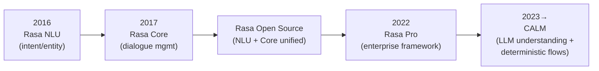
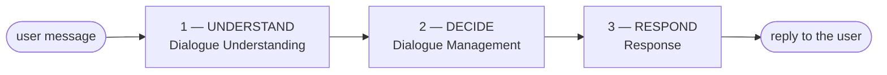
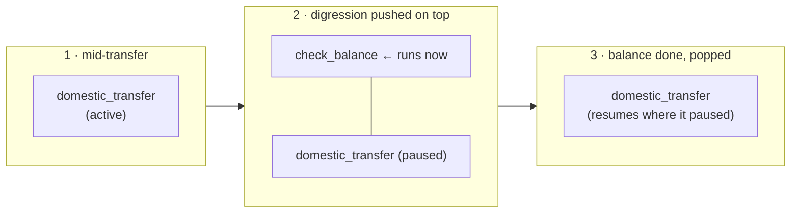
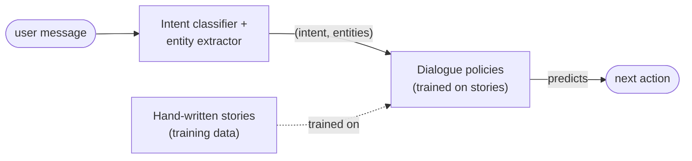
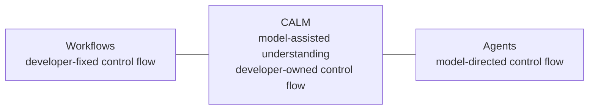
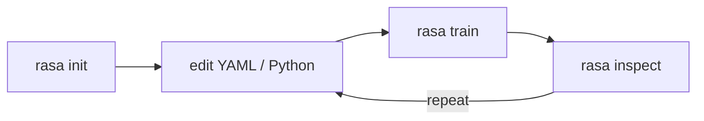
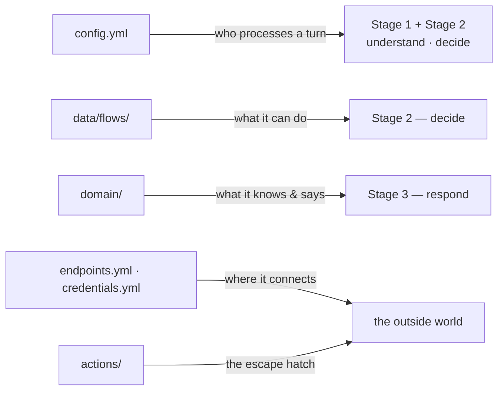

# Day 6 — Rasa CALM: Architettura e Anatomia del Progetto

## Guida di Studio per lo Studente

Questo capitolo introduce **Rasa** e la sua architettura **CALM**. Si apre con cosa sia Rasa, da dove venga e quali problemi si proponga di risolvere; passa in rassegna il prodotto — i suoi casi d'uso, le sue funzionalità e il modo in cui si integra con un sistema NLU esistente; spiega poi l'architettura CALM, la colloca rispetto alle alternative, e si conclude con le edizioni, l'installazione e un tour dello scaffold di un progetto. La trattazione è a **livello di orientamento**: la configurazione, i flow e il domain sono trattati per intero nel Day 7, il flow design nel Day 9, e le custom action nel Day 8.

---

## §1 — Introduzione a Rasa e CALM

### 1.1 Una breve storia, da NLU a CALM

Rasa è stata fondata nel **2016 a Berlino** da Alan Nichol e Alex Weidauer.[^1] Il suo primo prodotto, **Rasa NLU**, era una libreria Python open-source rilasciata quell'anno per dare agli sviluppatori il controllo sulla **comprensione del linguaggio naturale** (natural-language understanding) — il compito di leggere il messaggio di un utente ed estrarne l'**intent** (cosa vuole l'utente) e le sue **entities** (i valori presenti nel messaggio). Un anno dopo arrivò **Rasa Core**, una seconda libreria per la **gestione del dialogo** (dialogue management) — decidere cosa l'assistente debba fare successivamente. Le due furono presentate insieme nel paper fondativo del 2017, il cui scopo dichiarato era "rendere accessibile a sviluppatori software non specialisti la gestione del dialogo e la comprensione del linguaggio basate su machine learning."[^2] NLU e Core furono in seguito unificate in un unico pacchetto open-source, **Rasa Open Source**.

Nel **2022** Rasa ha introdotto **Rasa Pro**, un framework commerciale di livello enterprise costruito su questa base, che aggiunge ciò di cui i team in produzione hanno bisogno oltre al nucleo open-source — security scanning, deployment su Kubernetes, connettori multicanale, tracing e analytics.[^3] Poi, nel **2023**, Rasa ha annunciato **CALM** — **Conversational AI with Language Models** — un nuovo approccio che usa un large language model come livello di comprensione dell'assistente, mantenendo al contempo la logica di business deterministica.[^4] Rasa Pro è la casa di CALM, ed è CALM ciò che questo corso insegna.



CALM **prosegue l'eredità fondativa** piuttosto che romperla. La motivazione del 2016 — dare agli sviluppatori un controllo reale su come un assistente comprende il linguaggio e gestisce una conversazione — è rimasta invariata; ciò che è cambiato è il meccanismo. Dove lo stack classico usava un classificatore di intent addestrato e regole di dialogo scritte a mano, CALM usa un LLM per la comprensione e flow dichiarati per la logica. Rasa lo descrive come un modo per "passare da sistemi tradizionali basati su intent ad agenti basati su LLM."[^5]

### 1.2 A cosa serve Rasa, e quali problemi risolve

Rasa Pro è un framework per costruire agenti di AI conversazionale scalabili e **ad alta affidabilità** (high-trust), che usano large language model per abilitare interazioni più agentiche e consapevoli del contesto.[^5] La parola portante è **high-trust**: il posizionamento non è "un LLM che chatta" ma un assistente LLM il cui comportamento un'organizzazione regolamentata può considerare affidabile e verificabile. Quattro problemi ricorrenti plasmano questo design.

- **Bot fragili basati su intent e alberi decisionali.** La generazione di assistenti pre-LLM classificava ogni messaggio in un intent scelto da un catalogo fisso e percorreva un albero di dialogo scritto a mano. Tali sistemi si rompono quando un utente formula una richiesta in un modo nuovo, interrompe, o divaga, e ogni nuova formulazione è un nuovo compito di training-data. Questa è la fragilità che il livello di comprensione di CALM è pensato per rimuovere.[^2][^5]
- **Comportamento LLM non governato.** Un singolo LLM lasciato libero sia di comprendere *sia* di agire può avere allucinazioni, essere convinto a ignorare una regola, o compiere un'azione che nessuno ha autorizzato. La risposta progettuale di Rasa è lasciare che l'LLM comprenda ma non esegua mai direttamente la logica di business, in modo che la logica di business dichiarata venga sempre seguita e CALM sia resistente per progettazione ad hallucination, prompt injection e jailbreaking (claim).[^5] Cosa questa protezione copra e cosa no è definito con precisione nel §2.2.
- **La necessità enterprise di controllo e verificabilità.** Rasa Pro esiste perché le imprese hanno bisogno di molto più di una libreria open-source per distribuire, mantenere, orchestrare e mettere in sicurezza i propri assistenti.[^3] Per un deployment regolamentato e rivolto al cliente, la proprietà rilevante è che la logica su cui gli auditor faranno domande sia dichiarata, revisionabile ed eseguita letteralmente anziché prevista.
- **Controllo dei dati.** Rasa può funzionare interamente on-premise, senza chiamate a LLM esterni,[^5] il che risponde al requisito di data-residency comune in settori che richiedono una governance dei dati rigorosa.

In una frase: **Rasa è un framework per costruire assistenti di AI conversazionale che combinano la fluidità di un LLM con una logica di business deterministica e controllata dallo sviluppatore** — così un team mantiene controllo, affidabilità e la possibilità di eseguire il tutto sulla propria infrastruttura.

### 1.3 Panoramica del prodotto: casi d'uso e funzionalità

**Casi d'uso.** Rasa posiziona il prodotto attorno a molti ambiti rivolti al cliente. Alcuni esempi dei principali target:

- **Customer Experience & Support** — onboarding e assistenza guidata, risoluzione di FAQ e problemi ricorrenti, domande di fatturazione, tracciamento ordini, modifiche all'account, e supporto 24/7 che gestisce i contatti di routine così che gli agenti umani si occupino di quelli più complessi.[^6]
- **Process Automation** — flussi di lavoro interni e operativi ripetitivi come le richieste all'IT-helpdesk (reset password, richieste di accesso) e richieste ad alto volume al service-desk, assorbendo i picchi di domanda senza aumentare l'organico.[^7]
- **Sales & Marketing** — qualificazione dei lead, raccomandazioni personalizzate, cross-sell al momento dell'acquisto, e assistenza guidata lungo flussi di acquisto complessi.[^8]

I case study di Rasa citano risultati per i clienti come N26 che devia il 30% dei contatti di customer-service di routine (claim).[^6]

**Funzionalità.** Quattro capacità contano per questo corso.

- **Flow orchestration con agenti AI.** I task dell'assistente sono scritti come **flow** (§2.3), e un LLM instrada la conversazione tra di essi — scegliendo cosa deve succedere dopo mentre i flow stessi vengono eseguiti in modo deterministico.[^9]
- **Integrazione con NLU esistente.** Una pipeline NLU classica basata su intent può funzionare *insieme* a CALM nello stesso assistente, così un team non è costretto a scegliere l'uno o l'altro. Questo è il ponte descritto nel §1.4.[^10]
- **Voce in tempo reale.** Rasa Pro documenta gli assistenti vocali in due classi di canale: i canali **Voice Ready** scambiano audio ma lo elaborano come testo tramite servizi esterni di speech-to-text e text-to-speech, mentre i canali **Voice Stream** elaborano l'audio end-to-end e supportano il turn-taking in tempo reale e l'interruzione ("barge-in"). I connettori documentati includono Twilio, Genesys Cloud, AudioCodes, Jambonz e Browser Audio.[^11]
- **Integrazione MCP e tool.** Oltre ai flow, l'orchestrazione di Rasa può instradare verso tool esterni — inclusi tool esposti tramite il **Model Context Protocol (MCP)** — e verso il recupero di conoscenza (knowledge retrieval); i meccanismi sono un argomento di un giorno successivo.[^9]

### 1.4 Il vantaggio di collegarsi a un sistema NLU esistente

Per un'organizzazione che gestisce già in produzione un assistente basato su intent, l'argomento pratico più forte a favore di Rasa è che l'adozione non deve essere una sostituzione totale (rip-and-replace). La funzionalità di **coexistence** di Rasa fa funzionare insieme, in un unico assistente, un sistema basato su NLU e CALM, così un team può migrare una capacità alla volta. Il valore è triplice: **preserva l'investimento NLU esistente** (la pipeline in produzione e i suoi intent continuano a funzionare), **riduce il rischio dell'adozione** procedendo skill per skill con fiducia costruita in produzione, ed **evita qualsiasi cutover a cascata (waterfall)**.[^10]

Meccanicamente, un livello di **routing** invia ogni messaggio a un sistema o all'altro, e il routing è di norma **sticky** (persistente) — una volta instradato un messaggio, i messaggi successivi restano con lo stesso sistema finché il task non si conclude.[^12] Sono disponibili due router: un **`IntentBasedRouter`**, che instrada in base all'intent previsto dalla pipeline NLU, e un **`LLMBasedRouter`**, che usa un LLM per decidere.[^10]

Con questo arriva un vincolo reale: i due sistemi funzionano fianco a fianco ma non possono interrompersi a vicenda — una skill basata su NLU non può interrompere una skill CALM, o viceversa.[^10] La migrazione è incrementale e a basso rischio, ma la giuntura tra i due sistemi è reale.

### 1.5 Cos'è CALM, nel contesto del framework

**CALM è il sistema di dialogo che fa funzionare un assistente Rasa moderno.** La sua idea distintiva è una divisione del lavoro: un LLM **comprende** l'utente nel pieno contesto della conversazione, i **flow deterministici decidono** cosa fare, e le **risposte templated** formulano la replica — l'LLM mantiene la conversazione fluida senza dover indovinare la logica di business.[^13] Il command generator, il dialogue stack e il livello di risposta che implementano questa divisione sono l'oggetto del §2.

### 1.6 Il nostro setup per il corso

**Versione e documentazione.** Questo corso usa **Rasa Pro 3.17**, e ogni esempio la prende come riferimento. Il pacchetto, `rasa-pro`, è pubblicato sul PyPI pubblico.[^14] Il riferimento in tutto il corso è la documentazione ufficiale di Rasa su [rasa.com/docs](https://rasa.com/docs) (con il suo livello concettuale in `/docs/learn` e il livello di riferimento in `/docs/reference`). Dove viene menzionato un nome di modello o un default, si assume che rifletta la release corrente.

---

## §2 — L'architettura CALM: comprendere, decidere, rispondere

Ogni turno dell'utente attraversa tre fasi: l'assistente **comprende** il messaggio, **decide** cosa fare successivamente, e **risponde**.[^13] Solo la prima fase usa un LLM; tutto ciò che segue è deterministico.



Due termini ricorrono e vale la pena fissarli subito. Un **flow** è un processo di business scritto come una serie ordinata di passi — in Rasa, una descrizione YAML di un singolo task (*chiedi l'importo → conferma → esegui*). Uno **slot** è un'informazione con un nome che l'assistente raccoglie e ricorda durante una conversazione: la sua memoria di lavoro.

La divisione porta quattro benefici, ciascuno ripreso più avanti:

- **Separazione delle responsabilità (separation of concerns)** — comprensione, decisione e formulazione sono tre compiti diversi svolti da tre meccanismi diversi (un LLM, il flow engine, le risposte templated), così ciascuno può essere modificato, revisionato e testato per conto proprio.
- **Determinismo** — dati gli stessi command e gli stessi flow, l'assistente fa la stessa cosa ogni volta; non c'è alcuna policy appresa che possa andare alla deriva.[^15]
- **Efficienza** — poiché l'LLM si limita a comprendere e instradare invece di portare l'intero task, CALM può usare modelli più piccoli ed economici per il lavoro.[^13]
- **Consapevolezza conversazionale integrata** — le parti disordinate di un dialogo reale (una correzione, un cambio di argomento, una richiesta di chiarimento) sono rilevate e gestite da meccanismi che CALM fornisce di serie, anziché scriptate task per task (§2.3).[^13]

### 2.1 Fase 1 — Dialogue Understanding: il command generator

**Dialogue understanding** è la capacità dell'assistente di interpretare l'input dell'utente e determinare il prossimo passo migliore nella conversazione.[^16] È l'unica fase in cui un LLM svolge l'interpretazione. Il componente che la esegue è il **command generator**: a ogni turno dell'utente legge la conversazione nel suo contesto e produce un breve elenco di **command** di alto livello che descrivono come far avanzare il dialogo. Si limita a proporre i passi successivi — non li esegue.[^16]

È fondamentale che legga **l'intera conversazione**, non solo l'ultimo messaggio:[^16]

- la **conversazione fin qui**, incluso l'ultimo messaggio,
- i **flow potenzialmente rilevanti** — ogni flow si presenta tramite una `description` in linguaggio naturale,
- il **flow attualmente attivo**, e
- gli **slot già compilati**.

Rendiamolo concreto con un esempio. Il cliente di una banca scrive:

> "I need to send 200 euros to my sister Giulia."

Il command generator emette qualcosa come:

```text
start flow domestic_transfer
set slot recipient Giulia
set slot amount 200
```

Tre command, un turno — e **nessuna etichetta di intent da nessuna parte**. In un unico passaggio sull'intera frase ha individuato il processo di business *e* estratto due valori di slot.

**Il vocabolario dei command.** I command sono tratti da un *vocabolario fisso* che il team Rasa mantiene e testa; chi scrive un assistente non ne inventa di nuovi.[^17] I due che uno studente incontra per primi sono `start flow <name>` e `set slot <name> <value>`. L'insieme più ampio include:

| Command | Cosa esprime |
|---|---|
| `start flow <name>` | avvia un task |
| `set slot <name> <value>` | registra (o aggiorna) un'informazione |
| `cancel flow` | interrompe il task corrente |
| `disambiguate flows <a> <b> …` | la richiesta corrisponde a più di un task; chiede quale |
| `search and reply` | risponde a una domanda fattuale/FAQ da una knowledge base |
| `offtopic reply` | gestisce small-talk sociale |
| `repeat message` | ripete l'ultima cosa detta dall'assistente |

Due punti da fissare subito. Non esiste un **comando separato "correggi slot"**: quando un utente rivede un valore già fornito, il generator emette di nuovo `set slot` con il nuovo valore.[^17] E una richiesta che l'assistente non può servire **non** è segnalata da un command — è l'*assenza* di qualsiasi command utilizzabile a innescare la gestione di fallback dell'assistente (§2.3). Il vocabolario completo e il suo prompt sono un argomento del Day 7; oggi serve la *forma*, non l'inventario.

**Il generator può essere un LLM o un modello NLU.** Il command generator di default è basato su LLM, ma Rasa fornisce anche un **`NLUCommandAdapter`** che trasforma l'output di un classificatore di intent classico negli stessi command.[^18] I due possono funzionare insieme — l'approccio **ibrido** dietro la storia di coexistence del §1.4: il modello NLU, economico e deterministico, gestisce gli input che già classifica bene, e l'LLM gestisce il resto. Ecco perché "il command generator" è uno slot architetturale, non un singolo modello fisso.

### 2.2 Lo structured output come garanzia architetturale

Il command generator **è lo structured output elevato ad architettura.** Per *structured output* si intende vincolare la generazione di un modello a uno schema dichiarato e validare il risultato, così che la *forma* dell'output sia garantita per costruzione. La *verità* non lo è — un oggetto perfettamente formato può comunque contenere un valore allucinato — quindi la validazione semantica resta compito dell'applicazione.

CALM va un passo oltre: l'**unico canale di output** dell'LLM è una lista di command, e quella lista viene **validata rispetto al progetto**. Può fare riferimento solo a flow e slot che *esistono realmente* — non può inventare nuovi workflow.[^13] Un nome di flow allucinato semplicemente non sopravvive alla validazione. La conseguenza è la frase più forte dell'architettura:

> **Non esiste un percorso dall'immaginazione del modello a un effetto collaterale (side effect).**

Questo è il meccanismo dietro la resistenza di CALM ad hallucination, prompt injection e jailbreaking (claim).[^5] Detto con precisione, con il limite onesto allegato:

- Un'istruzione iniettata (injected instruction) **non può** far *fare* all'assistente qualcosa al di fuori dei suoi flow dichiarati — i command sono validati rispetto a uno schema fisso e non vengono mai eseguiti come testo libero.[^13]
- **Potrebbe** comunque orientare il generator verso un command *sbagliato ma valido* — il flow sbagliato, o un valore di slot sbagliato.

Quindi l'architettura **riduce la superficie di attacco; non abolisce la minaccia.** Un vocabolario di command validato è una vera protezione integrata nel framework, non uno slogan — ma è la prima protezione, non l'ultima.

### 2.3 Fase 2 — Dialogue Management: flow, FlowPolicy e il dialogue stack

**Dialogue management** è la parte di Rasa che decide il miglior passo successivo a partire dall'input dell'utente e dallo stato corrente della conversazione.[^19] La mossa che definisce CALM sta qui: uno sviluppatore non scripta ogni possibile turno ma dichiara dei **flow**, e il dialogue management si muove attraverso di essi, restando entro i confini della logica di business che i flow definiscono.[^19] Il componente che li esegue è il **FlowPolicy**.[^15]

Quel confine è ciò che rende il comportamento **deterministico**: dati gli stessi command e le stesse definizioni di flow, accade la stessa cosa, ogni volta. Non c'è alcuna policy appresa, nessuna probabilità, nulla che possa andare alla deriva. La logica di business su cui gli auditor dell'organizzazione faranno domande è **YAML, in version control, eseguita letteralmente**.[^15]

**Anatomia di un flow.** Un flow ha un **name**, una **description** e un elenco ordinato di **steps**.[^20] La description non è decorazione: è la frase in linguaggio naturale che il command generator legge per decidere *quando* avviare il flow, quindi scrivere una description chiara fa parte dello scrivere il flow.[^20] Gli steps sono costruiti a partire da un piccolo insieme di building block:[^21]

| Step | Cosa fa |
|---|---|
| `collect` | chiede all'utente un valore e lo memorizza in uno slot |
| `action` | esegue codice (una custom action) o invia una risposta |
| `set_slots` | assegna valori agli slot in modo programmatico |
| `link` | passa il controllo a un altro flow e termina questo |
| `call` | esegue un altro flow (o un tool) inline, poi torna indietro |
| condizioni (`next` / `if` / `else`) | ramifica in base ai valori degli slot |

Il flow tutorial ufficiale `transfer_money` li mostra combinati:[^22]

```yaml
flows:
  transfer_money:
    description: Help users send money to friends and family.
    steps:
      - collect: recipient
      - collect: amount
        description: the number of US dollars to send
      - action: action_check_sufficient_funds
        next:
          - if: not slots.has_sufficient_funds
            then:
              - action: utter_insufficient_funds
                next: END
          - else: final_confirmation
      - collect: final_confirmation
        id: final_confirmation
        next:
          - if: not slots.final_confirmation
            then:
              - action: utter_transfer_cancelled
                next: END
          - else: transfer_successful
      - action: utter_transfer_complete
        id: transfer_successful
```

Letto in chiaro: chiedi a chi pagare, chiedi quanto, verifica il saldo, e *se* i fondi sono insufficienti dillo e fermati, *altrimenti* chiedi conferma, e *se* l'utente rifiuta annulla, *altrimenti* completa. Il flow descrive la logica del task — non ogni possibile cosa che l'utente potrebbe dire. (La sintassi dei flow in dettaglio è nel Day 9.)

**Il dialogue stack.** Il dialogue management tiene i flow attivi su un **dialogue stack**. Quando un flow parte viene posto in cima, come impilare dei piatti; il flow in cima è sempre quello su cui si sta lavorando, e una volta che termina o viene annullato, il controllo torna al flow sottostante. L'ordinamento è **last-in, first-out (LIFO)**: i flow sotto la cima sono in pausa e riprendono una volta che tutto ciò che sta sopra si è concluso.[^13][^19]



Un esempio pratico: un cliente è a metà di un trasferimento quando chiede "Aspetta — prima qual è il mio saldo?" Il command generator emette `start flow check_balance`; quel flow viene impilato *sopra* il trasferimento in pausa, viene eseguito fino al termine, e viene rimosso dalla pila (popped); il trasferimento riprende esattamente dal punto in cui si era fermato. **Nessuno ha scritto una storia per "l'utente chiede il saldo a metà di un trasferimento".** In uno stack classico questo scenario è un progetto di training-data; qui il comportamento di interruzione e ripresa deriva dallo **stack LIFO** — una struttura dati, non un dataset. (Lo stack è trattato per intero nel Day 9.)

**Conversation patterns.** Quando un utente devia — correggendo, interrompendo, cambiando argomento, o chiedendo qualcosa fuori scope — il lavoro viene assorbito dai **conversation pattern**: flow di sistema riutilizzabili che CALM fornisce per riparare la conversazione quando i clienti non seguono il percorso previsto.[^23] Esistono quindi due tipi di flow: quelli che un team scrive per la propria logica di business, e i pattern che CALM fornisce di serie per gestire i momenti ricorrenti, non specifici del business, che ogni conversazione produce. Poiché i pattern preconfezionati assorbono le deviazioni, i flow di un team restano concentrati sui passi del task di alto livello invece di dover tenere conto di ogni possibile deviazione.[^23] Questi flow di sistema si suddividono in cinque grandi famiglie di momenti:

| Famiglia | Cosa gestisce | Esempi |
|---|---|---|
| **Conversation Repair** | l'utente esce dal percorso previsto | correzione, chiarimento, interruzione |
| **Conversation Navigation** | l'utente guida la sessione | annullamento, riavvio, completamento |
| **External Support** | il turno richiede qualcosa fuori dal flow | ricerca, passaggio a un operatore umano, chitchat |
| **Voice** | momenti del canale vocale | ripeti, silenzio |
| **System Error** | qualcosa fallisce internamente | errore interno, fallback per casi non gestibili |

I pattern sono flow come tutti gli altri, quindi vengono modificati come qualsiasi altro flow; ciascuno ha un default che un team è "libero di personalizzare."[^23] (I repair pattern sono un argomento del Day 11.)

### 2.4 Fase 3 — Response: risposte templated, opzionalmente riformulate

Quando un passo di un flow dice che l'assistente deve parlare, le parole provengono da **risposte templated dichiarate nel domain**.[^13] La frase rivolta al cliente riguardo al suo denaro è stata scritta da una persona, revisionata come si fa con il codice, e resa con i valori degli slot interpolati — non generata. La formulazione è **interamente posseduta** (fully owned), ed è la parte dello stack classico che CALM eredita invariata. Poiché i conversation pattern parlano attraverso lo stesso livello templated, la proprietà di "piena proprietà" si estende anche alla formulazione dei repair.

Un response template è più di una stringa fissa. Può **interpolare valori di slot** nel testo, così un unico template saluta ogni cliente per nome o cita il suo saldo reale. Può contenere **più formulazioni** sotto un unico nome e variare tra di esse, così che l'assistente non suoni robotico. Può risolversi in **formulazioni diverse per condizione o canale** — una formulazione quando uno slot ha un certo valore, un'altra su un canale vocale rispetto alla chat. E può portare più delle sole parole: **bottoni** (i cui tap possono impostare direttamente uno slot), immagini, o un **payload personalizzato** per un'interfaccia specifica del canale.[^33]

Un componente opzionale si colloca qui: il **Contextual Response Rephraser**, un LLM che può riscrivere il testo templated per adattarlo al momento conversazionale.[^13] Attivarlo scambia controllo con naturalezza, ed è un compromesso da esplicitare chiaramente:

- **Cosa offre** — risposte che suonano più naturali e consapevoli del contesto, mentre un team continua a possedere il template sottostante e può personalizzarne il comportamento.
- **Cosa costa** — reintroduce una **superficie di generazione** sopra un testo revisionato, e con essa le modalità di fallimento dell'LLM che il resto dell'architettura lavora per contenere: un rischio di **hallucination** nella formulazione riscritta, esposizione a **prompt injection**, una considerazione sulla **privacy** (il testo della risposta, eventualmente con i valori degli slot, viene inviato a un modello), e **latenza** aggiuntiva dovuta a una chiamata al modello in più. Attivarlo è una decisione deliberata, non un default ereditato.

### 2.5 Perché questa divisione conta

Le tre fasi separano le responsabilità in modo deliberato: la comprensione del linguaggio va al modello, le decisioni e tutto ciò che tocca il denaro vanno al codice, la formulazione va ai template.

> Il modello non sceglie mai un'azione, non esegue mai nulla, e non compone mai la frase sul saldo del cliente. Emette command validati, e il resto lo fa un meccanismo deterministico.

---

## §3 — Come si confronta CALM: NLU classico, agenti ReAct e CALM

CALM è uno dei tre modi principali per costruire un assistente conversazionale, e i tre differiscono per quanto si affidano all'LLM: l'approccio **classico** lo tiene fuori dal ciclo, l'approccio **LLM-centrico** (ReAct) gli affida sia la comprensione sia l'azione, e CALM segue la via **ibrida** — l'LLM comprende, la logica deterministica esegue. Tutti e tre sono architetture con compromessi diversi, non una storia di passato-contro-futuro.[^13]

### 3.1 I tre approcci

**NLU classico / basato su intent.** Ogni messaggio dell'utente viene classificato in esattamente un **intent** (più eventuali **entity**) da un catalogo fisso, e **story**, **regole**, o alberi di dialogo scritti a mano decidono il passo successivo. Non c'è alcun LLM nel ciclo, il che rende il sistema **deterministico, economico, a bassa latenza e facile da tracciare**.[^13] I suoi limiti sono strutturali: non può comprendere un messaggio che non rientra in nessun intent; gli alberi rigidi si rompono quando un utente devia; l'accuratezza degrada quando gli intent si sovrappongono su larga scala; e ogni nuova formulazione richiede nuovi dati di training.



Due parole sono portanti, perché sono esattamente ciò che CALM cambia: il messaggio viene *compresso* in un'etichetta, e l'azione successiva viene *prevista* da una policy appresa.

**Agenti in stile ReAct.** Un singolo LLM svolge *entrambi* i compiti a ogni turno — comprende il messaggio **e** decide l'azione successiva — con la logica di business che vive nel prompt. Questo è **flessibile, aperto, e richiede uno scaffolding minimo**.[^13] I suoi limiti rispecchiano quella libertà: le decisioni sono incoerenti perché il modello indovina la logica al volo; il debug è difficile perché il ragionamento è testo non strutturato; costo e latenza sono alti perché un turno può significare diverse chiamate LLM in serie; e le prestazioni degradano man mano che i task si accumulano.[^13]

**CALM.** L'LLM comprende il messaggio nel pieno contesto della conversazione; **i flow deterministici decidono** il passo successivo.[^13]

### 3.2 Sei dimensioni, tre approcci

I tre approcci si confrontano lungo sei dimensioni, ciascuna un compromesso più che un verdetto:[^13]

| Dimensione | NLU classico / bot basati su intent | Agenti in stile ReAct | Assistenti CALM |
|---|---|---|---|
| **Casi d'uso adatti** | Ottimo dove non si può o non serve usare un LLM; risultati deterministici | Ottimo per task aperti ed esplorativi dove la flessibilità conta più della struttura | Ideale per task strutturati con obiettivi chiari, che bilanciano fluidità e affidabilità |
| **Comprensione dell'utente** | Classifica solo l'ultimo messaggio, senza il contesto dell'intera conversazione | Combina comprensione e azione in un unico processo | Usa un LLM per comprendere nel contesto della conversazione, separato dall'esecuzione |
| **Decisione del passo successivo** | Predefinita in grandi alberi di dialogo; si rompe se gli utenti deviano | Incorporata nei prompt dell'LLM; decisioni incoerenti, prese al volo | Definita nei flow; l'LLM instrada tra i flow, che vengono eseguiti in modo deterministico |
| **Scalare su molti task** | L'accuratezza soffre quando gli argomenti si sovrappongono | Le prestazioni degradano man mano che si aggiungono task/agenti | Scala in modo affidabile su molti argomenti e flow |
| **Facilità di troubleshooting** | Diretta — ogni percorso è pianificato in anticipo | Difficile — bisogna leggere testo di ragionamento non strutturato | Facilitata dalla separazione tra ragionamento ed esecuzione del task |
| **Costo in produzione** | Molto economico, bassa latenza | Costo e latenza elevati per le chiamate LLM in serie | Efficiente in termini di costo; può usare modelli più piccoli e fine-tuned |

Quale architettura vince dipende da quali dimensioni un mandato privilegia. Dove **verificabilità, determinismo e facilità di troubleshooting** dominano — un mandato regolamentato, rivolto al cliente, dalla forma processuale — CALM è la scelta forte. Dove **costo e latenza** grezzi sono gli unici assi che contano, vince l'NLU classico; dove l'obiettivo è la **flessibilità aperta**, vince un agente in stile ReAct.

### 3.3 Dove si colloca CALM sullo spettro di autonomia

Trasversale al confronto c'è uno **spettro di autonomia**, che va dal **control flow fissato dallo sviluppatore (workflow)** a un'estremità al **control flow diretto dal modello (agenti)** all'altra.



La posizione di CALM è precisa: **verso l'estremità dei workflow — comprensione assistita dal modello, control flow di proprietà dello sviluppatore.** La fase 1 è del modello; le fasi 2 e 3 sono dello sviluppatore.

Esiste un'alternativa code-first. Una libreria come **Pydantic AI** — per costruire agenti LLM tipizzati in Python — offre piena flessibilità Python, nessun framework da imparare, nessun dialetto YAML, e controllo diretto del loop; un agente code-first di questo tipo richiede circa trenta righe. Per un assistente in stile ricerca, un'automazione interna una tantum, o un task la cui forma viene scoperta strada facendo, il percorso code-first è lo strumento migliore. Quale percorso sia adatto dipende da cosa il deployment ottimizza: un processo regolamentato e rivolto al cliente favorisce la struttura di CALM; il lavoro aperto o una tantum favorisce l'agente code-first.

### 3.4 Cosa offre l'approccio strutturato — e cosa costa

Cosa offre la struttura di CALM:

- **Verificabilità (Auditability).** La logica di business è costituita da flow YAML dichiarati — confrontabili (diffable), revisionabili in una pull request, leggibili da un responsabile compliance che non ha mai scritto Python. In un loop ad agente libero la logica è *emergente* dal prompt, dai tool e dalle scelte del modello del momento; "cosa può fare questo sistema?" non ha una risposta in forma chiusa.
- **Determinismo dove serve.** I flow dichiarati eseguono i propri passi e nient'altro.[^15] Il controllo di eleggibilità prima di un trasferimento viene eseguito ogni volta, nello stesso ordine, indipendentemente da quanto persuasivo fosse il messaggio dell'utente.
- **Collocazione dei guardrail.** Ogni difesa reale contro un fallimento dell'LLM è un guardrail deterministico esterno al modello. CALM dà a questi guardrail una collocazione naturale — nelle definizioni dei flow e nel codice delle action — invece di disperderli in un prompt.
- **Leggibilità per il team.** I flow sono leggibili da product owner e ingegneri non-ML; un conversation designer e un backend engineer possono lavorare sullo stesso artefatto.
- **Superficie di valutazione.** I flow dichiarati sono un insieme *enumerabile* di percorsi, che è ciò di cui un eval set ha bisogno; lo scaffold viene fornito con test end-to-end (Day 11).

Cosa costa:

- **Minore flessibilità aperta** rispetto a un loop ad agente libero — se il bisogno dell'utente non ha un flow, l'assistente non può improvvisarne uno. È un limite voluto, ma resta un limite.
- **Una curva di apprendimento del framework** — il modello di flow, domain e config richiede tempo reale da imparare.
- **YAML come vincolo** — la logica ramificata in YAML è più cerimoniosa che in Python, e talvolta lo si sente.
- **Una dipendenza dall'LLM che non è scomparsa** — il command generator chiama un modello a (quasi) ogni turno, quindi il costo del modello per turno, la dimensione del prompt e la latenza del provider richiedono comunque una voce sulla mappa del processo.

**Quando Rasa è lo strumento sbagliato.** Un **assistente di ricerca aperto** ("analizza questo portafoglio e dimmi qualcosa di interessante") non ha una forma processuale che i flow possano dichiarare. Un'**automazione interna una tantum** che un ingegnere esegue mensilmente non ripaga il setup del framework. Un task che **non può ancora essere mappato** come processo è troppo prematuro per qualsiasi framework. Processi ripetibili, verificabili e rivolti al cliente sono vicini al **caso migliore** per CALM.

---

## §4 — Edizioni, licenze e installazione

I limiti e le clausole qui sotto decidono cosa puoi **legalmente distribuire (deploy)**.

### 4.1 Le edizioni

La piattaforma Rasa è disponibile in tre livelli:[^24]

- **Developer Edition** — *gratuita*; accesso completo a Rasa Pro e CALM; supporto community.
- **Business (Pro + Studio)** — a pagamento; aggiunge **Rasa Studio**, l'interfaccia no-code/low-code per gli utenti business, oltre a limiti più alti e supporto di base.
- **Enterprise** — a pagamento; supporto premium, sicurezza avanzata, scala.

**Rasa Studio non è incluso nella Developer Edition** — la pagina dei prezzi elenca Studio solo sotto Business ed Enterprise.[^24] Questo corso insegna quindi **il percorso pro-code via CLI per intero**, e nulla di ciò che costruisce dipende da Studio.

### 4.2 Le restrizioni

Dai Rasa Developer Terms[^25] e dalla pagina di richiesta della licenza,[^26] enunciate con precisione:

| Restrizione | Termini della Developer Edition |
|---|---|
| **Limite di conversazioni** | **1.000 conversazioni/mese** per un assistente rivolto al cliente; **100/mese** per uno interno. Si sceglie **uno** dei due tipi di caso d'uso.[^25][^26] |
| **Casi d'uso** | **Un caso d'uso per organizzazione** — un'applicazione specifica. Un secondo bot richiede una licenza commerciale; affiliate o controllate non possono aggirare il limite.[^25] |
| **Validità della chiave** | Ogni chiave di licenza è valida per **12 mesi**; il rinnovo richiede di contattare Rasa.[^25] |
| **Produzione** | **Esplicitamente consentita** — il deployment in produzione commerciale è permesso entro i limiti indicati.[^25] |
| **Consulenza finanziaria** | Gli assistenti **non devono "fornire consulenza finanziaria professionale"** — i contenuti informativi sono consentiti; l'orientamento professionale deve essere indirizzato a consulenti autorizzati.[^25] |
| **Condivisione della chiave** | Vietata.[^25] |

Ottenere una chiave è un modulo di richiesta pubblico senza verifica di idoneità.[^26]

### 4.3 Installare Rasa Pro

Il pacchetto è `rasa-pro`, sul **PyPI pubblico** — nessun indice privato.[^14] L'installer consigliato è `uv`.[^27] La sequenza dalla documentazione di installazione:[^27]

```bash
# 1. Install uv
curl -LsSf https://astral.sh/uv/install.sh | sh

# 2. Create project directory and virtual environment
mkdir my-rasa-assistant
cd my-rasa-assistant
uv venv --python 3.11

# 3. Activate the virtual environment
source .venv/bin/activate

# 4. Install rasa-pro
uv pip install rasa-pro

# 5. Set the licence (persistent: add to ~/.zshrc or ~/.bashrc)
export RASA_LICENSE="<your-license-key-string>"

# 6. Verify the installation
rasa --version
```

**Versione di Python.** Rasa Pro supporta **Python 3.10–3.13**.[^28] L'esempio di installazione usa la 3.11. Le versioni 3.12 e 3.13 sono praticabili per progetti solo-CALM; l'unico vincolo è lo stack TensorFlow dietro gli extra NLU legacy, che richiede Python sotto la 3.12.[^28] Dato che questo corso è puramente CALM, funzionano tutte e quattro le versioni — usa la **3.11** se in futuro potresti aggiungere componenti NLU per la storia di coexistence, altrimenti **3.12/3.13** liberamente.

**La variabile di licenza.** La licenza viene letta dalla variabile d'ambiente `RASA_LICENSE`.[^25] È una **credenziale**, quindi si applica per intero la normale igiene dei segreti — una variabile d'ambiente o un secret manager, mai un valore letterale in un file, mai in un repository.

**La chiave del provider LLM.** Un assistente CALM **non può funzionare senza un LLM configurato**[^29] — Dialogue Understanding *è* una chiamata a un LLM. Quindi, insieme alla licenza, si esporta una chiave del provider (per il setup OpenAI di default, `OPENAI_API_KEY`[^29]). La chiave serve per **costruire** l'assistente, non solo per eseguirlo: `rasa train` effettua una chiamata di embedding prima di poter produrre un modello, quindi un train senza chiave del provider fallisce — cosa fa il training per un progetto CALM è spiegato nel §4.4.

**I provider a colpo d'occhio** (la configurazione completa è nel Day 7): **OpenAI** è il default; **Azure OpenAI** e **Amazon Bedrock** hanno forme di configurazione di prima classe; e poiché il backend usa **LiteLLM**, è raggiungibile qualsiasi endpoint compatibile con LiteLLM — che copre Anthropic, Mistral, Cohere, Groq, e vLLM/Ollama self-hosted.[^29] Dove contano le questioni di confine dei dati, il fatto rilevante è che **i percorsi Azure e self-hosted esistono e sono configurazione, non codice.**

### 4.4 Il ciclo di lavoro della CLI

Il ciclo abituale che uno sviluppatore segue lavorando su un assistente Rasa:[^30]



- `rasa init` genera un intero progetto di partenza (scaffold) a partire da una directory vuota (§5).
- `rasa train` produce l'artefatto del modello sotto `models/`, ed è **incrementale**: quando cambia solo una parte del progetto, viene ricostruita solo quella parte, e i componenti invariati vengono ripristinati dalla cache.[^30]
- `rasa inspect` apre nel browser l'**Inspector**, sull'ultimo modello addestrato, dove si passa la maggior parte del tempo di sviluppo; è l'oggetto del §6.[^31]

Altri due verbi: `rasa shell` carica l'ultimo modello per una rapida chat testuale nel terminale, senza browser; `rasa run` avvia il server HTTP che ospita il modello dietro l'API REST di Rasa, per collegare canali reali.[^30]

**Cosa fa `rasa train` quando non c'è nulla di "addestrato".** Un progetto puramente CALM non ha alcun classificatore di intent né alcuna policy di dialogo appresa — il FlowPolicy esegue i flow dichiarati in modo deterministico (§2.3) — quindi `rasa train` non adatta alcun modello statistico ai dati nel modo in cui lo fa una pipeline NLU classica; in questo senso non c'è nulla da *addestrare*. Il comando invece **valida** il progetto, **compila** flow, domain e config nell'artefatto del modello, e costruisce la struttura su cui il command generator si basa a runtime: l'**indice di flow-retrieval**. La `description` di ciascun flow — e, opzionalmente, le sue descrizioni di slot e i valori ammessi — viene trasformata in un breve documento, passata attraverso l'**embedding model**, e memorizzata come vettore.[^17] Questo passo di embedding è a sua volta una chiamata a un modello, ed è per questo che la chiave del provider serve per costruire l'assistente e non solo per eseguirlo (§4.3). A runtime il command generator incorpora (embeds) la conversazione in corso e la confronta con questo vector store, includendo nel prompt solo i flow più rilevanti per il momento corrente — il meccanismo che permette a un assistente di gestire centinaia di flow senza saturare la finestra di contesto del modello.[^17]

---

## §5 — Anatomia del progetto: il tour dello scaffold

### 5.1 Generare lo scaffold del progetto

Il comando di scaffolding è:

```bash
rasa init --template default
```

`rasa init` offre cinque template, selezionabili con `--template`: **`default`**, **`tutorial`**, **`basic`**, **`finance`**, e **`telco`**.[^30] Differiscono soprattutto per dominio applicativo e ricchezza:

- **`default`** — lo scaffold CALM usato quando non viene indicato alcun template: un piccolo assistente per una rubrica di contatti, neutro rispetto al dominio, con tre flow (`add_contact`, `list_contacts`, `remove_contact`), custom action reali, e una suite di test di partenza. L'esempio canonico per imparare i meccanismi di CALM.
- **`tutorial`** — l'opzione più essenziale: un unico flow di trasferimento di denaro, pensato per essere costruito passo dopo passo lungo il tutorial.[^22]
- **`basic`** — l'impalcatura conversazionale comune a qualsiasi assistente (saluti, aiuto, feedback, passaggio a un operatore umano, ricerca in una knowledge base) ma nessun flow di task di business: uno scheletro per il livello "sociale" di un agente.
- **`finance`** — una demo completa di retail banking (conti, carte, trasferimenti, bollette, contatti) sostenuta da un database mock e da una knowledge base di FAQ. La corrispondenza pronta all'uso più vicina al contesto di una banca.
- **`telco`** — una demo completa di customer-service per le telecomunicazioni (diagnostica di rete, troubleshooting del router, richieste di fatturazione) sostenuta da custom action e dati mock.

`rasa init` può anche addestrare un modello iniziale come parte dello scaffolding.

### 5.2 L'albero dello scaffold

Uno scaffold `default` genera questo insieme di file e directory:[^30]

```text
my-assistant/
├── actions/                  # custom Python: the escape hatch
│   ├── __init__.py
│   ├── add_contact.py
│   ├── db.py
│   ├── list_contacts.py
│   └── remove_contact.py
├── config.yml                # the pipeline and policies
├── credentials.yml           # channels
├── data/
│   └── flows/                # business logic, one file per flow
│       ├── add_contact.yml
│       ├── list_contacts.yml
│       └── remove_contact.yml
├── db/
│   └── contacts.json         # the demo's mock datastore
├── domain/                   # slots, responses, actions registry
│   ├── add_contact.yml
│   ├── list_contacts.yml
│   ├── remove_contact.yml
│   └── shared.yml
├── e2e_tests/                # the test suite, from day one
│   ├── cancelations/
│   ├── corrections/
│   └── happy_paths/
└── endpoints.yml             # models, action server, stores
```

(`models/` compare dopo il primo `rasa train`.)

### 5.3 Il tour: una domanda per ogni file

Ogni file risponde a una delle quattro domande, ancorate al diagramma del §2: **chi comprende? chi decide? chi parla? chi si connette?** Ciascuno è YAML semplice — chiavi e valori annidati per indentazione — e i quattro file importanti si dividono nettamente per compito, così che una personalizzazione intravista di sfuggita è facile da collocare.

**`config.yml` — chi elabora un turno.** Dichiara *come viene elaborato un turno*, e tre chiavi portano il peso maggiore. La `recipe` (`default.v1`) seleziona il cablaggio dell'assistente, e in pratica non la si cambia mai. La `pipeline` elenca i componenti che leggono ogni messaggio e lo trasformano in command — il suo componente principale è il **command generator** (fase 1). La lista `policies` indica cosa decide la mossa successiva; per CALM è il **FlowPolicy** (fase 2), che non ha una propria configurazione. Una config CALM minimale è esattamente questi due componenti funzionanti:[^32]

```yaml
recipe: default.v1
language: en
pipeline:
  - name: CompactLLMCommandGenerator
policies:
  - name: FlowPolicy
```

Un generator, una policy — un assistente completo — in contrasto con le pipeline multi-stadio richieste da uno stack NLU classico.[^32] (Ogni chiave è trattata nel Day 7.)

**`domain/` — cosa l'assistente sa e può dire.** Il domain è l'universo in cui l'assistente opera, e contiene tre cose da riconoscere a colpo d'occhio: gli **slot**, la sua memoria di lavoro (un archivio chiave-valore di ciò che l'utente ha detto e di ciò che è stato recuperato); le **responses**, le frasi templated che gli è concesso dire (la voce di proprietà della fase 3); e il **registro delle custom action**, le cose sostenute da codice che può fare. Se un flow dice "parla", le parole vivono in `responses`; se un flow dice "fai", l'action è dichiarata qui. Il template suddivide il domain in file per argomento e i flow in un file per flow; funzionano anche un singolo `domain.yml` e un singolo `data/flows.yml` — la disposizione è una scelta di organizzazione del codice, non una regola del framework.[^21]

**`data/flows/` — cosa l'assistente può fare.** La logica di business, come flow YAML. Per leggere un flow, cerca tre parti: un **name** (quale task è), una **description**, e un elenco ordinato di **steps**. La `description` non è un commento: è la frase in linguaggio naturale che il **command generator legge** per decidere se quel flow corrisponde alla richiesta dell'utente — è il modo in cui un flow si presenta alla fase 1, ed è per questo che una description come "blocca una carta se l'utente sospetta una frode" funziona meglio di "blocco carta". Gli step sotto di essa sono le mosse ordinate che l'assistente esegue una volta avviato il flow.[^20] (Sintassi dei flow per intero: Day 9.)

**`endpoints.yml` — dove vivono le cose.** Il cablaggio verso i servizi esterni. Il primo elemento da notare sono i **model group**: dove si indica l'LLM e il suo provider — e **la scelta del modello vive qui, non in `config.yml`**, che si limita a puntare a un model group tramite id.[^29] Il file porta anche l'**indirizzo dell'action-server** (dove viene eseguito il codice delle custom action) e, più avanti, gli **store di produzione** — dove vengono conservate le conversazioni, oltre a event broker e lock. Una cosa è deliberatamente *assente*: la chiave API. Rasa rifiuta una chiave scritta nel file; per OpenAI legge `OPENAI_API_KEY` dall'ambiente[^29] — un'igiene dei segreti che il framework impone.

**`credentials.yml` — dove ascolta l'assistente.** Ogni chiave di primo livello attiva un canale; lo scaffold abilita il canale `rest` già pronto all'uso.[^30]

**`actions/` — la via di fuga verso i sistemi reali.** Classi Python semplici che i flow possono chiamare — dove alla fine vivranno il controllo del saldo, la chiamata API di blocco carta, e le integrazioni. Lo scaffold fornisce piccoli esempi funzionanti sostenuti da un datastore mock. (Custom action per intero: Day 8.)

**`e2e_tests/` — la cultura del testing, fin dal primo giorno.** Lo scaffold non si limita a permettere il testing — ti fa *partire* già con una suite: `happy_paths/`, `cancelations/`, `corrections/`.[^30] La storia completa del testing è costruita esattamente su questa superficie (Day 11).



Ogni file ricade su una fase del diagramma del §2 — anatomia e architettura si corrispondono.

---

## §6 — Il Rasa Inspector, una breve introduzione

### 6.1 Cos'è e come si avvia

Una volta addestrato l'assistente, `rasa inspect` avvia una versione locale dell'**ultimo modello addestrato** e la apre in una nuova scheda del browser, permettendoti di chattare con l'assistente e osservare in tempo reale cosa succede sotto il cofano.[^31] Per default l'Inspector si apre in **modalità solo chat**; cliccando sul pulsante **Inspect** nell'intestazione compaiono i pannelli accanto alla conversazione.[^31]

### 6.2 I tre pannelli

Con la modalità inspect attiva, l'interfaccia mostra tre pannelli affiancati:[^31]

- **Preview** — dove chatti con l'assistente. Ogni scambio compare nel log della conversazione insieme a **eventi inline** — impostazioni di slot, esecuzioni di action, e il command emesso dal modello — così che la traccia di esecuzione viene resa leggibile invece di restare una scatola nera; cliccando su un evento se ne aprono i dettagli. L'intestazione del pannello porta alcune azioni rapide: **Copy** per copiare la conversazione, **Restart** per scartare la sessione e iniziarne una nuova, e **Download**, che esporta la conversazione come test case end-to-end oppure come log grezzi del tracker — così che una chat manuale che ha percorso un certo path può essere salvata come test (la superficie di testing è nel Day 11).[^31]
- **Flow** — un **flowchart live del flow attualmente attivo**; man mano che la conversazione procede lo step attivo viene evidenziato e la vista scorre per seguirlo, e cliccando su un nodo qualsiasi si aprono i dettagli dell'evento di quello step.[^31]
- **History & Memory** — una **timeline cronologica di ogni invocazione di flow** nella sessione, ciascuna voce con un **badge di stato** (`Active`, `Interrupted`, `Completed`, o `Cancelled`) insieme all'orario di inizio e alla durata, accanto agli **slot raccolti finora, organizzati per scope**: flow corrente, sessione e sistema. Cliccando sul valore di uno slot si apre l'evento che lo ha impostato, così un valore può essere ricondotto alla sua origine.[^31]

---

## Further reading — the source material
- **[Rasa Pro — Introduction](https://rasa.com/docs/pro/intro/) — Rasa.** The official one-page framing of Rasa Pro and CALM.
- **[Conversational AI with Language Models (CALM concepts)](https://rasa.com/docs/learn/concepts/calm/) — Rasa.** Rasa's own account of understand/decide/respond and the three-approach comparison.
- **[Rasa Pro Tutorial](https://rasa.com/docs/pro/tutorial/) — Rasa.** The money-transfer walkthrough; the flow dissected on Day 9.
- **[Migrating from NLU (Coexistence)](https://rasa.com/docs/pro/calm-with-nlu/migrating-from-nlu/) — Rasa.** The bridge from an existing NLU assistant onto CALM.

---

### Sources

*Every citation marker links to one note below. The reference throughout is the official Rasa documentation.*

[^1]: **"About Rasa"** — Rasa. [rasa.com/about](https://rasa.com/about). Source for the 2016 founding in Berlin and the co-founders.
[^2]: **"Rasa: Open Source Language Understanding and Dialogue Management"** — Bocklisch, Faulkner, Pawlowski, Nichol (arXiv:1712.05181, 2017). [arxiv.org/abs/1712.05181](https://arxiv.org/abs/1712.05181). Source for Rasa NLU + Rasa Core and the founding purpose.
[^3]: **"Introducing the Rasa Platform and Rasa Pro"** — Rasa (2022). [medium.com/rasa-blog](https://medium.com/rasa-blog/introducing-the-rasa-platform-and-rasa-pro-5b67c2b3e9da). Source for Rasa Pro as the enterprise pro-code framework and what it adds beyond open source.
[^4]: **"Redefining Conversational AI: Rasa Launches … CALM"** — PR Newswire (2023). [prnewswire.com](https://www.prnewswire.com/news-releases/redefining-conversational-ai-rasa-launches-innovative-generative-ai-platform-blending-pro-code-and-low-code-development-301954380.html). Source for the 2023 CALM announcement.
[^5]: **"Welcome to Rasa (Rasa Pro Introduction)"** — Rasa Documentation. [rasa.com/docs/pro/intro](https://rasa.com/docs/pro/intro/). Source for the CALM definition, "scalable, high-trust conversational AI agents," "shift from traditional intent-driven systems to LLM-based agents," "resistant to hallucination, prompt injection, and jailbreaking by design," "business logic will always be followed correctly," and fully on-premise operation.
[^6]: **"Customer Experience use case"** — Rasa. [rasa.com/use-cases/customer-experience](https://rasa.com/use-cases/customer-experience). Source (vendor/marketing) for the CX & support framing and the vendor-reported customer figures.
[^7]: **"Customer Support / Platform"** — Rasa. [rasa.com/use-cases/customer-support](https://rasa.com/use-cases/customer-support) ; [rasa.com/platform](https://rasa.com/platform). Source (vendor/marketing) for the internal/operational process-automation framing.
[^8]: **"Sales enablement use case"** — Rasa. [rasa.com/use-cases/sales-enablement](https://rasa.com/use-cases/sales-enablement). Source (vendor/marketing) for the sales & marketing framing.
[^9]: **"AI Agent Orchestration"** — Rasa. [rasa.com/orchestration](https://rasa.com/orchestration). Source (vendor/marketing) for agentic flow orchestration and tool/MCP/RAG routing.
[^10]: **"Migrating an NLU-based assistant to CALM (Coexistence)"** — Rasa Documentation. [rasa.com/docs/pro/calm-with-nlu/migrating-from-nlu](https://rasa.com/docs/pro/calm-with-nlu/migrating-from-nlu/). Source for the coexistence feature, no-waterfall migration, the `IntentBasedRouter`/`LLMBasedRouter`, and the no-mutual-interruption constraint.
[^11]: **"Voice Assistants"** — Rasa Documentation. [rasa.com/docs/pro/build/voice-assistants](https://rasa.com/docs/pro/build/voice-assistants/). Source for Voice Ready vs Voice Stream channels and the documented telephony connectors.
[^12]: **"How does Coexistence work?"** — Rasa Documentation. [rasa.com/docs/pro/calm-with-nlu/coexistence](https://rasa.com/docs/pro/calm-with-nlu/coexistence/). Source for the routing slot and sticky routing.
[^13]: **"Conversational AI with Language Models (CALM concepts)"** — Rasa Documentation. [rasa.com/docs/learn/concepts/calm](https://rasa.com/docs/learn/concepts/calm/). Source for the three-stage architecture, the dialogue stack, the three-approach six-dimension comparison, "LLMs keep the conversation fluent but don't guess your business logic," "it cannot invent new workflows," and the optional rephraser.
[^14]: **"rasa-pro on PyPI"** — PyPI. [pypi.org/project/rasa-pro](https://pypi.org/project/rasa-pro/). Source for the public PyPI package.
[^15]: **"FlowPolicy"** — Rasa Documentation. [rasa.com/docs/reference/config/policies/flow-policy](https://rasa.com/docs/reference/config/policies/flow-policy/). Source for the FlowPolicy's deterministic execution of declared flows.
[^16]: **"Dialogue Understanding (concepts)"** — Rasa Documentation. [rasa.com/docs/learn/concepts/dialogue-understanding](https://rasa.com/docs/learn/concepts/dialogue-understanding/). Source for the command generator's context and its proposing role.
[^17]: **"LLM Command Generators (reference)"** — Rasa Documentation. [rasa.com/docs/reference/config/components/llm-command-generators](https://rasa.com/docs/reference/config/components/llm-command-generators/). Source for the fixed command vocabulary and its canonical tokens (corrections ride `set slot`; out-of-scope is signalled by the absence of a command, not a token), and for flow retrieval — flow descriptions (and optional slot descriptions and allowed values) embedded into a vector store at training time and compared against the conversation at inference to include only the relevant flows in the prompt.
[^18]: **"NLU Command Adapter"** — Rasa Documentation. [rasa.com/docs/reference/config/components/nlu-command-adapter](https://rasa.com/docs/reference/config/components/nlu-command-adapter/). Source for a command generator backed by an NLU model and the hybrid setup.
[^19]: **"Dialogue Management (concepts)"** — Rasa Documentation. [rasa.com/docs/learn/concepts/dialogue-management](https://rasa.com/docs/learn/concepts/dialogue-management/). Source for dialogue management staying within the flows' boundaries and the LIFO dialogue stack.
[^20]: **"Writing Flows"** — Rasa Documentation. [rasa.com/docs/pro/build/writing-flows](https://rasa.com/docs/pro/build/writing-flows/). Source for flow anatomy (name, description, steps) and the description being read by the LLM to decide which flow to start.
[^21]: **"Flow Steps (reference)"** — Rasa Documentation. [rasa.com/docs/reference/primitives/flow-steps](https://rasa.com/docs/reference/primitives/flow-steps/). Source for the step building blocks (`collect`, `action`, `set_slots`, `link`, `call`, branching) and the per-topic/single-file domain and flow layouts.
[^22]: **"Rasa Pro Tutorial"** — Rasa Documentation. [rasa.com/docs/pro/tutorial](https://rasa.com/docs/pro/tutorial/). Source for the `transfer_money` flow and the `tutorial` template.
[^23]: **"Conversation Patterns (concepts)"** — Rasa Documentation. [rasa.com/docs/learn/concepts/conversation-patterns](https://rasa.com/docs/learn/concepts/conversation-patterns/). Source for conversation patterns as reusable system flows, the separation of business logic from repair, the five pattern families, and pattern customizability.
[^24]: **"Rasa Pricing"** — Rasa. [rasa.com/pricing](https://rasa.com/pricing). Source for the three edition tiers and Studio being Business/Enterprise only.
[^25]: **"Rasa Developer Terms"** — Rasa. [rasa.com/developer-terms](https://rasa.com/developer-terms/). Source for the conversation caps, one-use-case rule, 12-month key, production permission, financial-advice prohibition, key-sharing prohibition, and the `RASA_LICENSE` environment variable.
[^26]: **"Rasa Developer Edition — Free License Key Request"** — Rasa. [rasa.com/rasa-pro-developer-edition-license-key-request](https://rasa.com/rasa-pro-developer-edition-license-key-request). Source for the public request form and the working definition of a conversation.
[^27]: **"Rasa Pro Installation — Python"** — Rasa Documentation. [rasa.com/docs/pro/installation/python](https://rasa.com/docs/pro/installation/python/). Source for `uv` as the recommended installer and the install sequence.
[^28]: **"Python Versions and Dependencies"** — Rasa Documentation. [rasa.com/docs/reference/python-versions-and-dependencies](https://rasa.com/docs/reference/python-versions-and-dependencies/). Source for the Python 3.10–3.13 support range and the TensorFlow/NLU-extras constraint below 3.12.
[^29]: **"LLM Configuration"** — Rasa Documentation. [rasa.com/docs/reference/config/components/llm-configuration](https://rasa.com/docs/reference/config/components/llm-configuration/). Source for the provider list, `OPENAI_API_KEY` read from the environment, model groups in `endpoints.yml`, and a CALM assistant requiring a configured LLM.
[^30]: **"Command Line Interface"** — Rasa Documentation. [rasa.com/docs/rasa-pro/command-line-interface](https://rasa.com/docs/rasa-pro/command-line-interface/). Source for `rasa init`/`--template default`, `rasa train` (incremental, cached), `rasa shell`, `rasa run`, and the default scaffold layout.
[^31]: **"Trying Your Assistant (rasa inspect)"** — Rasa Documentation. [rasa.com/docs/pro/testing/trying-assistant](https://rasa.com/docs/pro/testing/trying-assistant/). Source for the Inspector as the browser-based testing and debugging tool.
[^32]: **"Configuring Your Assistant"** — Rasa Documentation. [rasa.com/docs/pro/build/configuring-assistant](https://rasa.com/docs/pro/build/configuring-assistant/). Source for the minimal CALM config being exactly `CompactLLMCommandGenerator` + `FlowPolicy`, the roles of `config.yml`/`domain.yml`/`endpoints.yml`, and model groups living in `endpoints.yml`.
[^33]: **"Writing Responses"** — Rasa Documentation. [rasa.com/docs/pro/build/writing-responses](https://rasa.com/docs/pro/build/writing-responses/). Source for slot interpolation, response variations, conditional and channel-specific responses, and rich responses (buttons, images, custom payloads).
