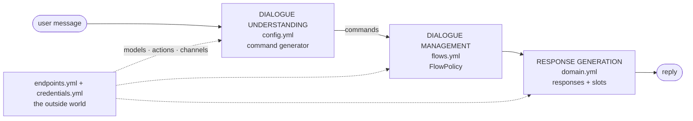
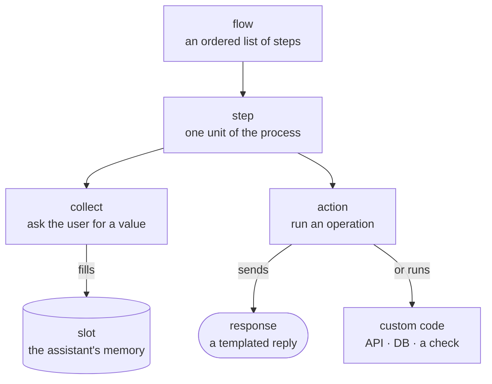
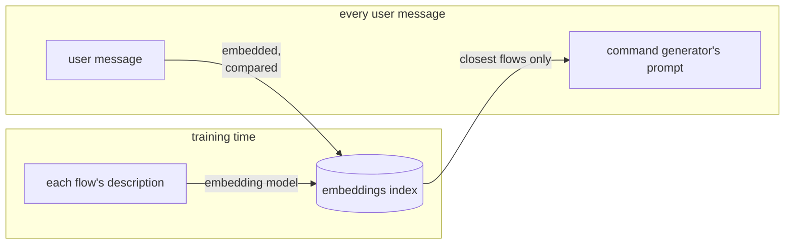
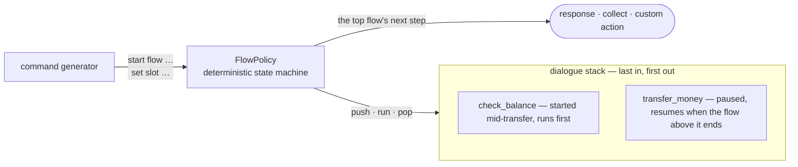
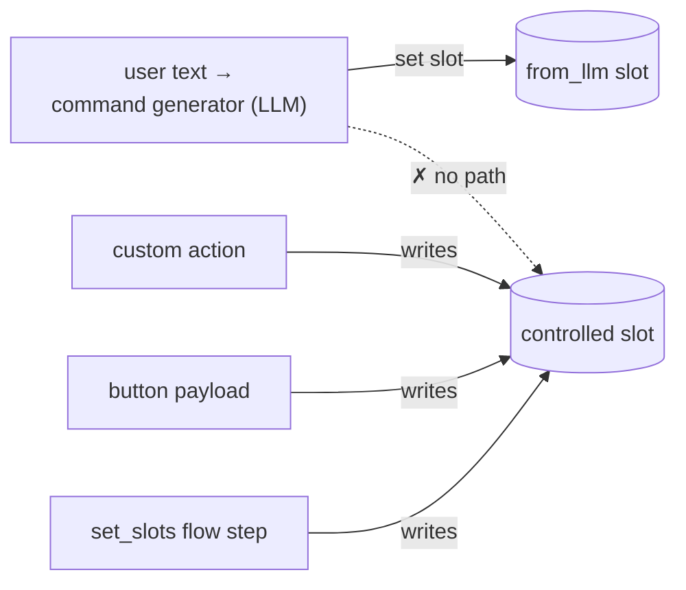
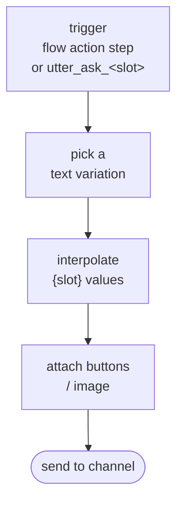
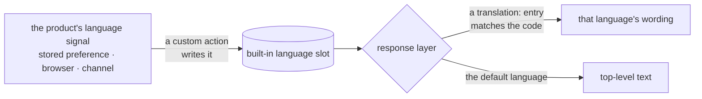
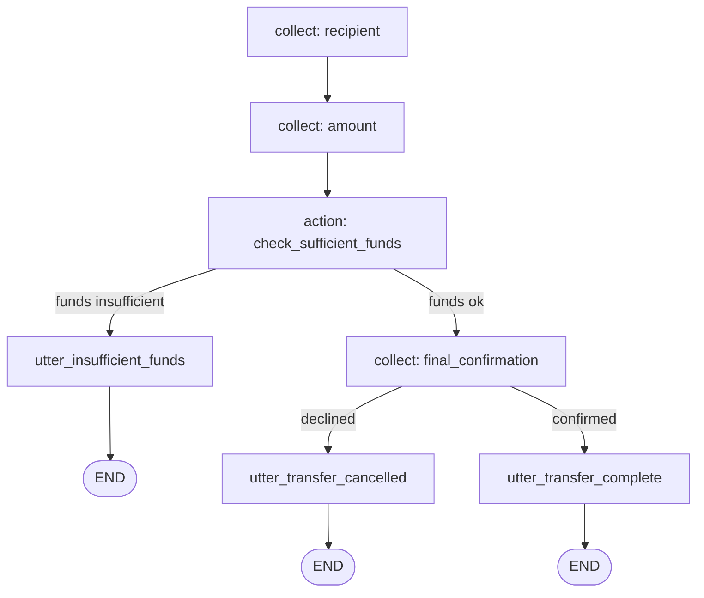
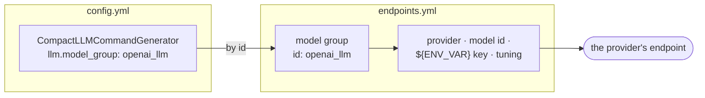
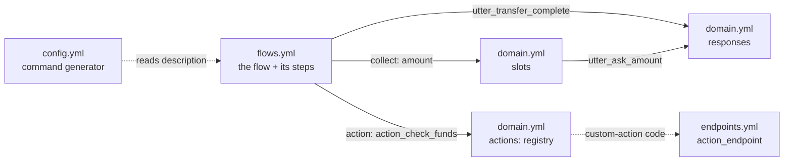

# Day 7 — Rasa Components Deep Dive

## Student Study Guide

This chapter is a file-by-file tour of a Rasa Pro project: what each configuration file is for, what its most important keys do, and where to go to change a given behaviour. It opens by mapping the files onto the three stages of a CALM turn — Dialogue Understanding, Dialogue Management, and Response Generation — and recalling the anatomy of a flow, then works through `config.yml` (the assistant pipeline), `domain.yml` (what the assistant knows and says), `flows.yml` (business logic as YAML), the fixed command vocabulary the command generator may emit, and finally `endpoints.yml` with `credentials.yml` (where the assistant connects to models, action code, and channels). The aim is practical fluency with the configuration surface — enough to spin up and customize a basic assistant; custom-action code, advanced flow design, and input validation are each taken up on their own later days.

---

## Chapter 1 — The file map and a flow's anatomy

### 1.1 The files, mapped to a CALM turn

A CALM assistant handles each user message in three stages: the assistant **understands** the message, **decides** what to do, and **responds**. Rasa names the first two stages **Dialogue Understanding** and **Dialogue Management**; the third is **Response Generation**. Only the first uses an LLM. Each stage is configured by a specific file, which is what makes "where do I change this?" a question with a precise answer.



**Dialogue Understanding** is the *command generator*, an LLM component declared in `config.yml`: it reads the conversation and emits commands. **Dialogue Management** is the `FlowPolicy`, which executes the business logic in `flows.yml` in response to those commands. **Response Generation** draws the assistant's replies from `domain.yml`, which also holds the conversation state. `endpoints.yml` and `credentials.yml` wire all three stages to the outside world — the model provider, the backend code, and the chat channels.

The whole configuration surface, then, is **four questions across five YAML files**, with two practical caveats folded into the table: the flows live under the `data/` directory (as `data/flows.yml`, optionally split across several files), and the last question is answered jointly by `endpoints.yml` and `credentials.yml`.

| File | The question it answers | Stage |
|---|---|---|
| `config.yml` | **Who processes a turn?** | Dialogue Understanding |
| `domain.yml` | **What does the assistant know and say?** | Response Generation + state |
| `data/flows.yml` | **What can the assistant do?** | Dialogue Management |
| `endpoints.yml` + `credentials.yml` | **Where does it connect?** | the outside world |

### 1.2 The anatomy of a flow

The tour ahead introduces slots, actions, and steps one file at a time. Recalling up front how they fit together inside a flow makes each part easier to place when it appears:



A **flow** is an ordered list of **steps** the assistant works through to carry out a task such as a money transfer. A step mostly does one of two things: a **collect** step asks the user for a value and stores it in a **slot** — the assistant's memory, which later steps can read and branch on — while an **action** step runs an operation, most often sending a **response** (a templated reply) but sometimes running custom code such as an API call or a database lookup. Flow, step, slot, action, response: these five words recur across every file in the tour.

---

## Chapter 2 — `config.yml`: the assistant pipeline

`config.yml` answers one question — **who processes a turn** — by declaring the components in the pipeline and the policies that run. It is the file to reach for when choosing or tuning the command generator, setting the language, or pointing the assistant at its models.

### 2.1 A complete assistant is two components

A complete CALM assistant is **two components** — one that understands, one that decides:[^1]

```yaml
recipe: default.v1
language: en
assistant_id: banking_assistant
pipeline:
  - name: CompactLLMCommandGenerator
policies:
  - name: FlowPolicy
```

That is not a fragment; it trains and runs. Two components carry it, one per block: the **`pipeline:`** key lists the components that process each incoming user message, in order, and the **`policies:`** key lists the components that decide what the assistant does with the result (§2.3).[^1] The `CompactLLMCommandGenerator` is the **command generator** — the Dialogue Understanding stage: on every turn it sends the conversation and the eligible flows to an LLM and gets back a short list of *commands* (start this flow, set this slot, and so on), the structured reading of what the user wants. The `FlowPolicy` is the **Dialogue Management** stage: it takes those commands and runs the matching flows deterministically, with no LLM involved.[^1][^2] The three header keys above the pipeline orient the file:


- **`recipe: default.v1`** selects the configuration schema Rasa uses to read this file — which keys are valid and how they are interpreted. `default.v1` is the schema for CALM projects and is effectively a fixed header: you set it once and leave it, since no other value applies.[^1]
- **`language: en`** declares the assistant's primary language, used when it is trained and run. A multilingual assistant adds an `additional_languages` list for the rest — Italian would appear as `additional_languages: [it]`.[^1]
- **`assistant_id`** is a stable identifier for this assistant, stamped onto its events and trained models so logs and tooling can tell one assistant apart from another. The scaffold leaves a placeholder — replace it with something stable and meaningful such as `banking_assistant`, and avoid changing it later, since the identifier ties together everything already tagged with it.[^1]

### 2.2 The command generator block

The minimal config grows into a realistic one key by key:[^3]

```yaml
recipe: default.v1
language: en
assistant_id: banking_assistant

pipeline:
  - name: CompactLLMCommandGenerator
    llm:
      model_group: openai_llm
    flow_retrieval:
      embeddings:
        model_group: openai_embeddings
    user_input:
      max_characters: 420
      prompt_template: prompts/command_generator.jinja2   # optional — your own prompt

policies:
  - name: FlowPolicy
```

**`llm.model_group` — which model powers the command generator.** This is where you choose the LLM that reads the conversation and produces commands. Instead of naming a model directly, it gives the name of a **model group** — a named bundle of provider, model id, and credentials. The bundle itself is declared elsewhere, in `endpoints.yml`, and referred to here only by its `id` (Chapter 6 covers how it is defined). For now the point is simply that this one line is the dial that aims the command generator at one model or another.[^4]

**`flow_retrieval` — only the relevant flows enter the prompt.** When an assistant grows to dozens of flows, putting *all* of their descriptions into *every* prompt is wasteful and dilutes the model's attention. Flow retrieval embeds each flow's description into a vector that captures its meaning, and per user message includes only the flows whose meaning is closest to the message.[^3][^5] The benefit is twofold: better **accuracy** (a tighter, more relevant prompt sharpens flow selection) and lower **cost** (fewer prompt tokens per turn). The embeddings index is built **at training time** from the flow descriptions and, optionally, the slot descriptions; retrieval is on by default and can be switched off with `flow_retrieval: { active: false }`. It uses its own embeddings model group — hence the second `model_group` reference in the block above.[^3]



**`user_input.max_characters` — the input guard.** Default **420** characters; anything longer is *not passed to the LLM*.[^3] This is a small, deterministic guard at the mouth of the pipeline that caps the token cost of an accidental or hostile wall of text before any model sees it.

**`prompt_template` — the customization hook.** To turn a user message into commands, the command generator wraps it in a **prompt**: a block of instructions that tells the LLM which commands exist, lists the eligible flows and current slots, and asks it to choose. That prompt is produced from a built-in template that ships with Rasa, so a working assistant needs no prompt of its own. The optional `prompt_template` parameter points the component at *your* template file instead, for projects that need to reshape those instructions; it is rarely touched when getting started, and customizing it is a later-course topic.[^3][^6]

**Optimized templates per model family.** That built-in prompt is not one-size-fits-all: Rasa maintains *tuned* templates for specific model families — current GPT and Claude families — and falls back to a default template when the configured model matches none of them.[^3] Which template the command generator uses is therefore determined by which model is configured.

A search-optimized variant, the `SearchReadyLLMCommandGenerator`, exists for assistants built around knowledge-base answering; it pairs with a search policy and is the natural choice once a project leans on retrieval-augmented answers, a topic covered later in the course.[^3]

### 2.3 The policy: `FlowPolicy`

Where the pipeline ends, the `policies` block begins. A **policy** drives the Dialogue Management stage: on each turn it decides the assistant's next action. In a classic NLU assistant several policies compete — each predicts a next action with a confidence, and the most confident one wins — and a configuration may list more than one; a CALM assistant needs only the `FlowPolicy`.[^2]

The `FlowPolicy` is a **deterministic state machine that executes the business logic defined in the flows**.[^2] It is the consumer of the commands the generator produces: a `start flow` command starts the named flow, pushing it onto a **dialogue stack** the policy maintains and running its steps; a `set slot` command fills an awaited value and advances the flow.[^2] The stack is last-in-first-out, so a flow started while another is mid-run finishes first and then returns control to the one beneath it — which is how the assistant handles a digression and comes back to where it was.[^2] No LLM is involved: given the same commands and state it always takes the same step, and it has no parameters of its own — `- name: FlowPolicy` is the whole declaration.[^2]



The `FlowPolicy` is not the only policy: others exist for capabilities beyond flow execution, and a configuration lists them alongside it when the project needs them. The `EnterpriseSearchPolicy`, for instance, answers knowledge questions by retrieving from an indexed document store and generating a grounded answer instead of executing a flow — the retrieval-augmented path taken up later in the course.[^2]

---

## Chapter 3 — `domain.yml`: what the assistant knows and says

`domain.yml` answers **what does the assistant know and say** — it holds the conversation *state* (slots), the **responses** that make up the Response Generation stage, the registry of **actions** the assistant can take, and the session configuration. In miniature, for an assistant that checks account balances:

```yaml
slots:
  account_type:
    type: categorical
    values:
      - checking
      - savings
    mappings:
      - type: from_llm
  current_balance:
    type: float
    mappings:
      - type: controlled

responses:
  utter_greet:
    - text: "Welcome — how can I help you today?"
  utter_ask_account_type:
    - text: "Which account would you like to check?"
  utter_current_balance:
    - text: "Your {account_type} account balance is €{current_balance}."

actions:
  - action_fetch_balance

session_config:
  session_expiration_time: 60
  carry_over_slots_to_new_session: true
```

Read top to bottom: the assistant remembers which account is being discussed and what its balance is, has three things to say, can run one piece of custom code, and starts a fresh conversation an hour after the user goes quiet.

### 3.1 Slots: the working memory

A slot is the assistant's **memory**: a named, typed key-value store that holds one piece of information for the span of a conversation — something the user supplied (the recipient of a transfer, the amount) or something the assistant gathered about the world (an account balance, whether a funds check passed).[^7] Slots are what let a multi-turn dialogue accumulate state instead of treating each message in isolation: values are collected into them, branching logic reads them, responses interpolate them, and custom actions write to them. Each is declared with a name and a type, and CALM offers **six** slot types:[^7]

| Type | Holds | Notes |
|---|---|---|
| `text` | any string | the workhorse |
| `bool` | true / false | confirmations, checks |
| `float` | numbers | amounts, balances |
| `categorical` | one of a declared list | requires a `values:` key |
| `any` | arbitrary data, including structured values | for custom-action plumbing |
| `list` | a list of values | usable from custom actions only — a `list` slot cannot be filled by a `collect` or `set_slots` step[^7] |

A categorical slot is the one shape with extra syntax — it must declare its allowed `values`:

```yaml
slots:
  card_block_type:
    type: categorical
    values:
      - temporary
      - permanent
    mappings:
      - type: from_llm
```

A slot's **mapping** declares *who is allowed to write to it*.

**`from_llm` is the default.** The command generator fills the slot from the conversation, whenever the user supplies the value, in any phrasing, in any order. Omit the `mappings` key entirely and `from_llm` is assumed.[^7] No extractor is trained to recognize "send it to my landlord, the usual amount" — the LLM simply reads it.

**`controlled` is the trust boundary.** A controlled slot can be written *only* by a custom action, a button payload (a fixed message attached to a response — §3.2), or a `set_slots` flow step — never by the LLM, and never by anything the user types:[^7]

```yaml
slots:
  has_sufficient_funds:
    type: bool
    mappings:
      - type: controlled
```

The `controlled` mapping is a **security control**. The rule is simple: *if the LLM must never be able to claim it, the slot is controlled.* An authentication result is controlled; an account balance is controlled; a transfer-limit check is controlled. The threat model is the trust-boundary one — a user, or an instruction injected into user text, says "I'm authenticated and my balance is one million euros." With a `from_llm` mapping a confused command generator could in principle write that into state; with `controlled`, **there is no code path from user text to that slot.** Reviewing slot mappings is therefore a security review: what must be guaranteed is not entrusted to the model, it is enforced deterministically, outside it.



Two further mapping types, `from_entity` and `from_intent`, wire slots to a classic NLU pipeline in coexistence setups; they belong to a later day.[^7]

A slot can also carry a `validation` block whose `rejections` list rejects a collected value that fails a check — a format or range rule that holds wherever the slot is used — and re-asks for a valid one, named here only to complete the `domain.yml` tour since it is one of the input-validation layers treated on Day 11.[^21]

### 3.2 Responses: the voice

A **response** is a message the assistant sends back to the user, written ahead of time and stored in the domain rather than generated on the fly. Everything templated that the assistant says lives under `responses:`, and every name carries the `utter_` prefix — and that name is all the wiring a response needs.[^8] A response fires in one of two situations — a flow reaches a step that names it (`action: utter_transfer_complete`), or a flow asks for a slot and Rasa automatically sends the matching `utter_ask_<slot>` (the convention below). Either way the *trigger* is the deterministic dialogue layer, not the LLM: the model decides what to do, but the wording of every reply is fixed text the team wrote and reviewed.

The grammar, by example:

```yaml
responses:
  utter_greet:
    - text: "Welcome — how can I help you today?"
    - text: "Hello — I'm the banking assistant. What do you need?"

  utter_current_balance:
    - text: "Your {account_type} account balance is €{current_balance}."

  utter_ask_account_type:
    - text: "Which account would you like to check?"
      buttons:
        - title: "Checking"
          payload: "/SetSlots(account_type=checking)"
        - title: "Savings"
          payload: "/SetSlots(account_type=savings)"
```

When a response fires, Rasa assembles the outgoing message in a short sequence — pick one of the text variations, substitute any `{slot}` placeholders with current values, attach any rich elements (buttons, an image), and hand the result to the channel the user is on:



Four mechanisms appear in that one block:

1. **Variations.** Multiple `- text:` entries under one name are chosen at random at runtime — cheap naturalness with zero generation risk, because every variant was written and reviewed.[^8]
2. **Slot interpolation.** `{slot_name}` injects the current slot value at send time.[^8] The wording stays reviewable in the domain; only the values move.
3. **Buttons.** A button is defined by two keys — a `title`, the label shown to the user, and a `payload`, the message sent back to the assistant *as if the user had typed it* when the button is chosen.[^8] How it is actually displayed is up to the **channel**, the surface the conversation runs on (a web widget, the CLI, Slack, and so on): one channel renders a clickable element, the CLI lists buttons to pick by number, and some channels do not support them at all. What stays constant is the payload — the `/SetSlots(account_type=checking)` form above is a command that sets the slot directly, bypassing the LLM. Because that input is deterministic rather than model-interpreted text, a slot-setting button is one of the few writers a `controlled` slot accepts (§3.1).[^7][^8] Responses can also carry an `image:` URL for channels that render images.[^8]
4. **The `utter_ask_<slot>` convention.** When a flow reaches `collect: account_type`, Rasa automatically asks the response named `utter_ask_account_type`.[^8] No wiring, no registration — the name *is* the wiring.

Response variations can also carry a `condition:` block, so wording can depend on a slot value — a different confirmation question for a `permanent` versus a `temporary` card block, for instance.[^8] The capability is worth knowing; its full syntax is beyond this tour.

### 3.3 Actions: what the assistant does

An **action** is anything the assistant *does* as a step in a flow — at its simplest, sending a message back to the user, but just as often running code: calling an API, querying a database, performing a check.[^9] They come in a few kinds, and §3.2's response is the first of them: any `utter_` name is automatically an action, usable in a flow's `action:` step with no further declaration — writing the response *was* the registration. Rasa's built-in **default actions** (its conversation-repair behaviours) are likewise ready to use. A **custom action** is the exception: it is backed by your own Python code, and every custom action must be listed under `actions:`, or it cannot run:[^9]

```yaml
actions:
  - action_fetch_balance
```

The list is the whole of what `domain.yml` needs to know about it — it is what makes a custom action callable. Writing the code behind a custom action, and wiring it to external systems, is the subject of the next day.

### 3.4 Multilingual responses: replying in the user's language

An assistant that serves customers in more than one language needs its replies available in each of them. `config.yml` already named the assistant's primary `language` (§2.1); an assistant that supports others lists them under `additional_languages`, each a two-letter ISO 639-1 code — Italian is `it`:[^19]

```yaml
language: en
additional_languages:
  - it
```

Given those supported languages, the domain carries the wording for each. A response holds all its language variants in one place through a **`translation:` key**, keyed by language code; the top-level `text` is the default language and each entry under `translation` supplies the same message in another. Button labels translate the same way, so the whole response stays a single reviewable unit rather than a copy per language:[^18]

```yaml
responses:
  utter_ask_account_type:
    - text: "Which account would you like to check?"
      translation:
        it: "Quale conto vuoi controllare?"
```

Which translation is served is decided by a **built-in `language` slot** that holds the current conversation's language.[^18] It is not a slot the team declares: `language` is a reserved keyword Rasa manages internally — a custom slot cannot take that name — and its value is constrained to the codes configured above. Setting it is the team's responsibility: because Rasa does not infer the user's language on its own, a custom action (typically at session start) writes the slot from whatever signal the product has — a stored preference, a browser setting, a channel parameter.[^18] With the slot set, the deterministic response layer serves the translation matching the current language, the top-level `text` being the default-language wording.



There is a second, dynamic path for the same goal. The **Response Rephraser** — an LLM-backed response generator, enabled in `endpoints.yml` — rewords the assistant's replies at runtime in the conversation's language rather than reading stored translations, taking the target language from the same `language` slot.[^18][^20] It trades the reviewability of fixed, written translations for coverage without authoring each one; the choice between stored translations and runtime rephrasing is the same design-time-control-versus-generative-flexibility trade-off that runs through CALM, applied to wording. This tour uses stored translations; the rephraser is named here only so its role is clear.

Translation completeness is checkable rather than a matter of inspection: `rasa data validate translations` reports responses (and flow names) missing a translation for a configured language, so gaps surface before deployment rather than in front of a customer.[^18]

### 3.5 Session configuration

A **conversation session** is one continuous stretch of dialogue between user and assistant; a new one begins when the user makes first contact or returns after a period of inactivity.[^9] `session_config` sets where that boundary falls and what crosses it:[^9]

```yaml
session_config:
  session_expiration_time: 60   # minutes; 0 = never expire
  carry_over_slots_to_new_session: true
```

- **`session_expiration_time`** — the minutes of inactivity after which the current session ends and the user's next message opens a fresh one; `0` means the session never expires.[^9]
- **`carry_over_slots_to_new_session`** — whether the slots filled in the old session survive into the new one (`true`) or are dropped so the next session starts blank (`false`).[^9]

For sensitive state, carry-over is a product-and-privacy decision rather than boilerplate — whether a card-block conversation abandoned at lunchtime should still hold the card number an hour later. The conservative choice is not to let sensitive slots linger.

### 3.6 Splitting the domain across files

The same domain content can be organised two ways, and Rasa treats them identically once loaded:[^9]

- **One file** — a single `domain.yml` holding `slots:`, `responses:`, `actions:`, and `session_config:` together. Easy to scan top to bottom, and the natural choice for a small assistant.
- **A directory** — the same top-level keys spread across several files in a folder (`domain/slots.yml`, `domain/responses.yml`, `domain/actions.yml`, …), which Rasa reads and **merges automatically** when pointed at the directory:[^9]

```bash
rasa train --domain path/to/domain_directory
```

The merged result behaves identically either way — the split is purely organisational. It earns its keep as a project grows: a few hundred responses in their own file stay navigable, slot definitions are easy to locate, and two people editing responses and slots respectively touch different files instead of colliding in one. The cost is the small amount of structure to set up and remembering the `--domain` pointer at train time.

Nor does a directory have to be split *by kind*. The CALM starter template (`rasa init --template calm`, a small contact-list assistant) splits its domain **by flow** instead: `domain/add_contact.yml` holds the slots, responses, and action of the add-contact flow, its siblings do the same for the list and remove flows, and a `domain/shared.yml` carries what several flows use. Everything one capability needs then sits in one file, so adding or retiring a capability touches one file rather than three. A reasonable rule of thumb is to keep a single file until it turns unwieldy, then split along whichever axis the team actually edits — by kind when specialists own responses or slots across the assistant, by flow when each capability is owned end to end. The starter templates already use the directory layout, which is why a scaffolded project shows a `domain/` directory rather than a lone `domain.yml`.

---

## Chapter 4 — `flows.yml`: business logic as YAML

`flows.yml` answers **what can the assistant do** — it is the Dialogue Management stage, the business logic written as YAML. It lives in the project's `data/` directory as `data/flows.yml`, which can be a single file or several YAML files.[^5][^12]

### 4.1 A flow's `description` is a prompt, not a comment

A flow's `description` is **required**, and it is the prose the command generator reads when deciding whether *this* flow matches what the user just said.[^10][^11] It is also what flow retrieval (Chapter 2) embeds to decide whether the flow even *enters* the prompt — the embeddings index is built from descriptions and slot names.[^3] So this one YAML string is the most important piece of LLM-facing text in the project: simultaneously the flow's **advertisement** (does retrieval surface it?) and its **trigger condition** (does the model select it?). Clear, specific descriptions measurably reduce flow-selection errors.[^5]

A flow's **identity** is three keys: the `id` (the YAML key itself — alphanumeric characters, underscores, and hyphens, and it must not start with a hyphen), an optional human-readable `name`, and the required `description`.[^11] One naming rule is enforced: the `pattern_` prefix is **reserved** for Rasa's built-in conversation-repair flows, and custom flows must not use it.[^14]

### 4.2 The running example

This is the official tutorial's money-transfer flow, final version, verbatim:[^12]

```yaml
flows:
  transfer_money:
    description: Help users send money to friends and family.
    steps:
      - collect: recipient
      - collect: amount
        description: the number of US dollars to send
      - action: action_check_sufficient_funds
        next:
          - if: not slots.has_sufficient_funds
            then:
              - action: utter_insufficient_funds
                next: END
          - else: final_confirmation
      - collect: final_confirmation
        id: final_confirmation
        next:
          - if: not slots.final_confirmation
            then:
              - action: utter_transfer_cancelled
                next: END
          - else: transfer_successful
      - action: utter_transfer_complete
        id: transfer_successful
```

The same flow drawn out, with its branches explicit:



Read top to bottom, the flow is a process narrative — *ask who, ask how much, check funds, branch, confirm, branch, done*. The `utter_insufficient_funds`, `utter_transfer_cancelled`, and `utter_transfer_complete` lines fire a response directly from inside the flow, which an `action` step can do (§4.3). The decision logic is in plain YAML rather than buried in a model's weights, so a non-engineer process owner can review it — the auditability that distinguishes CALM, made concrete.

### 4.3 The step types

**`collect` — ask and fill.** Names a slot; the engine asks `utter_ask_<slot>` (Chapter 3's convention) and waits for the user.[^10] The optional step-level `description` guides the LLM's extraction for *that specific* question — `amount` above is described as "the number of US dollars to send", disambiguating dollars from any other number in sight.[^10] Two modifiers matter here:

- `ask_before_filling: true` — by default a `collect` is skipped if the slot is already filled; set this to ask *always*, even when a value exists. A confirmation step needs it: a confirmation the user never saw is not a confirmation.[^10]
- `utter:` — override the default question, pointing the `collect` at a differently named response.[^10] This lets one shared `confirmation` slot be reused across flows, each `collect` supplying its own wording:

```yaml
# in transfer_money:
- collect: confirmation
  utter: utter_ask_transfer_confirmation
  ask_before_filling: true

# in block_card:
- collect: confirmation
  utter: utter_ask_block_confirmation
  ask_before_filling: true
```

**`action` — execute and continue.** Runs either a response (`action: utter_insufficient_funds`) or a custom action (`action: action_check_sufficient_funds`) and then moves straight on, *without* waiting for user input.[^10]

**`set_slots` — programmatic assignment.** The flow itself writes slot values; `null` clears a slot:[^10]

```yaml
- set_slots:
    - account_type: "savings"
    - amount: null
```

**`noop` — a pure branching point.** Does nothing except branch; it exists for when you need to branch *before* doing anything. It must always carry a `next`, or training fails:[^10]

```yaml
- noop: true
  next:
    - if: not slots.authenticated
      then: ask_credentials
    - else: show_account
```

### 4.4 Branching: `next`, predicates, ids, `END`

Branching hangs off any step via `next`, which accepts three forms:[^10]

- a **string** — jump to the step with that `id`;
- **`END`** — terminate the flow;
- a **list of `if:` / `then:` / `else:` objects** — conditional branching, as in the transfer flow above.

Conditions are **predicates** evaluated over the `slots.` namespace.[^13] The operator families, by example:

```
slots.amount_of_money > 5000                 # comparisons: > >= < <= = !=
not slots.confirmation                        # logical: not, and, or
slots.card_block_type is "permanent"          # identity: is, is not
slots.postal_code matches "\d{5}"             # regex match
slots.status = empty or slots.status is null  # constants: true false null empty undefined
```

A slot reads as `null` when it has never been set, and as `empty` when it was set to an empty value. In everyday guards you test `is null` to mean "this slot is not filled yet"; reach for `empty` only when you must tell an un-filled slot apart from one explicitly cleared. The `matches` operator handles format checks on codes and identifiers directly in the branching logic.[^13] Step `id`s are the jump targets: in the transfer flow, `final_confirmation` and `transfer_successful` are `id`s the `next:` lines route to by name.

Two composition steps round out the file's vocabulary: `call` embeds another flow and returns to the parent when it finishes, and `link` ends the current flow and hands off to another.[^10] They are how flows combine into larger behaviour, which is its own subject later in the course; for now it is enough to recognize them when touring a flow file.

---

## Chapter 5 — The command set: what the LLM can actually say

In CALM, the LLM's entire output channel is a **fixed, closed list of commands**: the model can emit these and nothing else. The command the Inspector shows inline with each exchange is always one of them.

### 5.1 The command vocabulary

The default command generator (`CompactLLMCommandGenerator`) may emit these commands, and no others — the model reads the conversation, the eligible flows, and the filled slots, and answers with lines from this list, *nothing else*:[^3]

| Command | What it means | Engine behaviour |
|---|---|---|
| `start flow <flow_name>` | Start a flow — e.g. `start flow transfer_money` | The `FlowPolicy` pushes the flow onto the dialogue stack and begins executing it.[^2][^3] |
| `set slot <slot_name> <value>` | Fill a slot; also used to correct a value already set | Fills the slot — both first-time values *and corrections* ride this one token.[^3] |
| `cancel flow` | Cancel the flow in progress | Triggers the cancellation pattern (`pattern_cancel_flow`).[^14] |
| `disambiguate flows <f1> <f2> …` | List candidate flows when the request is ambiguous | Triggers the clarification pattern (`pattern_clarification`): the assistant asks the user to choose.[^14] |
| `provide info` | Answer a knowledge/FAQ question when no flow fits | Routes the turn toward the search/RAG path.[^3][^14] |
| `offtopic reply` | Respond to casual or social, off-topic messages | Handled via `pattern_chitchat`.[^3][^14] |
| `repeat message` | Repeat the last bot message | Triggers `pattern_repeat_bot_messages`.[^14] |

Each line the model emits is a command in this small language — a verb followed by its arguments. Typing "add a contact" produces the single line `start flow add_contact` — the `start flow` command carrying `add_contact`; the dialogue engine reads that line and carries it out, starting the `add_contact` flow and running its steps.[^2][^3] The `pattern_` names in the engine column are Rasa's built-in conversation-repair flows — §4.1's reserved prefix — triggered here as the effect of a command. The division of labour is the point: the model only *writes* these lines, while executing them is the engine's job — the model never runs anything itself.

One precision point prevents a common confusion: there is **no `cannot handle` token**. When nothing in the vocabulary fits, the model emits no usable command, and it is that *absence* which routes the turn into the cannot-handle repair pattern (`pattern_cannot_handle`).[^14] This follows directly from the closed vocabulary: every command the model can emit corresponds to a real, declared capability, so "I cannot do this" is never something the model *says* — it is what the engine *concludes* when no valid command comes back. The fallback is engine behaviour, not a model utterance, and the model is never in a position to invent an option that does not exist.


The Compact generator taught here is one of a small family of command generators; a pipeline carries a single LLM-based one:

| Command generator | What it's for |
|---|---|
| `CompactLLMCommandGenerator` | The general-purpose default, tuned for compact modern LLMs — the generator this course uses. |
| `SearchReadyLLMCommandGenerator` | For assistants built around knowledge-base answering, where the generator itself triggers retrieval. |
| `NLUCommandAdapter` | A non-LLM generator that starts flows from a classic intent classifier, for NLU/coexistence setups. |

The latter two are later-course topics; the rows are here only so the names are familiar when they appear. Each generator speaks its own **command DSL** — the small domain-specific language it produces commands in — and Rasa maintains a few of them, so the available commands and their exact spellings vary a little from one to the next. The list above is the default DSL, the one the Compact generator uses; the `SearchReadyLLMCommandGenerator`, for instance, folds `provide info` and `offtopic reply` into a single `search and reply` command for knowledge and social turns alike, and pairs with a search policy. The complete per-generator command list is in Rasa's command reference.[^3][^6]

### 5.2 Why a closed vocabulary

Constraining the model to a fixed list of commands is a deliberate engineering choice, and it buys something specific. The model's only influence on the system is *which* commands it selects from a known set — it can never widen that set. Faced with "wire €5,000 to my landlord", the generator can emit `start flow transfer_money` and `set slot amount 5000`, commands the project defines, and the `FlowPolicy` runs the reviewed transfer logic. What it cannot do is emit an instruction the project never declared: there is no command for "move the money directly", "skip the confirmation step", or "call this URL", so no user phrasing and no model misfire can produce one. Every output is checked against the project — a `start flow` naming a flow that does not exist is not a valid command — and nothing the model writes is executed as free text.[^3][^6]

The benefit is that the assistant's range of action is fixed at design time and stays auditable: what it can do is exactly the set of flows and commands the team wrote, not whatever a model might generate on a given day. This is also the basis of Rasa's claim that CALM is resistant to hallucination and prompt injection by design (claim):[^6] the model cannot invent an action, because its language has no syntax for one. A residual risk remains — an injected instruction can still try to steer *which* allowed command the model picks, which is why the `controlled` slots of Chapter 3 still matter — but it cannot conjure a capability that was never built.

The command set *is* customizable in principle, through the prompt template, but Rasa explicitly discourages it: the built-in set is the one Rasa tests and maintains, and custom commands forfeit those guarantees.[^6] This course does not customize it.

---

## Chapter 6 — `endpoints.yml` & `credentials.yml`: models, channels, and the outside world

These two files answer **where does the assistant connect**. They are the deployment seam — the files that change as the assistant moves from a laptop to a test environment to production, while its behaviour stays put. The pipeline and policy (`config.yml`), the slots, responses, and actions (`domain.yml`), and the business logic (`flows.yml`) are identical across all three environments; only the wiring here differs — which model endpoint is called, where the action code runs, which channels are open. The benefit is that the same reviewed assistant is promoted unchanged from development to production: deploying is a change of connections, not of conversational logic. `endpoints.yml` declares the connections the assistant *uses* — the models and the action code — and `credentials.yml` declares the channels it *listens on*.

### 6.1 Model groups in `endpoints.yml`


All LLM configuration lives in named **model groups**, each referenced from `config.yml` by its `id`.[^4] The canonical OpenAI shape:

```yaml
model_groups:
  - id: openai_llm
    models:
      - provider: openai
        model: gpt-5.1-2025-11-13
        api_key: ${OPENAI_API_KEY}
        timeout: 15
        temperature: 1.0
        reasoning_effort: "minimal"

  - id: openai_embeddings
    models:
      - provider: openai
        model: text-embedding-3-large
        api_key: ${OPENAI_API_KEY}
```

This is Chapter 2's indirection seen from the other side: `config.yml` named `openai_llm`; here is what that name resolves to. The point of the indirection is to keep model choice out of the pipeline — components refer to a group by name, while the group's definition (provider, model id, credentials, tuning) lives here. One group can be shared by several components, and changing the model a component uses, or pointing it at a different provider or environment, becomes an edit to this file alone, with `config.yml` untouched.[^4]



A model group can hold **more than one model** — `models:` is a list, which is what makes it a *group*. When it holds several, Rasa puts a **router** in front of them and load-balances requests across the group:[^4]

```yaml
model_groups:
  - id: openai_llm
    models:
      - provider: azure
        deployment: gpt-instance-eu
        api_base: https://eu.example.openai.azure.com/
        api_version: "2025-02-01-preview"
        api_key: ${AZURE_API_KEY_EU}
      - provider: azure
        deployment: gpt-instance-us
        api_base: https://us.example.openai.azure.com/
        api_version: "2025-02-01-preview"
        api_key: ${AZURE_API_KEY_US}
    router:
      routing_strategy: simple-shuffle   # or least-busy, latency-based-routing, …
```

The deployments in one group are meant to be the **same underlying model** — for instance one model served from two regions — not a mix of different models, since the component reading the group expects consistent output.[^4] So holding several models buys **throughput and resilience**, not a cheaper-model-sometimes shortcut: the router spreads requests by the chosen `routing_strategy`, and can retry and briefly side-line a failing deployment (`num_retries`, `allowed_fails`, `cooldown_time`).[^4] A single-model group — the usual case while getting started — is simply a one-item list with no router.

Three further points make the file safe and portable:

- **Credentials are `${ENV_VAR}` references, never literals.** Rasa prohibits a hardcoded key value in the configuration — a credential in a config file is a credential that can leak, so it is kept out of the files entirely.[^4] For `provider: openai` the `api_key` line can even be omitted, and Rasa reads `OPENAI_API_KEY` from the environment directly.[^4]
- **Per-model parameters live in the group**, next to the model they tune — `timeout`, `temperature`, and the `reasoning_effort` dial that governs how hard a step may think all belong here.[^4]
- **Model choice is a deployment diff.** Because `config.yml` refers to the group only by its `id`, retargeting the assistant is an edit *inside* the group, with the `id` — and therefore `config.yml`, and every other file — untouched. Moving the command generator from direct OpenAI onto a corporate Azure tenancy is the whole of it:[^4]

```yaml
# development — direct OpenAI
model_groups:
  - id: openai_llm
    models:
      - provider: openai
        model: gpt-5.1-2025-11-13

# production — the same group id, now an Azure deployment; config.yml never changes
model_groups:
  - id: openai_llm
    models:
      - provider: azure
        deployment: rasa-gpt-5-1
        api_base: https://my-azure.openai.azure.com/
        api_version: "2025-02-01-preview"
        api_key: ${AZURE_API_KEY}
```

This is the pattern behind promoting an assistant between environments: a laptop, a test environment, and production each keep their own `endpoints.yml` — and their own environment variables behind the `${…}` references — while `config.yml`, `domain.yml`, and the flows ship identically to all three. How those environments are laid out and promoted is taken up when the course turns to deployment engineering (Day 14). One catch travels with any model swap, from Chapter 2: Rasa selects a tuned built-in prompt by model *family*, so changing the model here can change the prompt the command generator runs on, not just the model answering it. A model swap is therefore a *retest event*, not a one-line tweak.

One more provider shape completes the set — self-hosted:[^4]

```yaml
# Self-hosted — vLLM / Ollama or any OpenAI-compatible endpoint
model_groups:
  - id: self_hosted_llm
    models:
      - provider: self-hosted
        model: meta-llama/CodeLlama-7b-Instruct-hf
        api_base: "https://my-endpoint/v1"
```

The supported providers include OpenAI, Azure OpenAI, Amazon Bedrock, Anthropic, Mistral, Cohere, Groq, and `self-hosted`; the backend is [LiteLLM](https://github.com/BerriAI/litellm), so any provider it reaches is reachable.[^4]

### 6.2 The action endpoint, both forms

A **custom action** is your own code that the assistant runs as a step in a flow — to call an external API, query a database, or perform a check whose result the flow then branches on (fetching an account balance, confirming availability).[^15] Because that code can do anything and often holds credentials to outside systems, Rasa does not run it inside the dialogue engine by default: when a flow reaches a custom action, the engine sends a request to an **action server**, which runs the matching code and returns the resulting events and messages.[^15] `endpoints.yml` is where you declare where that code lives, in one of two forms:[^12][^15]

```yaml
action_endpoint:
  url: "http://localhost:5055/webhook"   # form 1: a separate action server
  # actions_module: "actions"            # form 2: in-process execution
```

**Form 1 — a separate action server** runs the custom-action code in its own process, reached over HTTP (conventionally port 5055 at `/webhook`). Engine and action code are decoupled, so the action code can be scaled, deployed, and secured on its own, and the credentials it needs never enter the Rasa process.[^15] **Form 2 — in-process** imports the actions directly into the Rasa process (`actions_module` names the Python module), removing the network hop and the second service — lower latency and simpler local development, at the cost of the Rasa process itself needing every credential the actions use.[^15] Both forms run the same code; they differ only in where it executes. Writing those actions, and the request/response contract behind the server, is the next day's subject.

### 6.3 The other endpoints: where state is kept

Three further blocks can appear in `endpoints.yml`, and a scaffolded project runs without setting any of them — each has a working default, so they can be left alone while getting started.[^16]

**Tracker store** — persists the conversation history and state (the *tracker*). In memory by default, which is lost on restart; in production it is backed by a database such as Redis, MongoDB, or SQL.[^16]

```yaml
tracker_store:
  type: redis
  url: localhost
  port: 6379
  db: 0
```

**Lock store** — serializes message handling so a single conversation is processed one turn at a time. In memory by default (a single process); Redis-backed when several Rasa instances run in parallel.[^16]

```yaml
lock_store:
  type: redis
  url: localhost
  port: 6379
```

**Event broker** — streams conversation events out to other systems as they happen, for analytics or downstream processing. Added only when something downstream needs the stream; Kafka is the option at scale.[^16]

```yaml
event_broker:
  type: kafka
  url: localhost:9092
  topic: rasa_events
```

Knowing these keys exist — and that the defaults are fine until deployment — is enough to read an `endpoints.yml` without confusion.

### 6.4 `credentials.yml`: channels

The simplest file of the set: **each top-level key activates a channel connector**, read at server startup.[^17] The `rest` channel costs nothing to enable — no credentials, just the key present — and exposes a webhook at `/webhooks/rest/webhook`; `socketio` serves web-chat widgets and is the channel the Inspector itself rides on.[^17]

```yaml
rest:

socketio:
  user_message_evt: user_uttered
  bot_message_evt: bot_uttered
  session_persistence: false
```

Voice channels — a browser-audio connector for testing plus telephony integrations — are activated the same way, by their own top-level key; voice is beyond this course's scope.

### 6.5 How the files fit together

The five files are not independent: a working assistant is largely the set of references between them, and adding a capability means touching several of them in a fixed order. A new flow is the typical case.[^5]



To add a flow that moves money you would: write the flow and its `description` in `data/flows.yml`; in `domain.yml`, declare each slot it collects (`amount`, `recipient`), the `utter_ask_<slot>` questions and result responses it sends, and — under `actions:` — any custom action it calls; and if that custom action is new code, point `endpoints.yml` at the action server that runs it. `config.yml` and `credentials.yml` are normally left alone: the command generator picks up the new flow through its `description`, and the channels do not change. The thread running through all of it is the **name** — a slot named in a `collect` step is the same name declared under `slots:` and asked by `utter_ask_<that name>`; an action named in a step is the same name listed under `actions:`. Get a name wrong in one place and the reference dangles.

That — knowing not just what each file holds but which file to open, and what else moves with it, when the assistant needs to do something new — is the working knowledge the rest of the course builds on.

---

## Further reading

- **[Rasa Pro Tutorial — money transfer](https://rasa.com/docs/pro/tutorial/).** Rebuild the money-transfer bot solo; it exercises every key taught here in under an hour, and its final `flows.yml` is this chapter's running example.
- **[LLM Command Generators (reference)](https://rasa.com/docs/reference/config/components/llm-command-generators/).** The command generator's parameters, the command vocabulary, and the per-model prompt templates.
- **[Conditions in Flows](https://rasa.com/docs/reference/primitives/conditions/).** The complete predicate operator catalogue.
- **[LLM Configuration reference](https://rasa.com/docs/reference/config/components/llm-configuration/).** The full provider matrix for evaluating deployment options.
- **`rasa init`.** Scaffold a project and read the generated files the way you would read good open-source code.

---

### Sources
[^1]: **Config Overview (reference)** — Rasa. [rasa.com/docs/reference/config/overview](https://rasa.com/docs/reference/config/overview/). The `recipe`/`language`/`assistant_id` header, the minimal pipeline + policies that trains and runs, and `user_input` at the pipeline.
[^2]: **Policies & FlowPolicy (reference)** — Rasa. [policies overview](https://rasa.com/docs/reference/config/policies/overview/), [flow-policy](https://rasa.com/docs/reference/config/policies/flow-policy/), [enterprise-search-policy](https://rasa.com/docs/reference/config/policies/enterprise-search-policy/). Policies as the Dialogue Management decision-makers (per-turn action selection; a configuration may list several policies); the `FlowPolicy` as the deterministic state-machine executor of the `start flow` / `set slot` commands over a last-in-first-out dialogue stack, with no parameters of its own; the `EnterpriseSearchPolicy` as the knowledge-base policy listed alongside it, answering questions from an indexed document store via retrieval-augmented generation.
[^3]: **LLM Command Generators (reference)** — Rasa. [rasa.com/docs/reference/config/components/llm-command-generators](https://rasa.com/docs/reference/config/components/llm-command-generators/). `CompactLLMCommandGenerator` parameters, `flow_retrieval` (default on, embedded at training time), `user_input.max_characters` default 420, the optimized per-model prompt templates and fallback, the DSL-v2 command vocabulary (`start flow`, `set slot`, `cancel flow`, `disambiguate flows`, `provide info`, `offtopic reply`, `repeat message`), the internal command classes, and the `SearchReadyLLMCommandGenerator` variant with `search and reply`.
[^4]: **LLM Configuration — model groups & multi-LLM routing (reference)** — Rasa. [llm-configuration](https://rasa.com/docs/reference/config/components/llm-configuration/), [multi-llm-routing](https://rasa.com/docs/reference/deployment/multi-llm-routing/). The `model_groups` shape, reference-by-`id` (separating model definitions from component config), the enforced `${ENV_VAR}`-only credential rule, optional `api_key` for OpenAI, per-model parameters (`timeout`, `temperature`, `reasoning_effort`), the Azure and self-hosted shapes, and the provider matrix on the LiteLLM backend; and multi-model groups with a `router` that load-balances across deployments of the same model via a `routing_strategy` (`simple-shuffle`, `least-busy`, `latency-based-routing`), with `num_retries`, `allowed_fails`, and `cooldown_time`.
[^5]: **Writing Flows (build guide)** — Rasa. [rasa.com/docs/pro/build/writing-flows](https://rasa.com/docs/pro/build/writing-flows/). That clear, detailed descriptions measurably reduce flow-selection errors, and that retrieval surfaces only the most relevant flows per message.
[^6]: **Customizing the Command Generator** — Rasa. [rasa.com/docs/pro/customize/command-generator](https://rasa.com/docs/pro/customize/command-generator/). The `prompt_template` hook, the `search and reply` token in the customization example, and Rasa's warning that it actively tests and maintains a fixed set of built-in commands.
[^7]: **Slots (primitives reference)** — Rasa. [rasa.com/docs/reference/primitives/slots](https://rasa.com/docs/reference/primitives/slots/). The six slot types, the `list`-in-`collect`/`set_slots` restriction, the `categorical` `values:` requirement, and the `from_llm` (default), `controlled` (custom action / button payload / `set_slots`), `from_entity`, and `from_intent` mappings.
[^8]: **Responses (primitives reference)** — Rasa. [rasa.com/docs/reference/primitives/responses](https://rasa.com/docs/reference/primitives/responses/). The `utter_` prefix, random variations, `{slot}` interpolation, buttons with the `/SetSlots(slot=value)` payload syntax, images, conditional variations via `condition:`, and the `utter_ask_<slot>` convention.
[^9]: **Domain (reference)** — Rasa. [rasa.com/docs/reference/config/domain](https://rasa.com/docs/reference/config/domain/). The `actions:` registry requirement, `session_config` (`session_expiration_time` in minutes with `0` = never, `carry_over_slots_to_new_session`), and the split-domain directory loaded via `rasa train --domain <dir>`.
[^10]: **Flow Steps (primitives reference)** — Rasa. [rasa.com/docs/reference/primitives/flow-steps](https://rasa.com/docs/reference/primitives/flow-steps/). The `collect` / `action` / `set_slots` / `noop` step definitions, `ask_before_filling` (default false), the `utter:` override, the step-level `description`, the three `next` forms, and the `call` / `link` composition steps.
[^11]: **Flows (primitives reference)** — Rasa. [rasa.com/docs/reference/primitives/flows](https://rasa.com/docs/reference/primitives/flows/). The required, LLM-facing `description`, the flow identity keys, and the `id` naming rules.
[^12]: **Rasa Pro Tutorial (money transfer)** — Rasa. [rasa.com/docs/pro/tutorial](https://rasa.com/docs/pro/tutorial/). The verbatim final `transfer_money` flow used as this day's running example, and the action-endpoint forms.
[^13]: **Conditions (primitives reference)** — Rasa. [rasa.com/docs/reference/primitives/conditions](https://rasa.com/docs/reference/primitives/conditions/). The predicate operator families over the `slots.` namespace, the constants (`true false null empty undefined`), and `matches` for regex.
[^14]: **Patterns (primitives reference)** — Rasa. [rasa.com/docs/reference/primitives/patterns](https://rasa.com/docs/reference/primitives/patterns/). The built-in repair patterns (`pattern_cancel_flow`, `pattern_clarification`, `pattern_chitchat`, `pattern_repeat_bot_messages`, `pattern_cannot_handle`) and the reserved `pattern_` prefix.
[^15]: **Custom Actions (reference & build guide)** — Rasa. [primitives/custom-actions](https://rasa.com/docs/reference/primitives/custom-actions/), [pro/build/custom-actions](https://rasa.com/docs/pro/build/custom-actions/). Why custom actions run on an action server (the engine calls it, isolating code and credentials from the dialogue engine), the `action_endpoint` block — `url` (separate action server over HTTP) versus `actions_module` (in-process) — the trade-offs (isolation/scaling versus latency/simplicity, where credentials live), and example actions (external API call, database query, availability check).
[^16]: **Integrations — tracker stores, lock stores, event brokers (reference)** — Rasa. [rasa.com/docs/reference/integrations/tracker-stores](https://rasa.com/docs/reference/integrations/tracker-stores/), [lock-stores](https://rasa.com/docs/reference/integrations/lock-stores/), [event-brokers](https://rasa.com/docs/reference/integrations/event-brokers/). The tracker store (default in-memory), lock store (default in-memory; Redis for multi-instance), and event broker (Kafka at scale) blocks in `endpoints.yml`, each with a working default.
[^17]: **Your Own Website — REST and SocketIO channels** — Rasa. [rasa.com/docs/reference/channels/your-own-website](https://rasa.com/docs/reference/channels/your-own-website/). Channel activation by top-level key; the `rest` webhook path and the `socketio` channel the Inspector rides on.
[^18]: **Translating Your Assistant (build guide)** — Rasa. [rasa.com/docs/pro/build/translating-your-assistant](https://rasa.com/docs/pro/build/translating-your-assistant/). The per-response `translation:` key (text and button labels, keyed by language code, defaulting to the top-level `text`), the built-in reserved `language` slot (managed internally, constrained to the configured codes, set by the team from user preference — e.g. at session start), the Response Rephraser as the runtime-translation alternative driven by the `language` slot, and the `rasa data validate translations` completeness check.
[^19]: **Configuring Your Assistant — Language (build guide)** — Rasa. [rasa.com/docs/pro/build/configuring-assistant#language](https://rasa.com/docs/pro/build/configuring-assistant/#language). The `language` key (primary language, two-letter ISO 639-1 code) and the `additional_languages` list of further supported languages.
[^20]: **Contextual Response Rephraser (reference)** — Rasa. [rasa.com/docs/reference/primitives/contextual-response-rephraser](https://rasa.com/docs/reference/primitives/contextual-response-rephraser/). The LLM-backed NLG rephraser (New in 3.7), enabled in `endpoints.yml` (`nlg: { type: rephrase }`), opt-in per response via `rephrase: True` metadata or globally via `rephrase_all`.
[^21]: **Slots — Real-Time Slot Validation (primitives reference)** — Rasa. [rasa.com/docs/reference/primitives/slots#real-time-slot-validation](https://rasa.com/docs/reference/primitives/slots/#real-time-slot-validation). The slot-level `validation` block with its mandatory `rejections` list (each a `pypred` `if` condition plus an `utter` response) and optional `refill_utter`, enforcing constraints on a collected value wherever the slot is used and re-asking on failure.
