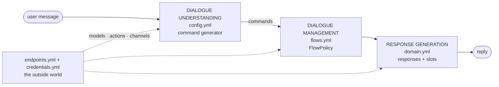
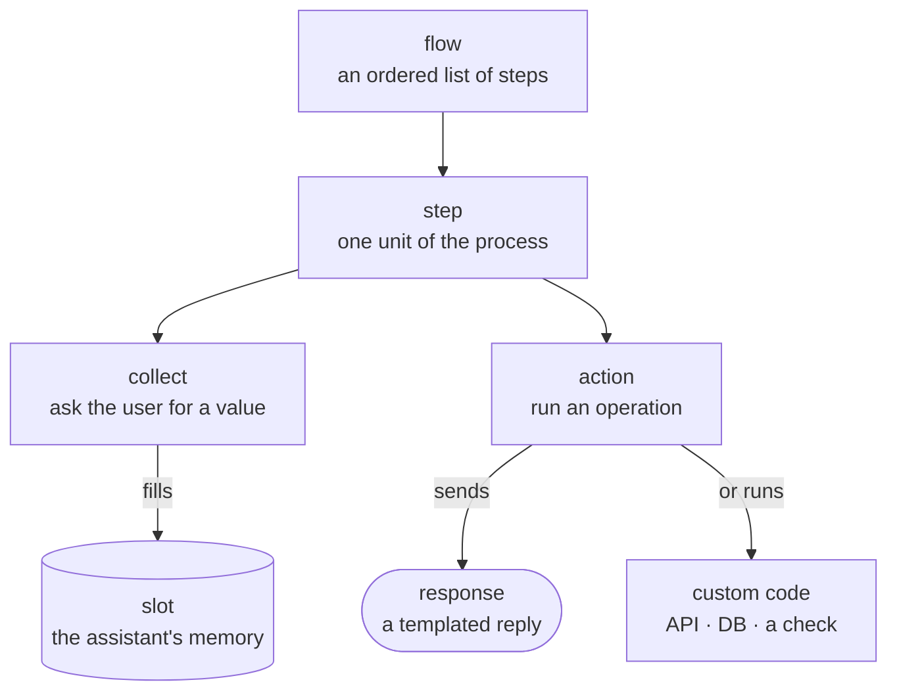
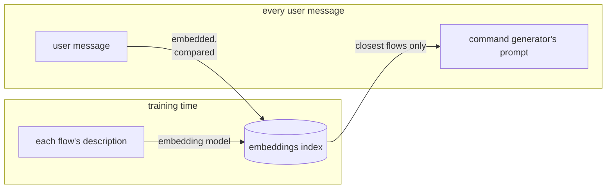
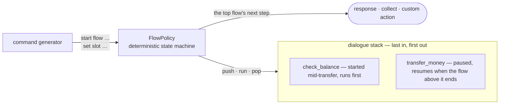
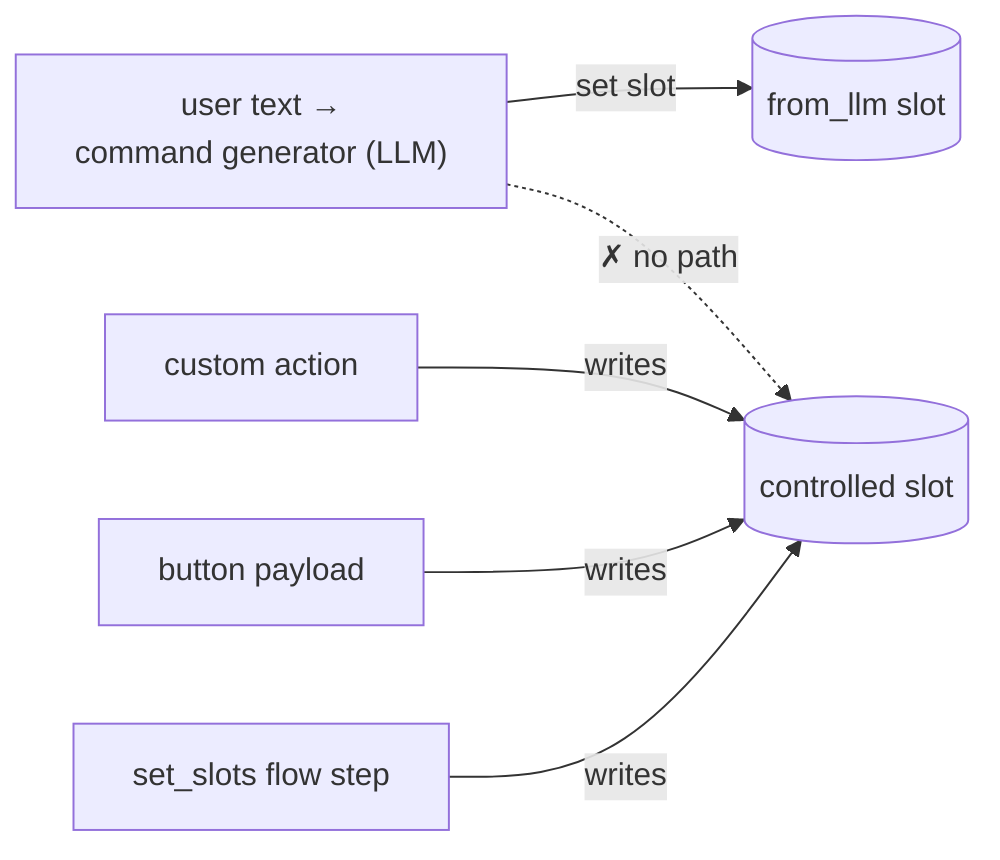
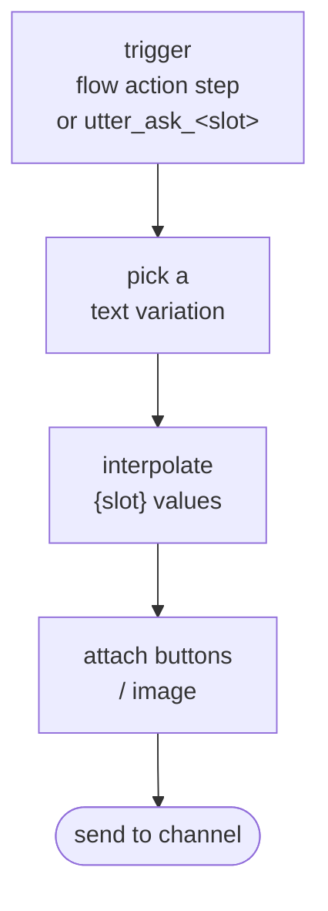
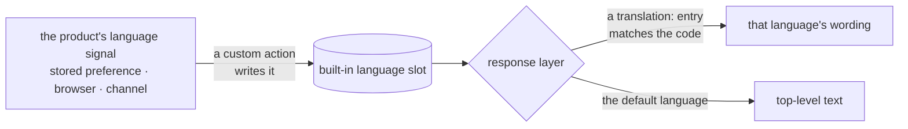
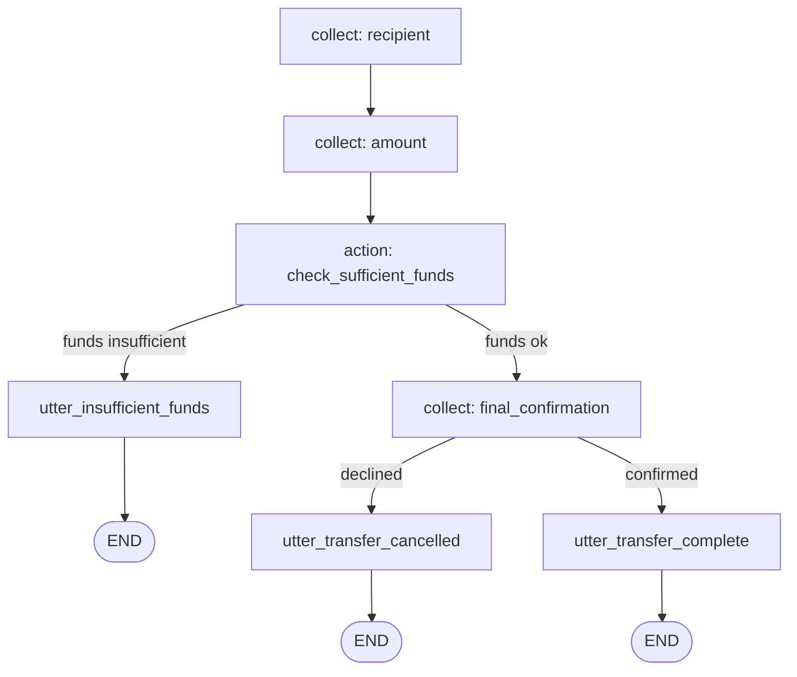
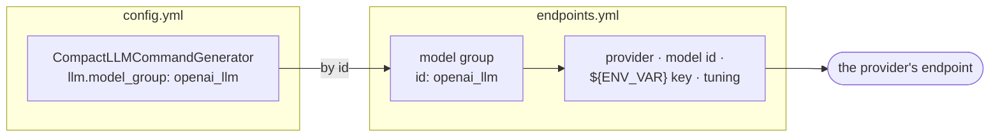
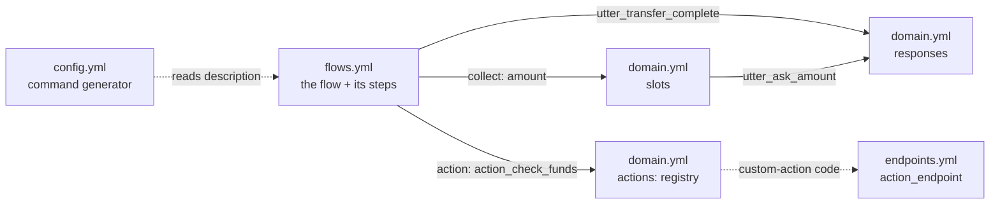

# Day 7 — Rasa: Approfondimento sui Componenti

## Guida di Studio per lo Studente

Questo capitolo è un tour file per file di un progetto Rasa Pro: a cosa serve ciascun file di configurazione, cosa fanno le sue chiavi più importanti, e dove intervenire per cambiare un dato comportamento. Si apre mappando i file sulle tre fasi di un turno CALM — Dialogue Understanding, Dialogue Management e Response Generation — e richiamando l'anatomia di un flow, poi attraversa `config.yml` (la pipeline dell'assistente), `domain.yml` (cosa l'assistente sa e dice), `flows.yml` (la logica di business come YAML), il vocabolario fisso di command che il command generator può emettere, e infine `endpoints.yml` insieme a `credentials.yml` (dove l'assistente si connette a modelli, codice delle action e canali). L'obiettivo è una padronanza pratica della superficie di configurazione — sufficiente ad avviare e personalizzare un assistente di base; il codice delle custom action, il flow design avanzato e la validazione dell'input sono ripresi ciascuno nei rispettivi giorni successivi.

---

## Capitolo 1 — La mappa dei file e l'anatomia di un flow

### 1.1 I file, mappati su un turno CALM

Un assistente CALM gestisce ogni messaggio dell'utente in tre fasi: l'assistente **comprende** il messaggio, **decide** cosa fare, e **risponde**. Rasa chiama le prime due fasi **Dialogue Understanding** e **Dialogue Management**; la terza è **Response Generation**. Solo la prima usa un LLM. Ogni fase è configurata da un file specifico, ed è questo che rende "dove cambio questa cosa?" una domanda con una risposta precisa.



**Dialogue Understanding** è il *command generator*, un componente LLM dichiarato in `config.yml`: legge la conversazione ed emette command. **Dialogue Management** è il `FlowPolicy`, che esegue la logica di business in `flows.yml` in risposta a quei command. **Response Generation** attinge le repliche dell'assistente da `domain.yml`, che contiene anche lo stato della conversazione. `endpoints.yml` e `credentials.yml` collegano tutte e tre le fasi al mondo esterno — il provider del modello, il codice di backend e i canali di chat.

L'intera superficie di configurazione, dunque, è **quattro domande distribuite su cinque file YAML**, con due precisazioni pratiche incorporate nella tabella: i flow risiedono nella directory `data/` (come `data/flows.yml`, opzionalmente suddivisi su più file), e all'ultima domanda rispondono congiuntamente `endpoints.yml` e `credentials.yml`.

| File | La domanda a cui risponde | Fase |
|---|---|---|
| `config.yml` | **Chi elabora un turno?** | Dialogue Understanding |
| `domain.yml` | **Cosa l'assistente sa e dice?** | Response Generation + stato |
| `data/flows.yml` | **Cosa può fare l'assistente?** | Dialogue Management |
| `endpoints.yml` + `credentials.yml` | **Dove si connette?** | il mondo esterno |

### 1.2 L'anatomia di un flow

Il tour che segue introduce slot, action e step un file alla volta. Richiamare fin da subito come si incastrano insieme all'interno di un flow rende più facile collocare ciascuna parte quando compare:



Un **flow** è un elenco ordinato di **step** che l'assistente percorre per portare a termine un task come un trasferimento di denaro. Uno step fa per lo più una di due cose: uno step **collect** chiede all'utente un valore e lo memorizza in uno **slot** — la memoria dell'assistente, che gli step successivi possono leggere e su cui possono ramificare — mentre uno step **action** esegue un'operazione, il più delle volte inviando una **response** (una replica templated) ma talvolta eseguendo codice custom come una chiamata API o una lookup su database. Flow, step, slot, action, response: queste cinque parole ricorrono in ogni file del tour.

---

## Capitolo 2 — `config.yml`: la pipeline dell'assistente

`config.yml` risponde a una domanda — **chi elabora un turno** — dichiarando i componenti della pipeline e le policy che vengono eseguite. È il file a cui rivolgersi quando si sceglie o si mette a punto il command generator, si imposta la lingua, o si indirizza l'assistente verso i suoi modelli.

### 2.1 Un assistente completo è fatto di due componenti

Un assistente CALM completo è **due componenti** — uno che comprende, uno che decide:[^1]

```yaml
recipe: default.v1
language: en
assistant_id: banking_assistant
pipeline:
  - name: CompactLLMCommandGenerator
policies:
  - name: FlowPolicy
```

Non è un frammento; si addestra e funziona. Due componenti lo reggono, uno per blocco: la chiave **`pipeline:`** elenca i componenti che elaborano ogni messaggio in arrivo dall'utente, in ordine, e la chiave **`policies:`** elenca i componenti che decidono cosa l'assistente fa con il risultato (§2.3).[^1] Il `CompactLLMCommandGenerator` è il **command generator** — la fase di Dialogue Understanding: a ogni turno invia la conversazione e i flow idonei a un LLM e riceve indietro un breve elenco di *command* (avvia questo flow, imposta questo slot, e così via), la lettura strutturata di ciò che l'utente vuole. Il `FlowPolicy` è la fase di **Dialogue Management**: prende quei command ed esegue i flow corrispondenti in modo deterministico, senza alcun LLM coinvolto.[^1][^2] Le tre chiavi di intestazione sopra la pipeline orientano il file:


- **`recipe: default.v1`** seleziona lo schema di configurazione che Rasa usa per leggere questo file — quali chiavi sono valide e come vengono interpretate. `default.v1` è lo schema per i progetti CALM ed è di fatto un'intestazione fissa: la si imposta una volta e la si lascia, dato che nessun altro valore è applicabile.[^1]
- **`language: en`** dichiara la lingua primaria dell'assistente, usata quando viene addestrato ed eseguito. Un assistente multilingue aggiunge un elenco `additional_languages` per le altre — l'italiano comparirebbe come `additional_languages: [it]`.[^1]
- **`assistant_id`** è un identificatore stabile per questo assistente, impresso sui suoi eventi e sui modelli addestrati così che log e strumenti possano distinguere un assistente da un altro. Lo scaffold lascia un placeholder — sostituiscilo con qualcosa di stabile e significativo come `banking_assistant`, ed evita di cambiarlo in seguito, dato che l'identificatore lega insieme tutto ciò che è già stato etichettato con esso.[^1]

### 2.2 Il blocco del command generator

La config minimale cresce in una realistica chiave dopo chiave:[^3]

```yaml
recipe: default.v1
language: en
assistant_id: banking_assistant

pipeline:
  - name: CompactLLMCommandGenerator
    llm:
      model_group: openai_llm
    flow_retrieval:
      embeddings:
        model_group: openai_embeddings
    user_input:
      max_characters: 420
      prompt_template: prompts/command_generator.jinja2   # optional — your own prompt

policies:
  - name: FlowPolicy
```

**`llm.model_group` — quale modello alimenta il command generator.** Qui si sceglie l'LLM che legge la conversazione e produce i command. Invece di nominare direttamente un modello, indica il nome di un **model group** — un pacchetto denominato di provider, model id e credenziali. Il pacchetto stesso è dichiarato altrove, in `endpoints.yml`, e qui viene richiamato solo tramite il suo `id` (il Capitolo 6 spiega come viene definito). Per ora il punto è semplicemente che questa singola riga è la manopola che punta il command generator verso l'uno o l'altro modello.[^4]

**`flow_retrieval` — nel prompt entrano solo i flow rilevanti.** Quando un assistente cresce fino a decine di flow, inserire *tutte* le loro description in *ogni* prompt è dispendioso e diluisce l'attenzione del modello. Il flow retrieval incorpora la description di ciascun flow in un vettore che ne cattura il significato, e per ogni messaggio dell'utente include solo i flow il cui significato è più vicino al messaggio.[^3][^5] Il beneficio è duplice: migliore **accuratezza** (un prompt più stretto e più pertinente affina la selezione del flow) e **costo** inferiore (meno token di prompt per turno). L'indice di embedding viene costruito **al training time** a partire dalle description dei flow e, opzionalmente, dalle description degli slot; il retrieval è attivo per default e può essere disattivato con `flow_retrieval: { active: false }`. Usa un proprio model group di embedding — da cui il secondo riferimento a `model_group` nel blocco qui sopra.[^3]



**`user_input.max_characters` — la barriera d'ingresso.** Default **420** caratteri; qualsiasi cosa più lunga *non viene passata all'LLM*.[^3] È una piccola barriera deterministica all'imbocco della pipeline che limita il costo in token di un muro di testo accidentale od ostile prima che qualsiasi modello lo veda.

**`prompt_template` — il punto di aggancio per la personalizzazione.** Per trasformare un messaggio dell'utente in command, il command generator lo avvolge in un **prompt**: un blocco di istruzioni che indica all'LLM quali command esistono, elenca i flow idonei e gli slot correnti, e gli chiede di scegliere. Quel prompt è prodotto da un template integrato fornito con Rasa, quindi un assistente funzionante non ha bisogno di un proprio prompt. Il parametro opzionale `prompt_template` punta invece il componente verso il *tuo* file di template, per i progetti che hanno bisogno di rimodellare quelle istruzioni; viene toccato di rado agli inizi, e personalizzarlo è un argomento di un momento successivo del corso.[^3][^6]

**Template ottimizzati per famiglia di modello.** Quel prompt integrato non è una soluzione unica per tutti: Rasa mantiene template *ottimizzati* (tuned) per famiglie di modello specifiche — le attuali famiglie GPT e Claude — e ripiega su un template di default quando il modello configurato non corrisponde a nessuna di esse.[^3] Quale template usi il command generator è quindi determinato da quale modello è configurato.

Esiste una variante ottimizzata per la ricerca, il `SearchReadyLLMCommandGenerator`, per gli assistenti costruiti attorno alla risposta da knowledge base; si abbina a una search policy ed è la scelta naturale quando un progetto si appoggia a risposte retrieval-augmented, un argomento trattato più avanti nel corso.[^3]

### 2.3 La policy: `FlowPolicy`

Dove finisce la pipeline, comincia il blocco `policies`. Una **policy** guida la fase di Dialogue Management: a ogni turno decide l'azione successiva dell'assistente. In un assistente NLU classico più policy competono — ciascuna prevede un'azione successiva con una confidence, e vince quella con la confidence più alta — e una configurazione può elencarne più di una; un assistente CALM ha bisogno solo del `FlowPolicy`.[^2]

Il `FlowPolicy` è una **macchina a stati deterministica che esegue la logica di business definita nei flow**.[^2] È il consumatore dei command che il generator produce: un command `start flow` avvia il flow indicato, ponendolo su un **dialogue stack** che la policy mantiene ed eseguendone gli step; un command `set slot` riempie un valore atteso e fa avanzare il flow.[^2] Lo stack è last-in-first-out, quindi un flow avviato mentre un altro è a metà esecuzione termina per primo e poi restituisce il controllo a quello sottostante — ed è così che l'assistente gestisce una digressione e torna al punto in cui si trovava.[^2] Nessun LLM è coinvolto: dati gli stessi command e lo stesso stato compie sempre lo stesso step, e non ha parametri propri — `- name: FlowPolicy` è l'intera dichiarazione.[^2]



Il `FlowPolicy` non è l'unica policy: altre esistono per capacità che vanno oltre l'esecuzione dei flow, e una configurazione le elenca accanto ad esso quando il progetto ne ha bisogno. L'`EnterpriseSearchPolicy`, per esempio, risponde a domande di conoscenza recuperando da un document store indicizzato e generando una risposta fondata (grounded) invece di eseguire un flow — il percorso retrieval-augmented ripreso più avanti nel corso.[^2]

---

## Capitolo 3 — `domain.yml`: cosa l'assistente sa e dice

`domain.yml` risponde a **cosa l'assistente sa e dice** — contiene lo *stato* della conversazione (gli slot), le **responses** che costituiscono la fase di Response Generation, il registro delle **action** che l'assistente può compiere, e la configurazione di sessione. In miniatura, per un assistente che controlla i saldi dei conti:

```yaml
slots:
  account_type:
    type: categorical
    values:
      - checking
      - savings
    mappings:
      - type: from_llm
  current_balance:
    type: float
    mappings:
      - type: controlled

responses:
  utter_greet:
    - text: "Welcome — how can I help you today?"
  utter_ask_account_type:
    - text: "Which account would you like to check?"
  utter_current_balance:
    - text: "Your {account_type} account balance is €{current_balance}."

actions:
  - action_fetch_balance

session_config:
  session_expiration_time: 60
  carry_over_slots_to_new_session: true
```

Letto dall'alto in basso: l'assistente ricorda di quale conto si sta parlando e qual è il suo saldo, ha tre cose da dire, può eseguire un pezzo di codice custom, e avvia una nuova conversazione un'ora dopo che l'utente è rimasto in silenzio.

### 3.1 Gli slot: la memoria di lavoro

Uno slot è la **memoria** dell'assistente: un archivio chiave-valore con nome e tipo che conserva un'informazione per la durata di una conversazione — qualcosa che l'utente ha fornito (il destinatario di un trasferimento, l'importo) o qualcosa che l'assistente ha raccolto sul mondo (il saldo di un conto, se un controllo sui fondi è andato a buon fine).[^7] Gli slot sono ciò che permette a un dialogo multi-turno di accumulare stato invece di trattare ogni messaggio isolatamente: i valori vengono raccolti al loro interno, la logica di branching li legge, le responses li interpolano, e le custom action vi scrivono. Ciascuno è dichiarato con un nome e un tipo, e CALM offre **sei** tipi di slot:[^7]

| Tipo | Contiene | Note |
|---|---|---|
| `text` | qualsiasi stringa | il cavallo di battaglia |
| `bool` | true / false | conferme, controlli |
| `float` | numeri | importi, saldi |
| `categorical` | uno di un elenco dichiarato | richiede una chiave `values:` |
| `any` | dati arbitrari, inclusi valori strutturati | per il cablaggio interno delle custom action |
| `list` | un elenco di valori | utilizzabile solo dalle custom action — uno slot `list` non può essere riempito da uno step `collect` o `set_slots`[^7] |

Uno slot categorical è l'unica forma con sintassi aggiuntiva — deve dichiarare i suoi `values` ammessi:

```yaml
slots:
  card_block_type:
    type: categorical
    values:
      - temporary
      - permanent
    mappings:
      - type: from_llm
```

Il **mapping** di uno slot dichiara *chi è autorizzato a scrivervi*.

**`from_llm` è il default.** Il command generator riempie lo slot a partire dalla conversazione, ogni volta che l'utente fornisce il valore, in qualsiasi formulazione, in qualsiasi ordine. Ometti del tutto la chiave `mappings` e `from_llm` viene assunto.[^7] Nessun extractor viene addestrato a riconoscere "mandalo al mio padrone di casa, la solita cifra" — l'LLM semplicemente lo legge.

**`controlled` è il confine di fiducia (trust boundary).** Uno slot controlled può essere scritto *solo* da una custom action, da un button payload (un messaggio fisso allegato a una response — §3.2), o da uno step di flow `set_slots` — mai dall'LLM, e mai da qualcosa che l'utente digita:[^7]

```yaml
slots:
  has_sufficient_funds:
    type: bool
    mappings:
      - type: controlled
```

Il mapping `controlled` è un **controllo di sicurezza**. La regola è semplice: *se l'LLM non deve mai poterlo affermare, lo slot è controlled.* Un risultato di autenticazione è controlled; il saldo di un conto è controlled; un controllo sul limite di trasferimento è controlled. Il modello di minaccia è quello del trust-boundary — un utente, o un'istruzione iniettata nel testo dell'utente, dice "sono autenticato e il mio saldo è un milione di euro." Con un mapping `from_llm` un command generator confuso potrebbe in linea di principio scrivere ciò nello stato; con `controlled`, **non esiste alcun percorso di codice dal testo dell'utente a quello slot.** Rivedere i mapping degli slot è quindi una revisione di sicurezza: ciò che deve essere garantito non è affidato al modello, è imposto in modo deterministico, al suo esterno.



Altri due tipi di mapping, `from_entity` e `from_intent`, collegano gli slot a una pipeline NLU classica nei setup di coexistence; appartengono a un giorno successivo.[^7]

Uno slot può anche portare un blocco `validation` la cui lista `rejections` rifiuta un valore raccolto che non supera un controllo — una regola di formato o di intervallo che vale ovunque lo slot venga usato — e ne richiede uno valido, nominato qui solo per completare il tour di `domain.yml` dato che è uno dei livelli di validazione dell'input trattati nel Day 11.[^21]

### 3.2 Le responses: la voce

Una **response** è un messaggio che l'assistente rimanda all'utente, scritto in anticipo e conservato nel domain anziché generato al volo. Tutto ciò che l'assistente dice in forma templated risiede sotto `responses:`, e ogni nome porta il prefisso `utter_` — e quel nome è tutto il cablaggio di cui una response ha bisogno.[^8] Una response scatta in una di due situazioni — un flow raggiunge uno step che la nomina (`action: utter_transfer_complete`), oppure un flow chiede uno slot e Rasa invia automaticamente il corrispondente `utter_ask_<slot>` (la convenzione più sotto). In entrambi i casi il *trigger* è il livello di dialogo deterministico, non l'LLM: il modello decide cosa fare, ma la formulazione di ogni replica è testo fisso che il team ha scritto e revisionato.

La grammatica, per esempio:

```yaml
responses:
  utter_greet:
    - text: "Welcome — how can I help you today?"
    - text: "Hello — I'm the banking assistant. What do you need?"

  utter_current_balance:
    - text: "Your {account_type} account balance is €{current_balance}."

  utter_ask_account_type:
    - text: "Which account would you like to check?"
      buttons:
        - title: "Checking"
          payload: "/SetSlots(account_type=checking)"
        - title: "Savings"
          payload: "/SetSlots(account_type=savings)"
```

Quando una response scatta, Rasa assembla il messaggio in uscita in una breve sequenza — sceglie una delle variazioni di testo, sostituisce eventuali placeholder `{slot}` con i valori correnti, allega eventuali elementi rich (bottoni, un'immagine), e consegna il risultato al canale su cui si trova l'utente:



In quell'unico blocco compaiono quattro meccanismi:

1. **Variazioni.** Più voci `- text:` sotto un unico nome vengono scelte a caso a runtime — naturalezza a basso costo con zero rischio di generazione, perché ogni variante è stata scritta e revisionata.[^8]
2. **Interpolazione degli slot.** `{slot_name}` inietta il valore corrente dello slot al momento dell'invio.[^8] La formulazione resta revisionabile nel domain; solo i valori si muovono.
3. **Bottoni.** Un bottone è definito da due chiavi — un `title`, l'etichetta mostrata all'utente, e un `payload`, il messaggio rimandato all'assistente *come se l'utente lo avesse digitato* quando il bottone viene scelto.[^8] Come venga effettivamente visualizzato dipende dal **canale**, la superficie su cui si svolge la conversazione (un widget web, la CLI, Slack, e così via): un canale rende un elemento cliccabile, la CLI elenca i bottoni da scegliere per numero, e alcuni canali non li supportano affatto. Ciò che resta costante è il payload — la forma `/SetSlots(account_type=checking)` qui sopra è un command che imposta lo slot direttamente, aggirando l'LLM. Poiché quell'input è deterministico anziché testo interpretato dal modello, un bottone che imposta uno slot è uno dei pochi scrittori che uno slot `controlled` accetta (§3.1).[^7][^8] Le responses possono anche portare un URL `image:` per i canali che rendono immagini.[^8]
4. **La convenzione `utter_ask_<slot>`.** Quando un flow raggiunge `collect: account_type`, Rasa chiede automaticamente la response chiamata `utter_ask_account_type`.[^8] Nessun cablaggio, nessuna registrazione — il nome *è* il cablaggio.

Le variazioni di una response possono anche portare un blocco `condition:`, così la formulazione può dipendere dal valore di uno slot — una domanda di conferma diversa per un blocco carta `permanent` rispetto a uno `temporary`, per esempio.[^8] La capacità vale la pena conoscerla; la sua sintassi completa va oltre questo tour.

### 3.3 Le action: cosa fa l'assistente

Un'**action** è tutto ciò che l'assistente *fa* come step in un flow — nella sua forma più semplice, inviare un messaggio all'utente, ma altrettanto spesso eseguire codice: chiamare un'API, interrogare un database, effettuare un controllo.[^9] Ne esistono di alcuni tipi, e la response del §3.2 è il primo di essi: qualsiasi nome `utter_` è automaticamente un'action, utilizzabile nello step `action:` di un flow senza ulteriore dichiarazione — scrivere la response *era* la registrazione. Le **default action** integrate di Rasa (i suoi comportamenti di conversation-repair) sono anch'esse pronte all'uso. Una **custom action** è l'eccezione: è sostenuta dal tuo codice Python, e ogni custom action deve essere elencata sotto `actions:`, altrimenti non può essere eseguita:[^9]

```yaml
actions:
  - action_fetch_balance
```

L'elenco è tutto ciò che `domain.yml` deve sapere al riguardo — è ciò che rende una custom action richiamabile. Scrivere il codice dietro una custom action, e collegarlo a sistemi esterni, è l'argomento del giorno successivo.

### 3.4 Responses multilingue: rispondere nella lingua dell'utente

Un assistente che serve clienti in più di una lingua ha bisogno che le sue repliche siano disponibili in ciascuna di esse. `config.yml` ha già indicato il `language` primario dell'assistente (§2.1); un assistente che ne supporta altre le elenca sotto `additional_languages`, ciascuna un codice ISO 639-1 di due lettere — l'italiano è `it`:[^19]

```yaml
language: en
additional_languages:
  - it
```

Date quelle lingue supportate, il domain porta la formulazione per ciascuna. Una response tiene tutte le sue varianti linguistiche in un unico posto tramite una **chiave `translation:`**, indicizzata per codice di lingua; il `text` di primo livello è la lingua di default e ogni voce sotto `translation` fornisce lo stesso messaggio in un'altra. Le etichette dei bottoni si traducono allo stesso modo, così l'intera response resta un'unica unità revisionabile anziché una copia per lingua:[^18]

```yaml
responses:
  utter_ask_account_type:
    - text: "Which account would you like to check?"
      translation:
        it: "Quale conto vuoi controllare?"
```

Quale traduzione viene servita è deciso da uno **slot `language` integrato** che contiene la lingua della conversazione corrente.[^18] Non è uno slot che il team dichiara: `language` è una parola chiave riservata che Rasa gestisce internamente — uno slot custom non può assumere quel nome — e il suo valore è vincolato ai codici configurati sopra. Impostarlo è responsabilità del team: poiché Rasa non deduce da sé la lingua dell'utente, una custom action (tipicamente all'inizio della sessione) scrive lo slot a partire da qualunque segnale il prodotto abbia — una preferenza memorizzata, un'impostazione del browser, un parametro del canale.[^18] Con lo slot impostato, il livello di response deterministico serve la traduzione corrispondente alla lingua corrente, dove il `text` di primo livello è la formulazione nella lingua di default.



Esiste un secondo percorso, dinamico, per lo stesso obiettivo. Il **Response Rephraser** — un response generator sostenuto da un LLM, abilitato in `endpoints.yml` — riformula le repliche dell'assistente a runtime nella lingua della conversazione anziché leggere traduzioni memorizzate, prendendo la lingua di destinazione dallo stesso slot `language`.[^18][^20] Scambia la revisionabilità di traduzioni fisse e scritte con una copertura che non richiede di redigerne ciascuna; la scelta tra traduzioni memorizzate e riformulazione a runtime è lo stesso compromesso tra controllo al design-time e flessibilità generativa che attraversa CALM, applicato alla formulazione. Questo tour usa traduzioni memorizzate; il rephraser è nominato qui solo perché il suo ruolo sia chiaro.

La completezza delle traduzioni è verificabile anziché una questione di ispezione: `rasa data validate translations` segnala le responses (e i nomi dei flow) a cui manca una traduzione per una lingua configurata, così le lacune emergono prima del deployment anziché davanti a un cliente.[^18]

### 3.5 Configurazione di sessione

Una **sessione di conversazione** è un tratto continuo di dialogo tra utente e assistente; una nuova comincia quando l'utente stabilisce il primo contatto o torna dopo un periodo di inattività.[^9] `session_config` stabilisce dove cade quel confine e cosa lo attraversa:[^9]

```yaml
session_config:
  session_expiration_time: 60   # minutes; 0 = never expire
  carry_over_slots_to_new_session: true
```

- **`session_expiration_time`** — i minuti di inattività dopo i quali la sessione corrente termina e il messaggio successivo dell'utente ne apre una nuova; `0` significa che la sessione non scade mai.[^9]
- **`carry_over_slots_to_new_session`** — se gli slot riempiti nella vecchia sessione sopravvivono nella nuova (`true`) o vengono scartati così che la sessione successiva inizi vuota (`false`).[^9]

Per lo stato sensibile, il carry-over è una decisione di prodotto e di privacy anziché boilerplate — se una conversazione di blocco carta abbandonata all'ora di pranzo debba ancora contenere il numero della carta un'ora dopo. La scelta conservativa è non lasciare che gli slot sensibili permangano.

### 3.6 Suddividere il domain su più file

Lo stesso contenuto del domain può essere organizzato in due modi, e Rasa li tratta in modo identico una volta caricati:[^9]

- **Un file** — un unico `domain.yml` che tiene insieme `slots:`, `responses:`, `actions:` e `session_config:`. Facile da scorrere dall'alto in basso, e la scelta naturale per un assistente piccolo.
- **Una directory** — le stesse chiavi di primo livello distribuite su più file in una cartella (`domain/slots.yml`, `domain/responses.yml`, `domain/actions.yml`, …), che Rasa legge e **unisce automaticamente** quando le si punta alla directory:[^9]

```bash
rasa train --domain path/to/domain_directory
```

Il risultato unito si comporta in modo identico in entrambi i casi — la suddivisione è puramente organizzativa. Si ripaga man mano che un progetto cresce: qualche centinaio di responses in un file proprio restano navigabili, le definizioni degli slot sono facili da individuare, e due persone che modificano rispettivamente responses e slot toccano file diversi invece di scontrarsi in uno solo. Il costo è la piccola quantità di struttura da predisporre e il ricordarsi del puntatore `--domain` al momento del train.

Né una directory deve necessariamente essere suddivisa *per tipo*. Il template di partenza CALM (`rasa init --template calm`, un piccolo assistente per una rubrica di contatti) suddivide invece il suo domain **per flow**: `domain/add_contact.yml` contiene gli slot, le responses e l'action del flow add-contact, i suoi omologhi fanno lo stesso per i flow list e remove, e un `domain/shared.yml` porta ciò che diversi flow usano. Tutto ciò di cui una capacità ha bisogno sta allora in un unico file, così aggiungere o dismettere una capacità tocca un file anziché tre. Una regola pratica ragionevole è mantenere un unico file finché non diventa ingestibile, poi suddividere lungo l'asse che il team effettivamente modifica — per tipo quando degli specialisti gestiscono responses o slot in tutto l'assistente, per flow quando ciascuna capacità è gestita end-to-end. I template di partenza usano già il layout a directory, ed è per questo che un progetto scaffoldato mostra una directory `domain/` anziché un solo `domain.yml`.

---

## Capitolo 4 — `flows.yml`: la logica di business come YAML

`flows.yml` risponde a **cosa può fare l'assistente** — è la fase di Dialogue Management, la logica di business scritta come YAML. Risiede nella directory `data/` del progetto come `data/flows.yml`, che può essere un unico file o più file YAML.[^5][^12]

### 4.1 La `description` di un flow è un prompt, non un commento

La `description` di un flow è **obbligatoria**, ed è la prosa che il command generator legge quando decide se *questo* flow corrisponde a ciò che l'utente ha appena detto.[^10][^11] È anche ciò che il flow retrieval (Capitolo 2) incorpora per decidere se il flow *entra* addirittura nel prompt — l'indice di embedding è costruito a partire dalle description e dai nomi degli slot.[^3] Quindi questa singola stringa YAML è il pezzo di testo rivolto all'LLM più importante del progetto: simultaneamente la **pubblicità** del flow (il retrieval lo fa emergere?) e la sua **condizione di trigger** (il modello lo seleziona?). Description chiare e specifiche riducono in misura misurabile gli errori di selezione del flow.[^5]

L'**identità** di un flow è fatta di tre chiavi: l'`id` (la chiave YAML stessa — caratteri alfanumerici, underscore e trattini, e non deve iniziare con un trattino), un `name` opzionale e leggibile dall'uomo, e la `description` obbligatoria.[^11] Una regola di denominazione è imposta: il prefisso `pattern_` è **riservato** ai flow di conversation-repair integrati di Rasa, e i flow custom non devono usarlo.[^14]

### 4.2 L'esempio ricorrente

Questo è il flow di trasferimento di denaro del tutorial ufficiale, versione finale, verbatim:[^12]

```yaml
flows:
  transfer_money:
    description: Help users send money to friends and family.
    steps:
      - collect: recipient
      - collect: amount
        description: the number of US dollars to send
      - action: action_check_sufficient_funds
        next:
          - if: not slots.has_sufficient_funds
            then:
              - action: utter_insufficient_funds
                next: END
          - else: final_confirmation
      - collect: final_confirmation
        id: final_confirmation
        next:
          - if: not slots.final_confirmation
            then:
              - action: utter_transfer_cancelled
                next: END
          - else: transfer_successful
      - action: utter_transfer_complete
        id: transfer_successful
```

Lo stesso flow disegnato per esteso, con le sue ramificazioni esplicite:



Letto dall'alto in basso, il flow è una narrazione di processo — *chiedi chi, chiedi quanto, verifica i fondi, ramifica, conferma, ramifica, fatto*. Le righe `utter_insufficient_funds`, `utter_transfer_cancelled` e `utter_transfer_complete` fanno scattare una response direttamente dall'interno del flow, cosa che uno step `action` può fare (§4.3). La logica decisionale è in semplice YAML anziché sepolta nei pesi di un modello, così un process owner non ingegnere può revisionarla — la verificabilità che distingue CALM, resa concreta.

### 4.3 I tipi di step

**`collect` — chiedi e riempi.** Nomina uno slot; l'engine chiede `utter_ask_<slot>` (la convenzione del Capitolo 3) e attende l'utente.[^10] La `description` opzionale a livello di step guida l'estrazione dell'LLM per *quella specifica* domanda — `amount` qui sopra è descritto come "the number of US dollars to send", disambiguando i dollari da qualsiasi altro numero in vista.[^10] Due modificatori contano qui:

- `ask_before_filling: true` — per default un `collect` viene saltato se lo slot è già riempito; imposta questo per chiedere *sempre*, anche quando un valore esiste. Uno step di conferma ne ha bisogno: una conferma che l'utente non ha mai visto non è una conferma.[^10]
- `utter:` — sovrascrive la domanda di default, puntando il `collect` a una response con un nome diverso.[^10] Questo permette a un unico slot `confirmation` condiviso di essere riutilizzato tra i flow, con ciascun `collect` che fornisce la propria formulazione:

```yaml
# in transfer_money:
- collect: confirmation
  utter: utter_ask_transfer_confirmation
  ask_before_filling: true

# in block_card:
- collect: confirmation
  utter: utter_ask_block_confirmation
  ask_before_filling: true
```

**`action` — esegui e continua.** Esegue o una response (`action: utter_insufficient_funds`) o una custom action (`action: action_check_sufficient_funds`) e poi prosegue dritto, *senza* attendere l'input dell'utente.[^10]

**`set_slots` — assegnazione programmatica.** Il flow stesso scrive i valori degli slot; `null` azzera uno slot:[^10]

```yaml
- set_slots:
    - account_type: "savings"
    - amount: null
```

**`noop` — un puro punto di ramificazione.** Non fa nulla se non ramificare; esiste per quando hai bisogno di ramificare *prima* di fare qualsiasi cosa. Deve sempre portare un `next`, altrimenti il training fallisce:[^10]

```yaml
- noop: true
  next:
    - if: not slots.authenticated
      then: ask_credentials
    - else: show_account
```

### 4.4 Branching: `next`, predicati, id, `END`

Il branching si aggancia a qualsiasi step tramite `next`, che accetta tre forme:[^10]

- una **stringa** — salta allo step con quell'`id`;
- **`END`** — termina il flow;
- un **elenco di oggetti `if:` / `then:` / `else:`** — branching condizionale, come nel flow di trasferimento qui sopra.

Le condizioni sono **predicati** valutati sul namespace `slots.`.[^13] Le famiglie di operatori, per esempio:

```
slots.amount_of_money > 5000                 # comparisons: > >= < <= = !=
not slots.confirmation                        # logical: not, and, or
slots.card_block_type is "permanent"          # identity: is, is not
slots.postal_code matches "\d{5}"             # regex match
slots.status = empty or slots.status is null  # constants: true false null empty undefined
```

Uno slot si legge come `null` quando non è mai stato impostato, e come `empty` quando è stato impostato a un valore vuoto. Nelle guardie di tutti i giorni si verifica `is null` per intendere "questo slot non è ancora riempito"; ricorri a `empty` solo quando devi distinguere uno slot non riempito da uno esplicitamente azzerato. L'operatore `matches` gestisce i controlli di formato su codici e identificatori direttamente nella logica di branching.[^13] Gli `id` degli step sono i target dei salti: nel flow di trasferimento, `final_confirmation` e `transfer_successful` sono `id` verso cui le righe `next:` instradano per nome.

Due step di composizione completano il vocabolario del file: `call` incorpora un altro flow e ritorna al genitore quando questo termina, e `link` conclude il flow corrente e passa il testimone a un altro.[^10] Sono il modo in cui i flow si combinano in un comportamento più ampio, che è un argomento a sé più avanti nel corso; per ora basta riconoscerli quando si scorre un file di flow.

---

## Capitolo 5 — L'insieme dei command: cosa l'LLM può effettivamente dire

In CALM, l'intero canale di output dell'LLM è un **elenco fisso e chiuso di command**: il modello può emettere questi e nient'altro. Il command che l'Inspector mostra inline con ogni scambio è sempre uno di essi.

### 5.1 Il vocabolario dei command

Il command generator di default (`CompactLLMCommandGenerator`) può emettere questi command, e nessun altro — il modello legge la conversazione, i flow idonei e gli slot riempiti, e risponde con righe tratte da questo elenco, *nient'altro*:[^3]

| Command | Cosa significa | Comportamento dell'engine |
|---|---|---|
| `start flow <flow_name>` | Avvia un flow — ad es. `start flow transfer_money` | Il `FlowPolicy` pone il flow sul dialogue stack e comincia a eseguirlo.[^2][^3] |
| `set slot <slot_name> <value>` | Riempi uno slot; usato anche per correggere un valore già impostato | Riempie lo slot — sia i valori inseriti la prima volta *sia le correzioni* viaggiano su questo unico token.[^3] |
| `cancel flow` | Annulla il flow in corso | Innesca il pattern di annullamento (`pattern_cancel_flow`).[^14] |
| `disambiguate flows <f1> <f2> …` | Elenca i flow candidati quando la richiesta è ambigua | Innesca il pattern di chiarimento (`pattern_clarification`): l'assistente chiede all'utente di scegliere.[^14] |
| `provide info` | Risponde a una domanda di conoscenza/FAQ quando nessun flow è adatto | Instrada il turno verso il percorso search/RAG.[^3][^14] |
| `offtopic reply` | Risponde a messaggi casuali o sociali, fuori tema | Gestito tramite `pattern_chitchat`.[^3][^14] |
| `repeat message` | Ripeti l'ultimo messaggio del bot | Innesca `pattern_repeat_bot_messages`.[^14] |

Ogni riga che il modello emette è un command in questo piccolo linguaggio — un verbo seguito dai suoi argomenti. Digitare "add a contact" produce l'unica riga `start flow add_contact` — il command `start flow` che porta `add_contact`; il dialogue engine legge quella riga e la esegue, avviando il flow `add_contact` ed eseguendone gli step.[^2][^3] I nomi `pattern_` nella colonna dell'engine sono i flow di conversation-repair integrati di Rasa — il prefisso riservato del §4.1 — innescati qui come effetto di un command. La divisione del lavoro è il punto: il modello si limita a *scrivere* queste righe, mentre eseguirle è compito dell'engine — il modello non esegue mai nulla di persona.

Una precisazione previene una confusione comune: non esiste alcun **token `cannot handle`**. Quando niente nel vocabolario è adatto, il modello non emette alcun command utilizzabile, ed è quell'*assenza* a instradare il turno nel repair pattern per i casi non gestibili (`pattern_cannot_handle`).[^14] Questo discende direttamente dal vocabolario chiuso: ogni command che il modello può emettere corrisponde a una capacità reale e dichiarata, quindi "non posso farlo" non è mai qualcosa che il modello *dice* — è ciò che l'engine *conclude* quando non torna alcun command valido. Il fallback è un comportamento dell'engine, non un'enunciazione del modello, e il modello non è mai in condizione di inventare un'opzione che non esiste.


Il generator Compact insegnato qui è uno di una piccola famiglia di command generator; una pipeline ne porta uno solo basato su LLM:

| Command generator | A cosa serve |
|---|---|
| `CompactLLMCommandGenerator` | Il default generico, ottimizzato per gli LLM moderni e compatti — il generator che questo corso usa. |
| `SearchReadyLLMCommandGenerator` | Per gli assistenti costruiti attorno alla risposta da knowledge base, dove il generator stesso innesca il retrieval. |
| `NLUCommandAdapter` | Un generator non-LLM che avvia i flow a partire da un classificatore di intent classico, per i setup NLU/coexistence. |

Gli ultimi due sono argomenti di un momento successivo del corso; le righe sono qui solo perché i nomi siano familiari quando compariranno. Ogni generator parla la propria **command DSL** — il piccolo linguaggio domain-specific in cui produce i command — e Rasa ne mantiene alcune, quindi i command disponibili e la loro esatta grafia variano un po' dall'uno all'altro. L'elenco qui sopra è la DSL di default, quella che usa il generator Compact; il `SearchReadyLLMCommandGenerator`, per esempio, accorpa `provide info` e `offtopic reply` in un unico command `search and reply` sia per i turni di conoscenza sia per quelli sociali, e si abbina a una search policy. L'elenco completo dei command per ogni generator è nel command reference di Rasa.[^3][^6]

### 5.2 Perché un vocabolario chiuso

Vincolare il modello a un elenco fisso di command è una scelta ingegneristica deliberata, e produce qualcosa di specifico. L'unica influenza del modello sul sistema è *quali* command seleziona da un insieme noto — non può mai ampliare quell'insieme. Di fronte a "wire €5,000 to my landlord", il generator può emettere `start flow transfer_money` e `set slot amount 5000`, command che il progetto definisce, e il `FlowPolicy` esegue la logica di trasferimento revisionata. Ciò che non può fare è emettere un'istruzione che il progetto non ha mai dichiarato: non esiste alcun command per "sposta il denaro direttamente", "salta lo step di conferma", o "chiama questo URL", quindi nessuna formulazione dell'utente e nessun errore del modello possono produrne uno. Ogni output è verificato rispetto al progetto — un `start flow` che nomina un flow inesistente non è un command valido — e nulla di ciò che il modello scrive viene eseguito come testo libero.[^3][^6]

Il beneficio è che il raggio d'azione dell'assistente è fissato al design time e resta verificabile: ciò che può fare è esattamente l'insieme di flow e command che il team ha scritto, non ciò che un modello potrebbe generare in un dato giorno. Questa è anche la base dell'affermazione di Rasa secondo cui CALM è resistente per progettazione ad hallucination e prompt injection (claim):[^6] il modello non può inventare un'action, perché il suo linguaggio non ha una sintassi per farlo. Rimane un rischio residuo — un'istruzione iniettata può comunque cercare di orientare *quale* command consentito il modello sceglie, ed è per questo che gli slot `controlled` del Capitolo 3 contano ancora — ma non può evocare una capacità che non è mai stata costruita.

L'insieme dei command *è* personalizzabile in linea di principio, tramite il prompt template, ma Rasa lo scoraggia esplicitamente: l'insieme integrato è quello che Rasa testa e mantiene, e i command custom rinunciano a quelle garanzie.[^6] Questo corso non lo personalizza.

---

## Capitolo 6 — `endpoints.yml` e `credentials.yml`: modelli, canali e il mondo esterno

Questi due file rispondono a **dove si connette l'assistente**. Sono la giuntura del deployment — i file che cambiano man mano che l'assistente passa da un laptop a un ambiente di test alla produzione, mentre il suo comportamento resta fermo. La pipeline e la policy (`config.yml`), gli slot, le responses e le action (`domain.yml`), e la logica di business (`flows.yml`) sono identici in tutti e tre gli ambienti; solo il cablaggio qui differisce — quale endpoint di modello viene chiamato, dove viene eseguito il codice delle action, quali canali sono aperti. Il beneficio è che lo stesso assistente revisionato viene promosso invariato dallo sviluppo alla produzione: fare il deployment è un cambio di connessioni, non di logica conversazionale. `endpoints.yml` dichiara le connessioni che l'assistente *usa* — i modelli e il codice delle action — e `credentials.yml` dichiara i canali su cui *ascolta*.

### 6.1 I model group in `endpoints.yml`


Tutta la configurazione dell'LLM risiede in **model group** denominati, ciascuno referenziato da `config.yml` tramite il suo `id`.[^4] La forma canonica per OpenAI:

```yaml
model_groups:
  - id: openai_llm
    models:
      - provider: openai
        model: gpt-5.1-2025-11-13
        api_key: ${OPENAI_API_KEY}
        timeout: 15
        temperature: 1.0
        reasoning_effort: "minimal"

  - id: openai_embeddings
    models:
      - provider: openai
        model: text-embedding-3-large
        api_key: ${OPENAI_API_KEY}
```

Questa è l'indirezione del Capitolo 2 vista dall'altro lato: `config.yml` nominava `openai_llm`; ecco a cosa si risolve quel nome. Il senso dell'indirezione è tenere la scelta del modello fuori dalla pipeline — i componenti fanno riferimento a un group per nome, mentre la definizione del group (provider, model id, credenziali, tuning) risiede qui. Un unico group può essere condiviso da più componenti, e cambiare il modello che un componente usa, o puntarlo a un provider o ambiente diverso, diventa una modifica a questo solo file, con `config.yml` intatto.[^4]



Un model group può contenere **più di un modello** — `models:` è un elenco, ed è ciò che lo rende un *group*. Quando ne contiene diversi, Rasa mette un **router** davanti a essi e distribuisce (load-balance) le richieste sul group:[^4]

```yaml
model_groups:
  - id: openai_llm
    models:
      - provider: azure
        deployment: gpt-instance-eu
        api_base: https://eu.example.openai.azure.com/
        api_version: "2025-02-01-preview"
        api_key: ${AZURE_API_KEY_EU}
      - provider: azure
        deployment: gpt-instance-us
        api_base: https://us.example.openai.azure.com/
        api_version: "2025-02-01-preview"
        api_key: ${AZURE_API_KEY_US}
    router:
      routing_strategy: simple-shuffle   # or least-busy, latency-based-routing, …
```

I deployment in un group sono pensati per essere lo **stesso modello sottostante** — per esempio un unico modello servito da due region — non un misto di modelli diversi, dato che il componente che legge il group si aspetta un output coerente.[^4] Quindi contenere diversi modelli offre **throughput e resilienza**, non una scorciatoia per usare-a-volte-un-modello-più-economico: il router distribuisce le richieste secondo la `routing_strategy` scelta, e può ritentare e mettere brevemente da parte un deployment in errore (`num_retries`, `allowed_fails`, `cooldown_time`).[^4] Un group a modello singolo — il caso abituale agli inizi — è semplicemente un elenco di un solo elemento senza router.

Tre ulteriori punti rendono il file sicuro e portabile:

- **Le credenziali sono riferimenti `${ENV_VAR}`, mai valori letterali.** Rasa proibisce un valore di chiave hardcoded nella configurazione — una credenziale in un file di config è una credenziale che può trapelare, quindi è tenuta del tutto fuori dai file.[^4] Per `provider: openai` la riga `api_key` può addirittura essere omessa, e Rasa legge `OPENAI_API_KEY` direttamente dall'ambiente.[^4]
- **I parametri per singolo modello risiedono nel group**, accanto al modello che regolano — `timeout`, `temperature`, e la manopola `reasoning_effort` che governa quanto intensamente uno step può ragionare appartengono tutti qui.[^4]
- **La scelta del modello è un diff di deployment.** Poiché `config.yml` fa riferimento al group solo tramite il suo `id`, ridirezionare l'assistente è una modifica *all'interno* del group, con l'`id` — e quindi `config.yml`, e ogni altro file — intatto. Spostare il command generator da OpenAI diretto a una tenancy Azure aziendale è tutto qui:[^4]

```yaml
# development — direct OpenAI
model_groups:
  - id: openai_llm
    models:
      - provider: openai
        model: gpt-5.1-2025-11-13

# production — the same group id, now an Azure deployment; config.yml never changes
model_groups:
  - id: openai_llm
    models:
      - provider: azure
        deployment: rasa-gpt-5-1
        api_base: https://my-azure.openai.azure.com/
        api_version: "2025-02-01-preview"
        api_key: ${AZURE_API_KEY}
```

Questo è il pattern dietro la promozione di un assistente tra ambienti: un laptop, un ambiente di test e la produzione mantengono ciascuno il proprio `endpoints.yml` — e le proprie variabili d'ambiente dietro i riferimenti `${…}` — mentre `config.yml`, `domain.yml` e i flow vengono distribuiti identici a tutti e tre. Come questi ambienti siano disposti e promossi è ripreso quando il corso passa al deployment engineering (Day 14). Una fregatura viaggia con qualsiasi cambio di modello, dal Capitolo 2: Rasa seleziona un prompt integrato ottimizzato in base alla *famiglia* del modello, quindi cambiare il modello qui può cambiare il prompt su cui il command generator gira, non solo il modello che risponde. Un cambio di modello è quindi un *evento di retest*, non una modifica di una riga.

Un'ulteriore forma di provider completa l'insieme — self-hosted:[^4]

```yaml
# Self-hosted — vLLM / Ollama or any OpenAI-compatible endpoint
model_groups:
  - id: self_hosted_llm
    models:
      - provider: self-hosted
        model: meta-llama/CodeLlama-7b-Instruct-hf
        api_base: "https://my-endpoint/v1"
```

I provider supportati includono OpenAI, Azure OpenAI, Amazon Bedrock, Anthropic, Mistral, Cohere, Groq, e `self-hosted`; il backend è [LiteLLM](https://github.com/BerriAI/litellm), quindi qualsiasi provider esso raggiunga è raggiungibile.[^4]

### 6.2 L'action endpoint, entrambe le forme

Una **custom action** è il tuo codice che l'assistente esegue come step in un flow — per chiamare un'API esterna, interrogare un database, o effettuare un controllo sul cui risultato il flow poi ramifica (recuperare il saldo di un conto, confermare una disponibilità).[^15] Poiché quel codice può fare qualsiasi cosa e spesso detiene credenziali verso sistemi esterni, Rasa per default non lo esegue all'interno del dialogue engine: quando un flow raggiunge una custom action, l'engine invia una richiesta a un **action server**, che esegue il codice corrispondente e restituisce gli eventi e i messaggi risultanti.[^15] `endpoints.yml` è dove si dichiara dove risiede quel codice, in una di due forme:[^12][^15]

```yaml
action_endpoint:
  url: "http://localhost:5055/webhook"   # form 1: a separate action server
  # actions_module: "actions"            # form 2: in-process execution
```

**Forma 1 — un action server separato** esegue il codice delle custom action in un proprio processo, raggiunto via HTTP (convenzionalmente la porta 5055 su `/webhook`). Engine e codice delle action sono disaccoppiati, così il codice delle action può essere scalato, distribuito e messo in sicurezza per conto proprio, e le credenziali di cui ha bisogno non entrano mai nel processo Rasa.[^15] **Forma 2 — in-process** importa le action direttamente nel processo Rasa (`actions_module` nomina il modulo Python), eliminando il salto di rete e il secondo servizio — latenza inferiore e sviluppo locale più semplice, al costo del fatto che il processo Rasa stesso ha bisogno di ogni credenziale che le action usano.[^15] Entrambe le forme eseguono lo stesso codice; differiscono solo in dove esso viene eseguito. Scrivere quelle action, e il contratto request/response dietro il server, è l'argomento del giorno successivo.

### 6.3 Gli altri endpoint: dove viene conservato lo stato

Altri tre blocchi possono comparire in `endpoints.yml`, e un progetto scaffoldato funziona senza impostarne nessuno — ciascuno ha un default funzionante, quindi possono essere lasciati stare agli inizi.[^16]

**Tracker store** — persiste la cronologia e lo stato della conversazione (il *tracker*). In memoria per default, il che va perso al riavvio; in produzione è sostenuto da un database come Redis, MongoDB o SQL.[^16]

```yaml
tracker_store:
  type: redis
  url: localhost
  port: 6379
  db: 0
```

**Lock store** — serializza la gestione dei messaggi così che una singola conversazione venga elaborata un turno alla volta. In memoria per default (un singolo processo); sostenuto da Redis quando più istanze Rasa girano in parallelo.[^16]

```yaml
lock_store:
  type: redis
  url: localhost
  port: 6379
```

**Event broker** — trasmette in streaming gli eventi della conversazione verso altri sistemi mentre accadono, per analytics o elaborazione a valle. Aggiunto solo quando qualcosa a valle ha bisogno dello stream; Kafka è l'opzione su larga scala.[^16]

```yaml
event_broker:
  type: kafka
  url: localhost:9092
  topic: rasa_events
```

Sapere che queste chiavi esistono — e che i default vanno bene fino al deployment — è sufficiente per leggere un `endpoints.yml` senza confusione.

### 6.4 `credentials.yml`: i canali

Il file più semplice dell'insieme: **ogni chiave di primo livello attiva un connettore di canale**, letta all'avvio del server.[^17] Il canale `rest` non costa nulla ad abilitare — nessuna credenziale, solo la chiave presente — ed espone un webhook su `/webhooks/rest/webhook`; `socketio` serve i widget di web-chat ed è il canale su cui viaggia l'Inspector stesso.[^17]

```yaml
rest:

socketio:
  user_message_evt: user_uttered
  bot_message_evt: bot_uttered
  session_persistence: false
```

I canali vocali — un connettore browser-audio per il testing più integrazioni di telefonia — vengono attivati allo stesso modo, tramite la propria chiave di primo livello; la voce va oltre lo scope di questo corso.

### 6.5 Come i file si incastrano insieme

I cinque file non sono indipendenti: un assistente funzionante è in gran parte l'insieme dei riferimenti tra di essi, e aggiungere una capacità significa toccarne diversi in un ordine fisso. Un nuovo flow è il caso tipico.[^5]



Per aggiungere un flow che sposta denaro dovresti: scrivere il flow e la sua `description` in `data/flows.yml`; in `domain.yml`, dichiarare ciascuno slot che raccoglie (`amount`, `recipient`), le domande `utter_ask_<slot>` e le responses di risultato che invia, e — sotto `actions:` — ogni custom action che chiama; e se quella custom action è codice nuovo, puntare `endpoints.yml` all'action server che la esegue. `config.yml` e `credentials.yml` vengono normalmente lasciati stare: il command generator recepisce il nuovo flow tramite la sua `description`, e i canali non cambiano. Il filo che attraversa tutto questo è il **nome** — uno slot nominato in uno step `collect` è lo stesso nome dichiarato sotto `slots:` e chiesto da `utter_ask_<quel nome>`; un'action nominata in uno step è lo stesso nome elencato sotto `actions:`. Sbaglia un nome in un punto e il riferimento resta appeso nel vuoto.

Questo — sapere non solo cosa contiene ciascun file ma quale file aprire, e cos'altro si muove insieme a esso, quando l'assistente deve fare qualcosa di nuovo — è la conoscenza operativa su cui il resto del corso si costruisce.

---

## Further reading

- **[Rasa Pro Tutorial — money transfer](https://rasa.com/docs/pro/tutorial/).** Rebuild the money-transfer bot solo; it exercises every key taught here in under an hour, and its final `flows.yml` is this chapter's running example.
- **[LLM Command Generators (reference)](https://rasa.com/docs/reference/config/components/llm-command-generators/).** The command generator's parameters, the command vocabulary, and the per-model prompt templates.
- **[Conditions in Flows](https://rasa.com/docs/reference/primitives/conditions/).** The complete predicate operator catalogue.
- **[LLM Configuration reference](https://rasa.com/docs/reference/config/components/llm-configuration/).** The full provider matrix for evaluating deployment options.
- **`rasa init`.** Scaffold a project and read the generated files the way you would read good open-source code.

---

### Sources
[^1]: **Config Overview (reference)** — Rasa. [rasa.com/docs/reference/config/overview](https://rasa.com/docs/reference/config/overview/). The `recipe`/`language`/`assistant_id` header, the minimal pipeline + policies that trains and runs, and `user_input` at the pipeline.
[^2]: **Policies & FlowPolicy (reference)** — Rasa. [policies overview](https://rasa.com/docs/reference/config/policies/overview/), [flow-policy](https://rasa.com/docs/reference/config/policies/flow-policy/), [enterprise-search-policy](https://rasa.com/docs/reference/config/policies/enterprise-search-policy/). Policies as the Dialogue Management decision-makers (per-turn action selection; a configuration may list several policies); the `FlowPolicy` as the deterministic state-machine executor of the `start flow` / `set slot` commands over a last-in-first-out dialogue stack, with no parameters of its own; the `EnterpriseSearchPolicy` as the knowledge-base policy listed alongside it, answering questions from an indexed document store via retrieval-augmented generation.
[^3]: **LLM Command Generators (reference)** — Rasa. [rasa.com/docs/reference/config/components/llm-command-generators](https://rasa.com/docs/reference/config/components/llm-command-generators/). `CompactLLMCommandGenerator` parameters, `flow_retrieval` (default on, embedded at training time), `user_input.max_characters` default 420, the optimized per-model prompt templates and fallback, the DSL-v2 command vocabulary (`start flow`, `set slot`, `cancel flow`, `disambiguate flows`, `provide info`, `offtopic reply`, `repeat message`), the internal command classes, and the `SearchReadyLLMCommandGenerator` variant with `search and reply`.
[^4]: **LLM Configuration — model groups & multi-LLM routing (reference)** — Rasa. [llm-configuration](https://rasa.com/docs/reference/config/components/llm-configuration/), [multi-llm-routing](https://rasa.com/docs/reference/deployment/multi-llm-routing/). The `model_groups` shape, reference-by-`id` (separating model definitions from component config), the enforced `${ENV_VAR}`-only credential rule, optional `api_key` for OpenAI, per-model parameters (`timeout`, `temperature`, `reasoning_effort`), the Azure and self-hosted shapes, and the provider matrix on the LiteLLM backend; and multi-model groups with a `router` that load-balances across deployments of the same model via a `routing_strategy` (`simple-shuffle`, `least-busy`, `latency-based-routing`), with `num_retries`, `allowed_fails`, and `cooldown_time`.
[^5]: **Writing Flows (build guide)** — Rasa. [rasa.com/docs/pro/build/writing-flows](https://rasa.com/docs/pro/build/writing-flows/). That clear, detailed descriptions measurably reduce flow-selection errors, and that retrieval surfaces only the most relevant flows per message.
[^6]: **Customizing the Command Generator** — Rasa. [rasa.com/docs/pro/customize/command-generator](https://rasa.com/docs/pro/customize/command-generator/). The `prompt_template` hook, the `search and reply` token in the customization example, and Rasa's warning that it actively tests and maintains a fixed set of built-in commands.
[^7]: **Slots (primitives reference)** — Rasa. [rasa.com/docs/reference/primitives/slots](https://rasa.com/docs/reference/primitives/slots/). The six slot types, the `list`-in-`collect`/`set_slots` restriction, the `categorical` `values:` requirement, and the `from_llm` (default), `controlled` (custom action / button payload / `set_slots`), `from_entity`, and `from_intent` mappings.
[^8]: **Responses (primitives reference)** — Rasa. [rasa.com/docs/reference/primitives/responses](https://rasa.com/docs/reference/primitives/responses/). The `utter_` prefix, random variations, `{slot}` interpolation, buttons with the `/SetSlots(slot=value)` payload syntax, images, conditional variations via `condition:`, and the `utter_ask_<slot>` convention.
[^9]: **Domain (reference)** — Rasa. [rasa.com/docs/reference/config/domain](https://rasa.com/docs/reference/config/domain/). The `actions:` registry requirement, `session_config` (`session_expiration_time` in minutes with `0` = never, `carry_over_slots_to_new_session`), and the split-domain directory loaded via `rasa train --domain <dir>`.
[^10]: **Flow Steps (primitives reference)** — Rasa. [rasa.com/docs/reference/primitives/flow-steps](https://rasa.com/docs/reference/primitives/flow-steps/). The `collect` / `action` / `set_slots` / `noop` step definitions, `ask_before_filling` (default false), the `utter:` override, the step-level `description`, the three `next` forms, and the `call` / `link` composition steps.
[^11]: **Flows (primitives reference)** — Rasa. [rasa.com/docs/reference/primitives/flows](https://rasa.com/docs/reference/primitives/flows/). The required, LLM-facing `description`, the flow identity keys, and the `id` naming rules.
[^12]: **Rasa Pro Tutorial (money transfer)** — Rasa. [rasa.com/docs/pro/tutorial](https://rasa.com/docs/pro/tutorial/). The verbatim final `transfer_money` flow used as this day's running example, and the action-endpoint forms.
[^13]: **Conditions (primitives reference)** — Rasa. [rasa.com/docs/reference/primitives/conditions](https://rasa.com/docs/reference/primitives/conditions/). The predicate operator families over the `slots.` namespace, the constants (`true false null empty undefined`), and `matches` for regex.
[^14]: **Patterns (primitives reference)** — Rasa. [rasa.com/docs/reference/primitives/patterns](https://rasa.com/docs/reference/primitives/patterns/). The built-in repair patterns (`pattern_cancel_flow`, `pattern_clarification`, `pattern_chitchat`, `pattern_repeat_bot_messages`, `pattern_cannot_handle`) and the reserved `pattern_` prefix.
[^15]: **Custom Actions (reference & build guide)** — Rasa. [primitives/custom-actions](https://rasa.com/docs/reference/primitives/custom-actions/), [pro/build/custom-actions](https://rasa.com/docs/pro/build/custom-actions/). Why custom actions run on an action server (the engine calls it, isolating code and credentials from the dialogue engine), the `action_endpoint` block — `url` (separate action server over HTTP) versus `actions_module` (in-process) — the trade-offs (isolation/scaling versus latency/simplicity, where credentials live), and example actions (external API call, database query, availability check).
[^16]: **Integrations — tracker stores, lock stores, event brokers (reference)** — Rasa. [rasa.com/docs/reference/integrations/tracker-stores](https://rasa.com/docs/reference/integrations/tracker-stores/), [lock-stores](https://rasa.com/docs/reference/integrations/lock-stores/), [event-brokers](https://rasa.com/docs/reference/integrations/event-brokers/). The tracker store (default in-memory), lock store (default in-memory; Redis for multi-instance), and event broker (Kafka at scale) blocks in `endpoints.yml`, each with a working default.
[^17]: **Your Own Website — REST and SocketIO channels** — Rasa. [rasa.com/docs/reference/channels/your-own-website](https://rasa.com/docs/reference/channels/your-own-website/). Channel activation by top-level key; the `rest` webhook path and the `socketio` channel the Inspector rides on.
[^18]: **Translating Your Assistant (build guide)** — Rasa. [rasa.com/docs/pro/build/translating-your-assistant](https://rasa.com/docs/pro/build/translating-your-assistant/). The per-response `translation:` key (text and button labels, keyed by language code, defaulting to the top-level `text`), the built-in reserved `language` slot (managed internally, constrained to the configured codes, set by the team from user preference — e.g. at session start), the Response Rephraser as the runtime-translation alternative driven by the `language` slot, and the `rasa data validate translations` completeness check.
[^19]: **Configuring Your Assistant — Language (build guide)** — Rasa. [rasa.com/docs/pro/build/configuring-assistant#language](https://rasa.com/docs/pro/build/configuring-assistant/#language). The `language` key (primary language, two-letter ISO 639-1 code) and the `additional_languages` list of further supported languages.
[^20]: **Contextual Response Rephraser (reference)** — Rasa. [rasa.com/docs/reference/primitives/contextual-response-rephraser](https://rasa.com/docs/reference/primitives/contextual-response-rephraser/). The LLM-backed NLG rephraser (New in 3.7), enabled in `endpoints.yml` (`nlg: { type: rephrase }`), opt-in per response via `rephrase: True` metadata or globally via `rephrase_all`.
[^21]: **Slots — Real-Time Slot Validation (primitives reference)** — Rasa. [rasa.com/docs/reference/primitives/slots#real-time-slot-validation](https://rasa.com/docs/reference/primitives/slots/#real-time-slot-validation). The slot-level `validation` block with its mandatory `rejections` list (each a `pypred` `if` condition plus an `utter` response) and optional `refill_utter`, enforcing constraints on a collected value wherever the slot is used and re-asking on failure.
