# Day 8 — Custom Actions & Backend Integration
## Student Study Guide

<!--
TODO: In general for the rest of the study guide I'm keeping some notes here on top. 

- Sometimes, reasonably, the paragraph anticipate concepts and elements that will be explained later, for instance events, technical components etc. This must be handled with care, for concepts that are important, we should consider adding a brief and compact explanatory paragraph or chapter in advance, so that the reader doesn't get lost with new things that are introduced later but addressed earlier.
- By reading it again after a week, this whole study guides still reads a lot like a friend talking and less like a guide wirtten for a student with clarity and precision in mind, I think we should reduce the colloquial parts a bit and focus on content clarity and fluence.
- In general, I stream the study guide during the lesson, and often I find using the diagrams pretty useful for me to explain concepts. I'm not asking to spam the study guide with diagrams, but to provide more. Rule of thumb: when there is a long paragraph full of concepts interacting with each other, or even a short paragraph that describes the interaction of multiple components, a diagram is useful so that the students have a visual representation of the interactions. These scenarios are often involving multiple moving parts interacting or having a responsibility in a system of some sort, so let's spot them and add some diagram.
-->

This chapter is about the seam where a Rasa assistant stops *talking* and starts *doing* — calling an account-balance API, checking that funds cover a transfer, reading and writing the real systems a bank runs on. That work happens in **custom actions**, Python that runs in a separate service called the **action server**. It starts with what an action is, the built-in actions Rasa already runs, and the conversation patterns that drive them; then works through the action server and how it is wired, the anatomy of a custom action, the two handles every action holds — the tracker it reads and the dispatcher it writes through — the events an action returns to change the conversation, and finally calling an external API under the discipline a regulated deployment demands: credentials, timeouts, and clean failure. The aim is practical fluency — write an action, wire it, call it from a flow, and make it fail safely. The substance is not the Python, which is ordinary, but the discipline around it. Production-container deployment, the conversational error experience, and end-to-end testing are each treated on their own later lesson.

---

## Chapter 1 — Actions, and the machinery Rasa already runs

**Custom actions do not arrive on an empty stage.** Before you write a line of your own, Rasa is already running actions — driven by flows you never wrote. This chapter sets that baseline: what an action is, the **default actions** Rasa ships, and the **conversation patterns** that run them. It earns its place beyond orientation, because the mechanism you will use to write a custom action is the same one that lets you *replace* any of this.

### 1.1 An action is the "do something" step

A flow is an ordered list of **steps**, and a step does one of two things: it **collects** a slot from the user, or it runs an **action**. An action is the general unit of "the assistant does something." The commonest one is already familiar from writing flows — a **response**, an `utter_` template that sends a fixed or variable-filled message. A response is simply the simplest action there is: the work it does is "say this." The range runs from there up to an action that calls a backend API over the network — and it is that other end, actions that run your own code, that this lesson is about.

### 1.2 The default actions Rasa runs for you

Before you write any action, Rasa already runs a set of **default actions** on its own.[^15] You do not call them by name; the runtime and the conversation patterns ([§1.3](#13-conversation-patterns-the-system-flows-that-run-them)) trigger them. Two run in every conversation already:

- **`action_listen`** — the action of *waiting*. It signals that the assistant should do nothing and wait for the next user message.[^15]
- **`action_session_start`** — begins a conversation session. It runs at the start of each conversation, after a period of user inactivity, or on an explicit `/session_start`, and it resets the tracker while — by default — carrying existing slots into the new session.[^15]

Beyond those sits a family of defaults for conversation **repair and control**. You rarely invoke them directly; they are plumbing the runtime reaches for. The ones that fire inside an ordinary assistant:[^15]

| Default action | What it does |
|---|---|
| `action_listen` | Waits for the next user message |
| `action_session_start` | Begins a session; carries slots over by default |
| `action_default_fallback` | Reverts the last turn and utters `utter_default`, on a low-confidence prediction |
| `action_run_slot_rejections` | Enforces a flow's slot-validation (`rejections`) rules |
| `action_cancel_flow` | Cleanly stops the active flow and resets its slots |
| `action_repeat_bot_messages` | Re-sends the last bot message(s) verbatim |
| `action_restart` | Resets the whole conversation, slots included |

A handful of further defaults are scoped to features beyond this lesson, and are named here only so the list is not mistaken for the whole: `action_hangup` (voice calls), `action_trigger_search` (enterprise search), `action_reset_routing` (NLU/CALM coexistence), and `action_clean_stack` (stack repair after a redeploy).[^15]

### 1.3 Conversation patterns: the system flows that run them

Why does Rasa run actions you never asked for? Because real conversations are not linear — users correct themselves, change their minds, ask to start over, fall silent — and CALM handles each of these with a **conversation pattern**: a reusable **system flow**, shipped with Rasa, that repairs or steers the conversation when the user steps off the path you laid out.[^17] Patterns work out of the box; an assistant needs none of them in its own project to get the default behaviour.[^16]

The connection that explains the previous section: **a pattern is an ordinary flow, and its steps are largely default actions.** That is *why* those defaults exist — they are the executable steps inside the system flows. A few of the built-in patterns, read straight from their default definitions:[^16]

| Pattern | Its steps run | Handles |
|---|---|---|
| `pattern_cancel_flow` | `action_cancel_flow` | cancelling the flow in progress |
| `pattern_session_start` | `action_session_start` | the start of a conversation session |
| `pattern_collect_information` | `action_run_slot_rejections`, then `action_listen` | asking for and validating a slot |
| `pattern_internal_error` | utters `utter_internal_error_rasa` | telling the user something broke |
| `pattern_repeat_bot_messages` | `action_repeat_bot_messages` | a user asking "what did you say?" |

A single pattern, drawn out, shows the shape — a flow whose steps are default actions:

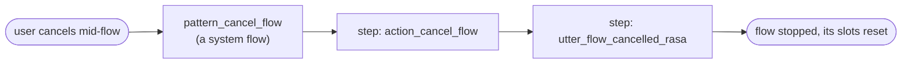

Rasa groups the patterns into a handful of categories — a map worth carrying, even though customising any one of them is a later-lesson topic:[^17]

| Category | Examples |
|---|---|
| Repair | correction, clarification, interruption |
| Navigation | cancel, restart, completion |
| External support | search, human handoff, chitchat |
| Voice | repeat, user silence |
| System error | internal error, code change, cannot-handle |

Two facts close the loop and carry into the rest of the lesson. First, **a pattern is a flow like any other**, so you customise one by defining a flow with the *same name* — `pattern_correction`, say.[^16] Second, the `pattern_` prefix is **reserved** for these system flows; your own flows must not use it.[^16]

### 1.4 Overriding a default — the bridge to custom actions

Replacing a pattern flow by name and replacing a default action by name are the same idea at two altitudes, and the second is the bridge into the rest of this lesson. **You override a default action by writing a custom action whose `name()` returns the same default name.** Register it in the domain, and your code runs in place of the built-in behaviour — the very mechanism every custom action in this lesson uses, pointed at a name Rasa already knows.[^15] One caveat: after adding such an override, re-train with `rasa train --force`, or Rasa may not notice the change and skip re-training the dialogue model.[^15]

With the defaults and the patterns as the baseline, the rest of the lesson is about the actions you write — your own Python, on the action server, called as a step in a flow.

---

## Chapter 2 — The action server: where Python runs


**This chapter answers one question — where does an action's Python actually run — and Rasa gives two answers, selected by a single configuration entry.** The reference form is a *separate* service, the **action server**: when a flow reaches an `action` step, the Rasa server sends an HTTP request across to it and reads the result back. The second form runs the same action classes inside the Rasa server process itself ([§2.2](#22-two-ways-to-wire-it-external-and-in-process)). Either way there is a defined seam between the conversation engine and the integration code — the configuration decides whether that seam is a network hop — and everything the assistant *does* crosses it. The chapter works through the separate-service form first, because it is the one that fixes the contract both forms share.

### 2.1 A separate process, and the wire between

The action server is built on the `rasa-sdk` package and started with `rasa run actions`; the same server can equally be launched as a Python module with `python -m rasa_sdk`.[^3] By convention it listens on port **5055** and exposes a `/webhook` endpoint.[^4]

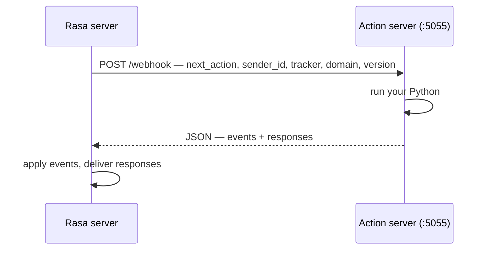

The request carries the name of the action to run (`next_action`), the conversation identifier (`sender_id`), the full tracker state, the domain, and a version field. The action server must answer with JSON carrying two lists: `events` (state changes, the subject of [Chapter 5](#chapter-5--events-how-actions-change-the-conversation)) and `responses` (messages for the user).[^4] The shape is all that is fixed, and that has a consequence worth stating: **any language could implement this contract.** The Python SDK is the convenient, official default, but a polyglot estate — Java middleware, a .NET fraud service — could expose an action server from any stack that answers an HTTP `POST` with the right JSON.[^4] The action server is then not "a Rasa thing" but a service that happens to speak Rasa's protocol. This chapter uses the Python SDK throughout.

### 2.2 Two ways to wire it: external and in-process

The `action_endpoint` entry in `endpoints.yml` takes one of two forms.[^4][^5]

```yaml
# Form A — external action server
action_endpoint:
  url: "http://localhost:5055/webhook"

# Form B — in-process execution
action_endpoint:
  actions_module: "actions"
```

**Form A, external (`url`),** points Rasa at the standalone HTTP action server of [§2.1](#21-a-separate-process-and-the-wire-between) — the one started with `rasa run actions` and listening on `/webhook` — running your integration code in its own process, in production its own container. Three properties follow from that separation:

- **Isolation** — the action tier can crash or leak without taking down the conversation engine.
- **Independent scaling** — the action tier scales separately from the conversation engine.
- **Credential separation** — the security-decisive property. Picture an action that calls a backend API with a secret token: with an external server, that token is injected into the action server's environment only, and never enters the Rasa process at all.[^5][^6]

**Form B, in-process (`actions_module`),** runs the same action classes *inside* the Rasa server process; the value is the importable package, conventionally `actions`. Here there is no second server and no network hop. The events-and-responses contract of [§2.1](#21-a-separate-process-and-the-wire-between) still describes what an action receives and returns, but Rasa now invokes the action as a direct in-process call rather than as an HTTP request. It costs less latency, removes a process to operate, and is the development default — the scaffolded project templates ship with exactly `actions_module: "actions"` and no `url`.[^5] Two mechanical points. If **both** keys are present, `actions_module` wins — the two are mutually exclusive and the in-process form takes priority.[^5] And the trade-off is the mirror of Form A's strength: when actions run inside Rasa, the Rasa process needs the same credentials the actions use, which raises the bar for securing that environment.[^5]

Where the credentials end up is the difference:

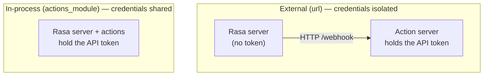

The choice between the two forms is therefore not a stage of the project but a security and operations decision: in-process wiring buys lower latency and one process fewer to run, at the cost of concentrating credentials in the Rasa environment; external wiring buys the isolation, independent scaling, and credential separation described above, at the cost of operating a second service. The scaffolded templates start in-process, which suits early work well — the moment real backend credentials enter the picture, the trade-off above is the argument to weigh. How the external form is deployed in production is a later-lesson topic.

### 2.3 One package, pinned with Rasa

The action server lives in `rasa-sdk`, a package distinct from Rasa Pro itself. The practical discipline is ordinary dependency hygiene: the two track each other by **major.minor parity** — `rasa-sdk` 3.17.x alongside Rasa Pro 3.17.x — so pin both explicitly and upgrade them together rather than letting one drift ahead.

### 2.4 The development loop

Custom actions live in an `actions/` directory at the project root; the default module is `actions`, so either `actions/actions.py` or a package with `actions/__init__.py`, and a different location can be named with the `--actions` flag.[^3]

How are they *discovered*? There is no scanning step and no registration call: discovery is ordinary Python module loading, performed once at startup, by whichever process actually executes the actions.

- **In-process** (`actions_module`): when the *Rasa server* boots, it imports the configured module — conventionally the `actions` package — and every `Action` subclass defined there becomes runnable.
- **External** (`url`): the import is the same, but it happens in the *action server's* own process when **it** boots — `rasa run actions` loads `actions.py`, or the package, or whatever `--actions` names. The Rasa server never imports remote action code.

What links the two processes is a *name*, not code. The Rasa server knows an action only as the string registered in the domain's `actions:` list; to run a remote one, it sends that string (`next_action`) in the POST to `/webhook`, and the action server routes the request to whichever loaded class's `name()` returns it. Nothing is "discovered" across the wire — register the name in the domain, and make sure the process that runs the actions can import a class that answers to it.[^3][^4]

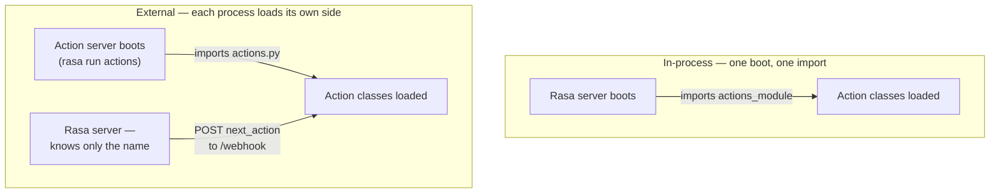

The loop you work in:

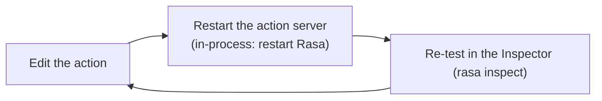

There is **no hot reload.** In-process, after editing action code you must restart the assistant for the change to take effect.[^5] An external action server is the same by construction — it imports your module once at startup — so an edit means a restart either way. Skip it and the failure mode is testing stale code: chasing a bug that is already fixed.

---

## Chapter 3 — Anatomy of a custom action

A custom action is one Python class with three obligations — a `name`, a `run`, and a registration in the domain — and getting any of the three out of step is where most early mistakes land.

### 3.1 The skeleton, and the obligations in it

A custom action is a Python class with three obligations, and nothing more — no decorators, no registration call.[^8]

```python
from typing import Any, Text, Dict, List
from rasa_sdk import Action, Tracker
from rasa_sdk.executor import CollectingDispatcher

class MyCustomAction(Action):

    def name(self) -> Text:
        return "action_name"

    def run(
        self, dispatcher: CollectingDispatcher,
        tracker: Tracker, domain: Dict[Text, Any],
    ) -> List[Dict[Text, Any]]:
        return []
```

Read it obligation by obligation:

- **It subclasses `rasa_sdk.Action`.** That subclass relationship *is* the framework contract — and everything imports from `rasa_sdk`, not `rasa`, reflecting the separate package of [Chapter 2](#chapter-2--the-action-server-where-python-runs).
- **`name()` returns a string**, and that string lives in three places: the method's return value, the `actions:` list in `domain.yml`, and a flow's `- action:` step (in `flows.yml`, or in any flow file under the data directory).[^8][^2]
- **`run()` receives three handles and returns a list of events.** The `dispatcher` is the write side and the `tracker` the read side (both [Chapter 4](#chapter-4--tracker-and-dispatcher-reading-state-speaking-back)); the returned events are the state changes ([Chapter 5](#chapter-5--events-how-actions-change-the-conversation)). The shape is *read state, do work, return events*. The `domain` argument carries the assistant's domain as a dict, which an action rarely reads.

`run` may also be a coroutine: `async def run` is supported and fits I/O-bound work such as awaiting an API call — though it is not required, and the first example below is an ordinary `def`.[^8]

The one-name-three-places rule is where most early mistakes land:

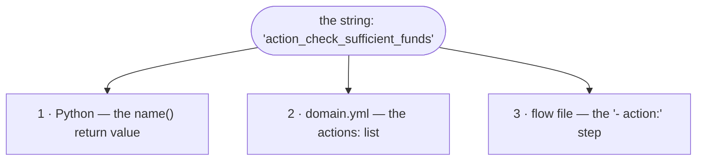

The string returned by `name()` must be the same string registered in the domain's `actions:` list (`domain.yml`) and referenced in a flow's `- action:` step. An action that is not in that `actions:` list cannot run at all.[^2] A name *mismatch* — say a Python `name()` of `action_execute_payment` against a flow that calls `execute_payment` — is not a hard error when the model trains; at runtime the FlowPolicy cancels the flow in progress and triggers the built-in `pattern_internal_error` ([§1.3](#13-conversation-patterns-the-system-flows-that-run-them)), whose runtime behaviour [Chapter 6](#chapter-6--calling-the-outside-world-safely) examines. It can be caught ahead of time with `rasa data validate`; the durable defence is a naming convention applied by hand.

### 3.2 First worked example: the sufficient-funds check

Imagine a banking assistant guarding a money transfer: before it lets the transfer go through, it has to confirm the account holds enough funds. The smallest action that still does real work is exactly that guard — the official tutorial's sufficient-funds check:[^7]

```python
from rasa_sdk.events import SlotSet  # event class, beyond the skeleton's three imports

class ActionCheckSufficientFunds(Action):

    def name(self) -> Text:
        return "action_check_sufficient_funds"

    def run(self, dispatcher: CollectingDispatcher,
            tracker: Tracker,
            domain: Dict[Text, Any]) -> List[Dict[Text, Any]]:
        balance = 1000  # hard-coded for the example; a real one fetches this
        transfer_amount = tracker.get_slot("amount")
        has_sufficient_funds = transfer_amount <= balance
        return [SlotSet("has_sufficient_funds", has_sufficient_funds)]
```

`SlotSet` — the event that writes a slot value, and the first of [Chapter 5](#chapter-5--events-how-actions-change-the-conversation)'s event classes to appear — is imported from `rasa_sdk.events`, a fourth import beyond the skeleton's three. The action is then registered in the domain (`domain.yml`):[^2]

```yaml
actions:
  - action_check_sufficient_funds
```

and called from a flow that branches on its result:[^7]

```yaml
- action: action_check_sufficient_funds
  next:
    - if: not slots.has_sufficient_funds
      then:
        - action: utter_insufficient_funds
          next: END
    - else: final_confirmation
```

Note how narrow the action's responsibility is. It does not message the user, does not decide what happens when funds fall short, and does not end or redirect the flow: it computes exactly one fact — whether the funds are sufficient — and returns it as an event. Every conversational consequence of that fact lives in the flow YAML. A `next:` block evaluates its conditions top to bottom and takes the first that matches, so `not slots.has_sufficient_funds` selects the insufficient-funds branch, and `else:` is the fallthrough when funds are adequate. In a real integration the hard-coded `balance = 1000` becomes a backend call — the subject of [Chapter 6](#chapter-6--calling-the-outside-world-safely).

### 3.3 The design rule: separate decision from work

Rasa states this rule as "keep logic out of custom actions and inside flows,"[^6] but the phrasing is easy to misread — a `run()` method full of computation is still business logic. The precise version is a **single-responsibility** split: a flow and a custom action each own a *different kind* of business logic, and the discipline is to keep one from leaking into the other.

- **The flow owns the decision logic** — the orchestration: which question comes next, which branch a result takes, when to confirm, when to abort. This is the conversation's control flow, and it lives in YAML.
- **The action owns the execution logic** — the raw work behind a single fact: an API fetch, a database read, a computation. It reports that fact as an event and stops there.

So an action *does* carry business logic; what it must not carry is the **conversational decision** that belongs to the flow. The test for where a branch belongs is whether it is *work* or *decision*: an `if` whose arms lead to different conversational outcomes belongs in the flow's `next:` block, while an `if` that copes with a malformed API response stays in Python — that is work (handling a bad payload), not decision (choosing the conversation's path).

The reason the split matters in a regulated setting: **branching that lives in YAML is reviewable by a process owner and testable by an automated suite; branching buried in Python is neither.** When a compliance officer asks what happens if a transfer exceeds the daily limit, the answer should be three readable lines of flow YAML, diffable in the repository's history — not an archaeology dig through `if`/`else` chains. An action that quietly decides to skip a confirmation or send a different message has moved a *business decision* out of the auditable layer.

### 3.4 Dynamic questions: the `action_ask_<slot>` convention

A `collect` step normally finds its question by name: for `- collect: account_type`, Rasa looks for an `utter_ask_account_type` response in `domain.yml` and sends it.[^12] There is an action-side counterpart for when the question must be **computed** rather than written in advance — for instance, asking "which account?" only after fetching the customer's real accounts from the backend, so the options can be shown as buttons ([Chapter 4](#chapter-4--tracker-and-dispatcher-reading-state-speaking-back)). If a domain-registered custom action named `action_ask_<slot_name>` exists, the `collect` step calls *it* instead of the static response.

The wiring spans three files, and the `collect` step itself never changes:

```yaml
# flows.yml — identical whether the question is a response or an action
- collect: account_type
```

```yaml
# domain.yml — registering action_ask_account_type is the whole switch
actions:
  - action_ask_account_type
```

```python
# actions.py — an action whose name() matches action_ask_<slot>
class ActionAskAccountType(Action):

    def name(self) -> Text:
        return "action_ask_account_type"

    def run(self, dispatcher, tracker, domain):
        accounts = fetch_accounts(tracker.sender_id)   # the raw work
        buttons = [{"title": a, "payload": a} for a in accounts]
        dispatcher.utter_message(text="Which account?", buttons=buttons)
        return []
```

The convention is resolved by a name lookup at runtime, not by any declaration. When the `collect` step for `account_type` runs, Rasa looks for a domain-registered action named `action_ask_account_type`; finding one, it runs it, and otherwise it sends the `utter_ask_account_type` response. Registering the action is therefore the entire opt-in — nothing in the flow records that a computed question was *intended*. That is also the mechanism's weakness: because no declaration exists for training-time validation to check the name against, an unregistered or misspelled `action_ask_<slot>` raises no error when the model trains. The gap surfaces only at runtime, when the collect step has nothing to ask the question with: the FlowPolicy cancels the flow and triggers `pattern_internal_error` ([§1.3](#13-conversation-patterns-the-system-flows-that-run-them)). Only the opposite mistake is caught early — defining *both* a response and a custom action for the same collect step is a training-time validation error.[^12]

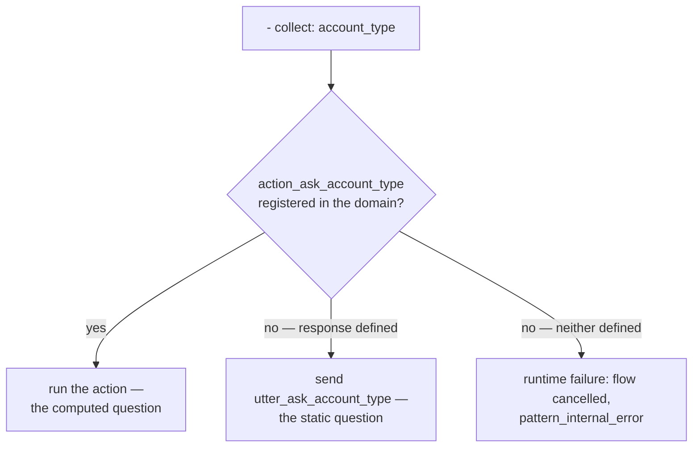

---

## Chapter 4 — Tracker and dispatcher: reading state, speaking back

Every action holds two handles. The **tracker** is the read side — the full conversation state, delivered with the request. The **dispatcher** is the write side — everything the user will see. The division is *tracker in, dispatcher out.*

### 4.1 Tracker: the read side

The tracker an action receives is the same conversation state the dialogue manager maintains, not a reshaped copy.[^10] Its members, in rough order of how often an action reaches for them:[^10]

- **`tracker.get_slot("amount")`** — the workhorse; nearly every integration action begins by reading a slot the flow has already collected.
- **`tracker.slots`** — the whole slot map as a dict, for reading several values at once.
- **`tracker.sender_id`** — the unique conversation identifier, which keys per-customer work; an action uses it to isolate one conversation's data from another's.
- **`tracker.latest_message`** — a dict of the last user message's attributes, including `text`, for the rare action that needs the raw words rather than a collected slot.
- **`tracker.events`** — the full event history. An action that reasons over raw history to decide what to do is almost always doing a flow's job (the rule of [§3.3](#33-the-design-rule-separate-decision-from-work)); the legitimate uses are narrow, such as summarising a transcript for a human handoff, and even that is *work*, not *logic*.

An action can also read the **dialogue stack** through `tracker.stack` — the same LIFO stack of active flows the Inspector shows. It exposes, for instance, a balance check digressing on top of a half-finished transfer:

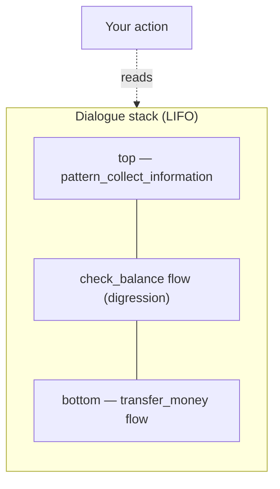

Seeing the stack from inside the seam is occasionally useful; *acting* on it from Python is rarely appropriate, because deciding what the conversation does next is a flow's job. The three lines an action actually writes most often:

```python
transfer_amount = tracker.get_slot("amount")      # the workhorse
conversation    = tracker.sender_id               # keys per-conversation work
user_text       = tracker.latest_message.get("text")  # raw text, rarely needed
```

### 4.2 Dispatcher: the write side

The dispatcher is a `CollectingDispatcher`, and its one method, `utter_message()`, collects the messages to send back:[^9]

```python
# Plain text
dispatcher.utter_message(text="Hey there")

# Named response from the domain, with variable interpolation
dispatcher.utter_message(response="utter_greet_name", name="Aimee")

# Buttons — each button dict needs 'title' and 'payload'
dispatcher.utter_message(buttons=[
    {"title": "Yes", "payload": "/affirm"},
    {"title": "No",  "payload": "/deny"},
])

# Channel-specific custom JSON payload
dispatcher.utter_message(json_message=date_picker)
```

The `response=` call has another side — the named template it fills, declared in `domain.yml`:

```yaml
# domain.yml
responses:
  utter_greet_name:
    - text: "Hey, {name}. How are you?"
```

The `{name}` placeholder is filled by the `name="Aimee"` keyword passed to `utter_message`; absent that keyword, Rasa fills `{name}` from a slot of the same name, or with `None` if no such slot exists.[^18]

Between `text=` and `response=`, prefer **`response=`** whenever the wording is customer-facing. The reason is governance rather than aesthetics: wording that lives in `domain.yml` sits in one reviewable, translatable place, while wording embedded in Python is invisible to whoever owns the assistant's voice. Concretely, if the bank's communications owner decides the greeting should read differently, the `response=` version is a one-line YAML change they can find, review, and diff in the repository's history; the `text=` version is a change to the body of an action they may not even know exists. The same single-place property is what allows a translation pass to find every customer-facing string.

Buttons present constrained choices, and a button's `payload` is sent to the assistant as the user's next message when the button is clicked. A payload that starts with `/` is processed deterministically instead of being read by the language model, and two grammars are documented.[^18] The `/SetSlots(slot=value)` form issues a set-slot command directly, which is why a button is among the few writers a *controlled* slot accepts (a guarantee [Chapter 5](#chapter-5--events-how-actions-change-the-conversation) returns to). The `/affirm` and `/deny` in the example above are the other grammar, `/intent_name`: the message is deterministically classified as that intent (`affirm`, `deny`), bypassing interpretation entirely — a shorthand inherited from Rasa's NLU-era assistants, which the SDK documentation still uses in its examples. In a CALM assistant, where flows branch on slots rather than intents, `/SetSlots` is normally the form to reach for. `json_message`, finally, carries channel-specific shapes a web widget can render, and passing several arguments together yields one rich message.[^9]

One bug to avoid — stated here, and clearer once events arrive in [Chapter 5](#chapter-5--events-how-actions-change-the-conversation): an action's `run()` returns a list of *events*, records of conversation-state change, and Rasa already records every message sent through the dispatcher as such an event (a `BotUttered`) on its own. A dispatched message must therefore *not* also be returned from `run()` — the dispatcher call is its complete record.[^9]

### 4.3 Output discipline

A constraint governs the write side: **whatever the dispatcher sends is customer-visible, and whoever owns the assistant is answerable for it.** No internal identifiers, no stack traces, no upstream error bodies. A backend API's HTTP 500 page must never reach a chat bubble — an exception message can leak hostnames, table names, even credentials. This has a name in the security literature, *insecure output handling*, and the dispatcher is the pipe it would flow through. The rule is simple: dispatch only domain-templated, customer-appropriate text.

---

## Chapter 5 — Events: how actions change the conversation

An action returns a list of **events**, and events are the *only* way its work re-enters the conversation. The division is clean: the dispatcher talks to the user, events talk to the state. Every event class imports from `rasa_sdk.events`.[^11]

### 5.1 `SlotSet` and the integration idiom

`SlotSet(key, value)` writes a value into a named slot.[^11] It is the event behind the canonical CALM integration idiom — combine it with a slot the model cannot forge and a flow that branches on the result:

> **The action fetches, a slot carries the result, the flow branches on it.**

The slot in the middle should be **controlled**, and a controlled slot is declared in `domain.yml`:[^1]

```yaml
# domain.yml
slots:
  has_sufficient_funds:
    type: bool
    mappings:
      - type: controlled
```

A slot whose mapping is `controlled` can be set only by an action, a button payload, or a `set_slots` step, and — when `controlled` is its sole mapping — is *not* available to be filled by the NLU or the LLM.[^1] That is the trust boundary: the language model can never *claim* a balance of €12,000; only the backend call can set that value. (Keep `controlled` as the slot's *only* mapping where the guarantee matters; mixing it with other mapping types reopens the door to probabilistic filling.[^1])

With the slot in place, the three pieces meet. The **action fetches** — raw work in Python, the execution side of the split of [§3.3](#33-the-design-rule-separate-decision-from-work). The **slot carries** the result. The **flow branches** on the slot in its `next:` predicates, per the CALM division of labour — the model understands, the flows decide, the actions do.

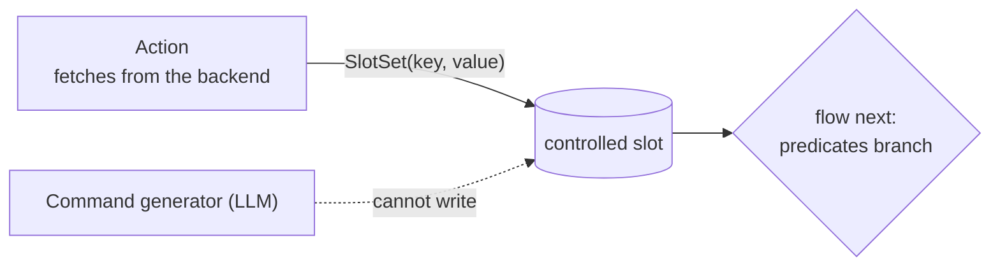

The sufficient-funds check of [§3.2](#32-first-worked-example-the-sufficient-funds-check) *is* this idiom: `has_sufficient_funds` is a controlled bool, the action returns `SlotSet("has_sufficient_funds", …)`, and the flow branches on `slots.has_sufficient_funds`.[^7]

An outcome is not always binary. Where an action can end several ways, the carrying slot holds an *outcome string* and the flow branches once per outcome:

```yaml
# in a flow file — branch once per outcome string
- action: action_check_transfer
  next:
    - if: slots.transfer_status = "success"
      then:
        - action: utter_transfer_done
          next: END
    - if: slots.transfer_status = "not_found"
      then:
        - action: utter_account_not_found
          next: END
    - else:
        - action: utter_service_down
          next: END
```

Each `if:` is a predicate over the `slots.` namespace, and `=` — equality — is one operator of a small fixed vocabulary: the comparisons (`=`, `!=`, `>`, `>=`, `<`, `<=`), the logical connectives (`and`, `or`, `not`), identity (`is`, `is not`), membership (`contains`), and regular-expression matching (`matches`), with string literals quoted and slots always reached through the `slots.` prefix.[^19] The branches are tried top to bottom, the first match wins, and `else:` is the fallthrough.[^12]

### 5.2 The supporting cast

The other events an action can return, with their roles:[^11]

| Class | Effect | Typical scenario |
|---|---|---|
| `AllSlotsReset` | Clears every slot — blunt | Wiping state at the end of a session-scoped task |
| `SessionStarted` | Marks the start of a new session | Inside a custom `action_session_start` override |
| `SessionEnded` | Marks a session as terminated | Closing the session after an explicit logout |
| `ConversationPaused` / `ConversationResumed` | Stop / restart the bot's responses | Parking a conversation during a human handoff, then resuming |
| `Restarted` | Resets the tracker entirely, no history retained | A hard "start over" that carries nothing forward |
| `FollowupAction(name)` | Forces a specific action to run next, bypassing prediction | A genuinely runtime-determined next action |

These events are returned from Python, never declared in YAML — an action emits them by listing them in its `return`:

```python
from rasa_sdk.events import AllSlotsReset, FollowupAction

return [AllSlotsReset(), FollowupAction("action_say_goodbye")]
```

`FollowupAction` deserves a caution. It is an *imperative override*, and it fights the *declarative* flow model — "what happens next" is exactly what flows exist to express. Two of these events do have a declarative flow counterpart, and where one exists the flow is the better tool: a `SlotSet` corresponds to a `set_slots:` step, and a `FollowupAction` to ordinary `next:` routing.[^12] So prefer flow branching; reserve `FollowupAction` for the genuinely runtime-determined case, which is rare.

---

## Chapter 6 — Calling the outside world, safely

Here the integration boundary's discipline becomes code. The happy path is ordinary Python — `requests` or `httpx` against the backend API. The substance is everything *around* it: each line below the imports is a deliberate decision.

```python
import os
import requests
from rasa_sdk import Action, Tracker
from rasa_sdk.executor import CollectingDispatcher
from rasa_sdk.events import SlotSet

class ActionFetchBalance(Action):

    def name(self) -> str:
        return "action_fetch_balance"

    def run(self, dispatcher: CollectingDispatcher,
            tracker: Tracker, domain: dict) -> list:
        api_base = os.environ.get("BACKEND_API_URL")
        token    = os.environ.get("BACKEND_API_TOKEN")
        account  = tracker.get_slot("account_id")

        try:
            resp = requests.get(
                f"{api_base}/v1/accounts/{account}/balance",
                headers={"Authorization": f"Bearer {token}"},
                timeout=5,
            )
            resp.raise_for_status()
            balance = resp.json()["balance"]
            return [
                SlotSet("current_balance", balance),
                SlotSet("balance_fetch_ok", True),
            ]
        except requests.RequestException:
            return [SlotSet("balance_fetch_ok", False)]
```

`current_balance` and `balance_fetch_ok` are both controlled slots — the integration idiom of [§5.1](#51-slotset-and-the-integration-idiom), applied twice. The listing encodes three disciplines.

### 6.1 Credentials from the environment, and nowhere else

The credentials come from `os.environ` — the only place they may come from. Three rules, enforceable in code review. **Never as literals in source:** a token committed to git is a token leaked forever. **Never written to logs.** **Never anywhere a prompt could reach** — a credential in the model's context is a credential that can leak through the model's output, so keep secrets out of slots, out of instructions, out of anything the command generator sees.

Rasa models the same hygiene at the configuration layer: values in `endpoints.yml` use `${ENV_VAR}` placeholder syntax rather than literals, and in production secrets are injected into the container environment rather than baked into the image.[^6] This is where the credential-separation argument of [§2.2](#22-two-ways-to-wire-it-external-and-in-process) pays off: with an **external** action server, `BACKEND_API_TOKEN` exists in that container only — the Rasa server, the model artifacts, and the LLM prompts never hold it.

### 6.2 Timeouts: the outbound call must be the short one

The second discipline is the `timeout=5` argument the balance-fetch action passes to `requests.get(...)`. It tells the `requests` library to wait at most 5 seconds for the backend to answer, and to raise an exception rather than hang if it does not. The value is yours, not the framework's: nothing is magic about 5 beyond "short enough that a hung backend fails fast on an interactive channel," and Rasa exposes no configuration key for it, so the only place to bound the outbound call is the action's own code.

Why it has to be the *shortest* fuse in the chain: Rasa's own patience with an action server is long — by default the engine waits about five minutes (300 seconds) for the action endpoint to answer (a hardcoded constant, `DEFAULT_REQUEST_TIMEOUT`, not an `endpoints.yml` setting); and the user-facing REST channel carries its own, shorter response timeout (around 60 seconds), so a customer on an interactive channel usually hits that first. Either way the failure is slow unless the outbound call is the short one:

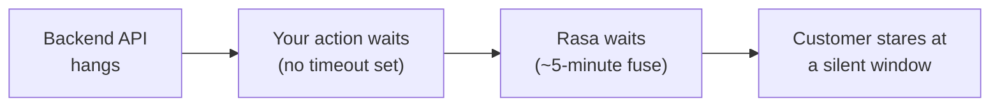

Without a timeout on the outbound call the whole chain hangs: the API hangs, the action hangs, the action server's reply never comes, Rasa waits on its multi-minute fuse, and the customer watches a silent window.

The fix is one keyword argument, set in Python where the call is made — `requests` and `httpx` both take it:

```python
resp = requests.get(url, timeout=5)   # 5 seconds; httpx.get(url, timeout=5.0) is the same idea
```

There is no YAML knob to reach for instead: `endpoints.yml` configures *where* the action server is (`action_endpoint.url`), not how long an action may take. The rule: **every outbound call carries an explicit, short timeout**, so a hung backend degrades into a clean failure in seconds.

### 6.3 Failing cleanly: the handled and unhandled paths

There are two failure stories, and they are distinct.

**The handled failure.** The `except requests.RequestException` branch catches the expected failures — connection refused, timeout, HTTP error — and returns `SlotSet("balance_fetch_ok", False)`. The flow then routes to a *designed* unhappy path: a clean, domain-templated apology, perhaps an offer to retry. The customer experiences a polite degradation and the conversation survives. The shape follows the split of [§3.3](#33-the-design-rule-separate-decision-from-work) — the action reports the *fact* of failure, the *flow* decides what it means:

```yaml
- action: action_fetch_balance
  next:
    - if: slots.balance_fetch_ok
      then:
        - action: utter_current_balance
          next: END
    - else:
        - action: utter_balance_service_down
          next: END
```

**The unhandled failure.** If `run()` raises an exception you did *not* catch — and the listing above has such a path: a `200` response whose JSON carries no `"balance"` key raises a `KeyError`, which is not a `RequestException` and sails past the `except` — the SDK answers Rasa with an HTTP 500 and the server treats the action as failed; the same happens if the action server is unreachable or never answers.[^14] In the Rasa log this surfaces as a line like *"Failed to run custom action … Action server responded with a non 200 status code"*, or, when the server is down, *"Couldn't connect to the server … Is the server running?"*.[^14] The framework then triggers the built-in pattern **`pattern_internal_error`**, whose default branch utters `utter_internal_error_rasa`: *"Sorry, I am having trouble with that. Please try again in a few minutes."*[^13]

That generic apology is the customer's experience for *every* uncaught exception — a bug in your code or a backend that died, indistinguishable from one another and off-brand. The conversation is not silently abandoned, but neither is it gracefully handled. Taking control of exactly what the customer reads — a customised `pattern_internal_error`, retries, a handoff — is a later-lesson topic; the discipline of *this* lesson is catching the failures you can foresee and turning them into a slot the flow can branch on.

### 6.4 The seam, end to end

Step back and the chapter is one picture — a single request crossing the seam and coming back as a branch:

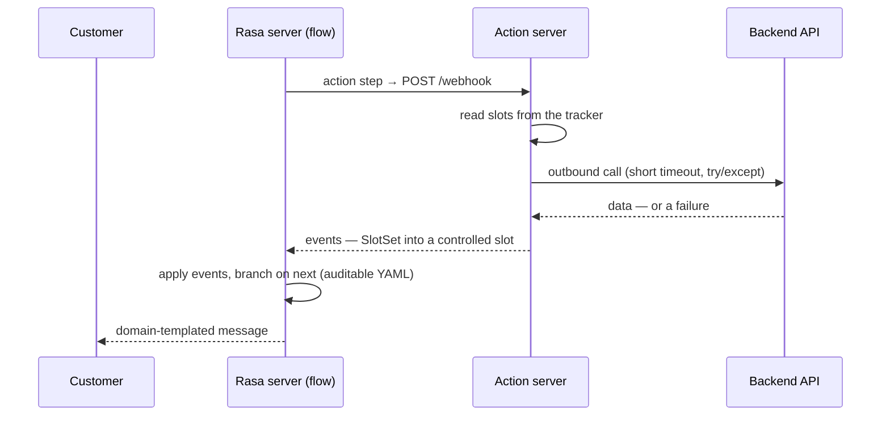

Read top to bottom: a flow reaches an `action` step and Rasa posts across the seam; the action reads what it needs from the tracker, does its raw work behind a short timeout and a `try`/`except`, and returns a `SlotSet` into a controlled slot the model cannot forge; Rasa applies the events, the flow branches in auditable YAML, and any message the customer sees came from a reviewed domain template.

Everything decisive happens in deterministic code and declared flows, *outside* the model: least privilege, secrets isolation, a short timeout, and a clean failure path. That is what makes a model's words safe to turn into real, consequential actions.

---

## Further reading

- **[Writing Custom Actions](https://rasa.com/docs/pro/build/custom-actions/) — Rasa Pro documentation.** The source of the "Keep Logic Out of Custom Actions and Inside Flows" rule and the in-process `actions_module` configuration, with the credential and security trade-offs of each wiring form.
- **[Running the Action Server](https://rasa.com/docs/reference/integrations/action-server/running-action-server/) — Rasa documentation.** The `rasa run actions` / `python -m rasa_sdk` launch forms, the `--actions` flag, and the HTTP/gRPC options.
- **[Default actions](https://rasa.com/docs/reference/primitives/default-actions/) — Rasa documentation.** The full set of built-in actions and the override-by-matching-`name()` mechanism the Intro introduces.
- **The `finance` project template (`rasa init --template finance`).** Rasa's own bank-assistant reference: actions organised by business area, a per-conversation mock database, and a real `check_transfer_funds` action that does what [§3.2](#32-first-worked-example-the-sufficient-funds-check)'s stub only gestures at.

---

### Sources

[^1]: **Slots — Rasa documentation (primitives reference).** [rasa.com](https://rasa.com/docs/reference/primitives/slots/). The `controlled` slot mapping: a controlled slot is fillable only by a custom action, a button payload, or a `set_slots` step, and when `controlled` is its sole mapping it is not available to the NLU or LLM; mixing mappings reintroduces probabilistic filling. Backs the controlled-slot declaration YAML.
[^2]: **Custom Actions / Domain — Rasa documentation (reference).** [custom-actions](https://rasa.com/docs/reference/primitives/custom-actions/), [domain](https://rasa.com/docs/reference/config/domain/). Every custom action must be registered under the domain's `actions:` list; an unregistered action cannot run.
[^3]: **Running the Action Server — Rasa documentation.** [rasa.com](https://rasa.com/docs/reference/integrations/action-server/running-action-server/). `rasa run actions` and `python -m rasa_sdk` as two front doors to the same server; the `--actions` flag; the `actions/` package layout; HTTP-default and `--grpc`.
[^4]: **Actions — Rasa Action Server integration.** [rasa.com](https://rasa.com/docs/reference/integrations/action-server/actions/). The request/response JSON contract (`next_action`, `sender_id`, `tracker` including the dialogue `stack`, `domain`, `version` → `events` + `responses`); the `action_endpoint.url` form and the `http://localhost:5055/webhook` example; the language-agnostic contract.
[^5]: **Custom Actions — Rasa documentation (reference primitives).** [rasa.com](https://rasa.com/docs/reference/primitives/custom-actions/). The in-process `actions_module` form; its mutual exclusivity with `url` and the rule that `actions_module` wins if both are set; the higher bar to secure the Rasa environment when actions run in-process; the requirement to restart the assistant after editing action code.
[^6]: **Writing Custom Actions — Rasa Pro documentation.** [rasa.com](https://rasa.com/docs/pro/build/custom-actions/). "Keep Logic Out of Custom Actions and Inside Flows"; the action-fetches-then-flow-branches example; reading credentials from the environment and injecting them into the container.
[^7]: **Rasa Pro Tutorial (money transfer).** [rasa.com](https://rasa.com/docs/pro/tutorial/). The `ActionCheckSufficientFunds` action verbatim (hard-coded `balance = 1000`, reads slot `amount`, returns `SlotSet("has_sufficient_funds", …)`), the `has_sufficient_funds` controlled slot, and the money-transfer flow that branches on it.
[^8]: **Actions — Rasa SDK reference.** [rasa.com](https://rasa.com/docs/reference/integrations/action-server/sdk-actions/). The `Action` base class with required `name()` and `run(self, dispatcher, tracker, domain)`; `run` returns a list of events and may be `async`.
[^9]: **Dispatcher — Rasa SDK reference.** [rasa.com](https://rasa.com/docs/reference/integrations/action-server/sdk-dispatcher/). `CollectingDispatcher.utter_message()` with `text`, `response` (named domain response + kwargs), `buttons` (each needing `title` and `payload`), and `json_message`; multiple arguments yield one rich message; dispatched messages become `BotUttered` events and must not also be returned.
[^10]: **Tracker — Rasa SDK reference.** [rasa.com](https://rasa.com/docs/reference/integrations/action-server/sdk-tracker/). `get_slot`, `slots`, `sender_id`, `latest_message` (a dict including `text`), and `events`.
[^11]: **Events Reference — Rasa Action Server SDK.** [rasa.com](https://rasa.com/docs/reference/integrations/action-server/sdk-events/). `SlotSet`, `AllSlotsReset`, `SessionStarted`, `SessionEnded`, `ConversationPaused`/`ConversationResumed`, `Restarted`, and `FollowupAction`, with their event-type strings and parameters.
[^12]: **Flow Steps — Rasa documentation (primitives reference).** [rasa.com](https://rasa.com/docs/reference/primitives/flow-steps/). The `action` step; the `action_ask_<slot>` convention (the collect step calls the action by name and its YAML is unchanged; a missing action fails at runtime; defining both a response and an action for one collect step is a training-time validation error).
[^13]: **Patterns — Rasa documentation (primitives reference).** [rasa.com](https://rasa.com/docs/reference/primitives/patterns/). `pattern_internal_error` and its default `utter_internal_error_rasa` text, "Sorry, I am having trouble with that. Please try again in a few minutes."
[^14]: **rasa/core/actions/action.py — RemoteAction error handling.** [github.com](https://github.com/RasaHQ/rasa/blob/main/rasa/core/actions/action.py). The non-200 and connection-failure log lines the Rasa server emits when an action endpoint returns an error or is unreachable, and its treatment of a non-200 response as a failed action.
[^15]: **Default actions — Rasa documentation (primitives reference).** [rasa.com](https://rasa.com/docs/reference/primitives/default-actions/). The default actions (`action_listen`, `action_session_start`, and the repair/control family) and their behaviour; overriding a default by writing a custom action whose `name()` returns the same name and registering it in the domain; the `rasa train --force` retrain caveat.
[^16]: **Patterns — Rasa documentation (primitives reference).** [rasa.com](https://rasa.com/docs/reference/primitives/patterns/). The built-in conversation patterns and their default step definitions (`pattern_cancel_flow` runs `action_cancel_flow`; `pattern_session_start` runs `action_session_start`; `pattern_collect_information` runs `action_run_slot_rejections` then `action_listen`; `pattern_internal_error` utters `utter_internal_error_rasa`; `pattern_repeat_bot_messages` runs `action_repeat_bot_messages`); that patterns work out-of-the-box (the pattern flow need not be present in the project to get the default behaviour); and overriding a pattern by defining a flow of the same name.
[^17]: **Conversation patterns — Rasa documentation (concept).** [rasa.com](https://rasa.com/docs/learn/concepts/conversation-patterns/). Conversation patterns as reusable system flows provided by CALM to handle non-linear interactions and repair the conversation, and the category taxonomy — conversation repair, navigation, external support, voice, and system error.
[^18]: **Responses — Rasa documentation (primitives reference).** [rasa.com](https://rasa.com/docs/reference/primitives/responses/). Variable interpolation in a response: a `{variable}` enclosed in curly brackets is filled from a slot of the same name (or with `None` if no such slot exists), or from a keyword argument passed to `dispatcher.utter_message`. Also the two button-payload grammars: a payload in the `/intent{entities}` shorthand is handled deterministically by the `RegexInterpreter` and classified as that intent, skipping interpretation; a `/SetSlots(slot_name=slot_value)` payload (Rasa Pro ≥ 3.9) issues set-slot commands directly.
[^19]: **Conditions — Rasa documentation (primitives reference).** [rasa.com](https://rasa.com/docs/reference/primitives/conditions/). The operators usable in a flow's `next:` predicates — `=` (equality), `!=`, the numeric comparisons, `and`/`or`/`not`, `contains`, `matches` — with string literals enclosed in quotes and slots referenced through the `slots.` namespace.
