# Day 8 — Custom Actions e Integrazione con il Backend
## Guida di Studio per lo Studente

<!--
TODO: In general for the rest of the study guide I'm keeping some notes here on top. 

- Sometimes, reasonably, the paragraph anticipate concepts and elements that will be explained later, for instance events, technical components etc. This must be handled with care, for concepts that are important, we should consider adding a brief and compact explanatory paragraph or chapter in advance, so that the reader doesn't get lost with new things that are introduced later but addressed earlier.
- By reading it again after a week, this whole study guides still reads a lot like a friend talking and less like a guide wirtten for a student with clarity and precision in mind, I think we should reduce the colloquial parts a bit and focus on content clarity and fluence.
- In general, I stream the study guide during the lesson, and often I find using the diagrams pretty useful for me to explain concepts. I'm not asking to spam the study guide with diagrams, but to provide more. Rule of thumb: when there is a long paragraph full of concepts interacting with each other, or even a short paragraph that describes the interaction of multiple components, a diagram is useful so that the students have a visual representation of the interactions. These scenarios are often involving multiple moving parts interacting or having a responsibility in a system of some sort, so let's spot them and add some diagram.
-->

Questo capitolo riguarda la giuntura in cui un assistente Rasa smette di *parlare* e inizia a *fare* — chiamare una API per il saldo di un conto, verificare che i fondi coprano un trasferimento, leggere e scrivere i sistemi reali su cui gira una banca. Quel lavoro avviene nelle **custom action**, codice Python che viene eseguito in un servizio separato chiamato **action server**. Si parte da cosa sia un'action, dalle action integrate che Rasa esegue già, e dai conversation pattern che le guidano; poi si affrontano l'action server e come viene collegato, l'anatomia di una custom action, i due handle che ogni action possiede — il tracker che legge e il dispatcher attraverso cui scrive — gli event che un'action restituisce per cambiare la conversazione, e infine la chiamata a una API esterna sotto la disciplina che un deployment regolamentato richiede: credenziali, timeout e fallimento pulito. L'obiettivo è una padronanza pratica — scrivere un'action, collegarla, chiamarla da un flow, e farla fallire in sicurezza. La sostanza non è il Python, che è ordinario, ma la disciplina attorno ad esso. Il deployment in container di produzione, l'esperienza conversazionale in caso di errore, e il testing end-to-end sono trattati ciascuno in una propria lezione successiva.

---

## Capitolo 1 — Le action, e il meccanismo che Rasa esegue già

**Le custom action non arrivano su un palco vuoto.** Prima che tu scriva una sola riga di codice tua, Rasa sta già eseguendo delle action — guidate da flow che non hai mai scritto. Questo capitolo stabilisce questa base di partenza: cos'è un'action, le **default action** che Rasa fornisce, e i **conversation pattern** che le eseguono. Si guadagna il proprio posto oltre il mero orientamento, perché il meccanismo che userai per scrivere una custom action è lo stesso che ti permette di *sostituire* qualunque di questi elementi.

### 1.1 Un'action è il passo del "fai qualcosa"

Un flow è un elenco ordinato di **step**, e uno step fa una di due cose: **raccoglie** (collect) uno slot dall'utente, oppure esegue un'**action**. Un'action è l'unità generale del "l'assistente fa qualcosa." La più comune è già familiare dallo scrivere i flow — una **response**, un template `utter_` che invia un messaggio fisso o riempito con variabili. Una response è semplicemente l'action più semplice che esista: il lavoro che svolge è "dì questo." La gamma va da lì fino a un'action che chiama una API di backend sulla rete — ed è di quell'altro estremo, le action che eseguono codice tuo, che tratta questa lezione.

### 1.2 Le default action che Rasa esegue per te

Prima che tu scriva una qualsiasi action, Rasa esegue già per conto proprio un insieme di **default action**.[^15] Non le chiami per nome; le innescano il runtime e i conversation pattern ([§1.3](#13-conversation-patterns-the-system-flows-that-run-them)). Due vengono già eseguite in ogni conversazione:

- **`action_listen`** — l'action dell'*attesa*. Segnala che l'assistente non deve fare nulla e aspettare il prossimo messaggio dell'utente.[^15]
- **`action_session_start`** — avvia una sessione di conversazione. Viene eseguita all'inizio di ogni conversazione, dopo un periodo di inattività dell'utente, o su un esplicito `/session_start`, e resetta il tracker pur — per default — portando gli slot esistenti nella nuova sessione.[^15]

Oltre a queste si colloca una famiglia di default per la **riparazione e il controllo** della conversazione. Raramente le invochi direttamente; sono l'impianto idraulico a cui il runtime attinge. Quelle che scattano all'interno di un assistente ordinario:[^15]

| Default action | Cosa fa |
|---|---|
| `action_listen` | Aspetta il prossimo messaggio dell'utente |
| `action_session_start` | Avvia una sessione; porta con sé gli slot per default |
| `action_default_fallback` | Annulla l'ultimo turno e pronuncia `utter_default`, su una previsione a bassa confidenza |
| `action_run_slot_rejections` | Applica le regole di validazione degli slot (`rejections`) di un flow |
| `action_cancel_flow` | Interrompe in modo pulito il flow attivo e ne resetta gli slot |
| `action_repeat_bot_messages` | Reinvia testualmente l'ultimo/gli ultimi messaggio/i del bot |
| `action_restart` | Resetta l'intera conversazione, slot inclusi |

Un pugno di ulteriori default riguarda funzionalità oltre lo scopo di questa lezione, ed è nominato qui solo affinché l'elenco non venga scambiato per il tutto: `action_hangup` (chiamate vocali), `action_trigger_search` (enterprise search), `action_reset_routing` (coexistence NLU/CALM), e `action_clean_stack` (riparazione dello stack dopo un redeploy).[^15]

### 1.3 Conversation pattern: i flow di sistema che le eseguono

Perché Rasa esegue action che non hai mai richiesto? Perché le conversazioni reali non sono lineari — gli utenti si correggono, cambiano idea, chiedono di ricominciare, restano in silenzio — e CALM gestisce ciascuno di questi casi con un **conversation pattern**: un **system flow** riutilizzabile, fornito con Rasa, che ripara o indirizza la conversazione quando l'utente esce dal percorso che hai tracciato.[^17] I pattern funzionano da subito; un assistente non ne ha bisogno di nessuno nel proprio progetto per ottenere il comportamento di default.[^16]

Il collegamento che spiega la sezione precedente: **un pattern è un flow ordinario, e i suoi step sono in gran parte default action.** È *per questo* che quei default esistono — sono gli step eseguibili all'interno dei system flow. Alcuni dei pattern integrati, letti direttamente dalle loro definizioni di default:[^16]

| Pattern | Gli step che esegue | Gestisce |
|---|---|---|
| `pattern_cancel_flow` | `action_cancel_flow` | l'annullamento del flow in corso |
| `pattern_session_start` | `action_session_start` | l'avvio di una sessione di conversazione |
| `pattern_collect_information` | `action_run_slot_rejections`, poi `action_listen` | richiedere e validare uno slot |
| `pattern_internal_error` | pronuncia `utter_internal_error_rasa` | dire all'utente che qualcosa si è rotto |
| `pattern_repeat_bot_messages` | `action_repeat_bot_messages` | un utente che chiede "cosa hai detto?" |

Un singolo pattern, disteso, ne mostra la forma — un flow i cui step sono default action:

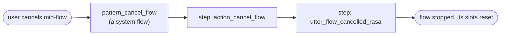

Rasa raggruppa i pattern in un pugno di categorie — una mappa che vale la pena portare con sé, anche se personalizzarne uno qualsiasi è un argomento di una lezione successiva:[^17]

| Categoria | Esempi |
|---|---|
| Riparazione | correzione, chiarimento, interruzione |
| Navigazione | annullamento, riavvio, completamento |
| Supporto esterno | ricerca, passaggio a un operatore umano, chitchat |
| Voce | ripeti, silenzio dell'utente |
| Errore di sistema | errore interno, cambio di codice, impossibilità di gestire |

Due fatti chiudono il cerchio e si portano nel resto della lezione. Primo, **un pattern è un flow come qualunque altro**, quindi lo personalizzi definendo un flow con lo *stesso nome* — `pattern_correction`, ad esempio.[^16] Secondo, il prefisso `pattern_` è **riservato** a questi system flow; i tuoi flow non devono usarlo.[^16]

### 1.4 Sovrascrivere una default — il ponte verso le custom action

Sostituire un pattern flow per nome e sostituire una default action per nome sono la stessa idea a due diverse altitudini, e la seconda è il ponte verso il resto di questa lezione. **Sovrascrivi una default action scrivendo una custom action il cui `name()` restituisce lo stesso nome di default.** Registrala nel domain, e il tuo codice viene eseguito al posto del comportamento integrato — esattamente il meccanismo che ogni custom action in questa lezione utilizza, puntato su un nome che Rasa conosce già.[^15] Un'avvertenza: dopo aver aggiunto una sovrascrittura di questo tipo, riaddestra con `rasa train --force`, altrimenti Rasa potrebbe non accorgersi del cambiamento e saltare il riaddestramento del modello di dialogo.[^15]

Con i default e i pattern come base di partenza, il resto della lezione riguarda le action che scrivi tu — il tuo Python, sull'action server, chiamato come step in un flow.

---

## Capitolo 2 — L'action server: dove viene eseguito Python


**Questo capitolo risponde a una domanda — dove viene effettivamente eseguito il Python di un'action — e Rasa dà due risposte, selezionate da una singola voce di configurazione.** La forma di riferimento è un servizio *separato*, l'**action server**: quando un flow raggiunge uno step `action`, il Rasa server gli invia una richiesta HTTP e ne legge il risultato. La seconda forma esegue le stesse classi di action all'interno del processo stesso del Rasa server ([§2.2](#22-two-ways-to-wire-it-external-and-in-process)). In entrambi i casi c'è una giuntura definita tra il motore conversazionale e il codice di integrazione — la configurazione decide se quella giuntura sia un salto di rete (network hop) — e tutto ciò che l'assistente *fa* la attraversa. Il capitolo affronta prima la forma a servizio separato, perché è quella che fissa il contratto condiviso da entrambe le forme.

### 2.1 Un processo separato, e il collegamento tra i due

L'action server è costruito sul pacchetto `rasa-sdk` e si avvia con `rasa run actions`; lo stesso server può essere avviato ugualmente come modulo Python con `python -m rasa_sdk`.[^3] Per convenzione ascolta sulla porta **5055** ed espone un endpoint `/webhook`.[^4]

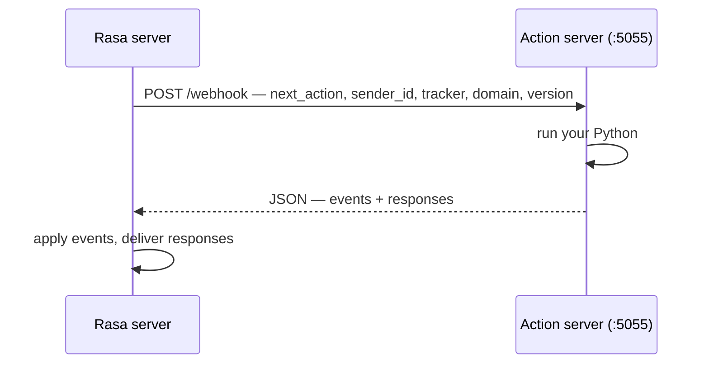

La richiesta porta il nome dell'action da eseguire (`next_action`), l'identificatore della conversazione (`sender_id`), lo stato completo del tracker, il domain, e un campo di versione. L'action server deve rispondere con del JSON che porta due liste: `events` (cambiamenti di stato, l'oggetto del [Capitolo 5](#chapter-5--events-how-actions-change-the-conversation)) e `responses` (messaggi per l'utente).[^4] La forma è tutto ciò che è fissato, e questo ha una conseguenza che vale la pena enunciare: **qualsiasi linguaggio potrebbe implementare questo contratto.** L'SDK Python è il default comodo e ufficiale, ma un parco tecnologico poliglotta — middleware Java, un servizio antifrode .NET — potrebbe esporre un action server da qualsiasi stack che risponda a un `POST` HTTP con il JSON corretto.[^4] L'action server non è allora "una cosa di Rasa" ma un servizio che si dà il caso parli il protocollo di Rasa. Questo capitolo usa l'SDK Python in tutto il suo corso.

### 2.2 Due modi per collegarlo: external e in-process

La voce `action_endpoint` in `endpoints.yml` assume una di due forme.[^4][^5]

```yaml
# Form A — external action server
action_endpoint:
  url: "http://localhost:5055/webhook"

# Form B — in-process execution
action_endpoint:
  actions_module: "actions"
```

**La Forma A, external (`url`),** punta Rasa all'action server HTTP autonomo del [§2.1](#21-a-separate-process-and-the-wire-between) — quello avviato con `rasa run actions` e in ascolto su `/webhook` — che esegue il tuo codice di integrazione nel proprio processo, in produzione nel proprio container. Da quella separazione derivano tre proprietà:

- **Isolamento** — il tier delle action può andare in crash o avere leak senza abbattere il motore conversazionale.
- **Scaling indipendente** — il tier delle action scala separatamente dal motore conversazionale.
- **Separazione delle credenziali** — la proprietà decisiva per la sicurezza. Immagina un'action che chiama una API di backend con un token segreto: con un server external, quel token viene iniettato solo nell'ambiente dell'action server, e non entra mai affatto nel processo di Rasa.[^5][^6]

**La Forma B, in-process (`actions_module`),** esegue le stesse classi di action *all'interno* del processo del Rasa server; il valore è il pacchetto importabile, per convenzione `actions`. Qui non c'è un secondo server né alcun salto di rete. Il contratto di events-and-responses del [§2.1](#21-a-separate-process-and-the-wire-between) descrive ancora cosa un'action riceve e restituisce, ma ora Rasa invoca l'action come una chiamata diretta in-process anziché come una richiesta HTTP. Costa meno latenza, elimina un processo da gestire, ed è il default per lo sviluppo — i template di progetto generati dallo scaffold arrivano esattamente con `actions_module: "actions"` e nessun `url`.[^5] Due punti meccanici. Se **entrambe** le chiavi sono presenti, vince `actions_module` — le due si escludono a vicenda e la forma in-process ha la priorità.[^5] E il compromesso è lo specchio del punto di forza della Forma A: quando le action vengono eseguite all'interno di Rasa, il processo di Rasa ha bisogno delle stesse credenziali che le action usano, il che alza l'asticella per mettere in sicurezza quell'ambiente.[^5]

Dove finiscono le credenziali è la differenza:

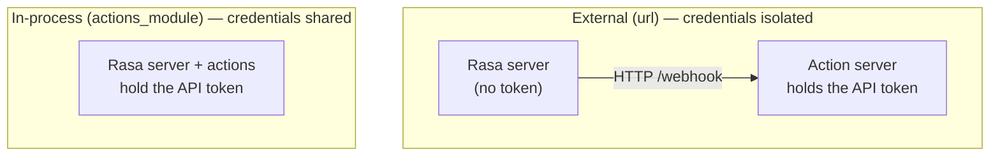

La scelta tra le due forme non è quindi una fase del progetto ma una decisione di sicurezza e di operatività: il collegamento in-process compra minore latenza e un processo in meno da gestire, al costo di concentrare le credenziali nell'ambiente di Rasa; il collegamento external compra l'isolamento, lo scaling indipendente e la separazione delle credenziali descritti sopra, al costo di gestire un secondo servizio. I template dello scaffold partono in-process, il che si adatta bene al lavoro iniziale — nel momento in cui entrano in gioco vere credenziali di backend, il compromesso di cui sopra è l'argomento da soppesare. Come la forma external venga distribuita in produzione è un argomento di una lezione successiva.

### 2.3 Un unico pacchetto, allineato (pinned) con Rasa

L'action server risiede in `rasa-sdk`, un pacchetto distinto da Rasa Pro stesso. La disciplina pratica è l'ordinaria igiene delle dipendenze: i due si seguono per **parità di major.minor** — `rasa-sdk` 3.17.x insieme a Rasa Pro 3.17.x — quindi fissa (pin) entrambi esplicitamente e aggiornali insieme invece di lasciare che uno vada avanti rispetto all'altro.

### 2.4 Il ciclo di sviluppo

Le custom action risiedono in una directory `actions/` alla radice del progetto; il modulo di default è `actions`, quindi o `actions/actions.py` o un pacchetto con `actions/__init__.py`, e si può indicare una posizione diversa con il flag `--actions`.[^3]

Come vengono *scoperte* (discovered)? Non c'è alcun passo di scansione né alcuna chiamata di registrazione: la discovery è l'ordinario caricamento di moduli Python, eseguito una sola volta all'avvio, da qualunque processo effettivamente esegua le action.

- **In-process** (`actions_module`): quando il *Rasa server* si avvia, importa il modulo configurato — per convenzione il pacchetto `actions` — e ogni sottoclasse di `Action` definita lì diventa eseguibile.
- **External** (`url`): l'import è lo stesso, ma avviene nel processo dell'*action server* stesso quando **quest'ultimo** si avvia — `rasa run actions` carica `actions.py`, o il pacchetto, o qualunque cosa `--actions` indichi. Il Rasa server non importa mai il codice remoto delle action.

Ciò che collega i due processi è un *nome*, non il codice. Il Rasa server conosce un'action solo come la stringa registrata nella lista `actions:` del domain; per eseguirne una remota, invia quella stringa (`next_action`) nel POST a `/webhook`, e l'action server instrada la richiesta verso qualunque classe caricata il cui `name()` la restituisca. Nulla viene "scoperto" attraverso la rete — registra il nome nel domain, e assicurati che il processo che esegue le action possa importare una classe che risponda a quel nome.[^3][^4]

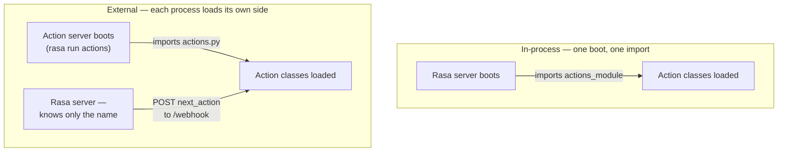

Il ciclo in cui lavori:

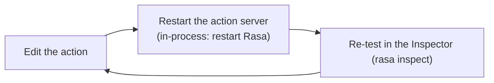

Non esiste **hot reload.** In-process, dopo aver modificato il codice di un'action devi riavviare l'assistente perché il cambiamento abbia effetto.[^5] Un action server external è uguale per costruzione — importa il tuo modulo una sola volta all'avvio — quindi una modifica implica comunque un riavvio. Saltalo e la modalità di fallimento è testare codice stantìo (stale): dare la caccia a un bug che è già stato corretto.

---

## Capitolo 3 — Anatomia di una custom action

Una custom action è una singola classe Python con tre obblighi — un `name`, un `run`, e una registrazione nel domain — e sbagliare uno qualsiasi dei tre è dove atterrano la maggior parte degli errori dei principianti.

### 3.1 Lo scheletro, e gli obblighi che contiene

Una custom action è una classe Python con tre obblighi, e nulla di più — nessun decoratore, nessuna chiamata di registrazione.[^8]

```python
from typing import Any, Text, Dict, List
from rasa_sdk import Action, Tracker
from rasa_sdk.executor import CollectingDispatcher

class MyCustomAction(Action):

    def name(self) -> Text:
        return "action_name"

    def run(
        self, dispatcher: CollectingDispatcher,
        tracker: Tracker, domain: Dict[Text, Any],
    ) -> List[Dict[Text, Any]]:
        return []
```

Leggila obbligo per obbligo:

- **È una sottoclasse di `rasa_sdk.Action`.** Quella relazione di sottoclasse *è* il contratto del framework — e tutto viene importato da `rasa_sdk`, non da `rasa`, il che riflette il pacchetto separato del [Capitolo 2](#chapter-2--the-action-server-where-python-runs).
- **`name()` restituisce una stringa**, e quella stringa vive in tre posti: il valore di ritorno del metodo, la lista `actions:` in `domain.yml`, e lo step `- action:` di un flow (in `flows.yml`, o in qualunque file di flow sotto la directory dei dati).[^8][^2]
- **`run()` riceve tre handle e restituisce una lista di event.** Il `dispatcher` è il lato di scrittura e il `tracker` il lato di lettura (entrambi nel [Capitolo 4](#chapter-4--tracker-and-dispatcher-reading-state-speaking-back)); gli event restituiti sono i cambiamenti di stato ([Capitolo 5](#chapter-5--events-how-actions-change-the-conversation)). La forma è *leggi lo stato, fai il lavoro, restituisci gli event*. L'argomento `domain` porta il domain dell'assistente come dict, che un'action legge raramente.

`run` può anche essere una coroutine: `async def run` è supportato e si adatta al lavoro I/O-bound come attendere (await) una chiamata API — anche se non è obbligatorio, e il primo esempio qui sotto è un `def` ordinario.[^8]

La regola un-nome-tre-posti è dove atterrano la maggior parte degli errori dei principianti:

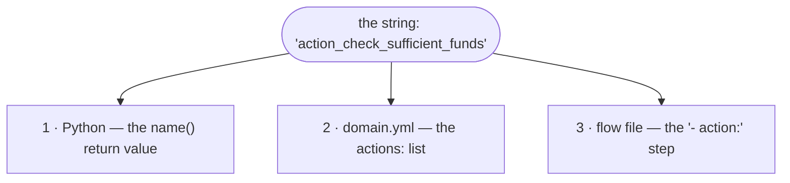

La stringa restituita da `name()` deve essere la stessa stringa registrata nella lista `actions:` del domain (`domain.yml`) e referenziata nello step `- action:` di un flow. Un'action che non è in quella lista `actions:` non può essere eseguita affatto.[^2] Un *disallineamento* del nome — poniamo un `name()` Python di `action_execute_payment` contro un flow che chiama `execute_payment` — non è un errore bloccante quando il modello viene addestrato; a runtime il FlowPolicy annulla il flow in corso e innesca il `pattern_internal_error` integrato ([§1.3](#13-conversation-patterns-the-system-flows-that-run-them)), il cui comportamento a runtime è esaminato dal [Capitolo 6](#chapter-6--calling-the-outside-world-safely). Può essere colto in anticipo con `rasa data validate`; la difesa duratura è una convenzione di denominazione applicata a mano.

### 3.2 Primo esempio svolto: il controllo dei fondi sufficienti

Immagina un assistente bancario che presidia un trasferimento di denaro: prima di lasciare che il trasferimento vada a buon fine, deve confermare che il conto disponga di fondi sufficienti. L'action più piccola che svolge comunque un lavoro reale è esattamente quel presidio — il controllo dei fondi sufficienti del tutorial ufficiale:[^7]

```python
from rasa_sdk.events import SlotSet  # event class, beyond the skeleton's three imports

class ActionCheckSufficientFunds(Action):

    def name(self) -> Text:
        return "action_check_sufficient_funds"

    def run(self, dispatcher: CollectingDispatcher,
            tracker: Tracker,
            domain: Dict[Text, Any]) -> List[Dict[Text, Any]]:
        balance = 1000  # hard-coded for the example; a real one fetches this
        transfer_amount = tracker.get_slot("amount")
        has_sufficient_funds = transfer_amount <= balance
        return [SlotSet("has_sufficient_funds", has_sufficient_funds)]
```

`SlotSet` — l'event che scrive un valore di slot, e la prima delle classi di event del [Capitolo 5](#chapter-5--events-how-actions-change-the-conversation) a comparire — viene importato da `rasa_sdk.events`, un quarto import oltre ai tre dello scheletro. L'action viene poi registrata nel domain (`domain.yml`):[^2]

```yaml
actions:
  - action_check_sufficient_funds
```

e chiamata da un flow che ramifica in base al suo risultato:[^7]

```yaml
- action: action_check_sufficient_funds
  next:
    - if: not slots.has_sufficient_funds
      then:
        - action: utter_insufficient_funds
          next: END
    - else: final_confirmation
```

Nota quanto sia ristretta la responsabilità dell'action. Non invia messaggi all'utente, non decide cosa succede quando i fondi sono insufficienti, e non termina né reindirizza il flow: calcola esattamente un fatto — se i fondi siano sufficienti — e lo restituisce come event. Ogni conseguenza conversazionale di quel fatto vive nello YAML del flow. Un blocco `next:` valuta le sue condizioni dall'alto verso il basso e prende la prima che corrisponde, quindi `not slots.has_sufficient_funds` seleziona il ramo dei fondi insufficienti, ed `else:` è il caso di ricaduta (fallthrough) quando i fondi sono adeguati. In un'integrazione reale il `balance = 1000` hard-coded diventa una chiamata al backend — l'oggetto del [Capitolo 6](#chapter-6--calling-the-outside-world-safely).

### 3.3 La regola di progettazione: separare la decisione dal lavoro

Rasa enuncia questa regola come "tieni la logica fuori dalle custom action e dentro i flow,"[^6] ma la formulazione è facile da fraintendere — un metodo `run()` pieno di calcoli è comunque logica di business. La versione precisa è una divisione a **responsabilità singola** (single-responsibility): un flow e una custom action possiedono ciascuno un *tipo diverso* di logica di business, e la disciplina è impedire che l'uno tracimi nell'altro.

- **Il flow possiede la logica di decisione** — l'orchestrazione: quale domanda viene dopo, quale ramo prende un risultato, quando confermare, quando abortire. Questo è il control flow della conversazione, e vive nello YAML.
- **L'action possiede la logica di esecuzione** — il lavoro grezzo dietro un singolo fatto: un fetch da API, una lettura da database, un calcolo. Riporta quel fatto come event e si ferma lì.

Quindi un'action *sì* che porta logica di business; ciò che non deve portare è la **decisione conversazionale** che appartiene al flow. Il test per stabilire dove appartiene una ramificazione è se sia *lavoro* o *decisione*: un `if` i cui rami portano a esiti conversazionali diversi appartiene al blocco `next:` del flow, mentre un `if` che gestisce una risposta API malformata resta in Python — quello è lavoro (gestire un payload errato), non decisione (scegliere il percorso della conversazione).

Il motivo per cui questa divisione conta in un contesto regolamentato: **la ramificazione che vive nello YAML è revisionabile da un process owner e testabile da una suite automatica; la ramificazione sepolta in Python non è né l'uno né l'altro.** Quando un responsabile compliance chiede cosa succede se un trasferimento supera il limite giornaliero, la risposta dovrebbe essere tre righe leggibili di YAML di flow, confrontabili (diffable) nella storia del repository — non uno scavo archeologico attraverso catene di `if`/`else`. Un'action che decide silenziosamente di saltare una conferma o di inviare un messaggio diverso ha spostato una *decisione di business* fuori dal livello verificabile (auditable).

### 3.4 Domande dinamiche: la convenzione `action_ask_<slot>`

Uno step `collect` normalmente trova la sua domanda per nome: per `- collect: account_type`, Rasa cerca una response `utter_ask_account_type` in `domain.yml` e la invia.[^12] Esiste una controparte lato action per quando la domanda deve essere **calcolata** anziché scritta in anticipo — per esempio, chiedere "quale conto?" solo dopo aver recuperato i conti reali del cliente dal backend, così che le opzioni possano essere mostrate come bottoni ([Capitolo 4](#chapter-4--tracker-and-dispatcher-reading-state-speaking-back)). Se esiste una custom action registrata nel domain di nome `action_ask_<slot_name>`, lo step `collect` chiama *quella* invece della response statica.

Il collegamento si estende su tre file, e lo step `collect` stesso non cambia mai:

```yaml
# flows.yml — identical whether the question is a response or an action
- collect: account_type
```

```yaml
# domain.yml — registering action_ask_account_type is the whole switch
actions:
  - action_ask_account_type
```

```python
# actions.py — an action whose name() matches action_ask_<slot>
class ActionAskAccountType(Action):

    def name(self) -> Text:
        return "action_ask_account_type"

    def run(self, dispatcher, tracker, domain):
        accounts = fetch_accounts(tracker.sender_id)   # the raw work
        buttons = [{"title": a, "payload": a} for a in accounts]
        dispatcher.utter_message(text="Which account?", buttons=buttons)
        return []
```

La convenzione è risolta da una ricerca per nome a runtime, non da una qualche dichiarazione. Quando lo step `collect` per `account_type` viene eseguito, Rasa cerca un'action registrata nel domain di nome `action_ask_account_type`; se ne trova una, la esegue, altrimenti invia la response `utter_ask_account_type`. Registrare l'action è quindi l'intero opt-in — nulla nel flow registra che una domanda calcolata fosse *voluta*. Questa è anche la debolezza del meccanismo: poiché non esiste alcuna dichiarazione rispetto a cui la validazione in fase di training possa controllare il nome, un `action_ask_<slot>` non registrato o scritto male non solleva alcun errore quando il modello viene addestrato. La lacuna emerge solo a runtime, quando lo step collect non ha nulla con cui porre la domanda: il FlowPolicy annulla il flow e innesca `pattern_internal_error` ([§1.3](#13-conversation-patterns-the-system-flows-that-run-them)). Solo l'errore opposto viene colto in anticipo — definire *sia* una response *sia* una custom action per lo stesso step collect è un errore di validazione in fase di training.[^12]

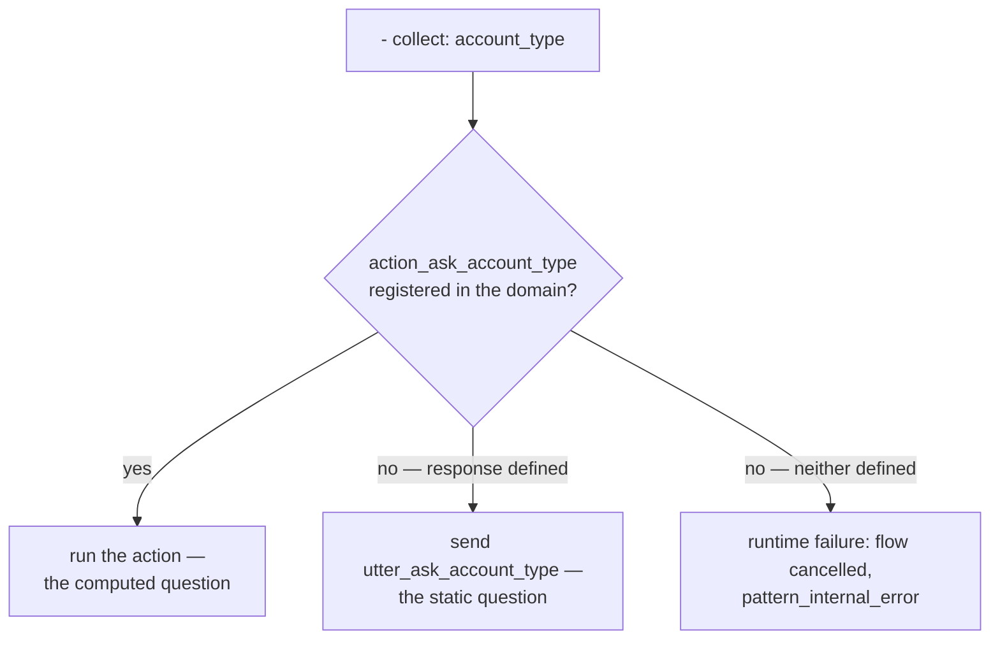

---

## Capitolo 4 — Tracker e dispatcher: leggere lo stato, rispondere

Ogni action possiede due handle. Il **tracker** è il lato di lettura — lo stato completo della conversazione, consegnato con la richiesta. Il **dispatcher** è il lato di scrittura — tutto ciò che l'utente vedrà. La divisione è *tracker in ingresso, dispatcher in uscita.*

### 4.1 Tracker: il lato di lettura

Il tracker che un'action riceve è lo stesso stato di conversazione che il dialogue manager mantiene, non una copia rielaborata.[^10] I suoi membri, all'incirca nell'ordine di quanto spesso un'action vi attinge:[^10]

- **`tracker.get_slot("amount")`** — il cavallo da tiro; quasi ogni action di integrazione inizia leggendo uno slot che il flow ha già raccolto.
- **`tracker.slots`** — l'intera mappa degli slot come dict, per leggere più valori in una volta.
- **`tracker.sender_id`** — l'identificatore univoco della conversazione, che fa da chiave per il lavoro per-cliente; un'action lo usa per isolare i dati di una conversazione da quelli di un'altra.
- **`tracker.latest_message`** — un dict degli attributi dell'ultimo messaggio dell'utente, incluso `text`, per la rara action che ha bisogno delle parole grezze anziché di uno slot raccolto.
- **`tracker.events`** — la storia completa degli event. Un'action che ragiona sulla storia grezza per decidere cosa fare sta quasi sempre facendo il lavoro di un flow (la regola del [§3.3](#33-the-design-rule-separate-decision-from-work)); gli usi legittimi sono ristretti, come riassumere una trascrizione per un passaggio a un operatore umano, e anche quello è *lavoro*, non *logica*.

Un'action può anche leggere il **dialogue stack** attraverso `tracker.stack` — lo stesso stack LIFO di flow attivi che l'Inspector mostra. Espone, per esempio, un controllo del saldo che divaga sopra un trasferimento a metà:

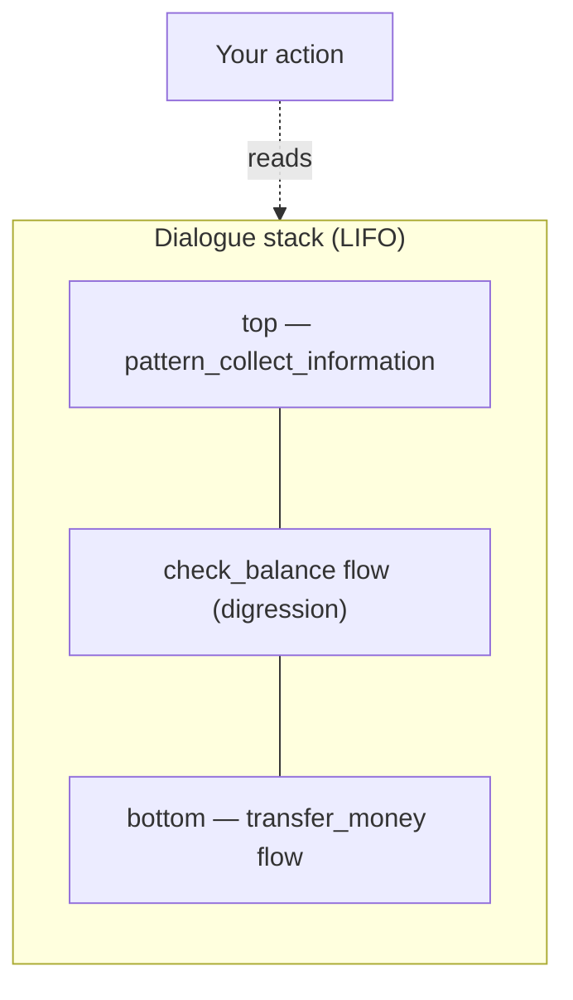

Vedere lo stack dall'interno della giuntura è occasionalmente utile; *agire* su di esso da Python è raramente appropriato, perché decidere cosa fa la conversazione successivamente è compito di un flow. Le tre righe che un'action scrive effettivamente più spesso:

```python
transfer_amount = tracker.get_slot("amount")      # the workhorse
conversation    = tracker.sender_id               # keys per-conversation work
user_text       = tracker.latest_message.get("text")  # raw text, rarely needed
```

### 4.2 Dispatcher: il lato di scrittura

Il dispatcher è un `CollectingDispatcher`, e il suo unico metodo, `utter_message()`, raccoglie i messaggi da rimandare indietro:[^9]

```python
# Plain text
dispatcher.utter_message(text="Hey there")

# Named response from the domain, with variable interpolation
dispatcher.utter_message(response="utter_greet_name", name="Aimee")

# Buttons — each button dict needs 'title' and 'payload'
dispatcher.utter_message(buttons=[
    {"title": "Yes", "payload": "/affirm"},
    {"title": "No",  "payload": "/deny"},
])

# Channel-specific custom JSON payload
dispatcher.utter_message(json_message=date_picker)
```

La chiamata `response=` ha un altro lato — il template con nome che riempie, dichiarato in `domain.yml`:

```yaml
# domain.yml
responses:
  utter_greet_name:
    - text: "Hey, {name}. How are you?"
```

Il segnaposto `{name}` viene riempito dal keyword `name="Aimee"` passato a `utter_message`; in assenza di quel keyword, Rasa riempie `{name}` da uno slot con lo stesso nome, o con `None` se tale slot non esiste.[^18]

Tra `text=` e `response=`, preferisci **`response=`** ogni volta che la formulazione è rivolta al cliente. Il motivo è la governance più che l'estetica: la formulazione che vive in `domain.yml` si trova in un unico posto revisionabile e traducibile, mentre la formulazione incorporata in Python è invisibile a chi possiede la voce dell'assistente. Concretamente, se il responsabile delle comunicazioni della banca decide che il saluto dovrebbe suonare diversamente, la versione `response=` è una modifica YAML di una riga che può trovare, revisionare e confrontare (diff) nella storia del repository; la versione `text=` è una modifica al corpo di un'action di cui potrebbe persino non sapere l'esistenza. La stessa proprietà del posto-unico è ciò che permette a una passata di traduzione di trovare ogni stringa rivolta al cliente.

I bottoni presentano scelte vincolate, e il `payload` di un bottone viene inviato all'assistente come messaggio successivo dell'utente quando il bottone viene cliccato. Un payload che inizia con `/` viene elaborato in modo deterministico invece di essere letto dal language model, e sono documentate due grammatiche.[^18] La forma `/SetSlots(slot=value)` emette direttamente un comando di set-slot, ed è per questo che un bottone è tra i pochi scrittori che uno slot *controlled* accetta (una garanzia su cui il [Capitolo 5](#chapter-5--events-how-actions-change-the-conversation) ritorna). I `/affirm` e `/deny` nell'esempio sopra sono l'altra grammatica, `/intent_name`: il messaggio viene classificato in modo deterministico come quell'intent (`affirm`, `deny`), aggirando del tutto l'interpretazione — una scorciatoia ereditata dagli assistenti dell'era NLU di Rasa, che la documentazione dell'SDK usa ancora nei suoi esempi. In un assistente CALM, dove i flow ramificano sugli slot anziché sugli intent, `/SetSlots` è normalmente la forma a cui ricorrere. `json_message`, infine, porta forme specifiche del canale che un widget web può renderizzare, e passare più argomenti insieme produce un unico messaggio ricco (rich message).[^9]

Un bug da evitare — enunciato qui, e più chiaro una volta che gli event arrivano nel [Capitolo 5](#chapter-5--events-how-actions-change-the-conversation): il `run()` di un'action restituisce una lista di *event*, registrazioni di cambiamento di stato della conversazione, e Rasa registra già da sé ogni messaggio inviato tramite il dispatcher come un event di questo tipo (un `BotUttered`). Un messaggio inviato tramite dispatcher non deve quindi *anche* essere restituito da `run()` — la chiamata al dispatcher è la sua registrazione completa.[^9]

### 4.3 Disciplina dell'output

Un vincolo governa il lato di scrittura: **qualunque cosa il dispatcher invii è visibile al cliente, e chi possiede l'assistente ne risponde.** Nessun identificatore interno, nessuno stack trace, nessun corpo di errore proveniente dall'upstream. La pagina HTTP 500 di una API di backend non deve mai raggiungere una bolla di chat — un messaggio di eccezione può far trapelare hostname, nomi di tabelle, persino credenziali. Questo ha un nome nella letteratura sulla sicurezza, *insecure output handling*, e il dispatcher è il tubo attraverso cui fluirebbe. La regola è semplice: invia (dispatch) solo testo templated dal domain e appropriato per il cliente.

---

## Capitolo 5 — Event: come le action cambiano la conversazione

Un'action restituisce una lista di **event**, e gli event sono l'*unico* modo in cui il suo lavoro rientra nella conversazione. La divisione è netta: il dispatcher parla all'utente, gli event parlano allo stato. Ogni classe di event viene importata da `rasa_sdk.events`.[^11]

### 5.1 `SlotSet` e l'idioma di integrazione

`SlotSet(key, value)` scrive un valore in uno slot con nome.[^11] È l'event dietro l'idioma canonico di integrazione di CALM — combinalo con uno slot che il modello non può contraffare e un flow che ramifica in base al risultato:

> **L'action recupera (fetch), uno slot porta il risultato, il flow ramifica in base ad esso.**

Lo slot al centro dovrebbe essere **controlled**, e uno slot controlled viene dichiarato in `domain.yml`:[^1]

```yaml
# domain.yml
slots:
  has_sufficient_funds:
    type: bool
    mappings:
      - type: controlled
```

Uno slot il cui mapping è `controlled` può essere impostato solo da un'action, dal payload di un bottone, o da uno step `set_slots`, e — quando `controlled` è il suo unico mapping — *non* è disponibile a essere riempito dall'NLU o dall'LLM.[^1] Questo è il confine di fiducia (trust boundary): il language model non può mai *dichiarare* un saldo di €12.000; solo la chiamata al backend può impostare quel valore. (Mantieni `controlled` come *unico* mapping dello slot dove la garanzia conta; mescolarlo con altri tipi di mapping riapre la porta al riempimento probabilistico.[^1])

Con lo slot al suo posto, i tre pezzi si incontrano. L'**action recupera** — lavoro grezzo in Python, il lato di esecuzione della divisione del [§3.3](#33-the-design-rule-separate-decision-from-work). Lo **slot porta** il risultato. Il **flow ramifica** in base allo slot nei suoi predicati `next:`, secondo la divisione del lavoro di CALM — il modello comprende, i flow decidono, le action fanno.

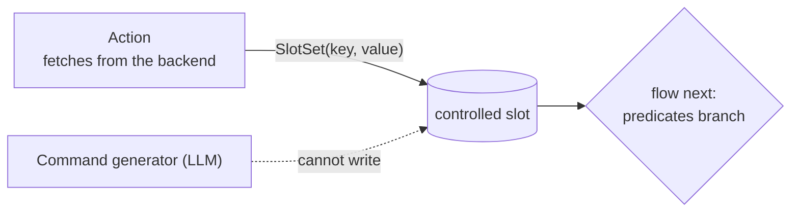

Il controllo dei fondi sufficienti del [§3.2](#32-first-worked-example-the-sufficient-funds-check) *è* questo idioma: `has_sufficient_funds` è un bool controlled, l'action restituisce `SlotSet("has_sufficient_funds", …)`, e il flow ramifica in base a `slots.has_sufficient_funds`.[^7]

Un esito non è sempre binario. Quando un'action può concludersi in diversi modi, lo slot che porta il risultato contiene una *stringa di esito* e il flow ramifica una volta per ogni esito:

```yaml
# in a flow file — branch once per outcome string
- action: action_check_transfer
  next:
    - if: slots.transfer_status = "success"
      then:
        - action: utter_transfer_done
          next: END
    - if: slots.transfer_status = "not_found"
      then:
        - action: utter_account_not_found
          next: END
    - else:
        - action: utter_service_down
          next: END
```

Ogni `if:` è un predicato sul namespace `slots.`, e `=` — uguaglianza — è uno degli operatori di un piccolo vocabolario fisso: i confronti (`=`, `!=`, `>`, `>=`, `<`, `<=`), i connettivi logici (`and`, `or`, `not`), l'identità (`is`, `is not`), l'appartenenza (`contains`), e il matching con espressioni regolari (`matches`), con i letterali di stringa tra virgolette e gli slot sempre raggiunti attraverso il prefisso `slots.`.[^19] I rami vengono provati dall'alto verso il basso, vince la prima corrispondenza, ed `else:` è il caso di ricaduta (fallthrough).[^12]

### 5.2 Il resto del cast

Gli altri event che un'action può restituire, con i loro ruoli:[^11]

| Classe | Effetto | Scenario tipico |
|---|---|---|
| `AllSlotsReset` | Cancella ogni slot — brutale | Azzerare lo stato alla fine di un task circoscritto alla sessione |
| `SessionStarted` | Segna l'inizio di una nuova sessione | All'interno di una sovrascrittura custom di `action_session_start` |
| `SessionEnded` | Segna una sessione come terminata | Chiudere la sessione dopo un logout esplicito |
| `ConversationPaused` / `ConversationResumed` | Ferma / riavvia le risposte del bot | Parcheggiare una conversazione durante un passaggio a un operatore umano, poi riprenderla |
| `Restarted` | Resetta interamente il tracker, nessuna storia conservata | Un "ricomincia da capo" netto che non porta avanti nulla |
| `FollowupAction(name)` | Forza l'esecuzione di una specifica action come successiva, aggirando la previsione | Una action successiva genuinamente determinata a runtime |

Questi event vengono restituiti da Python, mai dichiarati in YAML — un'action li emette elencandoli nel suo `return`:

```python
from rasa_sdk.events import AllSlotsReset, FollowupAction

return [AllSlotsReset(), FollowupAction("action_say_goodbye")]
```

`FollowupAction` merita una cautela. È una *sovrascrittura imperativa*, e combatte contro il modello *dichiarativo* dei flow — "cosa succede dopo" è esattamente ciò che i flow esistono per esprimere. Due di questi event hanno effettivamente una controparte dichiarativa nei flow, e dove ne esiste una il flow è lo strumento migliore: un `SlotSet` corrisponde a uno step `set_slots:`, e un `FollowupAction` all'ordinario routing `next:`.[^12] Quindi preferisci la ramificazione tramite flow; riserva `FollowupAction` al caso genuinamente determinato a runtime, che è raro.

---

## Capitolo 6 — Chiamare il mondo esterno, in sicurezza

Qui la disciplina del confine di integrazione diventa codice. L'happy path è Python ordinario — `requests` o `httpx` contro la API di backend. La sostanza è tutto ciò che sta *attorno* ad esso: ogni riga sotto gli import è una decisione deliberata.

```python
import os
import requests
from rasa_sdk import Action, Tracker
from rasa_sdk.executor import CollectingDispatcher
from rasa_sdk.events import SlotSet

class ActionFetchBalance(Action):

    def name(self) -> str:
        return "action_fetch_balance"

    def run(self, dispatcher: CollectingDispatcher,
            tracker: Tracker, domain: dict) -> list:
        api_base = os.environ.get("BACKEND_API_URL")
        token    = os.environ.get("BACKEND_API_TOKEN")
        account  = tracker.get_slot("account_id")

        try:
            resp = requests.get(
                f"{api_base}/v1/accounts/{account}/balance",
                headers={"Authorization": f"Bearer {token}"},
                timeout=5,
            )
            resp.raise_for_status()
            balance = resp.json()["balance"]
            return [
                SlotSet("current_balance", balance),
                SlotSet("balance_fetch_ok", True),
            ]
        except requests.RequestException:
            return [SlotSet("balance_fetch_ok", False)]
```

`current_balance` e `balance_fetch_ok` sono entrambi slot controlled — l'idioma di integrazione del [§5.1](#51-slotset-and-the-integration-idiom), applicato due volte. Il listato codifica tre discipline.

### 6.1 Le credenziali dall'ambiente, e da nessun'altra parte

Le credenziali provengono da `os.environ` — l'unico posto da cui possono provenire. Tre regole, applicabili in code review. **Mai come letterali nel sorgente:** un token committato su git è un token trapelato per sempre. **Mai scritte nei log.** **Mai in nessun posto che un prompt possa raggiungere** — una credenziale nel contesto del modello è una credenziale che può trapelare attraverso l'output del modello, quindi tieni i segreti fuori dagli slot, fuori dalle istruzioni, fuori da qualsiasi cosa il command generator veda.

Rasa modella la stessa igiene al livello della configurazione: i valori in `endpoints.yml` usano la sintassi con segnaposto `${ENV_VAR}` anziché letterali, e in produzione i segreti vengono iniettati nell'ambiente del container anziché incorporati (baked) nell'immagine.[^6] È qui che l'argomento della separazione delle credenziali del [§2.2](#22-two-ways-to-wire-it-external-and-in-process) dà i suoi frutti: con un action server **external**, `BACKEND_API_TOKEN` esiste solo in quel container — il Rasa server, gli artefatti del modello, e i prompt dell'LLM non lo contengono mai.

### 6.2 Timeout: la chiamata in uscita deve essere quella breve

La seconda disciplina è l'argomento `timeout=5` che l'action di fetch del saldo passa a `requests.get(...)`. Dice alla libreria `requests` di aspettare al massimo 5 secondi che il backend risponda, e di sollevare un'eccezione anziché rimanere appesa se non lo fa. Il valore è tuo, non del framework: non c'è nulla di magico nel 5 oltre a "abbastanza breve perché un backend appeso fallisca rapidamente su un canale interattivo," e Rasa non espone alcuna chiave di configurazione per esso, quindi l'unico posto per delimitare la chiamata in uscita è il codice stesso dell'action.

Perché deve essere la miccia *più corta* della catena: la pazienza di Rasa stessa verso un action server è lunga — per default il motore aspetta circa cinque minuti (300 secondi) che l'action endpoint risponda (una costante hardcoded, `DEFAULT_REQUEST_TIMEOUT`, non un'impostazione di `endpoints.yml`); e il canale REST rivolto all'utente porta un proprio timeout di risposta, più breve (circa 60 secondi), quindi un cliente su un canale interattivo di solito incontra prima quello. In entrambi i casi il fallimento è lento a meno che la chiamata in uscita non sia quella breve:

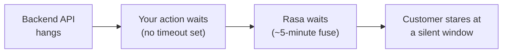

Senza un timeout sulla chiamata in uscita l'intera catena rimane appesa: la API rimane appesa, l'action rimane appesa, la risposta dell'action server non arriva mai, Rasa aspetta sulla sua miccia di diversi minuti, e il cliente osserva una finestra silenziosa.

La correzione è un unico keyword argument, impostato in Python dove viene fatta la chiamata — `requests` e `httpx` lo accettano entrambi:

```python
resp = requests.get(url, timeout=5)   # 5 seconds; httpx.get(url, timeout=5.0) is the same idea
```

Non c'è alcuna manopola YAML a cui ricorrere in alternativa: `endpoints.yml` configura *dove* si trova l'action server (`action_endpoint.url`), non quanto a lungo un'action può impiegare. La regola: **ogni chiamata in uscita porta un timeout esplicito e breve**, così che un backend appeso degradi in un fallimento pulito nel giro di secondi.

### 6.3 Fallire in modo pulito: il percorso gestito e quello non gestito

Ci sono due storie di fallimento, e sono distinte.

**Il fallimento gestito.** Il ramo `except requests.RequestException` cattura i fallimenti attesi — connessione rifiutata, timeout, errore HTTP — e restituisce `SlotSet("balance_fetch_ok", False)`. Il flow instrada poi verso un unhappy path *progettato*: una scusa pulita, templated dal domain, magari un'offerta di riprovare. Il cliente sperimenta una degradazione cortese e la conversazione sopravvive. La forma segue la divisione del [§3.3](#33-the-design-rule-separate-decision-from-work) — l'action riporta il *fatto* del fallimento, il *flow* decide cosa significa:

```yaml
- action: action_fetch_balance
  next:
    - if: slots.balance_fetch_ok
      then:
        - action: utter_current_balance
          next: END
    - else:
        - action: utter_balance_service_down
          next: END
```

**Il fallimento non gestito.** Se `run()` solleva un'eccezione che *non* hai catturato — e il listato sopra ha un percorso di questo tipo: una risposta `200` il cui JSON non porta alcuna chiave `"balance"` solleva un `KeyError`, che non è un `RequestException` e scivola oltre l'`except` — l'SDK risponde a Rasa con un HTTP 500 e il server tratta l'action come fallita; lo stesso accade se l'action server è irraggiungibile o non risponde mai.[^14] Nel log di Rasa questo emerge come una riga tipo *"Failed to run custom action … Action server responded with a non 200 status code"*, o, quando il server è giù, *"Couldn't connect to the server … Is the server running?"*.[^14] Il framework innesca poi il pattern integrato **`pattern_internal_error`**, il cui ramo di default pronuncia `utter_internal_error_rasa`: *"Sorry, I am having trouble with that. Please try again in a few minutes."*[^13]

Quella scusa generica è l'esperienza del cliente per *ogni* eccezione non catturata — un bug nel tuo codice o un backend morto, indistinguibili l'uno dall'altro e fuori tono rispetto al brand. La conversazione non viene abbandonata silenziosamente, ma nemmeno viene gestita con grazia. Prendere il controllo di esattamente ciò che il cliente legge — un `pattern_internal_error` personalizzato, i retry, un passaggio a un operatore — è un argomento di una lezione successiva; la disciplina di *questa* lezione è catturare i fallimenti che puoi prevedere e trasformarli in uno slot su cui il flow può ramificare.

### 6.4 La giuntura, end to end

Fai un passo indietro e il capitolo è un'unica immagine — una singola richiesta che attraversa la giuntura e torna indietro come una ramificazione:

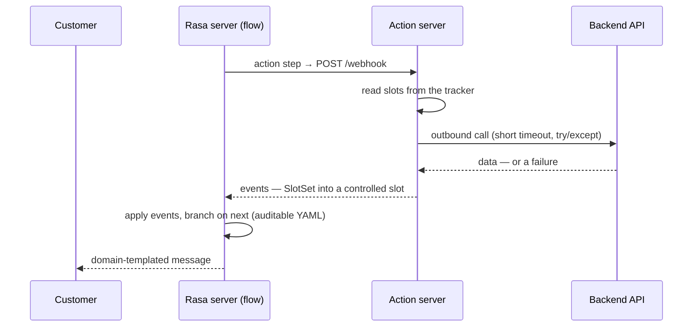

Letto dall'alto verso il basso: un flow raggiunge uno step `action` e Rasa invia (post) attraverso la giuntura; l'action legge ciò che le serve dal tracker, fa il suo lavoro grezzo dietro un timeout breve e un `try`/`except`, e restituisce un `SlotSet` in uno slot controlled che il modello non può contraffare; Rasa applica gli event, il flow ramifica in YAML verificabile (auditable), e qualsiasi messaggio che il cliente vede è provenuto da un template del domain revisionato.

Tutto ciò che è decisivo avviene in codice deterministico e flow dichiarati, *al di fuori* del modello: privilegio minimo (least privilege), isolamento dei segreti, un timeout breve, e un percorso di fallimento pulito. È questo che rende le parole di un modello sicure da trasformare in azioni reali e consequenziali.

---

## Further reading

- **[Writing Custom Actions](https://rasa.com/docs/pro/build/custom-actions/) — Rasa Pro documentation.** The source of the "Keep Logic Out of Custom Actions and Inside Flows" rule and the in-process `actions_module` configuration, with the credential and security trade-offs of each wiring form.
- **[Running the Action Server](https://rasa.com/docs/reference/integrations/action-server/running-action-server/) — Rasa documentation.** The `rasa run actions` / `python -m rasa_sdk` launch forms, the `--actions` flag, and the HTTP/gRPC options.
- **[Default actions](https://rasa.com/docs/reference/primitives/default-actions/) — Rasa documentation.** The full set of built-in actions and the override-by-matching-`name()` mechanism the Intro introduces.
- **The `finance` project template (`rasa init --template finance`).** Rasa's own bank-assistant reference: actions organised by business area, a per-conversation mock database, and a real `check_transfer_funds` action that does what [§3.2](#32-first-worked-example-the-sufficient-funds-check)'s stub only gestures at.

---

### Sources

[^1]: **Slots — Rasa documentation (primitives reference).** [rasa.com](https://rasa.com/docs/reference/primitives/slots/). The `controlled` slot mapping: a controlled slot is fillable only by a custom action, a button payload, or a `set_slots` step, and when `controlled` is its sole mapping it is not available to the NLU or LLM; mixing mappings reintroduces probabilistic filling. Backs the controlled-slot declaration YAML.
[^2]: **Custom Actions / Domain — Rasa documentation (reference).** [custom-actions](https://rasa.com/docs/reference/primitives/custom-actions/), [domain](https://rasa.com/docs/reference/config/domain/). Every custom action must be registered under the domain's `actions:` list; an unregistered action cannot run.
[^3]: **Running the Action Server — Rasa documentation.** [rasa.com](https://rasa.com/docs/reference/integrations/action-server/running-action-server/). `rasa run actions` and `python -m rasa_sdk` as two front doors to the same server; the `--actions` flag; the `actions/` package layout; HTTP-default and `--grpc`.
[^4]: **Actions — Rasa Action Server integration.** [rasa.com](https://rasa.com/docs/reference/integrations/action-server/actions/). The request/response JSON contract (`next_action`, `sender_id`, `tracker` including the dialogue `stack`, `domain`, `version` → `events` + `responses`); the `action_endpoint.url` form and the `http://localhost:5055/webhook` example; the language-agnostic contract.
[^5]: **Custom Actions — Rasa documentation (reference primitives).** [rasa.com](https://rasa.com/docs/reference/primitives/custom-actions/). The in-process `actions_module` form; its mutual exclusivity with `url` and the rule that `actions_module` wins if both are set; the higher bar to secure the Rasa environment when actions run in-process; the requirement to restart the assistant after editing action code.
[^6]: **Writing Custom Actions — Rasa Pro documentation.** [rasa.com](https://rasa.com/docs/pro/build/custom-actions/). "Keep Logic Out of Custom Actions and Inside Flows"; the action-fetches-then-flow-branches example; reading credentials from the environment and injecting them into the container.
[^7]: **Rasa Pro Tutorial (money transfer).** [rasa.com](https://rasa.com/docs/pro/tutorial/). The `ActionCheckSufficientFunds` action verbatim (hard-coded `balance = 1000`, reads slot `amount`, returns `SlotSet("has_sufficient_funds", …)`), the `has_sufficient_funds` controlled slot, and the money-transfer flow that branches on it.
[^8]: **Actions — Rasa SDK reference.** [rasa.com](https://rasa.com/docs/reference/integrations/action-server/sdk-actions/). The `Action` base class with required `name()` and `run(self, dispatcher, tracker, domain)`; `run` returns a list of events and may be `async`.
[^9]: **Dispatcher — Rasa SDK reference.** [rasa.com](https://rasa.com/docs/reference/integrations/action-server/sdk-dispatcher/). `CollectingDispatcher.utter_message()` with `text`, `response` (named domain response + kwargs), `buttons` (each needing `title` and `payload`), and `json_message`; multiple arguments yield one rich message; dispatched messages become `BotUttered` events and must not also be returned.
[^10]: **Tracker — Rasa SDK reference.** [rasa.com](https://rasa.com/docs/reference/integrations/action-server/sdk-tracker/). `get_slot`, `slots`, `sender_id`, `latest_message` (a dict including `text`), and `events`.
[^11]: **Events Reference — Rasa Action Server SDK.** [rasa.com](https://rasa.com/docs/reference/integrations/action-server/sdk-events/). `SlotSet`, `AllSlotsReset`, `SessionStarted`, `SessionEnded`, `ConversationPaused`/`ConversationResumed`, `Restarted`, and `FollowupAction`, with their event-type strings and parameters.
[^12]: **Flow Steps — Rasa documentation (primitives reference).** [rasa.com](https://rasa.com/docs/reference/primitives/flow-steps/). The `action` step; the `action_ask_<slot>` convention (the collect step calls the action by name and its YAML is unchanged; a missing action fails at runtime; defining both a response and an action for one collect step is a training-time validation error).
[^13]: **Patterns — Rasa documentation (primitives reference).** [rasa.com](https://rasa.com/docs/reference/primitives/patterns/). `pattern_internal_error` and its default `utter_internal_error_rasa` text, "Sorry, I am having trouble with that. Please try again in a few minutes."
[^14]: **rasa/core/actions/action.py — RemoteAction error handling.** [github.com](https://github.com/RasaHQ/rasa/blob/main/rasa/core/actions/action.py). The non-200 and connection-failure log lines the Rasa server emits when an action endpoint returns an error or is unreachable, and its treatment of a non-200 response as a failed action.
[^15]: **Default actions — Rasa documentation (primitives reference).** [rasa.com](https://rasa.com/docs/reference/primitives/default-actions/). The default actions (`action_listen`, `action_session_start`, and the repair/control family) and their behaviour; overriding a default by writing a custom action whose `name()` returns the same name and registering it in the domain; the `rasa train --force` retrain caveat.
[^16]: **Patterns — Rasa documentation (primitives reference).** [rasa.com](https://rasa.com/docs/reference/primitives/patterns/). The built-in conversation patterns and their default step definitions (`pattern_cancel_flow` runs `action_cancel_flow`; `pattern_session_start` runs `action_session_start`; `pattern_collect_information` runs `action_run_slot_rejections` then `action_listen`; `pattern_internal_error` utters `utter_internal_error_rasa`; `pattern_repeat_bot_messages` runs `action_repeat_bot_messages`); that patterns work out-of-the-box (the pattern flow need not be present in the project to get the default behaviour); and overriding a pattern by defining a flow of the same name.
[^17]: **Conversation patterns — Rasa documentation (concept).** [rasa.com](https://rasa.com/docs/learn/concepts/conversation-patterns/). Conversation patterns as reusable system flows provided by CALM to handle non-linear interactions and repair the conversation, and the category taxonomy — conversation repair, navigation, external support, voice, and system error.
[^18]: **Responses — Rasa documentation (primitives reference).** [rasa.com](https://rasa.com/docs/reference/primitives/responses/). Variable interpolation in a response: a `{variable}` enclosed in curly brackets is filled from a slot of the same name (or with `None` if no such slot exists), or from a keyword argument passed to `dispatcher.utter_message`. Also the two button-payload grammars: a payload in the `/intent{entities}` shorthand is handled deterministically by the `RegexInterpreter` and classified as that intent, skipping interpretation; a `/SetSlots(slot_name=slot_value)` payload (Rasa Pro ≥ 3.9) issues set-slot commands directly.
[^19]: **Conditions — Rasa documentation (primitives reference).** [rasa.com](https://rasa.com/docs/reference/primitives/conditions/). The operators usable in a flow's `next:` predicates — `=` (equality), `!=`, the numeric comparisons, `and`/`or`/`not`, `contains`, `matches` — with string literals enclosed in quotes and slots referenced through the `slots.` namespace.
