# Day 9 — From Process to Rasa Flow
## Student Study Guide

This lesson takes a single customer-facing use case from a sketch on a whiteboard to a working set of Rasa flows. Chapter 1 models a business process — its inputs, outcomes, decision points, actors, and failure branches — and finds the several distinct flows hiding inside one use case. Chapter 2 names the recurring patterns for delegating and composing work — routing, chaining, orchestration with subroutines, human handoff, graph-based control flow, agent-to-agent — and places each on the dial of *who decides the next step*. Chapter 3 turns the process map into a Rasa flow design, where inputs become slots, decision points become branches, and the flow description becomes the natural-language surface the assistant routes on. Chapter 4 composes flows with the two verbs `call` and `link` and the dialogue stack they ride, and guards what the model may start. Chapter 5 designs slot collection as conversation rather than form-filling. Chapter 6 diagnoses why an oversized flow fails and splits it along the seams the map already revealed. Chapter 7, an extra, implements the same use case in a code-first framework, Pydantic AI, to make the declarative choice legible by contrast. The running example throughout is a domestic money transfer. Two adjacent topics are out of scope and named where they belong: the Python of a custom action is built in its own lesson, and orchestrating *several* use cases together — multi-flow architecture, slot scoping, the live-agent handoff — is a later lesson; this lesson stays deliberately on one use case.

---

## Chapter 1 — Modeling a process before you build it

The hard thinking in a conversational feature is not the prompt; it is the **process map**. Everything downstream — slots, branches, actions, tests — falls out of a good map almost mechanically. So the work starts before any framework is chosen: read a business use case into a map of its inputs, outcomes, decisions, and actors, and the Rasa design in the later chapters becomes a transcription rather than an invention.

The use case itself deserves to be stated plainly before any notation touches it:

> A customer opens the bank's chat and asks to send money to another person's account in the same country — *"send 200 euros to Anna."* Before any money moves, the assistant must establish that the customer is who they claim to be; learn who the recipient is and how much to send; check that the transfer can happen at all — the recipient is valid, the funds are sufficient, the amount is within the customer's limits; obtain an explicit confirmation, because moving money is irreversible; and only then have the core-banking system execute the transfer and report the outcome. When any check — or the execution itself — fails, the case must land somewhere designed: the customer told why, or a human operator brought in, never a silent dead end.

That block is the **domestic money transfer**, and it is the working material of the whole lesson: this chapter turns it into a map, and the chapters after turn the map into a working assistant.

### 1.1 What a process is

A working definition, used throughout:

> A **process** is a repeatable sequence of activities that turns defined inputs into defined outcomes, with explicit decision points and responsible actors.

Each element earns its place:

- **Repeatable** — if it happens once, it is a task, not a process; automation pays back on repetition.
- **Defined inputs** — everything the process consumes, *and where each item comes from*.
- **Defined outcomes** — what "done" looks like, including the unhappy "done"s.
- **Decision points** — the places where the path forks, each with a condition.
- **Responsible actors** — for every activity, who does it: the customer, a system, or a human operator.

The test that follows: **if you cannot draw the process, you cannot automate it.** A language model does not change that — it only makes an unmapped process fail more *fluently*, in confident, well-formed sentences, which is worse than failing loudly.

### 1.2 A mapping vocabulary: BPMN at intuition level

Drawing a process needs a shared notation. Rather than invent one, this lesson borrows four shapes from an industry standard, **BPMN — Business Process Model and Notation**, governed by the Object Management Group and ratified as ISO/IEC 19510.[^1] Its stated purpose fits the use: a notation "readily understandable by all business users, from the business analysts that create the initial drafts of the processes, to the technical developers responsible for implementing" them.[^1]

Four elements suffice. This is a drawing vocabulary, not a tooling lesson; no BPMN editor is required:

- **Events** (circles) — things that happen: a start ("customer asks to send money"), an end ("transfer complete").
- **Activities** (rounded rectangles) — work to be done: "check funds", "execute transfer".
- **Gateways** (diamonds) — decisions: the forks, each labelled with its condition.
- **Lanes** (horizontal bands) — who does what: one lane per actor.

A fragment of the transfer, drawn with all four shapes, shows the vocabulary in use — a start **event**, two **activities**, the **gateway** that forks between them, and two **lanes** slicing the fragment by actor:


The two horizontal bands are the lanes — the "who does what" layer: every element sits in the lane of whoever performs it, so this fragment shows at a glance that the customer only initiates while the system does all the work. A fuller map would add a third lane for the human operator (the worked map in [§1.5](#15-worked-map-the-domestic-transfer) sends failed transfers there).

The governing method is to **start from the outcome and work backwards**. Ask "what must be true when this conversation ends well?" and walk toward the start. A map drawn forwards tends to become a happy path with no exits; a map drawn backwards forces, at every step, the question "what had to exist for this to happen?" — which surfaces the inputs and preconditions a forward draft discovers only in production.

### 1.3 Reading a use case into a map

Three rules turn a use case into a map.

**Name every input and its source.** Not "the customer's details" — *which* details, and from where? Typed by the customer in chat, fetched from a backend system, or confirmed by a human? An input without a named source is a step someone forgot to design.

**Make every decision explicit, including its failure branches.** Each gateway gets a condition *and all of its exits*, especially the inconvenient ones: what happens when a check fails, when the customer goes silent, when the action errors. A gateway with one exit is a decoration, not a decision. The failure branches drawn here reappear almost verbatim as the guardrails and the test cases of the build.

**Assign each activity an actor: customer, system, or human operator.** Lanes force the question "who actually does this?" The lane that says *human operator* is a design output, not a failure of automation: some steps belong to a person by regulation or risk appetite, and finding them on the map makes the handoff a designed feature rather than a later patch.

### 1.4 One use case, several flows

A single customer-facing use case almost always hides several distinct flows. "Send money" sounds like one thing; the map reveals at least four concerns, each with its own start, end, inputs, and failure modes:

- **identification** — is the customer who they claim to be?
- **the core request** — the transfer itself: recipient, amount, execution.
- **confirmation** — an irreversible action gets an explicit "yes".
- **the unhappy paths** — invalid recipient, insufficient funds, a declined confirmation, an execution error.

One box on the whiteboard, four flows underneath:

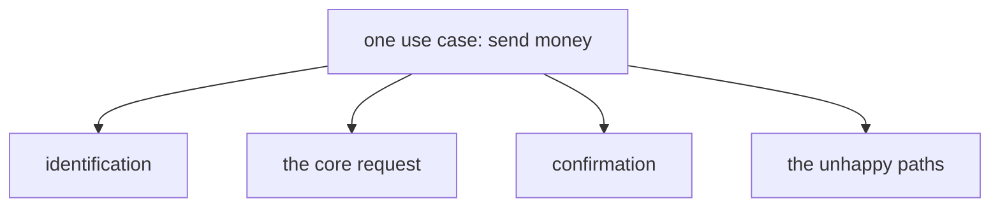

These are **separate flows that compose**, not one monolith. Finding the seams now has two payoffs: **reuse** (identification recurs in nearly every banking use case, so it is mapped once and built once) and **modular implementation** (the seams the map records are exactly where the build will later divide, when an oversized flow needs splitting — [Chapter 6](#chapter-6--why-big-flows-fail-and-how-to-split-them)).

### 1.5 Worked map: the domestic transfer

The method from [§1.2](#12-a-mapping-vocabulary-bpmn-at-intuition-level) — start from the outcome and work backwards — has so far been a principle. Applied to the transfer it is five questions, each asking *what had to exist for this to happen?*:

1. **What must be true when this ends well?** **Money moved** from the customer's account to the recipient's; the **customer informed**; an **auditable record** kept. That is the **outcome** — the map's right edge.
2. **What had to exist for money to move?** An **execution** by the **core-banking system**. Executions can fail, so an **execution-error branch** exists the moment the activity does.
3. **What had to exist before the system may execute?** The customer's explicit **confirmation**, because the action is irreversible. A customer may **decline** — that is a branch too, and it belongs to the **customer**, not to the system.
4. **What had to be true before confirmation is even worth asking?** The checks passed: the **recipient is valid**, the **funds are sufficient**, the **amount is within limits**. Each check is a **decision point**, and each "no" is a **failure branch**.
5. **What did the checks need to run at all?** A **recipient** and an **amount**, provided by the **customer** — and, behind everything, a customer whose **identity is established**.

Every answer lands in one of five buckets, and the buckets are the map:

- **Outcome** — money moved from the customer's account to a recipient's; the customer informed; an auditable record kept.
- **Inputs** — an authenticated customer; a recipient; an amount in euros.
- **Decision points** — is the recipient valid? are funds sufficient? is the amount within limits? does the customer confirm?
- **Actors** — the customer (provides recipient, amount, confirmation), the system (verifies, checks, executes), and, on the failure lane, a human operator (flagged or failed transfers).
- **Failure branches** — invalid recipient, insufficient funds, over limit, customer declines, execution error.

Drawn as a BPMN map — the happy path running left to right through its four decisions in the System lane; the customer's own work sits as activities in the Customer lane, providing the recipient and amount up front and approving or declining before execution (the inputs the assistant will later `collect`); every "no" and the execution error drop into the Human operator lane, where a review activity collects them, while a declined confirmation ends in the Customer lane, since declining is the customer's own act:

![The domestic transfer as a three-lane BPMN map: in the Customer lane, the start event leads to a "provide recipient and amount" activity; the System lane chains four gateways (recipient valid? funds sufficient? within limits? customer confirms?), with the confirmation gateway fed by the customer's "approve or decline" activity, leading to "execute transfer" and a "transfer complete" end event; each gateway's "no" and the execution error drop into the operator lane's "review failed transfer" activity, and a declined confirmation ends in the customer lane](assets/bpmn-domestic-transfer-map.png)

This one map carries the whole lesson. Every element on it has a destination in the Rasa design: its inputs become slots, its gateways become branches, its system activities become actions, its operator lane becomes a handoff, and each failure branch becomes a designed path. [Chapter 3](#chapter-3--the-translation-discipline-process-map-to-rasa-flow-design) makes that translation; the chapters after it compose and refine the result.

---

## Chapter 2 — Patterns for delegating and composing work

Before mapping a process onto one framework's primitives, it helps to name the recurring shapes the industry uses for breaking a use case into cooperating units. These patterns are framework-agnostic: the same handful appears in declarative tools like Rasa and in code-first agent frameworks, under different names. What separates them is a single question — **who decides the next step, the model or the author?**

### 2.1 The recurring patterns

A code-first agent framework, Pydantic AI, frames multi-unit design as a ladder of increasing autonomy, from a single agent up to graph-based control flow.[^2] Folded together with the workflow patterns Anthropic catalogues in *Building effective agents*,[^3] the shapes worth naming are these. Each comes with a sketch of its shape and the question *when should I use this?*

**Routing** — classify the request, then send it down the right path. One cheap classification step in front of per-category logic.

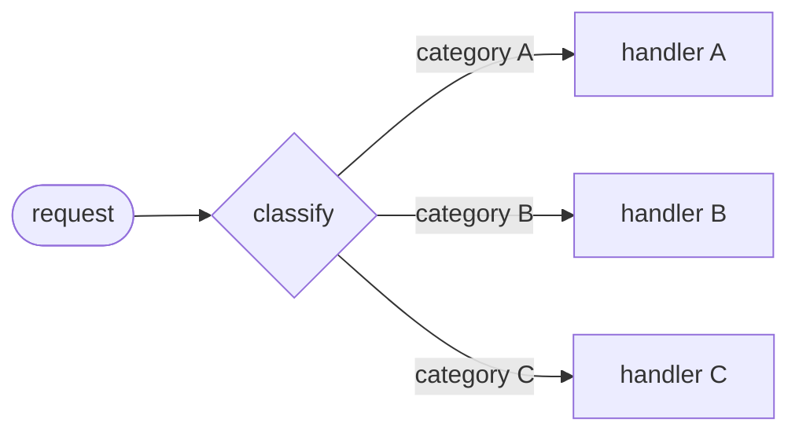

*When to use:* there are distinct categories of request that are better handled separately, and the classification can be made accurately — so that optimising one path does not degrade the others.[^3] (Sorting *general questions* vs *refund requests* vs *technical support* into separate downstream logic is the textbook case.)

**Chaining / hand-off** — one unit finishes and the next begins, with no return. A pipeline of steps, each consuming the previous one's output.

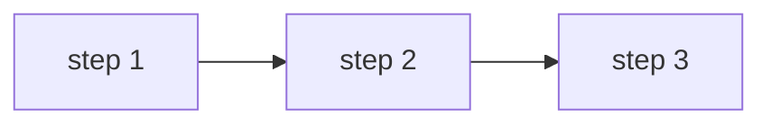

*When to use:* the task decomposes cleanly into *fixed* subtasks done in order, and you are willing to trade a little latency for the higher accuracy of making each step an easier, self-contained call.[^3] (Draft a document, then check it, then translate it.)

**Orchestration with subroutines (delegation)** — a unit calls another, which runs and *returns* control to the caller, like a function call.[^2] The home for shared logic written once and reused.

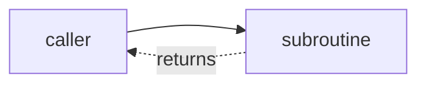

*When to use:* a piece of logic is needed by several callers, or is complex enough to isolate, and the caller needs the *result* back to keep going. (An authentication step that many different requests all need before they can proceed.)

**Human handoff** — a designed point where a person takes over, with the conversation handed across *with context*.

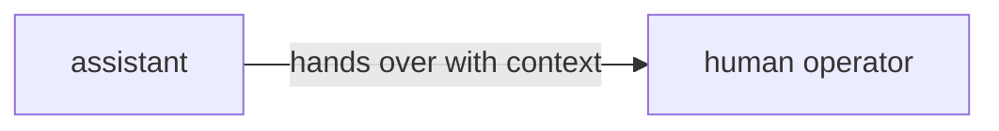

*When to use:* a step belongs to a person by regulation, risk appetite, or because the model's confidence is too low to act — the handoff is then a designed feature, not a failure of automation.

**Graph-based control flow** — an explicit state machine of nodes and transitions, where the edges between steps are declared.

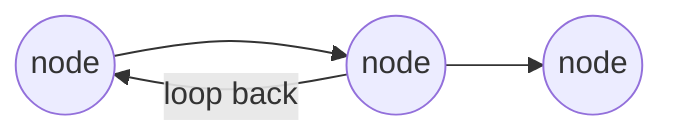

*When to use:* the control flow is complex enough — branches, loops, revisited states — that writing the transitions out explicitly is clearer and safer than letting them emerge; Pydantic AI reserves its graph layer for exactly these "most complex cases."[^2]

**Agent-to-agent** — independent agents cooperating over a protocol, each owning its own logic.

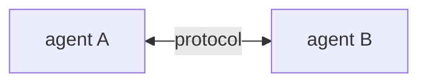

*When to use:* the cooperating units are genuinely separate systems — owned by different teams, deployed independently, written in different stacks — so they coordinate across a defined protocol rather than living inside one program.

Chapters 3–6 realize the first four of these in Rasa: routing is the choice of a flow by its natural-language description (made by the *command generator*, the LLM component [Chapter 3](#chapter-3--the-translation-discipline-process-map-to-rasa-flow-design) introduces), chaining is the `link` step, orchestration-with-subroutines is the `call` step, and the human handoff is a designed lane in a flow. The last two — graph-based control flow and agent-to-agent — are where code-first frameworks differ most, and Chapter 7 shows them in Pydantic AI.

### 2.2 The autonomy dial

Under every one of those patterns sits the same question: **who decides the next step?** The answer is a dial, not a switch. At one end are **fixed workflows**, where the author fixes the steps and the model only fills in language; at the other are **autonomous agents**, where the model chooses the steps itself, turn by turn.[^3] Most real systems sit somewhere between, deciding *per step* whether the model or the code is in charge.

The decision is rarely free in a regulated setting. The rule of thumb that settles most borderline cases: **the more irreversible the action, the more the author should decide.** The cost of moving a decision from model to code is a little flexibility; the cost of moving it the other way is an unauditable decision in a process a regulator can inspect. A bank cannot tell an auditor "the model judged the funds sufficient." Understanding language is the model's job; deciding whether money may move is the author's.

### 2.3 Decomposition is the through-line

Every pattern above is a way to keep one unit from doing too many jobs. Routing keeps the classifier out of the handlers; delegation keeps shared logic in one place; a handoff keeps the human's work out of the automation. The seams found on the process map in Chapter 1 ([§1.4](#14-one-use-case-several-flows)) — identification, the core request, confirmation, the unhappy paths — are exactly where this delegation happens. Decomposition is not an implementation detail bolted on later; it is the shape the map already drew, and the rest of the lesson is the discipline of building to it.

---

## Chapter 3 — The translation discipline: process map to Rasa flow design

Translating a mapped process into a Rasa design changes the target syntax, not the underlying analysis: the map already made every decision the design needs, so the derivation is almost mechanical. This chapter derives the Rasa flow from the [worked map of §1.5](#15-worked-map-the-domestic-transfer).

A few Rasa terms are load-bearing from here on. The architecture this lesson works in is **CALM** (Conversational AI with Language Models), which splits the work in two: a language model turns the customer's open-ended message into structured *commands*, and a deterministic engine executes the declared business logic. The component that does the interpretation is the **command generator**; it reads the user's message alongside a description of the available flows and emits commands such as `start flow <name>` and `set slot <name> <value>`. A **flow** is a declared business process — a named, ordered sequence of **steps**, written in YAML under a `flows:` key — and it is the unit of business logic in CALM. The step types in play are `collect` (ask the customer for a value and store it in a slot), `action` (run server-side code or send a response), and a `next` clause (branch on a *predicate* over the slots); Chapter 4 adds two more.

### 3.1 The translation table

Each row of the table is a question answerable from the map; the discipline is asking it once per element.

| On the process map | In the Rasa design | The decision to make |
|---|---|---|
| An input | A **slot** | **Who may assert this value?** `from_llm` if the customer may state it in conversation; `controlled` if only the backend may |
| A decision point (gateway) | A **`next` branch** with a predicate | Which slot does the predicate read, and who filled it? |
| A system activity | An **`action` step** | Backed by a custom action; the result returns through a `controlled` slot |
| A customer-facing activity | A **`collect` step** (plus a response) | The conversation-design questions of [Chapter 5](#chapter-5--slot-collection-as-conversation-design) |
| An operator lane | A **handoff point** | Named and designed here; the *mechanics* are a later lesson |
| A failure branch | A **designed unhappy path** | Written into the YAML deliberately, not discovered in production |

A **slot** is a named piece of the conversation's working memory; each has a **type** (`text`, `float`, `bool`, …) and a **mapping** that decides who may fill it.[^4] The two mappings that matter here are **`from_llm`** (the customer may state the value and the model extracts it) and **`controlled`** (only the backend may assert it — set by a custom action or a button payload, never inferred by the model). This split is the **trust boundary**, applied to each input at design time. A **custom action** is the server-side Python that does the work the model must not do — calling a backend API, checking funds, executing a transfer; it runs behind the action server and returns its results through `controlled` slots. (Writing that Python is a separate-lesson topic; here actions are invoked, not built.)

Running the transfer's inputs through the first row settles the trust question for each:

| Input | Slot type | Mapping | Why |
|---|---|---|---|
| `recipient` | text | `from_llm` | The customer says it |
| `amount` | float | `from_llm` | The customer says it |
| `final_confirmation` | bool | `from_llm` | The customer says it |
| `has_sufficient_funds` | bool | `controlled` | Only the core-banking system may assert this |
| `transfer_successful` | bool | `controlled` | Only the system — set by the executing action |

The two `controlled` slots are filled by custom actions — the funds check sets `has_sufficient_funds`, the executing action sets `transfer_successful` — never inferred by the model. One principle governs every borderline case here, and it is worth stating once plainly: **no model failure has a prompt-level fix.** A model that can be talked into asserting a fact can be talked into it by an input the developer never foresaw; the engineering response is not a better sentence in a prompt but a declared path the model cannot overrule — here, the `controlled` mapping. When in doubt, the value is `controlled`, because the cost of letting the model assert an auditable fact is an unauditable decision in a regulated process.

### 3.2 The translated flow

The map translates line by line. The flow below adapts Rasa's money-transfer tutorial[^5] to the transfer use case: the tutorial models the same process — collecting a recipient, an amount, and a confirmation, and checking funds — and the slot types and mappings in the table above follow the trust decisions made there.

```yaml
flows:
  domestic_transfer:
    name: domestic transfer
    description: Help users send money to another person's bank account.
    steps:
      - collect: recipient
      - collect: amount
        description: the amount to send in euros
      - action: action_check_sufficient_funds
        next:
          - if: not slots.has_sufficient_funds
            then:
              - action: utter_insufficient_funds
                next: END
          - else: final_confirmation
```

Two mechanics in that block stitch the three YAML snippets of this section into one connected flow. **First, how the jump works.** A bare value after `if`/`else` — here `final_confirmation`, below `execute_transfer` — is the `id` of the step to jump *to*; that is why the confirmation `collect` in the next block carries `id: final_confirmation` and the executing action carries `id: execute_transfer`. The `id` is the label; the bare value after `if`/`else` is the reference to it. (Where a branch reads `next: END`, it terminates the flow instead of jumping.)[^6] **Second, where `has_sufficient_funds` comes from.** `action_check_sufficient_funds` sets that `controlled` slot as a side effect when it runs, server-side, inside the `action` step — which is why the `next` on the *same* step can immediately branch on `slots.has_sufficient_funds` with no `collect` in between: a slot the backend fills needs no question.

The flow continues with the confirmation gate — a `collect` on a bool slot, branching to execute or unwind:

```yaml
      - collect: final_confirmation
        id: final_confirmation
        ask_before_filling: true   # always ask, even if already filled — see Ch.5
        next:
          - if: not slots.final_confirmation
            then:
              - action: utter_transfer_cancelled
                next: END
          - else: execute_transfer
```

And the tail — the executing action and its success/failure branch:

```yaml
      - id: execute_transfer
        action: action_execute_transfer
        next:
          - if: slots.transfer_successful
            then:
              - action: utter_transfer_complete
                next: END
          - else:
              - action: utter_transfer_failed
                next: END
```

Assembled, the three snippets are one flow. Drawn as the engine will walk it — every box a step, every diamond a `next` predicate, every path ending in an explicit `END`:

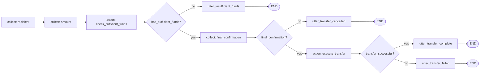

The map and the YAML correspond element by element: every gateway became a `next` with a predicate, every system activity an `action`, every customer activity a `collect`, and every failure branch has a home — `utter_insufficient_funds`, `utter_transfer_cancelled`, `utter_transfer_failed`. Two elements are deliberately left for later: the over-limit decision translates identically (one more check action and branch), and the operator lane is named but not built — the failed-execution branch is where a real deployment offers a human, and the mechanics of handing off are a later lesson.

### 3.3 Descriptions are the trigger surface

One element of the flow above is not like the others. The `description` is **not a comment**: it is the prose the command generator reads when deciding which flow matches the user's request — the routing table of the assistant, written in natural language.[^7] When a customer types "I need to move some money to my landlord," the model matches that sentence against the flow descriptions and chooses where to route. The description is an interface consumed by the model, and three rules follow:

1. **Written from the user's perspective.** It describes what the user wants ("send money"), not what the system does ("orchestrate the payment subledger"). The model matches against *user* messages.
2. **Specific enough to separate neighbours.** "Manage your money" would match transfers, balance checks, and limit changes alike. Clear, detailed descriptions are the documented lever for reducing flow-selection errors.[^7] The test: could a neighbouring flow honestly claim the same sentence? If so, sharpen it.
3. **Free of internal jargon.** No codenames, no ticket-system vocabulary; the model routes on the words customers use.

The official design guidance is that each flow should focus on a single job or outcome.[^7] A flow that does two jobs needs a description that blurs across both, triggers ambiguously against its neighbours, and doubles its testing surface. A sentence that cannot be written without an "and" describes two flows — the first symptom of the oversized flow treated in [Chapter 6](#chapter-6--why-big-flows-fail-and-how-to-split-them). None of this required new Rasa knowledge: slots, steps, predicates, and actions were already in hand. What the translation adds is the discipline of derivation — the map decides, the YAML records.

---

## Chapter 4 — Composing flows: call, link, and the stack

Chapter 1 found [several flows hiding inside one use case](#14-one-use-case-several-flows); this chapter connects them. Rasa offers two step types for moving from one flow to another, and the chapter introduces both before drawing the line between them. A **`call`** step runs another flow as a *subroutine*: control leaves the current flow, the other flow runs, and control comes back to continue where it left off — the tool for shared logic a flow needs *and then keeps going* past. A **`link`** step is a *follow-on*: it ends the current flow and starts another in its place, with no return — the tool for "this conversation is now about something else." So the distinction that organises the chapter is simply **`call` comes back and `link` does not**, and getting it right is what keeps an assistant from stranding or resurrecting a conversation. Both ride a shared structure, the dialogue stack, introduced once both verbs are in hand.

### 4.1 `call` — the subroutine

A `call` step embeds a child flow inside a parent. The child is **pushed** onto the dialogue stack (the engine's running record of which flows are active — [§4.4](#44-the-stack-revisited) details it), **runs to completion**, is **popped**, and the parent **resumes at the step after the `call`.**[^6] It is the function call of flow design: control leaves, does its work, and comes back to where it left. Two consequences follow straight from the reference:

- **Slots propagate between parent and child.**[^6] Slots are conversation-scoped, not flow-scoped, so a child reads and writes the same slot space as its parent. This is what makes a called `authenticate_user` useful: it sets `slots.authenticated`, and every flow above it on the stack can branch on that value.
- **Cancellations propagate too.**[^6] A user who cancels mid-child does not strand a zombie parent; backing out of the child takes the parent with it.

`call` is the natural home for shared logic. The canonical example is `authenticate_user`: written once, called from every flow that needs an authenticated customer. Here is the transfer again, with the shared sub-processes pulled out into `call`s (the middle steps are unchanged from Chapter 3 and elided for focus):

```yaml
flows:
  domestic_transfer:
    description: Help users send money to another person's bank account.
    steps:
      - call: authenticate_user        # child runs; control returns here
      - collect: recipient
      - call: verify_recipient         # child runs; control returns here
      - collect: amount
      # ... funds check, confirmation, execution as in Chapter 3 ...
      - action: utter_transfer_complete
      - link: leave_feedback           # this flow ends; no return
```

The shape is deliberate: `call`s sit in the body, where control must come back; the `link` sits only at the very end, for the reason §4.2 gives.

### 4.2 `link` — the handoff

A `link` step **terminates the current flow entirely** and starts the named flow as a follow-up. **There is no return.** The reference states the structural constraint plainly: links can only be used as the last step in a flow.[^6] Nothing can run after a `link`, so it sits only where a path ends; in a branched flow, each branch may end in its own `link`. The syntax is just the target flow's id:

```yaml
flows:
  order_pizza:
    description: Order a pizza for delivery.
    steps:
      - collect: pizza_kind
      - collect: delivery_address
      - action: action_place_order
      - action: utter_order_confirmed
      - link: leave_feedback        # the order is done; the conversation moves on
```

`link` is for "this conversation is now about something else" transitions, in or out of any domain: an order placed → leave feedback; a support ticket resolved → take a survey; a card blocked → order a replacement. The mental model, kept as a pair: `call` is a **function call**; `link` is the conversation **changing chapter**.

**Are slots shared across a `link`?** Only the ones that outlive a flow. Slots live at the conversation level, not inside a single flow, so the linked flow *can* read any slot that is still set. But a `link` *ends* the originating flow, and ending a flow resets the slots it filled with `collect` (a data-minimisation default [§5.5](#55-what-the-assistant-remembers) treats in full) — so the linked flow does **not** inherit the previous flow's working values unless those slots were deliberately kept (the `persisted_slots` list, or values written by a custom action, which persist by default).[^6] This is the substantive difference from `call`: `call` only *pauses* the parent, which keeps every slot it holds, whereas `link` *closes* the parent and lets its working memory clear. Pass nothing across a `link` and assume it starts clean unless you have arranged otherwise.

### 4.3 The two mis-use cases

Each verb used where the other was meant exposes the distinction:

- **`link` where `call` was meant.** Mid-transfer, a `link` to `authenticate_user` terminates the transfer. The customer authenticates successfully — into a void. The recipient and amount are discarded, the parent process is stranded, and the customer starts over.
- **`call` where `link` was meant.** After `utter_transfer_complete`, a `call` to the feedback flow runs the child, pops the stack, and returns the customer to the tail of a transfer they had mentally closed — the conversation resurrects the past.

In short: **link-for-call strands the parent; call-for-link resurrects the past.**

### 4.4 The stack, revisited

Both verbs ride the same **LIFO dialogue stack** — the engine's record of which flows are active, managed by the **`FlowPolicy`**.[^8] When a flow starts — via an LLM `start flow` command, a `call`, or a `link` — it is pushed onto the stack; the topmost flow is the active one; on completion it pops and the flow beneath resumes where it paused. The transfer's stack evolves as the opening message arrives and authentication runs.

The stack is one way to read the movement — *what is active right now*. The same three moments, read as a timeline — *who hands control to whom, and when* — make the call-and-return explicit:

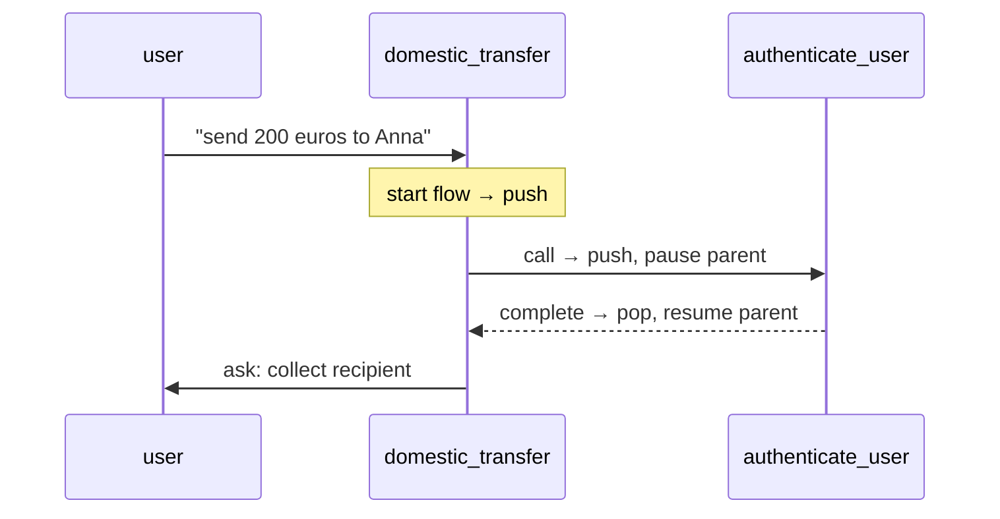

And as a stack — *what sits on top, and what is paused beneath* — across the same three moments:

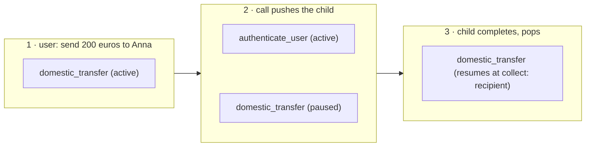

The `start flow` command pushes `domestic_transfer`; the `call` pushes `authenticate_user` on top and pauses the parent; the child completes, pops, and the parent resumes at `collect: recipient`. In each box the topmost line is the active, top-of-stack flow and any line below it is paused beneath — that vertical ordering *is* the LIFO position. This movement is visible live in the **Inspector**, the developer tool launched with `rasa inspect` that shows a conversation alongside the dialogue stack and the commands the model emitted.[^9] Conversation repair rides the same stack: when a customer interrupts or corrects mid-flow, the repair machinery pushes and pops on it. Composition and repair are one mechanism, treated in full in a later lesson.

### 4.5 Flow guards: controlling what the model may start

Composition produces flows that exist only to serve other flows — `verify_recipient` has no business being started by a customer request on its own. Such flows must never be startable by the command generator directly, and **flow guards** complete the control story. The **`if` property on a flow** (on the flow, not on a step) is a guard: a condition that must hold before the command generator may start the flow.[^10] The canonical case is an authentication-state guard:

```yaml
flows:
  check_balance:
    description: Show the customer their current account balance.
    if: slots.authenticated
    steps:
      - action: action_fetch_balance
      - action: utter_current_balance
```

The predicate reads `slots.authenticated`, set by the called `authenticate_user` subflow through a `controlled` slot, so the model can neither start the guarded flow nor fake its way past the guard. The documented idiom for a private subflow is **`if: False`** — a guard that never holds, making the flow reachable **only** through `call` or `link`:[^10]

```yaml
flows:
  verify_recipient:
    if: False                # never started by the LLM; reachable only via call/link
    description: Verify the transfer recipient details.
    steps:
      - collect: recipient_account
      - action: action_validate_recipient
```

This is the flow-design equivalent of a private method. If the guard never holds, how does `call` get through? Because guards gate only LLM-initiated starts: activation via a `call` step, a `link` step, or an NLU trigger intent bypasses the guard entirely.[^10] This cuts both ways:

- The **call/link bypass is the feature.** It is precisely why `if: False` works — the parent can still `call` a subflow the model can never start. Without the bypass, `if: False` would make a flow *unreachable* rather than *private*.
- The **`nlu_trigger` bypass is a security caveat.** An intent-triggered start pierces guards too, including authentication guards.[^10] `nlu_trigger` is a migration bridge taken up in a later lesson, where this caveat is addressed.

Two facts complete the picture. **Guards shape the prompt, not just the permission:** the command generator's prompt contains only the flows currently eligible under their guards, and subflows guarded `if: False` never appear in the prompt at all.[^10] That is both a cost win (fewer tokens per turn) and a clarity win (the model chooses among the five flows it may start, not the fifteen it mostly may not). The opposite lever also exists: **`always_include_in_prompt: true`** forces a flow into the prompt regardless of relevance whenever its guard holds[^10] — the default is `false`, and every forced inclusion taxes every turn, so it is used sparingly.

The whole guard story in one picture — what the model may start, what it never sees, and the composition path that bypasses the guard:

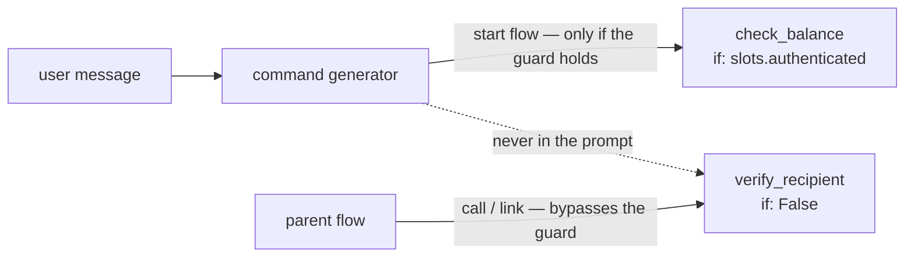

---

## Chapter 5 — Slot collection as conversation design

Earlier Rasa lessons covered `collect` as mechanics. Collection also carries design weight: a customer never sees the architecture — the stack, the guards, the YAML — only the *questions*. Whether those read like a competent banker or a bureaucratic form is decided by the collection design, and each property below is a conversation-design decision expressed in YAML. This is the heart of what Rasa calls conversation design (CxD): with CALM, each flow can focus on a specific task rather than a complex flowchart of interlinked branches, which moves the design effort from drawing branches to shaping questions.[^11]

### 5.1 Collection is not a form

Under CALM, customers do not answer forms in order. A customer opens with "send 200 euros to Anna," and the command generator fills `amount` **and** `recipient` from that single message, via `set slot` commands, wherever in the conversation the values appear. A `collect` step whose slot is already filled is **skipped**: by default, Rasa asks only when the value is missing.[^6] (Corrections ride the same `set slot` token — the customer can change the amount mid-flow and the engine updates the slot.) So collection design is not "write the questions in order." It is two sharper questions: **which questions may be skipped when the answer already arrived?** (for most slots, all of them — re-asking what it was just told makes an assistant feel broken), and **what order do the remaining questions take?** (identification before request details, details before checks, checks before confirmation — an order the map already fixed).

### 5.2 `ask_before_filling` — confirmation semantics for sensitive values

The exception to skipping is **`ask_before_filling: true`** on a collect step: it forces the question to be asked even when the slot is already filled.[^6]

```yaml
- collect: final_confirmation
  ask_before_filling: true   # ask even if a value already arrived
```

The mechanism is deliberate: if the slot is already filled when the step is reached, the assistant **clears it, asks the question, and fills it again** from the fresh answer[^6] — so an earlier value can never stand in for the question. This is confirmation semantics for sensitive values. It prevents a specific failure: the customer says something agreeable three turns ago, the model reads it as a "yes," and a transfer executes without an explicit confirmation question ever shown. A volunteered "yes, whatever" buried in an earlier message must not silently satisfy the final confirmation of a transfer. The rule of thumb: **skipping is good conversation for *information* and forbidden for *assent*.**

### 5.3 Sharpening extraction: the step description

A `collect` step takes its own `description`, the precision instrument for ambiguous values:

```yaml
      - collect: amount
        description: the amount to send in euros
```

This prose is read by the command generator **at extraction time**, exactly as the flow description is read at routing time: it is guidance the model consults while pulling the value out of the user's words.[^6] Without it, "send Anna 200" leaves *200 what* to the model's guess — euros, dollars, a count of something? The description `the amount to send in euros` fixes the unit, so the model resolves the number the way the process intends instead of picking one. The same instrument pins down *format* and *range*, not just units: a description like "a postal code of either 5 or 9 digits" tells the model what a well-formed value looks like, narrowing many plausible readings of a messy utterance to the one the flow can use.[^6] The rule: **if two readings of the user's words are possible, the disambiguation lives in the step description.**

### 5.4 The confirmation pattern

Before any irreversible action, the design is always the same four moves, and it deserves the name *the confirmation pattern*:

1. A **bool slot** (`final_confirmation`), `from_llm`.
2. A `collect` on it with **`ask_before_filling: true`**, so it is always asked ([§5.2](#52-ask_before_filling--confirmation-semantics-for-sensitive-values)).
3. A question that **interpolates everything about to happen** — the tutorial's own response is the model: "Please confirm: you want to transfer {amount} to {recipient}?"[^5] — never "Are you sure?", which confirms nothing. The customer assents to specifics.
4. A **branch**: confirmed → execute; declined → unwind cleanly (`utter_transfer_cancelled`, `END`).

This is the human-in-the-loop approval gate, implemented: a deterministic confirmation before an irreversible step, placed where the map said a person must approve a consequential action before the system commits it. It costs one turn of friction and buys an explicit, logged customer assent, which matters in transcript review and dispute handling.

For **security-critical sequences** there is a stronger tool, **`force_slot_filling: true`** on a collect step:

```yaml
- collect: otp_code
  force_slot_filling: true   # ignore everything except an answer to this question
```

To see what it does, recall the default: at any turn the assistant will process an interruption — the user digressing, or the model misreading a message as a topic switch — and step away from the current question.[^6] `force_slot_filling: true` switches that off *for one collect step*: while the step is active the assistant **ignores every other command and accepts only the value for this slot**,[^6] so the user must answer before anything else can happen. That is exactly what a one-time-passcode entry wants — a stray "actually what's my balance?" mid-code must not derail it. The trade-off is deliberate: it refuses *legitimate* interruptions too, so it belongs where the integrity of the sequence outweighs conversational freedom (OTP entry, not amount entry).

### 5.5 What the assistant remembers

What an assistant keeps in memory after a task finishes is itself a design choice, and the safe default is **remember less** — a data-minimisation instinct that serves any privacy-conscious application: keep the least the job needs, for the shortest time. There are two scenarios, a default and an opt-out.

**The default — forget when the flow ends.** Slots filled in a `collect` or `set_slots` step are reset when the flow completes.[^12] This is the right default: a working value collected to do one job — an amount for one transfer, an address typed for one order — has no business outliving the task it was collected for. Most slots want exactly this and need no extra configuration.

**The opt-out — keep a value on purpose.** When a value *should* carry forward, list it in the flow-level **`persisted_slots`** field, which exempts those named slots from the end-of-flow reset:[^12]

```yaml
flows:
  set_preferences:
    description: Capture the user's preferred contact language.
    persisted_slots:
      - preferred_language     # survives this flow so later flows need not re-ask
    steps:
      - collect: preferred_language
```

The legitimate use is a value a *later* task should reuse rather than re-ask — a stated preference, a chosen locale — so the user is not asked the same thing twice. Two boundaries on the mechanism, both grounded in the reference: `persisted_slots` may name only slots filled by a `collect` or `set_slots` step, and state written by a custom action is **already** persistent and must *not* be listed there.[^12] So "what survives" splits cleanly: transient working values are collected and discarded; values worth remembering are either persisted explicitly or come from a backend that holds them anyway. Per slot, the fate at flow end is decided by how the slot was filled:

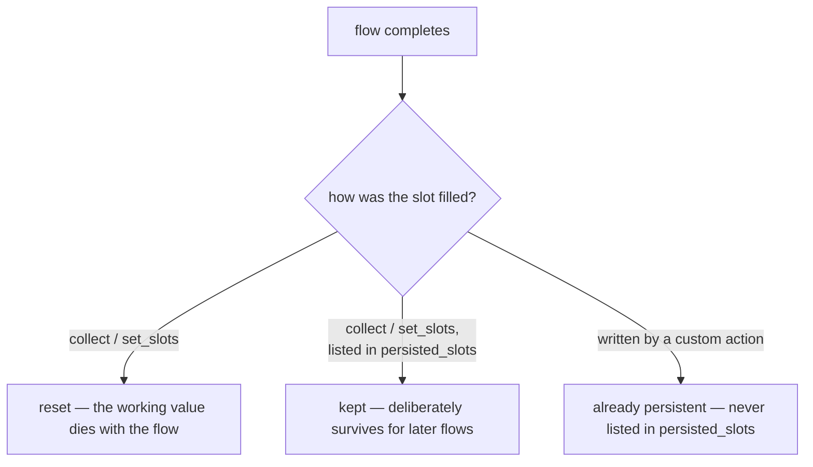

The rule of thumb: **working values die with the flow; values you deliberately keep survive it.** Two related topics belong to later lessons: slot scoping as architecture (which state is flow-local, session-shared, or cross-session), and input validation on collected values (rejecting a malformed entry and re-asking).

### 5.6 Buttons versus free text

Briefly, a **channel** is the connector through which a conversation reaches the user — a web chat widget, a messaging app, a voice line. The same flows run behind all of them, but each renders the interface differently: a web or messaging channel can show **buttons** as clickable elements, while a voice channel has none. Responses can be tailored per channel for exactly this reason,[^13] and that is where collection design meets a channel-and-risk decision. A response can carry buttons whose payloads set slots directly, with the payload shape `/SetSlots(<slot>=<value>)`:[^13]

```yaml
utter_ask_final_confirmation:
  - text: "Please confirm: transfer {amount} euros to {recipient}?"
    buttons:
      - payload: "/SetSlots(final_confirmation=true)"
        title: "Yes, transfer"
      - payload: "/SetSlots(final_confirmation=false)"
        title: "No, cancel"
```

A button press is a **deterministic input channel**: the slot is set by the payload, with no model interpretation between the press and the value. That determinism is also why a button is one of the permitted setters for a `controlled` slot (the trust boundary drawn in [§3.1](#31-the-translation-table)). The design rule: **constrained choices where mistakes are costly.** Free text for names and amounts, where expressiveness wins; buttons for confirmations and categorical choices, where a misread "yes" has a blast radius.

---

## Chapter 6 — Why big flows fail, and how to split them

The failure modes of an oversized flow follow from rules already in hand: the flow description as the surface the model routes on ([Chapter 3](#33-descriptions-are-the-trigger-surface)), and composition through `call` and `link` ([Chapter 4](#chapter-4--composing-flows-call-link-and-the-stack)). Consider a monolith: one `domestic_transfer` flow with OTP authentication inlined, recipient verification inlined, and a "report a problem" tangent bolted on — four independent jobs fused into a single flow. Such a flow is rarely written on purpose; it accretes one reasonable-looking addition at a time, until a flow that should do one thing carries four. The problem is not its length — a long flow that does one job is fine — but its lack of seams: four concerns that ought to be described, triggered, reused, and tested independently are welded into one unit that can do none of those separately. Three failures then follow mechanically.

### 6.1 Failure 1 — ambiguous triggering

One flow, four jobs → its description must **blur** to cover them: "authenticate the customer and send money and verify recipients and handle problems…". This is [§3.3](#33-descriptions-are-the-trigger-surface)'s logic at scale: the description is the trigger surface, and a blurred description routes badly in **both** directions — false positives (triggering on requests it should not own) and false negatives (losing requests to better-described neighbours). The fix is structural, not editorial: no wordsmithing makes one honest sentence out of four jobs.

### 6.2 Failure 2 — branch sprawl

Every inlined sub-job **multiplies** the paths through the flow rather than adding to them. The counts are illustrative, but the shape is the point: roughly two-to-three outcomes per inlined sub-job, multiplied together — three authentication outcomes times two verification times two funds times two confirmations — lands around two dozen paths through a single flow. An end-to-end test suite must walk every one, and twenty-four paths in one flow is a test file that is not maintained honestly. Each *composed* subflow, by contrast, is testable in isolation: the parent tests only its own composition, and the multiplication never happens.

### 6.3 Failure 3 — prompt bloat

**Flow retrieval** keeps the prompt manageable: it matches the user's message against flow descriptions and includes only the top candidates in the LLM prompt.[^14] Retrieval works best when flows are small and sharply described. The monolith loses twice: its blurry description matches poorly, and when it *is* included it drags its whole sixty-line structure into the prompt. Small, well-described flows mean fewer, more relevant tokens per turn — so **modularity is not just hygiene; it is an accuracy and cost lever.**

### 6.4 The splitting method

The seams were already identified by the Chapter 1 map ([§1.4](#14-one-use-case-several-flows)): identification, the core request, confirmation, the unhappy paths. Cutting along them, two assignment rules are the whole method:

- **Shared, reusable sub-processes** become subflows reached by **`call`**, guarded **`if: False`** where the model should never start them directly — out of the trigger surface, out of the prompt, reachable only by design.[^7][^10]
- **Follow-on transitions** ("this conversation is now about something else") become flows reached by **`link`**.

For the transfer:

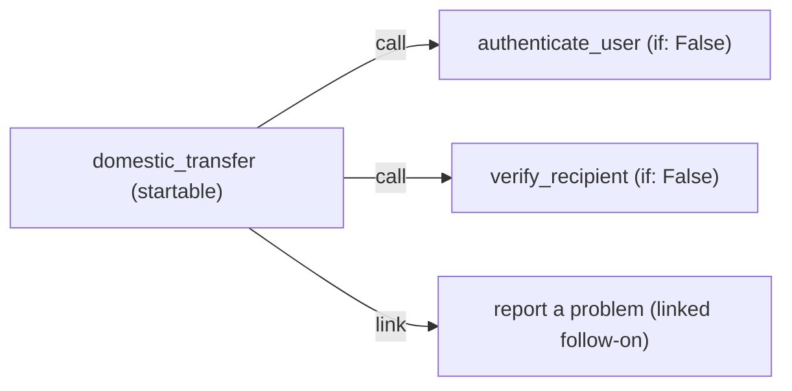

The monolith gives up `authenticate_user` and `verify_recipient` as called subflows, both `if: False` — authentication in particular is shared machinery a card-block or balance flow will call too. The confirmation step stays in the parent as its own beat. The "report a problem with this transfer" tangent becomes a `link`, because that conversation genuinely is about something else. This shape has precedent in Rasa's shipped finance template (`rasa init --template finance`), which structures money transfers as one startable router flow that collects the transfer type and then `call`s into guarded subflows. When the vendor's own demo bank composes this aggressively, the idiom is the intended grain of the framework, not advanced styling.

### 6.5 Heuristics over dogma

None of this is new. A flow is code, and asking when one flow should become two is the same question software engineering has always asked of a function or a module — the *single-responsibility principle*, *separation of concerns*, and *don't-repeat-yourself*, applied to a `flows:` block instead of a class. Splitting a flow is the **extract-function** refactoring under another name; guarding a private subflow is encapsulation under another name. So the heuristics below are the familiar ones, and a developer's existing instincts transfer directly. Do **not** split by line count. Split when one of three conditions holds:

1. **The description stops being writable in one honest sentence.** If you need "and," it is two flows — Chapter 3's rule used as a refactoring trigger, and the single-responsibility principle stated for flows: one unit, one reason to exist.
2. **A subpath needs reuse.** The *second* flow that needs authentication is the moment to extract `authenticate_user`, not the third — *don't-repeat-yourself*, and the same call to extract a function the moment a second caller appears.
3. **A section needs different guarding.** If part of a flow must be LLM-startable and part must never be, they cannot be one flow — guards live on flows, not steps.[^10] Parts with different access rules are different concerns, and separating them is just separation of concerns.

The inverse heuristic guards against over-engineering — the same caution as in ordinary code, where splitting one cohesive function into trivial fragments harms more than it helps: a three-step flow with one job and one honest description does not improve by being split into three one-step flows. Composition serves the description, the tests, and the prompt; where none of the three is suffering, splitting adds nothing.

---

## Chapter 7 — A code-first contrast in Pydantic AI *(extra)*

Rasa's declarative approach is a position chosen against alternatives, not an inevitability. Placing the same transfer use case beside a code-first agent framework — **Pydantic AI**, where the developer writes Python and the framework absorbs the loop, history, and tool dispatch — makes the declarative choice legible. The patterns of Chapter 2 are all here; what differs is who holds the control flow.

### 7.1 The same use case, code-first

Pydantic AI frames multi-unit design as a ladder of increasing autonomy: a single agent, then **agent delegation**, then **programmatic hand-off**, then **graph-based control flow**, and at the top "deep agents."[^2] The first four are the code-first counterparts of the patterns Chapter 2 named; the transfer exercises them in turn.

**The autonomous (ReAct) agent.** An `Agent` is a container for instructions, tools, and a structured output type.[^15] Its tools are plain Python functions registered with a decorator; on each turn the model chooses which tool to call, the framework runs it and feeds the result back, and the loop repeats — reason, act, observe — until the model produces the declared output type. The model picks the *sequence* of steps, bounded by a `UsageLimits` cap that prevents a runaway loop:[^15]

```python
from pydantic import BaseModel
from pydantic_ai import Agent, RunContext, UsageLimits

class TransferResult(BaseModel):
    executed: bool
    message: str

transfer_agent = Agent(
    'anthropic:claude-opus-4-8',
    output_type=TransferResult,
    instructions="Help the user send money. Check funds before executing.",
)

@transfer_agent.tool
async def check_funds(ctx: RunContext, amount: float) -> bool:      # code decides
    return await core_banking.has_sufficient_funds(amount)

@transfer_agent.tool
async def execute_transfer(ctx: RunContext, recipient: str, amount: float) -> bool:
    return await core_banking.transfer(recipient, amount)         # code decides

result = transfer_agent.run_sync(
    "send 200 euros to Anna",                                     # model decides the steps
    usage_limits=UsageLimits(request_limit=5),
)
```

The contrast with the Rasa flow is already visible. Here the *order* — check funds, then confirm, then execute — is not declared anywhere; it lives in the model's turn-by-turn choices, steered by the instruction string and bounded only by the request limit. In the flow of Chapter 3, that order is the YAML.

**Agent delegation** is the code-first form of `call`: a second agent is invoked from *inside* a tool, runs, and returns control to the caller. Passing `usage=ctx.usage` makes the child's token use count against the parent's budget:[^2]

```python
verify_agent = Agent('anthropic:claude-opus-4-8', output_type=bool)

@transfer_agent.tool
async def verify_recipient(ctx: RunContext, recipient: str) -> bool:
    r = await verify_agent.run(f"Is '{recipient}' a valid payee?", usage=ctx.usage)
    return r.output                                              # control returns here
```

**Programmatic hand-off** is the code-first form of `link`: ordinary application code — not an agent — runs one agent, then calls the next, with no return into the first. The author, not the model, decides what comes next:[^2]

```python
result = transfer_agent.run_sync(user_message, usage_limits=limits)
if result.output.executed:
    feedback_agent.run_sync("Ask the user to rate the transfer.")  # author decides
```

**Graph-based control flow** is the form with no Rasa equivalent in this lesson: an explicit state machine of typed nodes, where each node's `run` returns the next node — or `End` — and the *author* writes those transitions in code.[^16] The transfer's spine as a sketch of nodes:

```python
from dataclasses import dataclass
from pydantic_graph import BaseNode, End, GraphRunContext

@dataclass
class CheckFunds(BaseNode[TransferState]):
    async def run(self, ctx: GraphRunContext[TransferState]) -> "Confirm | End[str]":
        if not await core_banking.has_sufficient_funds(ctx.state.amount):
            return End("insufficient funds")
        return Confirm()                                          # code decides the edge
```

Across the four, one axis moves: who decides the next step. The autonomous agent gives the most to the model; the graph gives the most to the author; delegation and hand-off sit between. This is exactly the autonomy dial of [§2.2](#22-the-autonomy-dial), now expressed in Python instead of YAML.

### 7.2 Reading the contrast

A code-first, graph-based framework buys *maximum expressiveness*: dynamic fan-out, mid-run model decisions, arbitrary data structures in state, no framework ceiling. The honest steelman is Anthropic's: an autonomous agent earns its keep on "open-ended problems where it's difficult or impossible to predict the required number of steps."[^3] A research assistant that plans its own investigation is the case where code-first is the right call.

A mapped, regulated process is the **opposite** of open-ended: its steps are enumerable precisely because the rules enumerated them. For that case, the declarative stance buys things code cannot easily buy back — at a real cost, stated plainly:

| What declarative buys | What it costs |
|---|---|
| **The artifact is reviewable** — a diffable YAML flow a process owner can read and sign off; a graph callback is not | Less open-ended flexibility, *by design* |
| **Repair is built in** — interruptions, corrections, cancellations ship as patterns you customize | You work within the framework's repair model, not your own |
| **The testing surface is declared** — declared flows are enumerable paths a suite can walk | YAML as a constraint, not arbitrary code |

One cost the table deliberately omits is "a framework to learn" — because *both* paradigms demand that. Pydantic AI is a framework too, with arguably the steeper learning curve, since the developer also absorbs the agentic loop, state, and control flow that the declarative tool keeps out of sight. The real difference is not *whether* there is a framework but *who* can participate in authoring one: a declarative flow is legible to analysts and process owners, not only developers, which widens the circle of people who can review and shape the logic — a genuine advantage when the process is regulated and the reviewers are not engineers — at the mild cost of coordinating across that wider circle. Code-first keeps authorship inside the engineering team and inside general-purpose code, trading that breadth for maximum flexibility.

On the dial from fixed workflows to autonomous agents, the declarative tool sits at the workflow end **by design**, and for an enumerated, regulated, customer-facing process the declarative shape *is* the simplest one that works.[^3] The argument is domain-specific, not universal: the same reader who would reach for Pydantic AI to build a research agent that plans its own investigation should reach for declarative flows to run a process whose every step the rules already fixed.

### 7.3 The 2026 outlook — beta, not course material

Rasa's own roadmap extends the `call` step beyond child flows, all through the same step this lesson already teaches:

- **Sub-agents** — autonomous, ReAct-style steps invoked from a flow (`call: agent_name`, with exit conditions), where an LLM chooses which tools to invoke from the conversation context.[^17]
- **MCP tools invoked directly from call steps** — a `call:` with an `mcp_server` and input/output slot mappings.[^6]
- **Agent-to-agent (A2A) protocol support** — orchestrating external agents over the A2A protocol, again invoked from a `call` step.[^17]

The industry calls the most autonomous version of this shape "deep agents" — agents with planning, sub-agent delegation, and sandboxed execution[^2] — and the same caution applies to all of it: these Rasa features are **beta**, and a beta API is not production-ready for a bank. They are worth recognizing by name, not shipping. The composition craft of this lesson persists across them, because every one is invoked from a `call` step inside a flow: what deserves to be a subflow, what is guarded, what returns and what does not are exactly the questions those features compose. The verbs are not changing; the operands are growing.

---

## Further reading

- **[Rasa Pro Tutorial (money transfer)](https://rasa.com/docs/pro/tutorial/).** The money-transfer assistant built end to end, covering every translation row from Chapter 3.
- **[Writing Flows](https://rasa.com/docs/pro/build/writing-flows/).** The design guidance behind one-flow-one-job and description quality.
- **[Flow Steps reference](https://rasa.com/docs/reference/primitives/flow-steps/).** The exact semantics of every step type, including the `call`/`link` distinction this lesson turns on.
- **[Starting Flows](https://rasa.com/docs/reference/primitives/starting-flows/).** Flow guards, the `if: False` idiom, and the guard exceptions (`call`, `link`, `nlu_trigger`).
- **The shipped finance template** — run `rasa init --template finance`. A complete demo bank assistant composed as Chapter 6 describes: one router flow, guarded subflows, confirmation steps, a `link`ed feedback flow.
- **["Building effective agents"](https://www.anthropic.com/research/building-effective-agents) — Anthropic.** The workflow patterns mapped onto the primitives named in Chapter 2.
- **[PydanticAI — Multi-agent Patterns](https://pydantic.dev/docs/ai/guides/multi-agent-applications/).** The five-level ladder and the code-first delegation, hand-off, and graph patterns contrasted in Chapter 7.

---

### Sources

[^1]: **"Business Process Model & Notation (BPMN)"** — Object Management Group. [Portal](https://www.omg.org/bpmn/); [version & spec facts](https://www.omg.org/spec/BPMN/2.0/About-BPMN). Source for BPMN 2.0 / ISO/IEC 19510, the stated purpose quote, and the four shapes (events, activities, gateways, lanes) used as informal notation.
[^2]: **PydanticAI — "Multi-agent Applications"** — Pydantic. [ai.pydantic.dev/multi-agent-applications](https://ai.pydantic.dev/multi-agent-applications/). Source for the ladder of multi-unit designs from a single agent up to graph-based control flow.
[^3]: **"Building effective agents"** — Anthropic, December 2024. [anthropic.com/research/building-effective-agents](https://www.anthropic.com/research/building-effective-agents). Source for the workflow patterns (routing, chaining, orchestrator–workers, …) and the workflow-vs-agent / fixed-vs-autonomous framing.
[^4]: **Slots — primitives reference; types, `from_llm` and `controlled` mappings** — Rasa. [rasa.com/docs/reference/primitives/slots](https://rasa.com/docs/reference/primitives/slots/). Source for slot types (`text`, `float`, `bool`) and the `from_llm` vs `controlled` mappings.
[^5]: **Rasa Pro Tutorial (money transfer)** — Rasa. [rasa.com/docs/pro/tutorial](https://rasa.com/docs/pro/tutorial/). Source for the adapted flow's slots, the `amount` collect description, the confirmation response text, and the finance-template router-flow shape.
[^6]: **Flow Steps — primitives reference** — Rasa. [rasa.com/docs/reference/primitives/flow-steps](https://rasa.com/docs/reference/primitives/flow-steps/). Source for `call`/`link` semantics and the last-step constraint, slot/cancellation propagation, the `next`/`END` jump semantics, and the `collect` properties `ask_before_filling`, `force_slot_filling`, and skip-when-filled.
[^7]: **Writing Flows — single-job guidance, description quality, flow retrieval and prompt inclusion** — Rasa. [rasa.com/docs/pro/build/writing-flows](https://rasa.com/docs/pro/build/writing-flows/). Source for "each flow focuses on a single job," descriptions as the routing surface, and subflows guarded `if: False` never appearing in the prompt.
[^8]: **Flow Policy — dialogue stack, LIFO semantics** — Rasa. [rasa.com/docs/reference/config/policies/flow-policy](https://rasa.com/docs/reference/config/policies/flow-policy/).
[^9]: **Trying Your Assistant — the Inspector** — Rasa. [rasa.com/docs/pro/testing/trying-assistant](https://rasa.com/docs/pro/testing/trying-assistant/). Source for `rasa inspect` and the stack/tracker panes.
[^10]: **Starting Flows — flow guards, `if: False`, guard exceptions, `always_include_in_prompt`** — Rasa. [rasa.com/docs/reference/primitives/starting-flows](https://rasa.com/docs/reference/primitives/starting-flows/). Source for the `if` flow guard, the `if: False` idiom, the rule that guards gate only LLM-initiated starts (with `call`/`link`/`nlu_trigger` bypassing them), and `always_include_in_prompt`.
[^11]: **Conversation Design (CxD) with CALM — best practices** — Rasa. [rasa.com/docs/learn/best-practices/conversation-design](https://rasa.com/docs/learn/best-practices/conversation-design/). Source for CxD and the point that a CALM flow focuses on a specific task rather than a complex branching flowchart.
[^12]: **Flows — primitives reference; top-level flow properties incl. `persisted_slots`** — Rasa. [rasa.com/docs/reference/primitives/flows](https://rasa.com/docs/reference/primitives/flows/). Source for the reset-after-flow-ends default and the `persisted_slots` opt-out.
[^13]: **Responses — primitives reference; button payloads** — Rasa. [rasa.com/docs/reference/primitives/responses](https://rasa.com/docs/reference/primitives/responses/). Source for the `/SetSlots(slot=value)` button-payload syntax.
[^14]: **LLM Command Generators — reference; flow retrieval** — Rasa. [rasa.com/docs/reference/config/components/llm-command-generators](https://rasa.com/docs/reference/config/components/llm-command-generators/). Source for flow retrieval including only top-matching flows in the prompt.
[^15]: **PydanticAI — "Agents"** — Pydantic. [pydantic.dev/docs/ai/core-concepts/agent](https://pydantic.dev/docs/ai/core-concepts/agent/). Source for the `Agent` as a container for instructions, tools, and an output type; the tool decorator and `RunContext`; `run_sync`/`run`; and the `UsageLimits` request/token cap that bounds the agentic loop.
[^16]: **PydanticAI — "Graphs" (pydantic-graph)** — Pydantic. [pydantic.dev/docs/ai/graph/graph](https://pydantic.dev/docs/ai/graph/graph/). Source for typed nodes (`BaseNode`), a node's `run` returning the next node or `End`, and `GraphRunContext`.
[^17]: **Rasa — Sub Agents and Integrating External Agents (beta)** — Rasa. [rasa.com/docs/reference/config/agents/react-sub-agents](https://rasa.com/docs/reference/config/agents/react-sub-agents/) and [rasa.com/docs/pro/build/integrating-external-agents](https://rasa.com/docs/pro/build/integrating-external-agents/). Source for ReAct sub-agents invoked from a `call` step and agent-to-agent (A2A) orchestration, both beta.
