# Day 9 — Dal processo al Rasa Flow
## Guida di Studio per lo Studente

Questa lezione porta un singolo caso d'uso rivolto al cliente da uno schizzo su una lavagna a un insieme funzionante di Rasa flow. Il Capitolo 1 modella un processo di business — i suoi input, gli esiti, i punti decisionali, gli attori e i rami di fallimento — e scopre i diversi flow distinti nascosti dentro un solo caso d'uso. Il Capitolo 2 dà un nome ai pattern ricorrenti per delegare e comporre il lavoro — routing, chaining, orchestrazione con subroutine, human handoff, control flow basato su grafo, agent-to-agent — e colloca ciascuno sul quadrante di *chi decide il passo successivo*. Il Capitolo 3 trasforma la mappa del processo in un Rasa flow design, dove gli input diventano slot, i punti decisionali diventano branch, e la descrizione del flow diventa la superficie in linguaggio naturale su cui l'assistente instrada. Il Capitolo 4 compone i flow con i due verbi `call` e `link` e il dialogue stack su cui viaggiano, e presidia ciò che il modello può avviare. Il Capitolo 5 progetta la raccolta degli slot come conversazione anziché come compilazione di un modulo. Il Capitolo 6 diagnostica perché un flow sovradimensionato fallisce e lo divide lungo le giunture che la mappa aveva già rivelato. Il Capitolo 7, un extra, implementa lo stesso caso d'uso in un framework code-first, Pydantic AI, per rendere leggibile per contrasto la scelta dichiarativa. L'esempio ricorrente in tutta la lezione è un trasferimento di denaro nazionale. Due argomenti adiacenti sono fuori scope e nominati dove è opportuno: il Python di una custom action è costruito nella sua lezione dedicata, e l'orchestrazione di *più* casi d'uso insieme — architettura multi-flow, scoping degli slot, il passaggio a un operatore in tempo reale — è una lezione successiva; questa lezione resta deliberatamente su un solo caso d'uso.

---

## Capitolo 1 — Modellare un processo prima di costruirlo

Il pensiero difficile in una feature conversazionale non è il prompt; è la **mappa del processo**. Tutto ciò che sta a valle — slot, branch, action, test — deriva da una buona mappa quasi meccanicamente. Quindi il lavoro comincia prima che venga scelto qualsiasi framework: leggere un caso d'uso di business in una mappa dei suoi input, esiti, decisioni e attori, e il design Rasa dei capitoli successivi diventa una trascrizione anziché un'invenzione.

Il caso d'uso stesso merita di essere enunciato chiaramente prima che qualsiasi notazione lo tocchi:

> Un cliente apre la chat della banca e chiede di inviare denaro sul conto di un'altra persona nello stesso paese — *"send 200 euros to Anna."* Prima che qualsiasi somma si muova, l'assistente deve accertare che il cliente sia chi dichiara di essere; apprendere chi è il destinatario e quanto inviare; verificare che il trasferimento possa avvenire del tutto — il destinatario è valido, i fondi sono sufficienti, l'importo rientra nei limiti del cliente; ottenere una conferma esplicita, perché spostare denaro è irreversibile; e solo allora far eseguire il trasferimento al sistema di core-banking e riportarne l'esito. Quando un qualsiasi controllo — o l'esecuzione stessa — fallisce, il caso deve atterrare da qualche parte di progettato: il cliente informato del perché, oppure un operatore umano coinvolto, mai un vicolo cieco silenzioso.

Quel blocco è il **trasferimento di denaro nazionale (domestic money transfer)**, ed è il materiale di lavoro dell'intera lezione: questo capitolo lo trasforma in una mappa, e i capitoli successivi trasformano la mappa in un assistente funzionante.

### 1.1 Cos'è un processo

Una definizione operativa, usata in tutta la lezione:

> Un **processo** è una sequenza ripetibile di attività che trasforma input definiti in esiti definiti, con punti decisionali espliciti e attori responsabili.

Ogni elemento si guadagna il suo posto:

- **Ripetibile** — se accade una sola volta, è un compito, non un processo; l'automazione ripaga sulla ripetizione.
- **Input definiti** — tutto ciò che il processo consuma, *e da dove proviene ciascun elemento*.
- **Esiti definiti** — che aspetto ha il "fatto", inclusi i "fatto" infelici.
- **Punti decisionali** — i luoghi dove il percorso si biforca, ciascuno con una condizione.
- **Attori responsabili** — per ogni attività, chi la esegue: il cliente, un sistema, o un operatore umano.

Il test che ne segue: **se non riesci a disegnare il processo, non puoi automatizzarlo.** Un language model non cambia questo — rende soltanto il fallimento di un processo non mappato più *fluente*, in frasi sicure e ben formate, il che è peggio che fallire rumorosamente.

### 1.2 Un vocabolario di mappatura: BPMN a livello di intuizione

Disegnare un processo richiede una notazione condivisa. Anziché inventarne una, questa lezione prende in prestito quattro forme da uno standard di settore, **BPMN — Business Process Model and Notation**, governato dall'Object Management Group e ratificato come ISO/IEC 19510.[^1] Lo scopo dichiarato si adatta all'uso: una notazione "readily understandable by all business users, from the business analysts that create the initial drafts of the processes, to the technical developers responsible for implementing" them.[^1]

Quattro elementi bastano. Questo è un vocabolario di disegno, non una lezione di tooling; nessun editor BPMN è richiesto:

- **Events** (cerchi) — cose che accadono: un inizio ("customer asks to send money"), una fine ("transfer complete").
- **Activities** (rettangoli arrotondati) — lavoro da svolgere: "check funds", "execute transfer".
- **Gateways** (rombi) — decisioni: le biforcazioni, ciascuna etichettata con la sua condizione.
- **Lanes** (bande orizzontali) — chi fa cosa: una lane per attore.

Un frammento del trasferimento, disegnato con tutte e quattro le forme, mostra il vocabolario in azione — un **event** di inizio, due **activity**, il **gateway** che si biforca tra di esse, e due **lane** che affettano il frammento per attore:


Le due bande orizzontali sono le lane — il livello del "chi fa cosa": ogni elemento sta nella lane di chiunque lo esegua, così questo frammento mostra a colpo d'occhio che il cliente si limita a iniziare mentre il sistema fa tutto il lavoro. Una mappa più completa aggiungerebbe una terza lane per l'operatore umano (la mappa elaborata in [§1.5](#15-mappa-elaborata-il-trasferimento-nazionale) vi invia i trasferimenti falliti).

Il metodo guida è **partire dall'esito e lavorare a ritroso**. Chiediti "cosa deve essere vero quando questa conversazione finisce bene?" e cammina verso l'inizio. Una mappa disegnata in avanti tende a diventare un happy path senza uscite; una mappa disegnata a ritroso impone, a ogni passo, la domanda "cosa doveva esistere perché questo accadesse?" — che porta in superficie gli input e le precondizioni che una bozza in avanti scopre solo in produzione.

### 1.3 Leggere un caso d'uso in una mappa

Tre regole trasformano un caso d'uso in una mappa.

**Nomina ogni input e la sua fonte.** Non "i dettagli del cliente" — *quali* dettagli, e da dove? Digitati dal cliente in chat, recuperati da un sistema backend, o confermati da una persona? Un input senza una fonte nominata è un passo che qualcuno ha dimenticato di progettare.

**Rendi esplicita ogni decisione, inclusi i suoi rami di fallimento.** Ogni gateway riceve una condizione *e tutte le sue uscite*, specialmente quelle scomode: cosa accade quando un controllo fallisce, quando il cliente resta in silenzio, quando l'action va in errore. Un gateway con una sola uscita è una decorazione, non una decisione. I rami di fallimento disegnati qui riappaiono quasi alla lettera come i guardrail e i test case della fase di costruzione.

**Assegna a ogni activity un attore: cliente, sistema, o operatore umano.** Le lane impongono la domanda "chi fa effettivamente questo?" La lane che dice *operatore umano* è un risultato di progettazione, non un fallimento dell'automazione: alcuni passi spettano a una persona per regolamento o propensione al rischio, e trovarli sulla mappa rende il handoff una feature progettata anziché una toppa successiva.

### 1.4 Un caso d'uso, diversi flow

Un singolo caso d'uso rivolto al cliente quasi sempre nasconde diversi flow distinti. "Send money" suona come una cosa sola; la mappa rivela almeno quattro preoccupazioni, ciascuna con il proprio inizio, fine, input e modalità di fallimento:

- **identification** — il cliente è chi dichiara di essere?
- **the core request** — il trasferimento stesso: destinatario, importo, esecuzione.
- **confirmation** — un'azione irreversibile riceve un "sì" esplicito.
- **the unhappy paths** — destinatario non valido, fondi insufficienti, una conferma rifiutata, un errore di esecuzione.

Una casella sulla lavagna, quattro flow sotto:

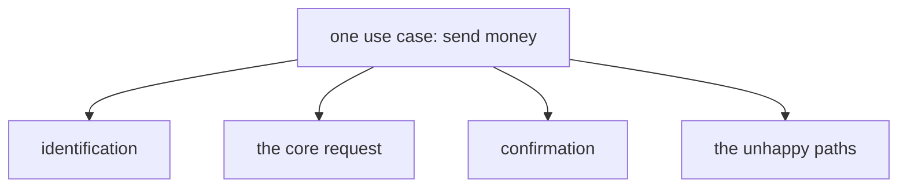

Questi sono **flow separati che si compongono**, non un unico monolite. Trovare le giunture ora ha due vantaggi: **riuso** (l'identification ricorre in quasi ogni caso d'uso bancario, quindi è mappata una volta e costruita una volta) e **implementazione modulare** (le giunture che la mappa registra sono esattamente dove la fase di costruzione dividerà in seguito, quando un flow sovradimensionato avrà bisogno di essere spezzato — [Capitolo 6](#capitolo-6--perché-i-flow-grandi-falliscono-e-come-spezzarli)).

### 1.5 Mappa elaborata: il trasferimento nazionale

Il metodo del [§1.2](#12-un-vocabolario-di-mappatura-bpmn-a-livello-di-intuizione) — partire dall'esito e lavorare a ritroso — è finora stato un principio. Applicato al trasferimento diventa cinque domande, ciascuna che chiede *cosa doveva esistere perché questo accadesse?*:

1. **Cosa deve essere vero quando finisce bene?** **Money moved** dal conto del cliente a quello del destinatario; il **customer informed**; un **auditable record** conservato. Quello è l'**esito** — il bordo destro della mappa.
2. **Cosa doveva esistere perché il denaro si muovesse?** Un'**execution** da parte del **core-banking system**. Le esecuzioni possono fallire, quindi un **execution-error branch** esiste nel momento stesso in cui esiste l'activity.
3. **Cosa doveva esistere prima che il sistema potesse eseguire?** L'esplicita **confirmation** del cliente, perché l'azione è irreversibile. Un cliente può **decline** — anch'esso è un branch, e appartiene al **cliente**, non al sistema.
4. **Cosa doveva essere vero prima che valesse persino la pena chiedere conferma?** I controlli superati: il **recipient is valid**, i **funds are sufficient**, l'**amount is within limits**. Ogni controllo è un **punto decisionale**, e ogni "no" è un **ramo di fallimento**.
5. **Cosa serviva perché i controlli potessero essere eseguiti del tutto?** Un **recipient** e un **amount**, forniti dal **cliente** — e, dietro a tutto, un cliente la cui **identity is established**.

Ogni risposta atterra in uno di cinque contenitori, e i contenitori sono la mappa:

- **Esito (Outcome)** — denaro spostato dal conto del cliente a quello di un destinatario; il cliente informato; un record verificabile conservato.
- **Input (Inputs)** — un cliente autenticato; un destinatario; un importo in euro.
- **Punti decisionali (Decision points)** — il destinatario è valido? i fondi sono sufficienti? l'importo rientra nei limiti? il cliente conferma?
- **Attori (Actors)** — il cliente (fornisce destinatario, importo, conferma), il sistema (verifica, controlla, esegue), e, sulla failure lane, un operatore umano (trasferimenti segnalati o falliti).
- **Rami di fallimento (Failure branches)** — destinatario non valido, fondi insufficienti, oltre il limite, il cliente rifiuta, errore di esecuzione.

Disegnata come una mappa BPMN — l'happy path che corre da sinistra a destra attraverso le sue quattro decisioni nella lane System; il lavoro proprio del cliente sta come activity nella lane Customer, fornendo il destinatario e l'importo fin dall'inizio e approvando o rifiutando prima dell'esecuzione (gli input che l'assistente in seguito farà `collect`); ogni "no" e l'errore di esecuzione cadono nella lane Human operator, dove un'activity di revisione li raccoglie, mentre una conferma rifiutata termina nella lane Customer, poiché rifiutare è un atto proprio del cliente:

![Il trasferimento nazionale come mappa BPMN a tre lane: nella lane Customer, lo start event conduce a un'activity "provide recipient and amount"; la lane System concatena quattro gateway (recipient valid? funds sufficient? within limits? customer confirms?), con il gateway di conferma alimentato dall'activity "approve or decline" del cliente, che conduce a "execute transfer" e a un end event "transfer complete"; il "no" di ogni gateway e l'errore di esecuzione cadono nell'activity "review failed transfer" della lane operatore, e una conferma rifiutata termina nella lane customer](assets/bpmn-domestic-transfer-map.png)

Questa singola mappa porta con sé l'intera lezione. Ogni elemento su di essa ha una destinazione nel design Rasa: i suoi input diventano slot, i suoi gateway diventano branch, le sue activity di sistema diventano action, la sua lane operatore diventa un handoff, e ogni ramo di fallimento diventa un percorso progettato. Il [Capitolo 3](#capitolo-3--la-disciplina-di-traduzione-dalla-mappa-del-processo-al-rasa-flow-design) compie quella traduzione; i capitoli successivi compongono e affinano il risultato.

---

## Capitolo 2 — Pattern per delegare e comporre il lavoro

Prima di mappare un processo sulle primitive di un framework, è utile dare un nome alle forme ricorrenti che il settore usa per scomporre un caso d'uso in unità cooperanti. Questi pattern sono agnostici rispetto al framework: la stessa manciata compare in strumenti dichiarativi come Rasa e in framework di agenti code-first, sotto nomi diversi. Ciò che li distingue è un'unica domanda — **chi decide il passo successivo, il modello o l'autore?**

### 2.1 I pattern ricorrenti

Un framework di agenti code-first, Pydantic AI, inquadra il design multi-unità come una scala di autonomia crescente, da un singolo agente fino al control flow basato su grafo.[^2] Uniti ai workflow pattern che Anthropic cataloga in *Building effective agents*,[^3] le forme che vale la pena nominare sono queste. Ciascuna arriva con uno schizzo della sua forma e con la domanda *quando dovrei usare questo?*

**Routing** — classifica la richiesta, poi inviala lungo il percorso giusto. Un unico passo di classificazione economico davanti a una logica per-categoria.

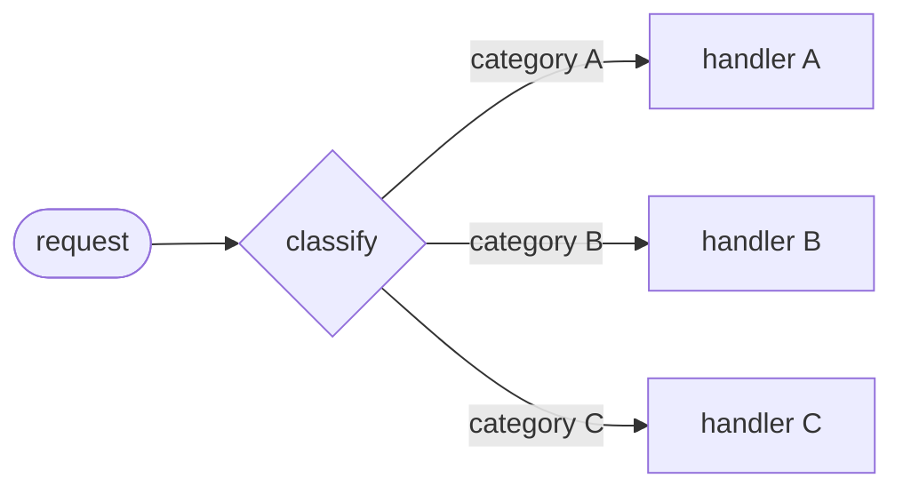

*Quando usarlo:* ci sono categorie distinte di richiesta che è meglio gestire separatamente, e la classificazione può essere fatta con accuratezza — così che ottimizzare un percorso non degradi gli altri.[^3] (Smistare *domande generali* vs *richieste di rimborso* vs *supporto tecnico* in logiche a valle separate è il caso da manuale.)

**Chaining / hand-off** — un'unità finisce e la successiva comincia, senza ritorno. Una pipeline di passi, ciascuno che consuma l'output del precedente.

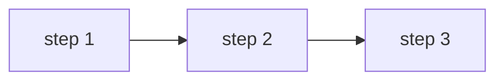

*Quando usarlo:* il task si scompone in modo pulito in sottotask *fissi* eseguiti in ordine, e sei disposto a barattare un po' di latenza con la maggiore accuratezza che deriva dal rendere ogni passo una chiamata più facile e autocontenuta.[^3] (Redigi un documento, poi controllalo, poi traducilo.)

**Orchestrazione con subroutine (delegazione)** — un'unità ne chiama un'altra, che viene eseguita e *restituisce* il controllo al chiamante, come una chiamata di funzione.[^2] La casa della logica condivisa scritta una volta e riusata.

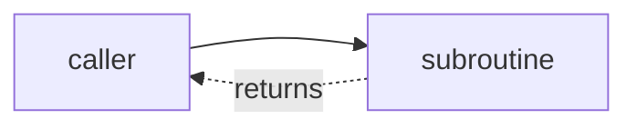

*Quando usarlo:* un pezzo di logica è necessario a più chiamanti, o è abbastanza complesso da isolare, e il chiamante ha bisogno del *risultato* di ritorno per proseguire. (Un passo di autenticazione di cui molte richieste diverse hanno bisogno prima di poter procedere.)

**Human handoff** — un punto progettato in cui una persona subentra, con la conversazione consegnata *con il contesto*.

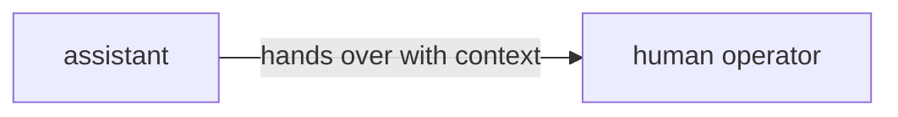

*Quando usarlo:* un passo spetta a una persona per regolamento, propensione al rischio, o perché la confidenza del modello è troppo bassa per agire — il handoff è allora una feature progettata, non un fallimento dell'automazione.

**Control flow basato su grafo** — una macchina a stati esplicita di nodi e transizioni, dove gli archi tra i passi sono dichiarati.

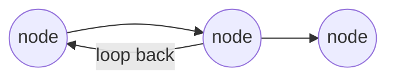

*Quando usarlo:* il control flow è abbastanza complesso — branch, loop, stati rivisitati — che scrivere le transizioni esplicitamente è più chiaro e più sicuro che lasciarle emergere; Pydantic AI riserva il suo livello a grafo esattamente per questi "most complex cases."[^2]

**Agent-to-agent** — agenti indipendenti che cooperano tramite un protocollo, ciascuno proprietario della propria logica.

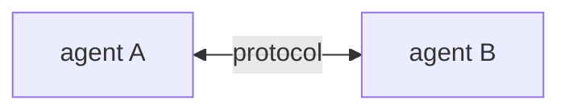

*Quando usarlo:* le unità cooperanti sono sistemi genuinamente separati — di proprietà di team diversi, distribuiti in modo indipendente, scritti in stack diversi — così che si coordinano attraverso un protocollo definito anziché vivere dentro un unico programma.

I Capitoli 3–6 realizzano i primi quattro di questi in Rasa: il routing è la scelta di un flow tramite la sua descrizione in linguaggio naturale (fatta dal *command generator*, il componente LLM che il [Capitolo 3](#capitolo-3--la-disciplina-di-traduzione-dalla-mappa-del-processo-al-rasa-flow-design) introduce), il chaining è lo step `link`, l'orchestrazione-con-subroutine è lo step `call`, e lo human handoff è una lane progettata in un flow. Gli ultimi due — control flow basato su grafo e agent-to-agent — sono dove i framework code-first differiscono di più, e il Capitolo 7 li mostra in Pydantic AI.

### 2.2 Il quadrante dell'autonomia

Sotto ognuno di quei pattern si trova la stessa domanda: **chi decide il passo successivo?** La risposta è un quadrante, non un interruttore. A un'estremità ci sono i **fixed workflows**, dove l'autore fissa i passi e il modello si limita a riempire il linguaggio; all'altra ci sono gli **autonomous agents**, dove il modello sceglie da sé i passi, turno dopo turno.[^3] La maggior parte dei sistemi reali si colloca da qualche parte nel mezzo, decidendo *per ogni passo* se sia il modello o il codice ad avere il comando.

La decisione è raramente libera in un contesto regolamentato. La regola pratica che risolve la maggior parte dei casi limite: **più un'azione è irreversibile, più dovrebbe decidere l'autore.** Il costo di spostare una decisione dal modello al codice è un po' di flessibilità; il costo di spostarla nell'altro senso è una decisione non verificabile in un processo che un regolatore può ispezionare. Una banca non può dire a un auditor "il modello ha giudicato i fondi sufficienti." Comprendere il linguaggio è il lavoro del modello; decidere se il denaro può muoversi è dell'autore.

### 2.3 La decomposizione è il filo conduttore

Ogni pattern qui sopra è un modo per impedire che un'unità faccia troppi lavori. Il routing tiene il classificatore fuori dagli handler; la delegazione tiene la logica condivisa in un unico posto; un handoff tiene il lavoro della persona fuori dall'automazione. Le giunture trovate sulla mappa del processo nel Capitolo 1 ([§1.4](#14-un-caso-duso-diversi-flow)) — identification, the core request, confirmation, the unhappy paths — sono esattamente dove avviene questa delegazione. La decomposizione non è un dettaglio implementativo bullonato in seguito; è la forma che la mappa ha già disegnato, e il resto della lezione è la disciplina di costruire in aderenza ad essa.

---

## Capitolo 3 — La disciplina di traduzione: dalla mappa del processo al Rasa flow design

Tradurre un processo mappato in un design Rasa cambia la sintassi di destinazione, non l'analisi sottostante: la mappa ha già preso ogni decisione di cui il design ha bisogno, quindi la derivazione è quasi meccanica. Questo capitolo deriva il Rasa flow dalla [mappa elaborata del §1.5](#15-mappa-elaborata-il-trasferimento-nazionale).

Alcuni termini Rasa sono portanti da qui in avanti. L'architettura in cui questa lezione lavora è **CALM** (Conversational AI with Language Models), che divide il lavoro in due: un language model trasforma il messaggio aperto del cliente in *command* strutturati, e un motore deterministico esegue la logica di business dichiarata. Il componente che compie l'interpretazione è il **command generator**; legge il messaggio dell'utente insieme a una descrizione dei flow disponibili ed emette command come `start flow <name>` e `set slot <name> <value>`. Un **flow** è un processo di business dichiarato — una sequenza ordinata e nominata di **step**, scritta in YAML sotto una chiave `flows:` — ed è l'unità di logica di business in CALM. I tipi di step in gioco sono `collect` (chiedi al cliente un valore e memorizzalo in uno slot), `action` (esegui codice server-side o invia una risposta), e una clausola `next` (ramifica su un *predicato* sugli slot); il Capitolo 4 ne aggiunge altri due.

### 3.1 La tabella di traduzione

Ogni riga della tabella è una domanda a cui si può rispondere dalla mappa; la disciplina è porsela una volta per ciascun elemento.

| Sulla mappa del processo | Nel design Rasa | La decisione da prendere |
|---|---|---|
| Un input | Uno **slot** | **Chi può asserire questo valore?** `from_llm` se il cliente può dichiararlo in conversazione; `controlled` se solo il backend può |
| Un punto decisionale (gateway) | Un **`next` branch** con un predicato | Quale slot legge il predicato, e chi lo ha compilato? |
| Un'activity di sistema | Uno **step `action`** | Sostenuto da una custom action; il risultato torna attraverso uno slot `controlled` |
| Un'activity rivolta al cliente | Uno **step `collect`** (più una risposta) | Le domande di conversation design del [Capitolo 5](#capitolo-5--la-raccolta-degli-slot-come-conversation-design) |
| Una lane operatore | Un **punto di handoff** | Nominato e progettato qui; i *meccanismi* sono una lezione successiva |
| Un ramo di fallimento | Un **unhappy path progettato** | Scritto deliberatamente nello YAML, non scoperto in produzione |

Uno **slot** è un pezzo nominato della memoria di lavoro della conversazione; ciascuno ha un **tipo** (`text`, `float`, `bool`, …) e un **mapping** che decide chi può compilarlo.[^4] I due mapping che contano qui sono **`from_llm`** (il cliente può dichiarare il valore e il modello lo estrae) e **`controlled`** (solo il backend può asserirlo — impostato da una custom action o da un payload di bottone, mai inferito dal modello). Questa divisione è il **trust boundary**, applicato a ogni input in fase di progettazione. Una **custom action** è il Python server-side che fa il lavoro che il modello non deve fare — chiamare un'API backend, controllare i fondi, eseguire un trasferimento; viene eseguito dietro l'action server e restituisce i suoi risultati attraverso slot `controlled`. (Scrivere quel Python è un argomento di una lezione separata; qui le action vengono invocate, non costruite.)

Far passare gli input del trasferimento attraverso la prima riga risolve la questione della fiducia per ciascuno:

| Input | Tipo di slot | Mapping | Perché |
|---|---|---|---|
| `recipient` | text | `from_llm` | Lo dice il cliente |
| `amount` | float | `from_llm` | Lo dice il cliente |
| `final_confirmation` | bool | `from_llm` | Lo dice il cliente |
| `has_sufficient_funds` | bool | `controlled` | Solo il sistema di core-banking può asserirlo |
| `transfer_successful` | bool | `controlled` | Solo il sistema — impostato dall'action che esegue |

I due slot `controlled` sono compilati da custom action — il controllo dei fondi imposta `has_sufficient_funds`, l'action che esegue imposta `transfer_successful` — mai inferiti dal modello. Un unico principio governa ogni caso limite qui, e vale la pena enunciarlo una volta chiaramente: **nessun fallimento del modello ha una correzione a livello di prompt.** Un modello che può essere convinto ad asserire un fatto può esserlo da un input che lo sviluppatore non ha mai previsto; la risposta ingegneristica non è una frase migliore in un prompt ma un percorso dichiarato che il modello non può scavalcare — qui, il mapping `controlled`. Nel dubbio, il valore è `controlled`, perché il costo di lasciare che il modello asserisca un fatto verificabile è una decisione non verificabile in un processo regolamentato.

### 3.2 Il flow tradotto

La mappa si traduce riga per riga. Il flow qui sotto adatta il tutorial di money-transfer di Rasa[^5] al caso d'uso del trasferimento: il tutorial modella lo stesso processo — raccogliere un destinatario, un importo e una conferma, e controllare i fondi — e i tipi di slot e i mapping nella tabella qui sopra seguono le decisioni di fiducia prese lì.

```yaml
flows:
  domestic_transfer:
    name: domestic transfer
    description: Help users send money to another person's bank account.
    steps:
      - collect: recipient
      - collect: amount
        description: the amount to send in euros
      - action: action_check_sufficient_funds
        next:
          - if: not slots.has_sufficient_funds
            then:
              - action: utter_insufficient_funds
                next: END
          - else: final_confirmation
```

Due meccanismi in quel blocco cuciono i tre frammenti YAML di questa sezione in un unico flow connesso. **Primo, come funziona il salto.** Un valore nudo dopo `if`/`else` — qui `final_confirmation`, sotto `execute_transfer` — è l'`id` dello step a cui saltare; è per questo che il `collect` di conferma nel blocco successivo porta `id: final_confirmation` e l'action che esegue porta `id: execute_transfer`. L'`id` è l'etichetta; il valore nudo dopo `if`/`else` è il riferimento ad essa. (Dove un branch legge `next: END`, termina il flow invece di saltare.)[^6] **Secondo, da dove viene `has_sufficient_funds`.** `action_check_sufficient_funds` imposta quello slot `controlled` come effetto collaterale quando viene eseguito, server-side, dentro lo step `action` — ed è per questo che il `next` sullo *stesso* step può ramificare immediatamente su `slots.has_sufficient_funds` senza alcun `collect` in mezzo: uno slot che il backend compila non ha bisogno di una domanda.

Il flow prosegue con il gate di conferma — un `collect` su uno slot bool, che ramifica per eseguire o per annullare:

```yaml
      - collect: final_confirmation
        id: final_confirmation
        ask_before_filling: true   # always ask, even if already filled — see Ch.5
        next:
          - if: not slots.final_confirmation
            then:
              - action: utter_transfer_cancelled
                next: END
          - else: execute_transfer
```

E la coda — l'action che esegue e il suo branch di successo/fallimento:

```yaml
      - id: execute_transfer
        action: action_execute_transfer
        next:
          - if: slots.transfer_successful
            then:
              - action: utter_transfer_complete
                next: END
          - else:
              - action: utter_transfer_failed
                next: END
```

Assemblati, i tre frammenti sono un unico flow. Disegnato come il motore lo percorrerà — ogni casella uno step, ogni rombo un predicato `next`, ogni percorso che termina in un `END` esplicito:

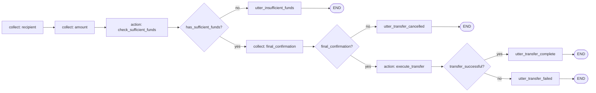

La mappa e lo YAML corrispondono elemento per elemento: ogni gateway è diventato un `next` con un predicato, ogni activity di sistema un'`action`, ogni activity del cliente un `collect`, e ogni ramo di fallimento ha una casa — `utter_insufficient_funds`, `utter_transfer_cancelled`, `utter_transfer_failed`. Due elementi sono deliberatamente lasciati per dopo: la decisione sul superamento del limite si traduce in modo identico (un altro controllo con la sua action e il suo branch), e la lane operatore è nominata ma non costruita — il ramo dell'esecuzione fallita è dove un deployment reale offre una persona, e i meccanismi del handoff sono una lezione successiva.

### 3.3 Le descrizioni sono la superficie di attivazione

Un elemento del flow qui sopra non è come gli altri. La `description` **non è un commento**: è la prosa che il command generator legge quando decide quale flow corrisponde alla richiesta dell'utente — la tabella di routing dell'assistente, scritta in linguaggio naturale.[^7] Quando un cliente digita "I need to move some money to my landlord," il modello confronta quella frase con le descrizioni dei flow e sceglie dove instradare. La description è un'interfaccia consumata dal modello, e ne seguono tre regole:

1. **Scritta dalla prospettiva dell'utente.** Descrive cosa l'utente vuole ("send money"), non cosa il sistema fa ("orchestrate the payment subledger"). Il modello confronta con i messaggi *dell'utente*.
2. **Abbastanza specifica da separare i vicini.** "Manage your money" corrisponderebbe indistintamente a trasferimenti, controlli del saldo e modifiche dei limiti. Descrizioni chiare e dettagliate sono la leva documentata per ridurre gli errori di selezione del flow.[^7] Il test: un flow vicino potrebbe onestamente rivendicare la stessa frase? Se sì, affinala.
3. **Priva di gergo interno.** Nessun nome in codice, nessun vocabolario del sistema di ticket; il modello instrada sulle parole che i clienti usano.

La guida di design ufficiale è che ogni flow dovrebbe concentrarsi su un unico lavoro o esito.[^7] Un flow che fa due lavori ha bisogno di una description che sfuma tra entrambi, si attiva in modo ambiguo rispetto ai suoi vicini, e raddoppia la sua superficie di test. Una frase che non può essere scritta senza una "and" descrive due flow — il primo sintomo del flow sovradimensionato trattato nel [Capitolo 6](#capitolo-6--perché-i-flow-grandi-falliscono-e-come-spezzarli). Nulla di tutto ciò ha richiesto nuova conoscenza di Rasa: slot, step, predicati e action erano già a portata di mano. Ciò che la traduzione aggiunge è la disciplina della derivazione — la mappa decide, lo YAML registra.

---

## Capitolo 4 — Comporre i flow: call, link e lo stack

Il Capitolo 1 ha trovato [diversi flow nascosti dentro un solo caso d'uso](#14-un-caso-duso-diversi-flow); questo capitolo li collega. Rasa offre due tipi di step per passare da un flow a un altro, e il capitolo introduce entrambi prima di tracciare la linea tra di loro. Uno step **`call`** esegue un altro flow come *subroutine*: il controllo lascia il flow corrente, l'altro flow viene eseguito, e il controllo torna per continuare da dove si era interrotto — lo strumento per la logica condivisa di cui un flow ha bisogno *e poi prosegue* oltre. Uno step **`link`** è un *seguito*: termina il flow corrente e ne avvia un altro al suo posto, senza ritorno — lo strumento per "questa conversazione ora riguarda qualcos'altro." Quindi la distinzione che organizza il capitolo è semplicemente **`call` torna indietro e `link` no**, e azzeccarla è ciò che impedisce a un assistente di abbandonare o di resuscitare una conversazione. Entrambi viaggiano su una struttura condivisa, il dialogue stack, introdotta una volta che entrambi i verbi sono a portata di mano.

### 4.1 `call` — la subroutine

Uno step `call` incorpora un child flow dentro un parent. Il child viene **pushato** sul dialogue stack (il registro in tempo reale del motore di quali flow sono attivi — il [§4.4](#44-lo-stack-rivisitato) lo dettaglia), **viene eseguito fino al completamento**, viene **poppato**, e il parent **riprende dallo step successivo al `call`.**[^6] È la chiamata di funzione del flow design: il controllo se ne va, fa il suo lavoro, e torna da dove era partito. Due conseguenze seguono direttamente dal riferimento:

- **Gli slot si propagano tra parent e child.**[^6] Gli slot sono a scope di conversazione, non di flow, quindi un child legge e scrive lo stesso spazio di slot del suo parent. È questo che rende utile un `authenticate_user` chiamato: imposta `slots.authenticated`, e ogni flow sopra di esso nello stack può ramificare su quel valore.
- **Anche le cancellazioni si propagano.**[^6] Un utente che annulla a metà del child non abbandona un parent zombie; uscire dal child porta con sé il parent.

`call` è la casa naturale della logica condivisa. L'esempio canonico è `authenticate_user`: scritto una volta, chiamato da ogni flow che ha bisogno di un cliente autenticato. Ecco di nuovo il trasferimento, con i sotto-processi condivisi estratti in `call` (gli step intermedi sono invariati rispetto al Capitolo 3 ed elisi per focalizzare l'attenzione):

```yaml
flows:
  domestic_transfer:
    description: Help users send money to another person's bank account.
    steps:
      - call: authenticate_user        # child runs; control returns here
      - collect: recipient
      - call: verify_recipient         # child runs; control returns here
      - collect: amount
      # ... funds check, confirmation, execution as in Chapter 3 ...
      - action: utter_transfer_complete
      - link: leave_feedback           # this flow ends; no return
```

La forma è deliberata: i `call` stanno nel corpo, dove il controllo deve tornare; il `link` sta soltanto alla fine, per il motivo che dà il §4.2.

### 4.2 `link` — il passaggio di consegne

Uno step `link` **termina interamente il flow corrente** e avvia il flow nominato come seguito. **Non c'è ritorno.** Il riferimento enuncia chiaramente il vincolo strutturale: i link possono essere usati solo come ultimo step in un flow.[^6] Nulla può essere eseguito dopo un `link`, quindi sta soltanto dove un percorso termina; in un flow ramificato, ogni branch può terminare con il proprio `link`. La sintassi è semplicemente l'id del flow di destinazione:

```yaml
flows:
  order_pizza:
    description: Order a pizza for delivery.
    steps:
      - collect: pizza_kind
      - collect: delivery_address
      - action: action_place_order
      - action: utter_order_confirmed
      - link: leave_feedback        # the order is done; the conversation moves on
```

`link` serve per le transizioni "questa conversazione ora riguarda qualcos'altro", dentro o fuori da qualsiasi dominio: un ordine effettuato → lascia un feedback; un ticket di supporto risolto → compila un sondaggio; una carta bloccata → ordina una sostituzione. Il modello mentale, tenuto come una coppia: `call` è una **chiamata di funzione**; `link` è la conversazione che **cambia capitolo**.

**Gli slot sono condivisi attraverso un `link`?** Solo quelli che sopravvivono a un flow. Gli slot vivono a livello di conversazione, non dentro un singolo flow, quindi il flow collegato *può* leggere qualsiasi slot ancora impostato. Ma un `link` *termina* il flow di origine, e terminare un flow resetta gli slot che ha compilato con `collect` (un default di minimizzazione dei dati che il [§5.5](#55-cosa-lassistente-ricorda) tratta per intero) — quindi il flow collegato **non** eredita i valori di lavoro del flow precedente a meno che quegli slot non siano stati deliberatamente conservati (la lista `persisted_slots`, o valori scritti da una custom action, che persistono di default).[^6] Questa è la differenza sostanziale rispetto a `call`: `call` si limita a *mettere in pausa* il parent, che conserva ogni slot che detiene, mentre `link` *chiude* il parent e lascia che la sua memoria di lavoro si azzeri. Non passare nulla attraverso un `link` e assumi che parta pulito a meno che tu non abbia predisposto diversamente.

### 4.3 I due casi di uso errato

Ciascun verbo usato dove era inteso l'altro espone la distinzione:

- **`link` dove era inteso `call`.** A metà del trasferimento, un `link` a `authenticate_user` termina il trasferimento. Il cliente si autentica con successo — nel vuoto. Il destinatario e l'importo vengono scartati, il processo parent è abbandonato, e il cliente ricomincia da capo.
- **`call` dove era inteso `link`.** Dopo `utter_transfer_complete`, un `call` al flow di feedback esegue il child, poppa lo stack, e riporta il cliente alla coda di un trasferimento che aveva mentalmente chiuso — la conversazione resuscita il passato.

In breve: **link-al-posto-di-call abbandona il parent; call-al-posto-di-link resuscita il passato.**

### 4.4 Lo stack, rivisitato

Entrambi i verbi viaggiano sullo stesso **dialogue stack LIFO** — il registro del motore di quali flow sono attivi, gestito dalla **`FlowPolicy`**.[^8] Quando un flow parte — tramite un command `start flow` dell'LLM, un `call`, o un `link` — viene pushato sullo stack; il flow più in cima è quello attivo; al completamento viene poppato e il flow sottostante riprende da dove era in pausa. Lo stack del trasferimento evolve man mano che il messaggio di apertura arriva e l'autenticazione viene eseguita.

Lo stack è un modo per leggere il movimento — *cosa è attivo in questo momento*. Gli stessi tre momenti, letti come una timeline — *chi passa il controllo a chi, e quando* — rendono esplicita la chiamata-e-ritorno:

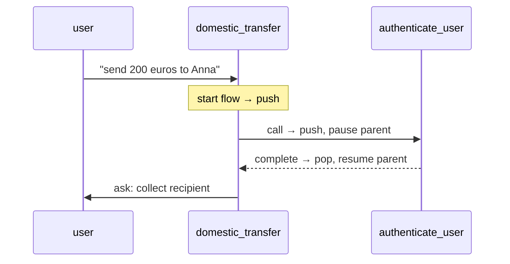

E come stack — *cosa sta in cima, e cosa è in pausa sotto* — attraverso gli stessi tre momenti:

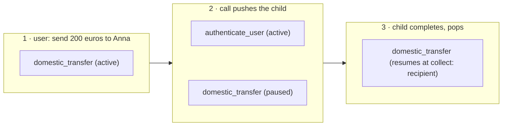

Il command `start flow` pusha `domestic_transfer`; il `call` pusha `authenticate_user` in cima e mette in pausa il parent; il child si completa, poppa, e il parent riprende a `collect: recipient`. In ogni casella la riga più in alto è il flow attivo, in cima allo stack, e qualsiasi riga sotto di essa è in pausa più in basso — quell'ordinamento verticale *è* la posizione LIFO. Questo movimento è visibile in tempo reale nell'**Inspector**, lo strumento per sviluppatori lanciato con `rasa inspect` che mostra una conversazione insieme al dialogue stack e ai command che il modello ha emesso.[^9] La conversation repair viaggia sullo stesso stack: quando un cliente interrompe o corregge a metà di un flow, il meccanismo di repair pusha e poppa su di esso. Composizione e repair sono un unico meccanismo, trattato per intero in una lezione successiva.

### 4.5 Flow guard: controllare ciò che il modello può avviare

La composizione produce flow che esistono solo per servire altri flow — `verify_recipient` non ha motivo di essere avviato da una richiesta del cliente per conto proprio. Tali flow non devono mai essere avviabili direttamente dal command generator, e i **flow guard** completano la storia del controllo. La **proprietà `if` su un flow** (sul flow, non su uno step) è un guard: una condizione che deve valere prima che il command generator possa avviare il flow.[^10] Il caso canonico è un guard sullo stato di autenticazione:

```yaml
flows:
  check_balance:
    description: Show the customer their current account balance.
    if: slots.authenticated
    steps:
      - action: action_fetch_balance
      - action: utter_current_balance
```

Il predicato legge `slots.authenticated`, impostato dal subflow `authenticate_user` chiamato attraverso uno slot `controlled`, quindi il modello non può né avviare il flow protetto né aggirare il guard con l'inganno. L'idioma documentato per un subflow privato è **`if: False`** — un guard che non vale mai, che rende il flow raggiungibile **solo** tramite `call` o `link`:[^10]

```yaml
flows:
  verify_recipient:
    if: False                # never started by the LLM; reachable only via call/link
    description: Verify the transfer recipient details.
    steps:
      - collect: recipient_account
      - action: action_validate_recipient
```

Questo è l'equivalente, nel flow design, di un metodo privato. Se il guard non vale mai, come fa `call` a passare? Perché i guard presidiano soltanto gli avvii iniziati dall'LLM: l'attivazione tramite uno step `call`, uno step `link`, o un intent di trigger NLU aggira interamente il guard.[^10] Questo taglia in due direzioni:

- Il **bypass di call/link è la feature.** È precisamente il motivo per cui `if: False` funziona — il parent può comunque fare `call` di un subflow che il modello non può mai avviare. Senza il bypass, `if: False` renderebbe un flow *irraggiungibile* anziché *privato*.
- Il **bypass di `nlu_trigger` è un caveat di sicurezza.** Un avvio innescato da un intent perfora anche i guard, inclusi i guard di autenticazione.[^10] `nlu_trigger` è un ponte di migrazione ripreso in una lezione successiva, dove questo caveat viene affrontato.

Due fatti completano il quadro. **I guard plasmano il prompt, non solo il permesso:** il prompt del command generator contiene solo i flow attualmente eleggibili sotto i loro guard, e i subflow protetti con `if: False` non compaiono affatto nel prompt.[^10] Questo è sia una vittoria di costo (meno token per turno) sia una vittoria di chiarezza (il modello sceglie tra i cinque flow che può avviare, non tra i quindici che perlopiù non può). Esiste anche la leva opposta: **`always_include_in_prompt: true`** forza un flow nel prompt indipendentemente dalla rilevanza ogniqualvolta il suo guard vale[^10] — il default è `false`, e ogni inclusione forzata tassa ogni turno, quindi la si usa con parsimonia.

L'intera storia dei guard in un'unica immagine — cosa il modello può avviare, cosa non vede mai, e il percorso di composizione che aggira il guard:

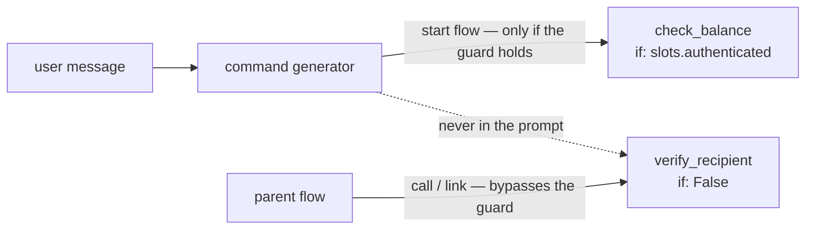

---

## Capitolo 5 — La raccolta degli slot come conversation design

Le lezioni Rasa precedenti hanno coperto `collect` come meccanismo. La raccolta porta con sé anche un peso di design: un cliente non vede mai l'architettura — lo stack, i guard, lo YAML — ma solo le *domande*. Se queste suonino come un banchiere competente o come un modulo burocratico è deciso dal design della raccolta, e ogni proprietà qui sotto è una decisione di conversation design espressa in YAML. Questo è il cuore di ciò che Rasa chiama conversation design (CxD): con CALM, ogni flow può concentrarsi su un compito specifico anziché su un complesso diagramma di branch interconnessi, il che sposta lo sforzo di design dal disegnare branch al plasmare domande.[^11]

### 5.1 La raccolta non è un modulo

Con CALM, i clienti non rispondono a moduli in ordine. Un cliente apre con "send 200 euros to Anna," e il command generator compila `amount` **e** `recipient` da quell'unico messaggio, tramite command `set slot`, ovunque nella conversazione i valori compaiano. Uno step `collect` il cui slot è già compilato viene **saltato**: di default, Rasa chiede solo quando il valore manca.[^6] (Le correzioni viaggiano sullo stesso token `set slot` — il cliente può cambiare l'importo a metà del flow e il motore aggiorna lo slot.) Quindi il design della raccolta non è "scrivi le domande in ordine." Sono due domande più affilate: **quali domande possono essere saltate quando la risposta è già arrivata?** (per la maggior parte degli slot, tutte — richiedere ciò che gli è appena stato detto fa sembrare un assistente rotto), e **che ordine prendono le domande rimanenti?** (identificazione prima dei dettagli della richiesta, dettagli prima dei controlli, controlli prima della conferma — un ordine che la mappa aveva già fissato).

### 5.2 `ask_before_filling` — semantica di conferma per valori sensibili

L'eccezione al salto è **`ask_before_filling: true`** su uno step collect: forza la domanda a essere posta anche quando lo slot è già compilato.[^6]

```yaml
- collect: final_confirmation
  ask_before_filling: true   # ask even if a value already arrived
```

Il meccanismo è deliberato: se lo slot è già compilato quando lo step viene raggiunto, l'assistente lo **azzera, pone la domanda, e lo compila di nuovo** dalla risposta fresca[^6] — così un valore precedente non può mai sostituirsi alla domanda. Questa è la semantica di conferma per i valori sensibili. Previene un fallimento specifico: il cliente dice qualcosa di conciliante tre turni prima, il modello lo legge come un "sì", e un trasferimento viene eseguito senza che una domanda di conferma esplicita sia mai stata mostrata. Un "yes, whatever" pronunciato spontaneamente e sepolto in un messaggio precedente non deve soddisfare silenziosamente la conferma finale di un trasferimento. La regola pratica: **saltare è buona conversazione per l'*informazione* ed è vietato per l'*assenso*.**

### 5.3 Affinare l'estrazione: la description dello step

Uno step `collect` prende la propria `description`, lo strumento di precisione per i valori ambigui:

```yaml
      - collect: amount
        description: the amount to send in euros
```

Questa prosa viene letta dal command generator **al momento dell'estrazione**, esattamente come la description del flow viene letta al momento del routing: è una guida che il modello consulta mentre estrae il valore dalle parole dell'utente.[^6] Senza di essa, "send Anna 200" lascia *200 di cosa* alla congettura del modello — euro, dollari, un conteggio di qualcosa? La description `the amount to send in euros` fissa l'unità, così il modello risolve il numero nel modo in cui il processo intende invece di sceglierne uno. Lo stesso strumento fissa il *formato* e l'*intervallo*, non solo le unità: una description come "a postal code of either 5 or 9 digits" dice al modello che aspetto ha un valore ben formato, restringendo molte letture plausibili di un'espressione disordinata a quella che il flow può usare.[^6] La regola: **se due letture delle parole dell'utente sono possibili, la disambiguazione vive nella description dello step.**

### 5.4 Il pattern di conferma

Prima di qualsiasi azione irreversibile, il design è sempre le stesse quattro mosse, e merita il nome di *pattern di conferma*:

1. Uno **slot bool** (`final_confirmation`), `from_llm`.
2. Un `collect` su di esso con **`ask_before_filling: true`**, così viene sempre chiesto ([§5.2](#52-ask_before_filling--semantica-di-conferma-per-valori-sensibili)).
3. Una domanda che **interpola tutto ciò che sta per accadere** — la risposta stessa del tutorial è il modello: "Please confirm: you want to transfer {amount} to {recipient}?"[^5] — mai "Are you sure?", che non conferma nulla. Il cliente acconsente a specifiche.
4. Un **branch**: confermato → esegui; rifiutato → annulla in modo pulito (`utter_transfer_cancelled`, `END`).

Questo è il gate di approvazione human-in-the-loop, implementato: una conferma deterministica prima di uno step irreversibile, collocata dove la mappa diceva che una persona deve approvare un'azione consequenziale prima che il sistema la esegua. Costa un turno di attrito e compra un assenso del cliente esplicito e registrato, che conta nella revisione delle trascrizioni e nella gestione delle contestazioni.

Per le **sequenze critiche per la sicurezza** esiste uno strumento più forte, **`force_slot_filling: true`** su uno step collect:

```yaml
- collect: otp_code
  force_slot_filling: true   # ignore everything except an answer to this question
```

Per capire cosa fa, ricorda il default: a qualsiasi turno l'assistente elaborerà un'interruzione — l'utente che divaga, o il modello che interpreta erroneamente un messaggio come un cambio di argomento — e si allontanerà dalla domanda corrente.[^6] `force_slot_filling: true` disattiva questo *per un solo step collect*: mentre lo step è attivo l'assistente **ignora ogni altro command e accetta solo il valore per questo slot**,[^6] così l'utente deve rispondere prima che qualsiasi altra cosa possa accadere. È esattamente ciò che vuole l'inserimento di un codice usa e getta (one-time-passcode) — un "actually what's my balance?" fuori tema a metà del codice non deve farlo deragliare. Il compromesso è deliberato: rifiuta anche le interruzioni *legittime*, quindi spetta a dove l'integrità della sequenza pesa più della libertà conversazionale (inserimento OTP, non inserimento dell'importo).

### 5.5 Cosa l'assistente ricorda

Cosa un assistente conserva in memoria dopo che un task è terminato è di per sé una scelta di design, e il default sicuro è **ricordare meno** — un istinto di minimizzazione dei dati che serve qualsiasi applicazione attenta alla privacy: conserva il minimo di cui il lavoro ha bisogno, per il tempo più breve. Ci sono due scenari, un default e un opt-out.

**Il default — dimenticare quando il flow termina.** Gli slot compilati in uno step `collect` o `set_slots` vengono resettati quando il flow si completa.[^12] Questo è il default corretto: un valore di lavoro raccolto per fare un unico lavoro — un importo per un trasferimento, un indirizzo digitato per un ordine — non ha motivo di sopravvivere al task per cui è stato raccolto. La maggior parte degli slot vuole esattamente questo e non ha bisogno di alcuna configurazione aggiuntiva.

**L'opt-out — conservare un valore di proposito.** Quando un valore *dovrebbe* essere riportato avanti, elencalo nel campo a livello di flow **`persisted_slots`**, che esenta quegli slot nominati dal reset di fine flow:[^12]

```yaml
flows:
  set_preferences:
    description: Capture the user's preferred contact language.
    persisted_slots:
      - preferred_language     # survives this flow so later flows need not re-ask
    steps:
      - collect: preferred_language
```

L'uso legittimo è un valore che un task *successivo* dovrebbe riutilizzare anziché richiedere di nuovo — una preferenza dichiarata, una locale scelta — così che all'utente non venga chiesta la stessa cosa due volte. Due limiti sul meccanismo, entrambi fondati nel riferimento: `persisted_slots` può nominare solo slot compilati da uno step `collect` o `set_slots`, e lo stato scritto da una custom action è **già** persistente e **non** deve essere elencato lì.[^12] Quindi "cosa sopravvive" si divide nettamente: i valori di lavoro transitori vengono raccolti e scartati; i valori che vale la pena ricordare o sono persistiti esplicitamente o provengono da un backend che li conserva comunque. Per ogni slot, il destino a fine flow è deciso da come lo slot è stato compilato:

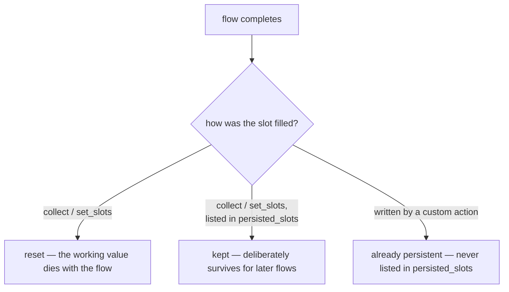

La regola pratica: **i valori di lavoro muoiono con il flow; i valori che conservi deliberatamente gli sopravvivono.** Due argomenti correlati appartengono a lezioni successive: lo scoping degli slot come architettura (quale stato è locale al flow, condiviso nella sessione, o cross-session), e la validazione dell'input sui valori raccolti (rifiutare un inserimento malformato e richiedere di nuovo).

### 5.6 Bottoni contro testo libero

Brevemente, un **channel** è il connettore attraverso cui una conversazione raggiunge l'utente — un widget di web chat, un'app di messaggistica, una linea vocale. Gli stessi flow girano dietro tutti quanti, ma ciascuno rende l'interfaccia in modo diverso: un canale web o di messaggistica può mostrare **bottoni** come elementi cliccabili, mentre un canale vocale non ne ha. Le risposte possono essere adattate per canale esattamente per questo motivo,[^13] ed è lì che il design della raccolta incontra una decisione di canale-e-rischio. Una risposta può portare bottoni i cui payload impostano direttamente gli slot, con la forma di payload `/SetSlots(<slot>=<value>)`:[^13]

```yaml
utter_ask_final_confirmation:
  - text: "Please confirm: transfer {amount} euros to {recipient}?"
    buttons:
      - payload: "/SetSlots(final_confirmation=true)"
        title: "Yes, transfer"
      - payload: "/SetSlots(final_confirmation=false)"
        title: "No, cancel"
```

La pressione di un bottone è un **canale di input deterministico**: lo slot è impostato dal payload, senza alcuna interpretazione del modello tra la pressione e il valore. Quel determinismo è anche il motivo per cui un bottone è uno dei setter permessi per uno slot `controlled` (il trust boundary tracciato nel [§3.1](#31-la-tabella-di-traduzione)). La regola di design: **scelte vincolate dove gli errori sono costosi.** Testo libero per nomi e importi, dove l'espressività vince; bottoni per conferme e scelte categoriali, dove un "sì" interpretato male ha un raggio d'azione ampio.

---

## Capitolo 6 — Perché i flow grandi falliscono, e come spezzarli

Le modalità di fallimento di un flow sovradimensionato derivano da regole già a portata di mano: la description del flow come superficie su cui il modello instrada ([Capitolo 3](#33-le-descrizioni-sono-la-superficie-di-attivazione)), e la composizione tramite `call` e `link` ([Capitolo 4](#capitolo-4--comporre-i-flow-call-link-e-lo-stack)). Considera un monolite: un unico flow `domestic_transfer` con l'autenticazione OTP inline, la verifica del destinatario inline, e una tangente "report a problem" bullonata addosso — quattro lavori indipendenti fusi in un unico flow. Un tale flow è raramente scritto di proposito; si accresce un'aggiunta dall'aria ragionevole alla volta, finché un flow che dovrebbe fare una cosa sola ne porta quattro. Il problema non è la sua lunghezza — un flow lungo che fa un unico lavoro va bene — ma la sua mancanza di giunture: quattro preoccupazioni che dovrebbero essere descritte, attivate, riusate e testate in modo indipendente sono saldate in un'unica unità che non può fare nulla di tutto ciò separatamente. Tre fallimenti seguono poi meccanicamente.

### 6.1 Fallimento 1 — attivazione ambigua

Un flow, quattro lavori → la sua description deve **sfumare** per coprirli: "authenticate the customer and send money and verify recipients and handle problems…". Questa è la logica del [§3.3](#33-le-descrizioni-sono-la-superficie-di-attivazione) su larga scala: la description è la superficie di attivazione, e una description sfumata instrada male in **entrambe** le direzioni — falsi positivi (attivandosi su richieste che non dovrebbe possedere) e falsi negativi (perdendo richieste a favore di vicini meglio descritti). La correzione è strutturale, non editoriale: nessun lavoro di cesello ricava una frase onesta da quattro lavori.

### 6.2 Fallimento 2 — proliferazione dei branch

Ogni sub-lavoro inline **moltiplica** i percorsi attraverso il flow anziché aggiungersi ad essi. I conteggi sono illustrativi, ma la forma è il punto: circa due-tre esiti per sub-lavoro inline, moltiplicati insieme — tre esiti di autenticazione per due di verifica per due di fondi per due di conferma — atterrano attorno alle due dozzine di percorsi attraverso un singolo flow. Una suite di test end-to-end deve percorrerli tutti, e ventiquattro percorsi in un unico flow sono un file di test che non viene mantenuto onestamente. Ogni subflow *composto*, al contrario, è testabile in isolamento: il parent testa solo la propria composizione, e la moltiplicazione non avviene mai.

### 6.3 Fallimento 3 — gonfiore del prompt

Il **flow retrieval** mantiene il prompt gestibile: confronta il messaggio dell'utente con le descrizioni dei flow e include nel prompt dell'LLM solo i migliori candidati.[^14] Il retrieval funziona meglio quando i flow sono piccoli e descritti in modo affilato. Il monolite perde due volte: la sua description sfumata si abbina male, e quando *viene* incluso trascina la sua intera struttura di sessanta righe nel prompt. Flow piccoli e ben descritti significano token meno numerosi e più rilevanti per turno — quindi **la modularità non è solo igiene; è una leva di accuratezza e di costo.**

### 6.4 Il metodo di suddivisione

Le giunture erano già state identificate dalla mappa del Capitolo 1 ([§1.4](#14-un-caso-duso-diversi-flow)): identification, the core request, confirmation, the unhappy paths. Tagliando lungo di esse, due regole di assegnazione sono l'intero metodo:

- I **sotto-processi condivisi e riutilizzabili** diventano subflow raggiunti tramite **`call`**, protetti con **`if: False`** dove il modello non dovrebbe mai avviarli direttamente — fuori dalla superficie di attivazione, fuori dal prompt, raggiungibili solo per progettazione.[^7][^10]
- Le **transizioni di seguito** ("questa conversazione ora riguarda qualcos'altro") diventano flow raggiunti tramite **`link`**.

Per il trasferimento:

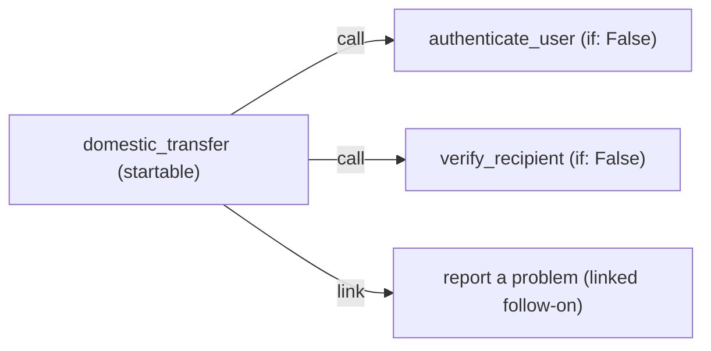

Il monolite cede `authenticate_user` e `verify_recipient` come subflow chiamati, entrambi `if: False` — l'autenticazione in particolare è un macchinario condiviso che anche un flow di card-block o di saldo chiamerà. Lo step di conferma resta nel parent come il suo proprio momento. La tangente "report a problem with this transfer" diventa un `link`, perché quella conversazione riguarda genuinamente qualcos'altro. Questa forma ha un precedente nel template finance fornito da Rasa (`rasa init --template finance`), che struttura i trasferimenti di denaro come un unico flow router avviabile che raccoglie il tipo di trasferimento e poi fa `call` verso subflow protetti. Quando la demo bank del vendor stesso compone in modo così aggressivo, l'idioma è la grana intesa del framework, non stile avanzato.

### 6.5 Euristiche anziché dogma

Nulla di tutto ciò è nuovo. Un flow è codice, e chiedersi quando un flow debba diventare due è la stessa domanda che l'ingegneria del software ha sempre posto a una funzione o a un modulo — il *single-responsibility principle*, la *separation of concerns*, e il *don't-repeat-yourself*, applicati a un blocco `flows:` invece che a una classe. Spezzare un flow è il refactoring **extract-function** sotto un altro nome; proteggere un subflow privato è l'incapsulamento sotto un altro nome. Quindi le euristiche qui sotto sono quelle familiari, e gli istinti esistenti di uno sviluppatore si trasferiscono direttamente. **Non** dividere per numero di righe. Dividi quando vale una di tre condizioni:

1. **La description smette di essere scrivibile in un'unica frase onesta.** Se hai bisogno di una "and", sono due flow — la regola del Capitolo 3 usata come trigger di refactoring, e il single-responsibility principle enunciato per i flow: un'unità, una ragione di esistere.
2. **Un sotto-percorso ha bisogno di riuso.** Il *secondo* flow che ha bisogno di autenticazione è il momento di estrarre `authenticate_user`, non il terzo — *don't-repeat-yourself*, e lo stesso richiamo a estrarre una funzione nel momento in cui compare un secondo chiamante.
3. **Una sezione ha bisogno di un guarding diverso.** Se parte di un flow deve essere avviabile dall'LLM e parte non deve esserlo mai, non possono essere un unico flow — i guard vivono sui flow, non sugli step.[^10] Parti con regole di accesso diverse sono preoccupazioni diverse, e separarle è semplicemente separation of concerns.

L'euristica inversa protegge dall'over-engineering — la stessa cautela del codice ordinario, dove dividere un'unica funzione coesa in frammenti banali danneggia più di quanto aiuti: un flow di tre step con un unico lavoro e un'unica description onesta non migliora se viene diviso in tre flow di un solo step. La composizione serve la description, i test e il prompt; dove nessuno dei tre sta soffrendo, dividere non aggiunge nulla.

---

## Capitolo 7 — Un contrasto code-first in Pydantic AI *(extra)*

L'approccio dichiarativo di Rasa è una posizione scelta contro le alternative, non un'inevitabilità. Affiancare lo stesso caso d'uso del trasferimento a un framework di agenti code-first — **Pydantic AI**, dove lo sviluppatore scrive Python e il framework assorbe il loop, la history e il dispatch dei tool — rende leggibile la scelta dichiarativa. I pattern del Capitolo 2 sono tutti qui; ciò che differisce è chi detiene il control flow.

### 7.1 Lo stesso caso d'uso, code-first

Pydantic AI inquadra il design multi-unità come una scala di autonomia crescente: un singolo agente, poi la **agent delegation**, poi il **programmatic hand-off**, poi il **control flow basato su grafo**, e in cima i "deep agents".[^2] I primi quattro sono le controparti code-first dei pattern nominati nel Capitolo 2; il trasferimento li esercita uno per uno.

**L'agente autonomo (ReAct).** Un `Agent` è un contenitore per istruzioni, tool, e un tipo di output strutturato.[^15] I suoi tool sono normali funzioni Python registrate con un decoratore; a ogni turno il modello sceglie quale tool chiamare, il framework lo esegue e ne riporta indietro il risultato, e il loop si ripete — reason, act, observe — finché il modello produce il tipo di output dichiarato. Il modello sceglie la *sequenza* di passi, limitata da un cap `UsageLimits` che previene un loop fuori controllo:[^15]

```python
from pydantic import BaseModel
from pydantic_ai import Agent, RunContext, UsageLimits

class TransferResult(BaseModel):
    executed: bool
    message: str

transfer_agent = Agent(
    'anthropic:claude-opus-4-8',
    output_type=TransferResult,
    instructions="Help the user send money. Check funds before executing.",
)

@transfer_agent.tool
async def check_funds(ctx: RunContext, amount: float) -> bool:      # code decides
    return await core_banking.has_sufficient_funds(amount)

@transfer_agent.tool
async def execute_transfer(ctx: RunContext, recipient: str, amount: float) -> bool:
    return await core_banking.transfer(recipient, amount)         # code decides

result = transfer_agent.run_sync(
    "send 200 euros to Anna",                                     # model decides the steps
    usage_limits=UsageLimits(request_limit=5),
)
```

Il contrasto con il Rasa flow è già visibile. Qui l'*ordine* — controlla i fondi, poi conferma, poi esegui — non è dichiarato da nessuna parte; vive nelle scelte turno-per-turno del modello, guidate dalla stringa di istruzioni e limitate solo dal request limit. Nel flow del Capitolo 3, quell'ordine è lo YAML.

**L'agent delegation** è la forma code-first di `call`: un secondo agente viene invocato da *dentro* un tool, viene eseguito, e restituisce il controllo al chiamante. Passare `usage=ctx.usage` fa sì che l'uso di token del child conti contro il budget del parent:[^2]

```python
verify_agent = Agent('anthropic:claude-opus-4-8', output_type=bool)

@transfer_agent.tool
async def verify_recipient(ctx: RunContext, recipient: str) -> bool:
    r = await verify_agent.run(f"Is '{recipient}' a valid payee?", usage=ctx.usage)
    return r.output                                              # control returns here
```

**Il programmatic hand-off** è la forma code-first di `link`: codice applicativo ordinario — non un agente — esegue un agente, poi chiama il successivo, senza ritorno nel primo. È l'autore, non il modello, a decidere cosa viene dopo:[^2]

```python
result = transfer_agent.run_sync(user_message, usage_limits=limits)
if result.output.executed:
    feedback_agent.run_sync("Ask the user to rate the transfer.")  # author decides
```

**Il control flow basato su grafo** è la forma senza equivalente Rasa in questa lezione: una macchina a stati esplicita di nodi tipizzati, dove il `run` di ogni nodo restituisce il nodo successivo — o `End` — e l'*autore* scrive quelle transizioni in codice.[^16] La spina dorsale del trasferimento come schizzo di nodi:

```python
from dataclasses import dataclass
from pydantic_graph import BaseNode, End, GraphRunContext

@dataclass
class CheckFunds(BaseNode[TransferState]):
    async def run(self, ctx: GraphRunContext[TransferState]) -> "Confirm | End[str]":
        if not await core_banking.has_sufficient_funds(ctx.state.amount):
            return End("insufficient funds")
        return Confirm()                                          # code decides the edge
```

Attraverso i quattro, un asse si muove: chi decide il passo successivo. L'agente autonomo dà il massimo al modello; il grafo dà il massimo all'autore; delegazione e hand-off si collocano nel mezzo. Questo è esattamente il quadrante dell'autonomia del [§2.2](#22-il-quadrante-dellautonomia), ora espresso in Python invece che in YAML.

### 7.2 Leggere il contrasto

Un framework code-first, basato su grafo, compra *massima espressività*: fan-out dinamico, decisioni del modello a metà esecuzione, strutture dati arbitrarie nello stato, nessun soffitto imposto dal framework. Lo steelman onesto è quello di Anthropic: un agente autonomo si guadagna il suo posto su "open-ended problems where it's difficult or impossible to predict the required number of steps."[^3] Un assistente di ricerca che pianifica la propria indagine è il caso in cui il code-first è la scelta giusta.

Un processo mappato e regolamentato è l'**opposto** dell'open-ended: i suoi passi sono enumerabili proprio perché le regole li hanno enumerati. Per quel caso, la posizione dichiarativa compra cose che il codice non può facilmente ricomprare — a un costo reale, enunciato chiaramente:

| Cosa compra il dichiarativo | Cosa costa |
|---|---|
| **L'artefatto è revisionabile** — un flow YAML diffabile che un process owner può leggere e approvare; una callback di grafo no | Minore flessibilità open-ended, *per progettazione* |
| **La repair è integrata** — interruzioni, correzioni, cancellazioni arrivano come pattern che personalizzi | Lavori entro il modello di repair del framework, non il tuo |
| **La superficie di test è dichiarata** — i flow dichiarati sono percorsi enumerabili che una suite può percorrere | YAML come vincolo, non codice arbitrario |

Un costo che la tabella omette deliberatamente è "un framework da imparare" — perché *entrambi* i paradigmi lo esigono. Pydantic AI è anch'esso un framework, con una curva di apprendimento probabilmente più ripida, dato che lo sviluppatore assorbe anche il loop agentico, lo stato e il control flow che lo strumento dichiarativo tiene fuori dalla vista. La vera differenza non è *se* ci sia un framework ma *chi* può partecipare alla scrittura di uno: un flow dichiarativo è leggibile da analisti e process owner, non solo da sviluppatori, il che allarga la cerchia delle persone che possono revisionare e plasmare la logica — un vantaggio genuino quando il processo è regolamentato e i revisori non sono ingegneri — al costo lieve di coordinarsi lungo quella cerchia più ampia. Il code-first tiene la scrittura dentro il team di ingegneria e dentro codice general-purpose, barattando quell'ampiezza per la massima flessibilità.

Sul quadrante che va dai fixed workflow agli autonomous agent, lo strumento dichiarativo si colloca all'estremità dei workflow **per progettazione**, e per un processo enumerato, regolamentato e rivolto al cliente la forma dichiarativa *è* la più semplice che funzioni.[^3] L'argomento è specifico del dominio, non universale: lo stesso lettore che ricorrerebbe a Pydantic AI per costruire un agente di ricerca che pianifica la propria indagine dovrebbe ricorrere ai flow dichiarativi per far girare un processo di cui le regole hanno già fissato ogni passo.

### 7.3 La prospettiva 2026 — beta, non materiale del corso

La roadmap stessa di Rasa estende lo step `call` oltre i child flow, il tutto attraverso lo stesso step che questa lezione già insegna:

- **Sub-agent** — step autonomi in stile ReAct invocati da un flow (`call: agent_name`, con condizioni di uscita), dove un LLM sceglie quali tool invocare dal contesto della conversazione.[^17]
- **Tool MCP invocati direttamente dagli step call** — un `call:` con un `mcp_server` e mapping di slot di input/output.[^6]
- **Supporto al protocollo agent-to-agent (A2A)** — orchestrare agenti esterni sul protocollo A2A, di nuovo invocati da uno step `call`.[^17]

Il settore chiama la versione più autonoma di questa forma "deep agents" — agenti con pianificazione, delegazione a sub-agent, ed esecuzione in sandbox[^2] — e la stessa cautela si applica a tutto ciò: queste feature di Rasa sono **beta**, e un'API beta non è pronta per la produzione per una banca. Vale la pena riconoscerle per nome, non spedirle. La maestria compositiva di questa lezione persiste attraverso di esse, perché ognuna è invocata da uno step `call` dentro un flow: cosa merita di essere un subflow, cosa è protetto, cosa torna indietro e cosa no sono esattamente le domande che quelle feature compongono. I verbi non stanno cambiando; gli operandi stanno crescendo.

---

## Ulteriori letture

- **[Rasa Pro Tutorial (money transfer)](https://rasa.com/docs/pro/tutorial/).** L'assistente di money-transfer costruito end to end, che copre ogni riga di traduzione del Capitolo 3.
- **[Writing Flows](https://rasa.com/docs/pro/build/writing-flows/).** La guida di design dietro one-flow-one-job e la qualità delle description.
- **[Flow Steps reference](https://rasa.com/docs/reference/primitives/flow-steps/).** La semantica esatta di ogni tipo di step, inclusa la distinzione `call`/`link` su cui questa lezione si impernia.
- **[Starting Flows](https://rasa.com/docs/reference/primitives/starting-flows/).** I flow guard, l'idioma `if: False`, e le eccezioni ai guard (`call`, `link`, `nlu_trigger`).
- **Il template finance fornito** — esegui `rasa init --template finance`. Un assistente demo bank completo composto come descrive il Capitolo 6: un flow router, subflow protetti, step di conferma, un flow di feedback raggiunto con `link`.
- **["Building effective agents"](https://www.anthropic.com/research/building-effective-agents) — Anthropic.** I workflow pattern mappati sulle primitive nominate nel Capitolo 2.
- **[PydanticAI — Multi-agent Patterns](https://pydantic.dev/docs/ai/guides/multi-agent-applications/).** La scala a cinque livelli e i pattern code-first di delegation, hand-off e grafo confrontati nel Capitolo 7.

---

### Sources

[^1]: **"Business Process Model & Notation (BPMN)"** — Object Management Group. [Portal](https://www.omg.org/bpmn/); [version & spec facts](https://www.omg.org/spec/BPMN/2.0/About-BPMN). Source for BPMN 2.0 / ISO/IEC 19510, the stated purpose quote, and the four shapes (events, activities, gateways, lanes) used as informal notation.
[^2]: **PydanticAI — "Multi-agent Applications"** — Pydantic. [ai.pydantic.dev/multi-agent-applications](https://ai.pydantic.dev/multi-agent-applications/). Source for the ladder of multi-unit designs from a single agent up to graph-based control flow.
[^3]: **"Building effective agents"** — Anthropic, December 2024. [anthropic.com/research/building-effective-agents](https://www.anthropic.com/research/building-effective-agents). Source for the workflow patterns (routing, chaining, orchestrator–workers, …) and the workflow-vs-agent / fixed-vs-autonomous framing.
[^4]: **Slots — primitives reference; types, `from_llm` and `controlled` mappings** — Rasa. [rasa.com/docs/reference/primitives/slots](https://rasa.com/docs/reference/primitives/slots/). Source for slot types (`text`, `float`, `bool`) and the `from_llm` vs `controlled` mappings.
[^5]: **Rasa Pro Tutorial (money transfer)** — Rasa. [rasa.com/docs/pro/tutorial](https://rasa.com/docs/pro/tutorial/). Source for the adapted flow's slots, the `amount` collect description, the confirmation response text, and the finance-template router-flow shape.
[^6]: **Flow Steps — primitives reference** — Rasa. [rasa.com/docs/reference/primitives/flow-steps](https://rasa.com/docs/reference/primitives/flow-steps/). Source for `call`/`link` semantics and the last-step constraint, slot/cancellation propagation, the `next`/`END` jump semantics, and the `collect` properties `ask_before_filling`, `force_slot_filling`, and skip-when-filled.
[^7]: **Writing Flows — single-job guidance, description quality, flow retrieval and prompt inclusion** — Rasa. [rasa.com/docs/pro/build/writing-flows](https://rasa.com/docs/pro/build/writing-flows/). Source for "each flow focuses on a single job," descriptions as the routing surface, and subflows guarded `if: False` never appearing in the prompt.
[^8]: **Flow Policy — dialogue stack, LIFO semantics** — Rasa. [rasa.com/docs/reference/config/policies/flow-policy](https://rasa.com/docs/reference/config/policies/flow-policy/).
[^9]: **Trying Your Assistant — the Inspector** — Rasa. [rasa.com/docs/pro/testing/trying-assistant](https://rasa.com/docs/pro/testing/trying-assistant/). Source for `rasa inspect` and the stack/tracker panes.
[^10]: **Starting Flows — flow guards, `if: False`, guard exceptions, `always_include_in_prompt`** — Rasa. [rasa.com/docs/reference/primitives/starting-flows](https://rasa.com/docs/reference/primitives/starting-flows/). Source for the `if` flow guard, the `if: False` idiom, the rule that guards gate only LLM-initiated starts (with `call`/`link`/`nlu_trigger` bypassing them), and `always_include_in_prompt`.
[^11]: **Conversation Design (CxD) with CALM — best practices** — Rasa. [rasa.com/docs/learn/best-practices/conversation-design](https://rasa.com/docs/learn/best-practices/conversation-design/). Source for CxD and the point that a CALM flow focuses on a specific task rather than a complex branching flowchart.
[^12]: **Flows — primitives reference; top-level flow properties incl. `persisted_slots`** — Rasa. [rasa.com/docs/reference/primitives/flows](https://rasa.com/docs/reference/primitives/flows/). Source for the reset-after-flow-ends default and the `persisted_slots` opt-out.
[^13]: **Responses — primitives reference; button payloads** — Rasa. [rasa.com/docs/reference/primitives/responses](https://rasa.com/docs/reference/primitives/responses/). Source for the `/SetSlots(slot=value)` button-payload syntax.
[^14]: **LLM Command Generators — reference; flow retrieval** — Rasa. [rasa.com/docs/reference/config/components/llm-command-generators](https://rasa.com/docs/reference/config/components/llm-command-generators/). Source for flow retrieval including only top-matching flows in the prompt.
[^15]: **PydanticAI — "Agents"** — Pydantic. [pydantic.dev/docs/ai/core-concepts/agent](https://pydantic.dev/docs/ai/core-concepts/agent/). Source for the `Agent` as a container for instructions, tools, and an output type; the tool decorator and `RunContext`; `run_sync`/`run`; and the `UsageLimits` request/token cap that bounds the agentic loop.
[^16]: **PydanticAI — "Graphs" (pydantic-graph)** — Pydantic. [pydantic.dev/docs/ai/graph/graph](https://pydantic.dev/docs/ai/graph/graph/). Source for typed nodes (`BaseNode`), a node's `run` returning the next node or `End`, and `GraphRunContext`.
[^17]: **Rasa — Sub Agents and Integrating External Agents (beta)** — Rasa. [rasa.com/docs/reference/config/agents/react-sub-agents](https://rasa.com/docs/reference/config/agents/react-sub-agents/) and [rasa.com/docs/pro/build/integrating-external-agents](https://rasa.com/docs/pro/build/integrating-external-agents/). Source for ReAct sub-agents invoked from a `call` step and agent-to-agent (A2A) orchestration, both beta.
