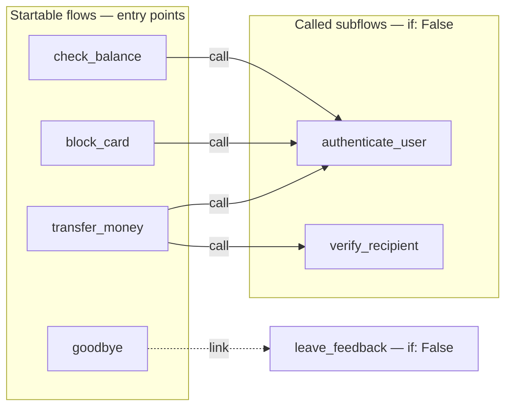
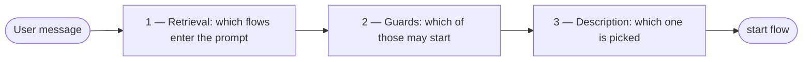
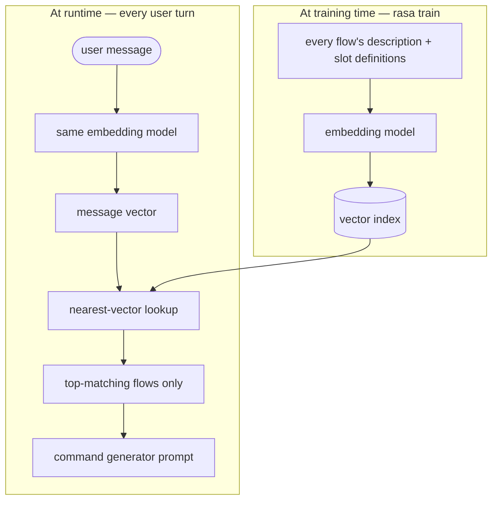
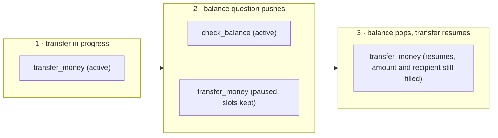
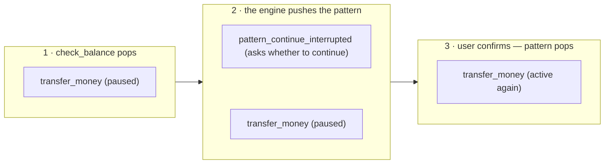
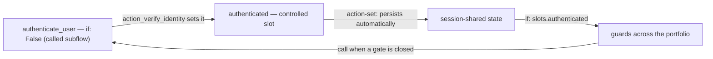
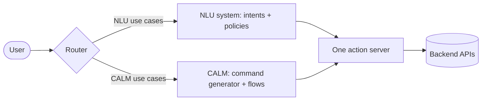
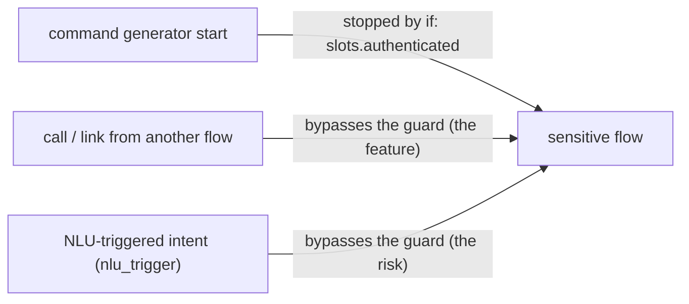

# Day 10 — Multi-Flow Architecture for Real-World Processes

A single business process, decomposed into a few well-composed flows, is one engineering problem; a whole assistant made of dozens of flows is a different one. This lesson treats that second problem. Chapter 1 sorts an assistant's flows into three roles and lays the project out in files that stay navigable as the set grows, then shows how the map of those flows becomes the shared design language between developers and the non-technical people who own the underlying processes. Chapter 2 covers how the right flow gets chosen when many compete: the three mechanisms — retrieval, guards, and descriptions — that run before any flow starts. Chapter 3 handles the two events that only appear at portfolio size: a request that matches several flows (ambiguity) and a user who switches topic mid-process (digression). Chapter 4 is a practical guide to scoping the assistant's shared state — which slot values are flow-local, which survive across flows, which persist past a session — with authentication as the worked case. Chapter 5 is an extra: how a CALM assistant can run beside an existing classic-NLU assistant inside one project. The conceptual treatment of embeddings and retrieval here stays at orientation level; their mechanics are the subject of a later lesson on retrieval-augmented generation.

---

## Chapter 1 — The assistant as a portfolio of flows

When a project holds one business process, the question about a flow is *"is this flow well composed?"* When it holds many, the unit of design changes and so does the question: *"does this **set** of flows behave as one coherent assistant?"* That is a different problem, with failure modes no single flow exhibits in isolation — **ambiguous routing** (a request that matches two flows), **leaking state** (one flow's values surfacing in another), and **prompt bloat** (every flow costing tokens on every turn). The rest of the lesson is about engineering those away.

A short vocabulary, since the chapter builds on it. In **CALM** (*Conversational AI with Language Models*, Rasa's architecture) a large language model is used only to *understand* the user; deterministic, declared logic decides what the assistant *does*. The model emits structured **commands** (such as "start this flow", "fill this slot"); the pipeline component that prompts the model and turns its output into commands is the **command generator**. A **flow** is a declared, step-by-step business process written in YAML, with an `id`, a natural-language `description` the model reads to decide whether the flow fits the request, and a list of `steps`. A **slot** is a named piece of the assistant's working memory.

### 1.1 What a multi-use-case scenario looks like

Take an intentionally simple portfolio — a banking assistant whose customer-facing scope is a handful of independent jobs: block a card, replace a card, send a transfer, check a balance, list recent transactions, find a branch, book an advisor appointment. Each is small; the difficulty is not in any one of them but in their coexistence. A set of flows can each be **individually correct and still behave as an incoherent assistant** — the way a set of microservices can each pass their own tests while the system as a whole misbehaves. The fix in both cases is the same: deliberate architecture.

### 1.2 The three roles of a flow

Every flow in a CALM assistant plays one of three roles, and the role decides how the flow is written, guarded, and described.

1. **Startable flows** — user-facing, and triggerable by the command generator. Each owns **one honest description**: if a flow cannot be described in one honest sentence, it is really two flows. These are the flows a user can *ask for* — `transfer_money`, `block_card`, `check_balance`.
2. **Called subflows** — shared machinery reached only through a `call` step from another flow: authentication, recipient verification. A `call` runs another flow as a **subroutine** and *returns* to where it left off, whereas a `link` hands off permanently and does not return[^1]. Subflows are guarded `if: False` — the `if:` property is a boolean condition on a flow, and `if: False` makes a flow un-startable by the model, so it is reachable only from another flow and never started by the chat model directly[^2]. They are written once and reused everywhere.
3. **Linked follow-ons** — post-completion transitions reached through a `link` step used as a flow's *last* step: a feedback flow after a goodbye, a satisfaction question after a completed process. There is no return, by design — the conversation has moved on.

Rasa's own `finance` project template — a complete demo bank assistant scaffolded from Rasa Pro — is built exactly this way: a handful of startable flows sit on top of subflows guarded `if: False`, with `link` used for follow-ons. Its `goodbye` flow shows all three roles in six lines:

```yaml
flows:
  goodbye:
    description: Handle user goodbye messages, say farewell, and collect feedback
    steps:
      - action: utter_goodbye
      - link: leave_feedback
```

`goodbye` is a **startable** flow with one honest description; its last step `link`s to `leave_feedback`, a **linked follow-on**; and `leave_feedback`, declared elsewhere, carries `if: False` so the model can never start it directly — it is reachable only by this `link`[^2]. Sorting a portfolio this way is the first design step:

| Role | Flows |
|---|---|
| Startable | `block_card`, `replace_card`, `transfer_money`, `check_balance`, `list_transactions`, `find_branch`, `book_appointment` |
| Called (`if: False`) | `authenticate_user`, `verify_recipient` |
| Linked follow-ons (`if: False`) | `leave_feedback` |

### 1.3 Project layout at scale

Many flows also mean many files: without layout discipline, adding the fortieth flow means a slow search through unfamiliar files instead of a quick addition. The scaffold templates are a useful precedent to borrow from when getting started:

- The `default` template ships **one flow per file** under `data/flows/`, and a **domain split per topic** under `domain/`.
- The `finance` template goes further at its larger size: per-topic *directories* on both sides — `data/accounts/`, `data/cards/`, `data/transfers/` — mirrored by `domain/accounts/`, `domain/cards/`, and so on, with shared slots collected in one `_shared.yml`.

A portfolio of moderate size adopts the same per-topic split:

```text
data/flows/
  accounts/      check_balance.yml, list_transactions.yml
  cards/         block_card.yml, replace_card.yml
  transfers/     transfer_money.yml, verify_recipient.yml
  branches/      find_branch.yml
  appointments/  book_appointment.yml
  shared/        authenticate_user.yml, leave_feedback.yml
domain/
  accounts.yml  cards.yml  transfers.yml  branches.yml
  appointments.yml  shared.yml
```

**Searchable naming** is the convention that makes this layout pay off: one name is reused across every artifact of the same use case. The flow `block_card` lives in `block_card.yml`, asks via `utter_ask_…` responses named after its slots, and is tested in a file of the same name — so a single project-wide search for `block_card` (the editor's search-in-files, or `grep -r block_card .` in a terminal) returns everything involved in blocking a card, and answers "what happens when a customer blocks a card?" at any portfolio size. The one formal constraint is that flow IDs may contain alphanumerics, underscores and hyphens and must not start with a hyphen[^3]; `snake_case` satisfies it, and the `pattern_` prefix is left to Rasa's built-in repair patterns ([Chapter 3](#chapter-3--when-flows-collide-ambiguity-and-digressions)).

### 1.4 Mapping the portfolio

When designing or growing a portfolio, keep a one-page diagram of every flow and its `call`/`link` edges — startable flows as entry points, subflows as shared internal nodes, linked follow-ons as exits. Nothing in Rasa requires this artifact; it is a quality-of-life improvement, kept in the repository as documentation and shared with the team. A representative cut, trimmed to a few flows so the edge types stay legible:



The argument for keeping this diagram current is organizational, not technical. The people who own a business process — the staff who actually run card blocking, disputes, or appointment booking — are rarely the people who write YAML, yet they are the authority on whether the assistant does the right thing. Because CALM flows and their edges are *declared* rather than buried in imperative code, this map can be read by someone who has never opened a flow file: it is the shared design language between the developers and those process owners. A few practices keep it usable across that mixed audience:

- **Name flows for the process, not the implementation.** A process owner can find `block_card` and `replace_card` on the page and confirm the assistant distinguishes them; a name like `card_handler_v2` tells them nothing. The same naming discipline that helps `grep` helps the non-technical reader.
- **Keep the map current as the source, not as documentation that drifts.** Every new flow enters the diagram when it enters the project, so the page is always the real wiring. A map that lags the code is worse than none, because it invites confident wrong answers.
- **Review the map with process owners at design time**, before flows are built — it is cheaper to discover "balance should re-check identity" on a diagram than after the flow is written. The map is where a developer and a domain expert agree on *what connects to what* in a vocabulary both share.

---

## Chapter 2 — Steering activation: descriptions, guards, and retrieval at scale

When many flows compete, the command generator's job gets harder: more candidates, more chances to pick wrong, more tokens per turn. Three mechanisms run **in sequence** before any flow starts, and each is a design lever the developer owns:



1. **Retrieval** decides which flows are *in the prompt at all*.
2. **Guards** decide which of those flows are *eligible* to be started.
3. **The description** decides which eligible flow the command generator actually *picks*.

Each fails differently, so each is treated separately.

### 2.1 Flow retrieval, conceptually

Flow retrieval narrows the field before the model ever chooses: it matches the incoming user message against all flows and includes only the top-matching flows in the prompt, keeping prompt size and token cost manageable as the assistant grows[^4]. The matching is *embedding-based*. An **embedding** turns a piece of text into a vector — a list of numbers that captures its meaning, positioned so that texts about similar things sit near each other. Each flow's description is embedded into a vector; the incoming message is embedded the same way; the flows whose vectors sit nearest the message's win. Concretely, `rasa train` embeds each flow's description and slot definitions into vectors and stores them in an index at training time, so matching at runtime is a fast nearest-vector lookup rather than a fresh computation[^5]. The figure below traces the two halves — what training prepares, and what happens on every turn:



This conceptual sketch is all that is needed here; how embeddings and retrieval work in depth is the subject of a later lesson on retrieval-augmented generation.

Two consequences follow:

- **Description quality is a *retrieval* concern before it is a *selection* concern.** A flow whose description does not match the user's words never enters the prompt — and the command generator cannot pick a flow it never saw. A vague description is therefore not only a routing problem; at scale it is an *invisibility* problem, and it **fails silently** — nothing logs an error; the flow is simply never offered.
- **Retrieval is the cost lever.** Every flow in the prompt costs input tokens on every turn. Small, well-described flows keep the candidate set sharp and the prompt short, so modularity is an accuracy *and* a cost decision at once. Subflows guarded `if: False` are excluded from the prompt entirely[^2][^4], so a large block of shared machinery costs prompt space only for the single startable flow that enters it.

Flow retrieval is configured on the command generator's entry in `config.yml`, under the `flow_retrieval` property, and is **enabled by default**[^5]:

```yaml
# config.yml
pipeline:
  - name: CompactLLMCommandGenerator
    llm:
      model_group: openai_llm
    flow_retrieval:
      active: true    # the default — set to false to disable
```

Retrieval is a scale mechanism, so the small scaffold templates ship with it switched off (`active: false`) — their portfolios fit comfortably in one prompt. The real design question is at what portfolio size retrieval becomes necessary: a ten-flow assistant may not need it; a fifty-flow one does, and its descriptions must be written *for* retrieval before it is turned on. `always_include_in_prompt` is the narrow opposite lever — an optional boolean (default false) that, when true and the guard passes, forces a flow into the prompt regardless of relevance scoring[^2] — fit for a global help or cancel flow that retrieval should never filter out, at the cost of permanent prompt weight on every turn, so it is used sparingly.

### 2.2 Description discipline at scale: write contrasts

At portfolio size, the recurring description failure is **neighbors**: pairs of flows close enough in meaning that one plausible message matches both — card *block* versus card *replacement*, *balance* versus *transactions*. Descriptions therefore stop being written one at a time; the technique is to **write descriptions as contrasts — say what the flow is *not* for whenever a neighbor confuses**:

```yaml
flows:
  block_card:
    description: |
      Immediately block a card that is lost, stolen or compromised, so it
      cannot be used. Does not order a replacement card.
    steps:
      # ...
  replace_card:
    description: |
      Order a replacement for a card that is damaged, expired or already
      blocked. Does not block an active card.
    steps:
      # ...
```

The two "Does not …" sentences do the separating work twice over: they pull the descriptions' embedding neighborhoods apart (helping retrieval) and they tell the command generator exactly where the boundary lies (helping selection)[^4]. Overlapping descriptions are not *wrong* — they simply push the resolution onto a clarification turn at runtime, which the engine handles correctly ([Chapter 3](#chapter-3--when-flows-collide-ambiguity-and-digressions)). The contrast technique trades that recurring runtime tax for a one-time design-time effort: separate the neighbors now, so the user is not asked to disambiguate later. The craft rules for a single flow's description carry over — written from the user's perspective, free of internal jargon — with one addition for scale: **review descriptions as a set**, reading all startable flows' descriptions side by side and hunting overlaps the way one reviews API routes for collisions.

### 2.3 Guards as architecture

A flow guard is the `if:` property introduced with the three roles in [§1.2](#12-the-three-roles-of-a-flow) — a boolean condition gating whether the command generator may start a flow[^2]. At portfolio size guards stop being a per-flow detail and become *architecture*: they partition the whole assistant by conversation state. Two use cases recur:

- **The authentication gate.** Every sensitive flow is guarded on a single authentication slot, set by one `authenticate_user` subflow that acts as the gatekeeper (the design is completed in [Chapter 4](#chapter-4--cross-flow-state-slots-as-shared-memory)):

  ```yaml
  flows:
    transfer_money:
      description: Send money from the customer's account to another person or business.
      if: slots.authenticated
      steps:
        # ...
  ```

- **Commercial segmentation.** The same lever expresses entitlement: a premium-only service can be guarded on a `customer_segment` slot that a custom action fetched at session start:

  ```yaml
  flows:
    premium_advisory:
      description: Book a dedicated session with a personal investment advisor.
      if: slots.customer_segment = "premium"
      steps:
        # ...
  ```

At portfolio scale, the guard's most important consequence is a **security property**. Because a flow whose guard evaluates false is excluded from the command generator's prompt entirely[^2][^4], an unauthenticated user's command generator never even *sees* `transfer_money` — there is no prompt to inject against, no description to socially-engineer. The guard is deterministic logic outside the model, which is the only reliable place to fix an LLM failure — no prompt wording achieves the same guarantee. The model cannot start what it cannot see.

The same property matters for **debugging**: a false guard produces no error and no log line — the flow is simply *absent*. At portfolio size, **"why won't this flow trigger?"** most often resolves to a guard evaluating false, which makes the guard the first thing to check. One nuance bounds this: guards gate only *model-initiated* starts, so a `call` or `link` reaches a flow regardless of its guard[^2] — the very property that keeps an `if: False` subflow callable by its parent. (A third activation path, an NLU-classified intent, also bypasses guards; it appears only in the coexistence architecture and is treated in [Chapter 5](#chapter-5--coexistence-running-calm-beside-an-nlu-assistant-extra).)

### 2.4 Beyond one assistant

The three levers of this chapter — retrieval, guards, descriptions — scale a portfolio *within one assistant*, and for most portfolios that is the whole story. A second decomposition axis exists above it: Rasa can also split work across **agents**. A flow can delegate a bounded task to a **sub agent** — a separately configured agent that the flow invokes as one of its steps[^6]. When the agents involved are built and deployed independently — by another team, on another framework, or outside the organization entirely — Rasa connects them through the **A2A (Agent-to-Agent) protocol**: an open standard for communication between AI agents, originally developed by Google and since donated to the Linux Foundation, that gives agents a common way to discover each other, delegate tasks, and share results without exposing their internals to one another[^7]. Through A2A an assistant can call other assistants from a flow, or be exposed as an agent that other systems call. The selection problem stays recognizably the same at that level: because a sub agent is only ever reached through a flow, deciding *which agent* handles a request is still the flow selection this chapter tuned. The mechanics of that layer, and the judgement of when a portfolio warrants splitting across agents at all, are treated later in the course; within this lesson, one assistant owns the whole portfolio.

---

## Chapter 3 — When flows collide: ambiguity and digressions

When dealing with a large portfolio, the most common and inevitable collision events are **ambiguity** — a request that matches several flows — and **digression** — a user who switches topic mid-process. Both are an obvious consequence of dealing with natural language, so neither is an error. Rasa provides built-in flows (**conversation patterns**) to handle both of them; the sections below cover what happens in each case and which design levers make the events rare and graceful.

### 3.1 Ambiguity

When a request genuinely matches several flows, the command generator does **not** guess. It emits a **disambiguation command** — the token is `disambiguate flows <name1> <name2> …`[^8]. For a portfolio with both card flows, the bare message "problems with my card", carrying no further signal, produces `disambiguate flows block_card replace_card`. That command triggers the built-in **`pattern_clarification`** flow, which presents the candidates and asks the user to choose[^9].

The design stance: **clarification is correct behavior, but every clarification is a small UX tax.** The engine did the right thing — it refused to guess about a customer's card — yet the customer paid an extra turn, and a slower one. The goal is *not* to suppress clarification (that would mean guessing); it is to make clarification *rare* by resolving ambiguity upstream with the description contrasts of [§2.2](#22-description-discipline-at-scale-write-contrasts). The "does not order a replacement / does not block an active card" pair resolves most card ambiguity before it reaches the engine; what remains — "problems with my card", with nothing to disambiguate on — is *genuine* ambiguity, and asking is the honest answer. During testing, keep a short list of the phrases that trigger clarification: each is either a description bug to fix or a genuine ambiguity to accept.

### 3.2 Digressions

The second event: a user mid-transfer asks "wait — what's my balance?" Nothing is wrong; people converse this way, interleaving a quick side question into a task and expecting to pick the task back up — conversational behavior to *handle*, not an error to *prevent*. The machinery is the LIFO **dialogue stack** — the engine's running record of which flows are active, newest on top: the command generator starts the new topic, which pushes onto the stack above the paused transfer, runs to completion, and pops, and the interrupted transfer is then offered for resumption[^10]. Because the stack preserved the parent's frame, the paused flow's slots are still filled when it resumes — the customer does not re-enter the amount and recipient they already gave. The figure below traces the three stack moments:


At portfolio size, digression also becomes a *design* concern: which flows make sensible interrupters. A balance check interrupting a transfer is helpful — the customer may be checking they can afford it; a *second* transfer interrupting a transfer is a source of confusion. The portfolio map ([§1.4](#14-mapping-the-portfolio)) is where those interrupt relationships get thought through, and the slot-frame guarantee above is what makes a well-chosen interruption cheap: the side-trip costs the customer a question or two, not their place in the task.

Blocking a bad interrupter uses the guard machinery of [§2.3](#23-guards-as-architecture). A boolean slot marks the flow as running — the flow's first step sets it, and the guard requires it to be unset:

```yaml
flows:
  transfer_money:
    description: Send money from the customer's account to another person or business.
    if: slots.authenticated and not slots.transfer_in_progress
    steps:
      - set_slots:
          - transfer_in_progress: true
      # ... collect amount, recipient, confirmation ...
```

While a transfer runs, `transfer_in_progress` is true, the guard is false, and `transfer_money` leaves the startable set — the command generator cannot start a second one, while `check_balance`, which carries no such condition, stays a legal digression. When the flow ends, the end-of-flow reset clears the slot (a `set_slots` slot, not persisted)[^3] and the flow becomes startable again. For a step during which *no* digression is acceptable — the final confirmation of a payment, say — a `collect` step can set `force_slot_filling: true`, which makes the assistant ignore every command except filling that slot[^1].

The flow that offers the resumption is a built-in pattern, **`pattern_continue_interrupted`**[^9]. A pattern is itself a flow, so it runs on the same dialogue stack: when the interrupting flow pops, the engine pushes the pattern above the paused flow; the pattern asks whether to continue and pops in turn, leaving the paused flow active again[^9][^10]. The figure below expands the hand-back — moment 3 of the previous figure:



Every pattern is customizable, at three depths[^11]:

1. **Wording only** — a pattern's questions and messages are ordinary responses with default text; redefining the response key in the domain's `responses:` section (for this pattern, `utter_ask_continue_interrupted_flow_confirmation`) replaces the text without touching any flow.
2. **Behavior** — declaring a flow with the pattern's exact name (`pattern_continue_interrupted`) in the project's flow files replaces the default flow entirely; the default implementations are published in the reference documentation and are the natural starting point to copy and edit[^9].
3. **Logic** — the default actions a pattern calls (here `action_continue_interrupted_flow`, the step that actually resumes the paused flow) can be swapped for custom actions written in the action server and referenced from the override flow.

A retrain is required after any of the three. The judgment is *when* to do so. Rasa ships and maintains these patterns precisely so every assistant need not reinvent digression handling, correction, or cancellation; an override means taking on the burden of keeping that behavior correct and tested yourself. So customize for a real, specific need — brand-consistent wording, an extra confirmation, a hand-off to a live agent — and otherwise leave the tested default in place. Overriding a pattern to re-implement what it already does well is effort spent re-deriving, and re-testing, behavior Rasa already carries.

---

## Chapter 4 — Cross-flow state: slots as shared memory

For a single flow, slot design is *collection* design — which questions to ask. Across a portfolio, slots become the assistant's **shared memory**, and every slot needs a deliberate **scoping decision**, as deliberate as choosing a variable's scope in code. This chapter is the method for making that decision per slot: who may write the value, and how long it lives.

The word *session* appears in every scope decision below, so its mechanics come first. A **conversation session** is one continuous interaction window between the user and the assistant — a single visit; the same conversation can span several sessions over its lifetime. A session begins when the user opens the conversation, when a message arrives after a configurable period of inactivity, or when a `/session_start` message forces one manually[^12]. The inactivity window is set in the domain under `session_config` (`session_expiration_time`, in minutes — `60` by default, `0` for sessions that never expire), and every session start runs the built-in action **`action_session_start`**, which by default copies all currently set slots into the new session — a carry-over behavior that [§4.1](#41-scoping-a-slot-two-axes)'s third scope setting decides deliberately[^12].

### 4.1 Scoping a slot: two axes

Each slot sits on two axes. The first, **trust** — *who is allowed to write it* — is fixed by the slot's **mapping**. A `controlled` mapping makes the slot settable only by a custom action or response buttons — the model can never reach it, so everything security-sensitive lands on this side. `from_llm` lets the model set the slot from what the user said; `from_entity` and `from_intent` let the classic NLU layer set it, in the coexistence setup of [Chapter 5](#chapter-5--coexistence-running-calm-beside-an-nlu-assistant-extra)[^13].

The second axis is **scope** — *how long the value lives* — with three settings, cheapest first:

1. **Flow-local** (the default): working values that die with the flow. A `collect` step's slot is cleared when its flow ends[^1], with nothing to declare:

   ```yaml
   flows:
     transfer_money:
       steps:
         - collect: amount       # both cleared when the flow ends
         - collect: recipient
   ```

   A transfer's `amount` and `recipient` should not carry into the next topic, so the default is correct.

2. **Session-shared**: state that must survive *across flows within a session* — authentication above all. The flow-level **`persisted_slots`** property exempts the listed slots from the end-of-flow reset, so a later flow need not re-ask[^3]:

   ```yaml
   flows:
     transfer_money:
       persisted_slots:
         - recipient             # survives the flow's end — a follow-up flow can reuse it
       steps:
         - collect: amount       # still cleared when the flow ends
         - collect: recipient
   ```

   The portfolio-level point is the *scope decision* the property encodes — declaring a value session state rather than a working value.

3. **Cross-session**: facts carried into the *next* session. The lever is `session_config.carry_over_slots_to_new_session` in the domain — and its shipped default is `true`[^12]:

   ```yaml
   session_config:
     session_expiration_time: 60             # minutes of inactivity before a new session
     carry_over_slots_to_new_session: true   # the shipped default
   ```

   With the flag `true`, a customer who chose Italian as `preferred_language` this morning is greeted in Italian when they return in the afternoon: the new session's `action_session_start` copied every set slot over. *Every* set slot is also the flag's danger — it is all-or-nothing, so `authenticated` from the morning session would come back too, and per-slot selection means overriding `action_session_start` with a custom action[^12]. The rule of thumb: carry over only low-sensitivity convenience state — a language, a display preference — that makes the next conversation smoother and is harmless if it resurfaces at the wrong moment; authentication state and financial working values never qualify. Since one slot that fails that test condemns the whole flag, an assistant handling personal data sets `carry_over_slots_to_new_session: false` — data minimization expressed as configuration.

### 4.2 The worked case: authentication state

Authentication is the natural working example for both axes: guards across the portfolio read the slot, persistence must keep it alive between flows, and the trust axis must protect it from the model. The subflow that produces it, and the slot itself:

```yaml
# data/flows/shared/authenticate_user.yml
flows:
  authenticate_user:
    if: False          # reachable only via call — never model-started
    description: Verify the customer's identity before sensitive operations.
    steps:
      - collect: customer_number
      - collect: otp_code
      - action: action_verify_identity
```

```yaml
# domain/shared.yml
slots:
  authenticated:
    type: bool
    mappings:
      - type: controlled
```

The slot's mapping, the subflow's guard, the portfolio's guards, and the slot's persistence each carry one guarantee:

- `authenticated` is a **controlled** slot — only a custom action (here `action_verify_identity`) or response buttons may set it; the model can never assert it, because `from_llm` is not among its mappings[^13]. No sequence of user messages, however adversarial, can talk the command generator into setting `authenticated` to `true`. The prompt-injection defense is *structural*, not prompted for.
- `authenticate_user` is a **called subflow**, guarded `if: False` so the model never starts it directly[^2].
- **Guards across the portfolio read the slot**: every sensitive flow carries `if: slots.authenticated`.
- **Persistence keeps it alive between flows**: because `authenticated` is set by a custom action rather than a `collect` step, it persists automatically after the flow ends, so a customer who authenticated for a transfer is not re-challenged for a balance check moments later.



Two boundaries keep this correct. A slot set by a custom action — like `authenticated` — is *already* persistent and must **not** be listed in `persisted_slots` (that field is for `collect`/`set_slots` slots); listing it is a training-time error[^3]. And to clear such a slot from any step — for instance to expire authentication on a timeout — a `set_slots` step sets it to `null`[^1].

### 4.3 Backend state and caching

**Fetch-once-per-session data** — customer segment, account list, daily limit — is a second cross-flow idiom: facts that many flows read and no flow should re-fetch on every use. The shape is the controlled-slot pattern of the authentication case: one custom action fetches the value at first need, writes a controlled slot, and every flow reads it. The idiom's cost is **staleness**: a cached account list is wrong the moment the customer opens an account through another channel. So decide, per cached slot, the refresh trigger — re-fetch per flow, per session, or on demand — and write it down. A cache without a stated staleness policy is a latent bug.

A **slot map**, kept next to the portfolio map of [§1.4](#14-mapping-the-portfolio), makes these decisions reviewable — every slot with its type, trust, and scope on one page:

| Slot | Type | Trust (mapping) | Scope | Notes |
|---|---|---|---|---|
| `authenticated` | bool | controlled | session (auto-persists) | set only by `action_verify_identity`; cleared per re-auth policy |
| `customer_segment` | categorical | controlled | session | backend cache; refresh per session |
| `account_list` | any | controlled | session | backend cache; re-fetch before transfers |
| `amount` | float | from_llm | flow-local | transfer working value; resets with flow |
| `recipient` | text | from_llm | flow-local | |
| `confirmation` | bool | from_llm | flow-local | reused across flows; per-step question overrides |
| `transactions_list` | text | controlled | flow-local | display value; no reason to persist |

Read as a review tool, the **trust** column is the security review in table form — anything the model must never assert is `controlled` — and the **scope** column is the data-protection review in table form: session-shared by declaration, persistent only by written policy.

---

## Chapter 5 — Coexistence: running CALM beside an NLU assistant *(extra)*

A portfolio can widen in one more way: by absorbing an assistant that already exists. A team adopting CALM often runs a **classic NLU assistant** in production — one that resolves each message into two structured facts: an **intent**, the message's purpose chosen from a fixed catalogue (`check_balance`, `block_card`), and its **entities**, the typed values found in the message text — an amount, a card number ([§5.4](#54-training-the-nlu-side-in-brief) shows how both are trained and extracted). Hand-written rules or stories decide what happens next, backed by an action server and years of operational tuning. Rasa supports running both understanding systems inside *one* assistant, so the CALM portfolio grows beside the legacy use cases rather than replacing them all at once. This chapter is an orientation to how that fits together; it is marked extra because it matters only when such a legacy assistant exists.

### 5.1 How the two systems coexist

The coexistence architecture depends on a **routing mechanism**: per conversation, a router — Rasa ships two, the **`IntentBasedRouter`** and the **`LLMBasedRouter`** ([§5.2](#52-the-two-routers)) — decides which system, NLU or CALM, handles the user, and both systems sit behind the *same* action server, so existing backend integrations are written once and serve both[^14].



Once the router sends a conversation to one system, that decision is recorded in a dedicated boolean slot, **`route_session_to_calm`**, and is usually **sticky** — subsequent messages go to the same system without re-engaging the router, so a process started on one side completes there rather than half-running on each. A **non-sticky** decision, by contrast, is re-evaluated every turn and fits only single-turn exchanges such as chitchat, where the next message may belong to either system. Routing state being just a slot means it uses the same shared-memory machinery as [Chapter 4](#chapter-4--cross-flow-state-slots-as-shared-memory), here used by the framework itself. The default action **`action_reset_routing`** releases the decision so the user can move between systems within one session[^15].

### 5.2 The two routers

The two routers differ in how they decide[^15]:

| | `IntentBasedRouter` | `LLMBasedRouter` |
|---|---|---|
| Decides using | the NLU classifier's predicted intent | an LLM classifying the message's destination |
| Character | deterministic; fits a mature, well-tuned intent model | flexible; handles phrasings no intent covers |
| Cost | no extra LLM call | one extra LLM call per routing decision |

A team with a well-tuned intent model usually reaches for the `IntentBasedRouter` first: the routing decision is exactly as deterministic as the classifier it routes on, and it costs nothing extra per turn. The `LLMBasedRouter` trades a per-turn call for the ability to route phrasings the intent model never saw.

### 5.3 The NLU command adapter, and a guarding caveat

The routers split traffic between the two systems per conversation. The **`NLUCommandAdapter`** works at a finer grain: it lets the existing trained classifier *trigger a CALM flow directly*. It reads the predicted intent and, if a flow declares a matching NLU trigger, returns a start-flow command with **no LLM call** at all[^16]. The flow declares it with `nlu_trigger`:

```yaml
flows:
  check_balance:
    description: Show the customer their current account balance.
    nlu_trigger:
      - intent:
          name: check_balance
          confidence_threshold: 0.9
    steps:
      - action: action_fetch_balance
      - action: utter_current_balance
```

If the classifier predicts `check_balance` at or above the confidence threshold, the flow starts directly — reusing the existing intent training data and skipping the model call entirely. The cost saving is controlled by the command generator's `minimize_num_calls` parameter (default `true`): it skips the LLM invocation when the adapter has already issued a start-flow command, so a high-confidence, high-volume intent can cost no LLM tokens on that turn[^5].

This third activation path carries a guarding caveat: **flow guards do not block NLU-triggered starts.** Guards gate only model-initiated triggering; `call`, `link`, and NLU-trigger intents all bypass them[^2]. The consequence is direct — a flow that is both auth-guarded *and* `nlu_trigger`'d is an **authentication bypass**: the guard `if: slots.authenticated` stops the command generator, and the classified intent walks straight past it. The three activation paths into a flow, and which the guard actually stops:



The rule, in either of two safe forms:

1. **Never declare `nlu_trigger` on a guard-gated sensitive flow.** Reserve the adapter shortcut for flows that need no gate — informational lookups, branch finding, a balance check already authenticated at the channel level.
2. **Or re-verify inside the flow**, so it is safe under *every* activation path — a branch on the auth slot that calls `authenticate_user` when needed:

```yaml
steps:
  - noop: true
    next:
      - if: not slots.authenticated
        then:
          - call: authenticate_user
            next: show_balance
      - else: show_balance
  - id: show_balance
    action: action_fetch_balance
```

Here `noop: true` is a do-nothing step whose only job is to host the `next:` decision[^1]: if the customer is not authenticated, `call` the gatekeeper subflow and continue; otherwise skip straight to the business step. Both branches route to `next: show_balance`, so the two paths converge at the one `- id: show_balance` step — the check is now structural, reached regardless of who started the flow. Form 2 is the stronger posture, because it holds even if a later change adds an `nlu_trigger` without the rule in mind.

### 5.4 Training the NLU side, in brief

The routers and the adapter both presuppose a trained classifier, and the NLU side trains from **examples, not descriptions**: the training data is YAML listing real user phrasings grouped by intent, with entities annotated inline as `[text](entity_name)`[^17]:

```yaml
# data/nlu.yml
nlu:
  - intent: check_balance
    examples: |
      - how much do I have on my [savings](account) account
      - what's my [credit](account) balance?
      - what is my current balance
```

From these examples the model learns both predictions at once: classify a new message into one of the known intents, and tag which words fill which entity — so a phrasing never listed still comes out as intent `check_balance` with `account: savings`. The extracted entity is what a `from_entity` slot mapping ([§4.1](#41-scoping-a-slot-two-axes)) reads[^13], and the predicted intent is what the `IntentBasedRouter` and `nlu_trigger` ([§5.3](#53-the-nlu-command-adapter-and-a-guarding-caveat)) consume.

The components that learn this are declared in the same `config.yml` pipeline that hosts the router and the command generator: a tokenizer splits the message, featurizers turn the words into numeric features, a classifier predicts the intent[^18]:

```yaml
# config.yml
pipeline:
  - name: WhitespaceTokenizer           # splits the message into words
  - name: CountVectorsFeaturizer        # turns words into feature vectors
  - name: LogisticRegressionClassifier  # predicts the intent from the features
```

Entity extraction is done by dedicated components in the same list: `CRFEntityExtractor` learns to tag entities from the annotated examples, `RegexEntityExtractor` matches regexes and lookup tables defined in the training data, and `DucklingEntityExtractor` recognizes structured values — dates, amounts of money — out of the box[^18]:

```yaml
# config.yml — extractors are appended to the same pipeline
pipeline:
  # ... tokenizer, featurizers, intent classifier ...
  - name: CRFEntityExtractor            # tags the entities annotated in the examples
  - name: RegexEntityExtractor          # matches regexes and lookup tables from the training data
  - name: DucklingEntityExtractor       # structured values, via a small dedicated server
    url: "http://localhost:8000"
    dimensions: ["time", "amount-of-money"]
```

Each extractor is fed differently. The `CRFEntityExtractor`'s training examples are exactly the annotations already shown — every `[savings](account)` inside the intent examples doubles as an entity-tagging example, so entities learned this way need no separate data section. The `RegexEntityExtractor` instead reads two further block types in the same `nlu.yml`: `regex:` patterns, whose name must match the entity they extract, and `lookup:` tables — lists of known values compiled into one case-insensitive pattern[^17]:

```yaml
# data/nlu.yml — entity training data for the RegexEntityExtractor
nlu:
  - regex: account_number
    examples: |
      - \d{10,12}
  - lookup: banks
    examples: |
      - JPMC
      - Bank of America
```

And `DucklingEntityExtractor` needs no training data at all — its extraction rules come pre-built in the Duckling server, which is why its configuration above points at a `url` rather than at examples.

The whole NLU side trains inside the ordinary `rasa train` run, and `rasa train nlu` trains it alone[^19]; none of these components calls an LLM to classify a message, which is what makes the NLU-served turns of this chapter the cheap ones.

---

## Further reading

- **[Writing Flows](https://rasa.com/docs/pro/build/writing-flows/) — Rasa Docs.** The composition, description, and flow-retrieval guidance behind Chapters 1–2.
- **[Starting Flows](https://rasa.com/docs/reference/primitives/starting-flows/) — Rasa Docs.** The precise guard, `if: False`, and `nlu_trigger` semantics Chapters 2 and 5 depend on.
- **[Flow Policy](https://rasa.com/docs/rasa-pro/concepts/policies/flow-policy/) — Rasa Docs.** The dialogue stack underneath Chapter 3's digressions.
- **[Customizing Patterns](https://rasa.com/docs/pro/customize/patterns/) — Rasa Docs.** When and how to override a built-in repair pattern (Chapter 3).
- **[How does Coexistence work?](https://rasa.com/docs/pro/calm-with-nlu/coexistence/) — Rasa Docs.** The architecture of Chapter 5 in the vendor's own words.
- **The `finance` project template** (`rasa init --template finance`). A complete multi-flow bank assistant exhibiting every lever in this lesson — the three roles, `if: False` guards, shared slots, per-topic layout — worth reading as a reference implementation.

---

### Sources

[^1]: **"Flow Steps" (primitives reference)** — Rasa Docs. The `collect`, `action`, `set_slots`, `link`, `call`, and `noop` step types; `call` returns while `link` does not; clearing a slot with `set_slots … null`; `collect` slots cleared when the flow ends; `force_slot_filling: true` on a `collect` step (ignore every command except the one filling that slot). [rasa.com](https://rasa.com/docs/reference/primitives/flow-steps/).
[^2]: **"Starting Flows" (primitives reference)** — Rasa Docs. Flow guards (`if:`), the `if: False` idiom, `always_include_in_prompt`, `nlu_trigger`, and the rule that guards gate only model-initiated starts while `call`/`link`/NLU triggers bypass them. [rasa.com](https://rasa.com/docs/reference/primitives/starting-flows/).
[^3]: **"Business Logic with Flows" (concepts)** — Rasa Docs. Flow-level keys including `persisted_slots`, `nlu_trigger`, `description`, and flow-ID naming rules (alphanumerics/underscores/hyphens; no leading hyphen). [rasa.com](https://rasa.com/docs/rasa-pro/concepts/flows/).
[^4]: **"Writing Flows"** — Rasa Docs. Flow retrieval (matching the user message against all flows, including only the top matches in the prompt); single-purpose flows and description quality. [rasa.com](https://rasa.com/docs/pro/build/writing-flows/).
[^5]: **"LLM Command Generators" (reference)** — Rasa Docs. The default command generator; flow-retrieval index built at train time; `flow_retrieval: active: false`; the `minimize_num_calls` parameter (default `true`) and command prioritization with the `NLUCommandAdapter`. [rasa.com](https://rasa.com/docs/reference/config/components/llm-command-generators/).
[^6]: **"Sub Agents Overview" (agents reference)** — Rasa Docs. Rasa as an orchestrator coordinating sub agents; sub agents invoked from flows via autonomous steps; ReAct and external (A2A-protocol) sub agent types; the inverse role of exposing an assistant as an A2A sub-agent. [rasa.com](https://rasa.com/docs/reference/config/agents/overview-agents/).
[^7]: **"What is A2A Protocol"** — A2A Protocol documentation. An open standard for communication and collaboration between AI agents; originally developed by Google and donated to the Linux Foundation; agents discover each other, delegate tasks, and share results while keeping internal systems opaque to one another. [a2a-protocol.org](https://a2a-protocol.org/latest/).
[^8]: **"Helping Your Assistant Understand Users" (dialogue understanding)** — Rasa Docs. The `disambiguate flows` command behavior and the clarification trigger. [rasa.com](https://rasa.com/docs/learn/concepts/dialogue-understanding/).
[^9]: **"Patterns" (reference)** — Rasa Docs. The built-in pattern flows, including `pattern_clarification` (ambiguity) and `pattern_continue_interrupted` (digression resumption); the default pattern implementations with their responses and default actions; re-training after a modification. [rasa.com](https://rasa.com/docs/reference/primitives/patterns/).
[^10]: **"Flow Policy" (concepts)** — Rasa Docs. The LIFO dialogue stack; flow push/pop mechanics; digression behavior. [rasa.com](https://rasa.com/docs/rasa-pro/concepts/policies/flow-policy/).
[^11]: **"Customizing Patterns" (customize)** — Rasa Docs. Overriding a built-in pattern by declaring a flow with the same name; overriding a pattern's default responses in the domain and its default actions with custom actions; keeping overrides concise; when to adapt versus keep the default. [rasa.com](https://rasa.com/docs/pro/customize/patterns/).
[^12]: **"Domain" (reference)** — Rasa Docs. Session configuration: what a conversation session is and the three ways one begins; `session_expiration_time`; `carry_over_slots_to_new_session` (default `true`); the default `action_session_start` copying all set slots into the new session. [rasa.com](https://rasa.com/docs/reference/config/domain/).
[^13]: **"Slots" (primitives reference)** — Rasa Docs. Slot mapping types: `controlled` (settable only by a custom action or buttons), `from_llm`, `from_entity`, and `from_intent`; the `NLUCommandAdapter` filling `from_entity`/`from_intent` slots from the NLU pipeline's output. [rasa.com](https://rasa.com/docs/reference/primitives/slots/).
[^14]: **"How does Coexistence work?"** — Rasa Docs. The coexistence architecture: both systems inside one assistant behind one action server; the routing mechanism and routing slot. [rasa.com](https://rasa.com/docs/pro/calm-with-nlu/coexistence/).
[^15]: **"Coexistence Routers" (reference)** — Rasa Docs. `IntentBasedRouter` and `LLMBasedRouter` (character, cost); sticky routing; the `route_session_to_calm` slot; `action_reset_routing`. [rasa.com](https://rasa.com/docs/reference/config/components/coexistence-routers/).
[^16]: **"NLU Command Adapter" (reference)** — Rasa Docs. The `NLUCommandAdapter`: predicted intent → start-flow command with no LLM call; requires an intent classifier in the pipeline. [rasa.com](https://rasa.com/docs/reference/config/components/nlu-command-adapter/).
[^17]: **"Training Data Format" (primitives reference)** — Rasa Docs. The `nlu:` YAML: training examples grouped by intent under `examples:`; inline entity annotation with `[text](entity_name)` and the extended `{"entity": …}` form; `regex:` blocks (name matching the entity when used with the `RegexEntityExtractor`) and `lookup:` tables. [rasa.com](https://rasa.com/docs/reference/primitives/training-data-format/).
[^18]: **"NLU Components" (reference)** — Rasa Docs. Tokenizers, featurizers, intent classifiers, and entity extractors (`CRFEntityExtractor`, `RegexEntityExtractor`, `DucklingEntityExtractor`); each component's role in the pipeline. [rasa.com](https://rasa.com/docs/reference/config/components/nlu-components/).
[^19]: **"Command Line Interface" (reference)** — Rasa Docs. `rasa train` training NLU and dialogue models together; `rasa train nlu` training the NLU model alone. [rasa.com](https://rasa.com/docs/reference/api/command-line-interface/).
