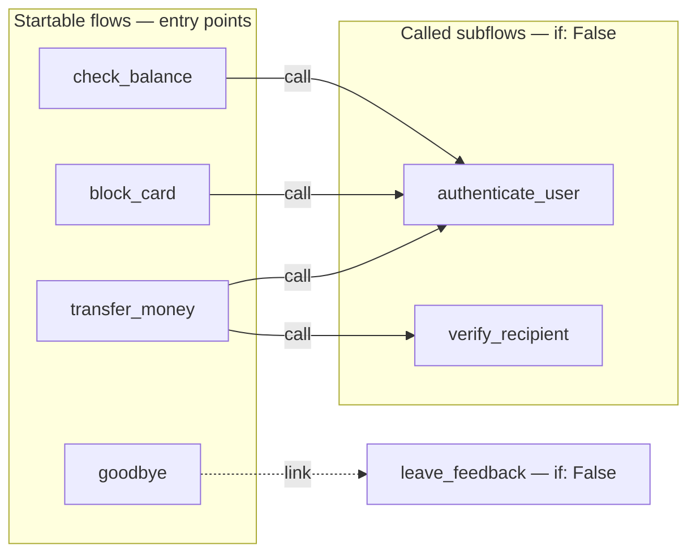
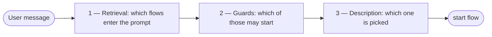
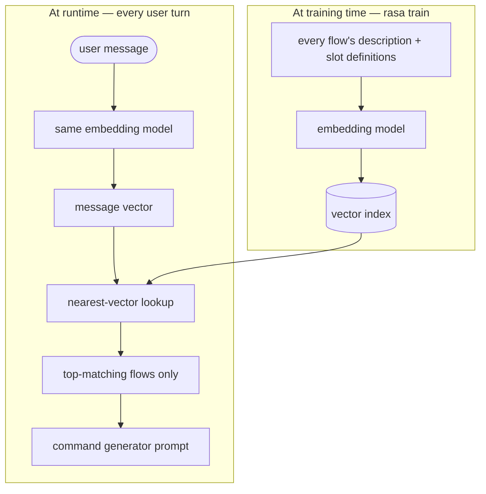
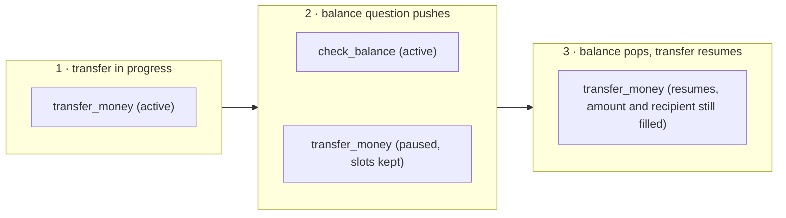
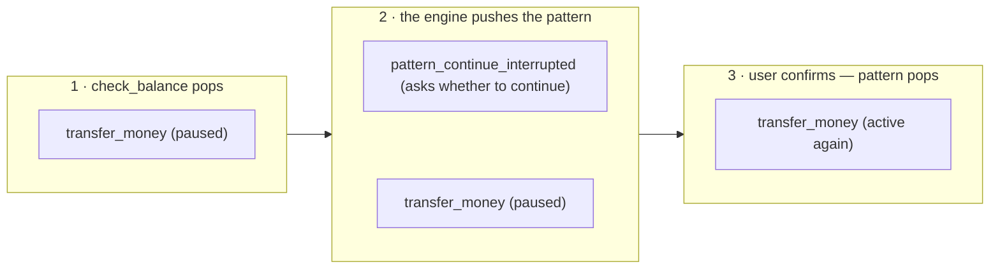
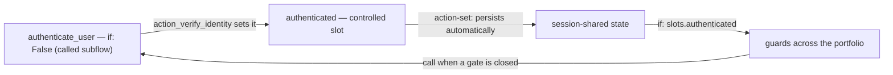
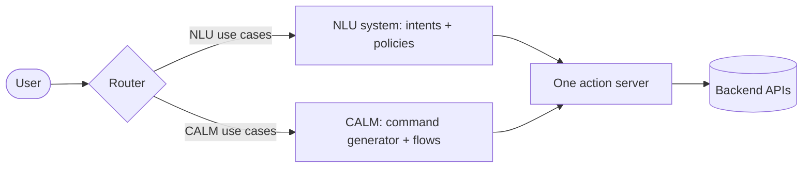
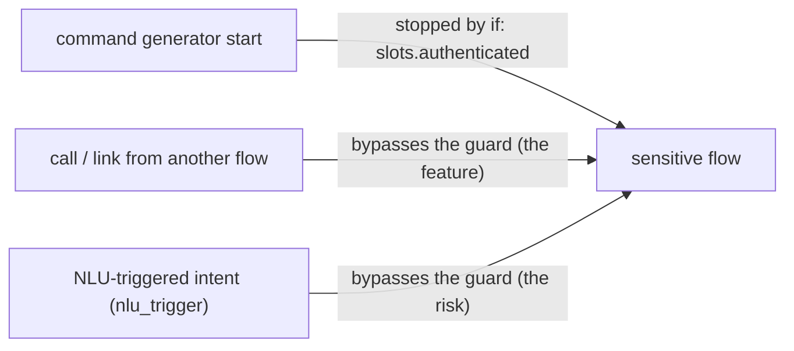

# Day 10 — Multi-Flow Architecture for Real-World Processes

Un singolo processo di business, scomposto in pochi flow ben composti, è un problema ingegneristico; un intero assistente fatto di decine di flow è un problema diverso. Questa lezione affronta il secondo. Il Capitolo 1 ordina i flow di un assistente in tre ruoli e dispone il progetto in file che restano navigabili man mano che l'insieme cresce, poi mostra come la mappa di quei flow diventi il linguaggio di progettazione condiviso tra gli sviluppatori e le persone non tecniche che possiedono i processi sottostanti. Il Capitolo 2 tratta di come venga scelto il flow giusto quando molti competono: i tre meccanismi — retrieval, guard e description — che operano prima che un qualunque flow parta. Il Capitolo 3 gestisce i due eventi che compaiono solo alla scala di un portafoglio: una richiesta che corrisponde a più flow (ambiguità) e un utente che cambia argomento a metà processo (digressione). Il Capitolo 4 è una guida pratica al dimensionamento dello stato condiviso dell'assistente — quali valori degli slot sono locali al flow, quali sopravvivono tra i flow, quali persistono oltre una sessione — con l'autenticazione come caso di studio. Il Capitolo 5 è un extra: come un assistente CALM possa funzionare accanto a un assistente classic-NLU esistente all'interno di un unico progetto. La trattazione concettuale degli embedding e del retrieval resta qui a livello di orientamento; i loro meccanismi sono oggetto di una lezione successiva sul retrieval-augmented generation.

---

## Chapter 1 — The assistant as a portfolio of flows

Quando un progetto contiene un solo processo di business, la domanda su un flow è *"questo flow è ben composto?"* Quando ne contiene molti, l'unità di progettazione cambia e così la domanda: *"questo **insieme** di flow si comporta come un unico assistente coerente?"* Quello è un problema diverso, con modalità di fallimento che nessun singolo flow esibisce isolatamente — **ambiguous routing** (una richiesta che corrisponde a due flow), **leaking state** (i valori di un flow che affiorano in un altro) e **prompt bloat** (ogni flow che costa token a ogni turno). Il resto della lezione riguarda l'eliminazione ingegneristica di questi problemi.

Un breve vocabolario, poiché il capitolo vi si fonda. In **CALM** (*Conversational AI with Language Models*, l'architettura di Rasa) un large language model è usato solo per *comprendere* l'utente; una logica deterministica e dichiarata decide cosa l'assistente *fa*. Il modello emette **commands** strutturati (come "avvia questo flow", "riempi questo slot"); il componente della pipeline che interroga il modello e ne trasforma l'output in commands è il **command generator**. Un **flow** è un processo di business dichiarato, passo dopo passo, scritto in YAML, con un `id`, una `description` in linguaggio naturale che il modello legge per decidere se il flow si adatta alla richiesta, e una lista di `steps`. Uno **slot** è un elemento denominato della memoria di lavoro dell'assistente.

### 1.1 What a multi-use-case scenario looks like

Si prenda un portafoglio volutamente semplice — un assistente bancario il cui ambito rivolto al cliente è una manciata di compiti indipendenti: bloccare una carta, sostituire una carta, inviare un bonifico, controllare un saldo, elencare le transazioni recenti, trovare una filiale, prenotare un appuntamento con un consulente. Ciascuno è piccolo; la difficoltà non sta in nessuno di essi ma nella loro coesistenza. Un insieme di flow può essere ciascuno **singolarmente corretto e comportarsi comunque come un assistente incoerente** — allo stesso modo in cui un insieme di microservizi può superare ciascuno i propri test mentre il sistema nel suo complesso si comporta male. La soluzione in entrambi i casi è la stessa: un'architettura deliberata.

### 1.2 The three roles of a flow

Ogni flow in un assistente CALM svolge uno di tre ruoli, e il ruolo decide come il flow viene scritto, protetto con guard e descritto.

1. **Startable flows** — rivolti all'utente e attivabili dal command generator. Ciascuno possiede **una descrizione onesta**: se un flow non può essere descritto in una sola frase onesta, in realtà è due flow. Sono i flow che un utente può *chiedere* — `transfer_money`, `block_card`, `check_balance`.
2. **Called subflows** — macchinari condivisi raggiunti solo attraverso uno step `call` da un altro flow: autenticazione, verifica del destinatario. Un `call` esegue un altro flow come **subroutine** e *ritorna* al punto in cui si era interrotto, mentre un `link` cede il controllo in modo permanente e non ritorna[^1]. I subflow sono protetti con `if: False` — la proprietà `if:` è una condizione booleana su un flow, e `if: False` rende un flow non avviabile dal modello, così che sia raggiungibile solo da un altro flow e mai avviato direttamente dal chat model[^2]. Sono scritti una volta e riutilizzati ovunque.
3. **Linked follow-ons** — transizioni post-completamento raggiunte attraverso uno step `link` usato come *ultimo* step di un flow: un flow di feedback dopo un commiato, una domanda di soddisfazione dopo un processo completato. Non c'è ritorno, per progettazione — la conversazione è andata avanti.

Lo stesso template di progetto `finance` di Rasa — un assistente bancario demo completo, generato come scaffold da Rasa Pro — è costruito esattamente in questo modo: una manciata di startable flow poggia su subflow protetti con `if: False`, con `link` usato per i follow-on. Il suo flow `goodbye` mostra tutti e tre i ruoli in sei righe:

```yaml
flows:
  goodbye:
    description: Handle user goodbye messages, say farewell, and collect feedback
    steps:
      - action: utter_goodbye
      - link: leave_feedback
```

`goodbye` è un flow **startable** con una descrizione onesta; il suo ultimo step fa `link` a `leave_feedback`, un **linked follow-on**; e `leave_feedback`, dichiarato altrove, porta `if: False` così che il modello non possa mai avviarlo direttamente — è raggiungibile solo tramite questo `link`[^2]. Ordinare un portafoglio in questo modo è il primo passo di progettazione:

| Role | Flows |
|---|---|
| Startable | `block_card`, `replace_card`, `transfer_money`, `check_balance`, `list_transactions`, `find_branch`, `book_appointment` |
| Called (`if: False`) | `authenticate_user`, `verify_recipient` |
| Linked follow-ons (`if: False`) | `leave_feedback` |

### 1.3 Project layout at scale

Molti flow significano anche molti file: senza disciplina di layout, aggiungere il quarantesimo flow significa una lenta ricerca tra file sconosciuti invece di una rapida aggiunta. I template di scaffold sono un precedente utile da cui attingere quando si inizia:

- Il template `default` fornisce **un flow per file** sotto `data/flows/`, e una **suddivisione del domain per argomento** sotto `domain/`.
- Il template `finance` va oltre, alla sua dimensione maggiore: *directory* per argomento su entrambi i lati — `data/accounts/`, `data/cards/`, `data/transfers/` — rispecchiate da `domain/accounts/`, `domain/cards/` e così via, con gli slot condivisi raccolti in un unico `_shared.yml`.

Un portafoglio di dimensioni moderate adotta la stessa suddivisione per argomento:

```text
data/flows/
  accounts/      check_balance.yml, list_transactions.yml
  cards/         block_card.yml, replace_card.yml
  transfers/     transfer_money.yml, verify_recipient.yml
  branches/      find_branch.yml
  appointments/  book_appointment.yml
  shared/        authenticate_user.yml, leave_feedback.yml
domain/
  accounts.yml  cards.yml  transfers.yml  branches.yml
  appointments.yml  shared.yml
```

La **denominazione ricercabile** è la convenzione che rende redditizio questo layout: un solo nome è riutilizzato in ogni artefatto dello stesso caso d'uso. Il flow `block_card` vive in `block_card.yml`, chiede tramite response `utter_ask_…` denominate a partire dai suoi slot, ed è testato in un file con lo stesso nome — così una singola ricerca a livello di progetto per `block_card` (la ricerca-nei-file dell'editor, o `grep -r block_card .` in un terminale) restituisce tutto ciò che è coinvolto nel bloccare una carta, e risponde a "cosa succede quando un cliente blocca una carta?" a qualunque dimensione del portafoglio. L'unico vincolo formale è che gli ID dei flow possono contenere caratteri alfanumerici, underscore e trattini e non devono iniziare con un trattino[^3]; `snake_case` lo soddisfa, e il prefisso `pattern_` è riservato ai pattern di riparazione integrati di Rasa ([Chapter 3](#chapter-3--when-flows-collide-ambiguity-and-digressions)).

### 1.4 Mapping the portfolio

Quando si progetta o si fa crescere un portafoglio, si tenga un diagramma su una pagina di ogni flow e dei suoi archi `call`/`link` — gli startable flow come punti di ingresso, i subflow come nodi interni condivisi, i linked follow-on come uscite. Nulla in Rasa richiede questo artefatto; è un miglioramento della qualità della vita, conservato nel repository come documentazione e condiviso con il team. Uno spaccato rappresentativo, ridotto a pochi flow perché i tipi di arco restino leggibili:



L'argomento a favore del mantenere aggiornato questo diagramma è organizzativo, non tecnico. Le persone che possiedono un processo di business — il personale che effettivamente gestisce il blocco delle carte, le contestazioni o la prenotazione degli appuntamenti — sono raramente le persone che scrivono YAML, eppure sono l'autorità su se l'assistente faccia la cosa giusta. Poiché i flow CALM e i loro archi sono *dichiarati* anziché sepolti in codice imperativo, questa mappa può essere letta da qualcuno che non ha mai aperto un file di flow: è il linguaggio di progettazione condiviso tra gli sviluppatori e quei process owner. Alcune pratiche la mantengono utilizzabile in quel pubblico misto:

- **Denominare i flow per il processo, non per l'implementazione.** Un process owner può trovare `block_card` e `replace_card` sulla pagina e confermare che l'assistente li distingue; un nome come `card_handler_v2` non gli dice nulla. La stessa disciplina di denominazione che aiuta `grep` aiuta il lettore non tecnico.
- **Mantenere la mappa aggiornata come sorgente, non come documentazione che va alla deriva.** Ogni nuovo flow entra nel diagramma quando entra nel progetto, così la pagina è sempre il cablaggio reale. Una mappa che è in ritardo rispetto al codice è peggio di nessuna, perché invita a risposte sbagliate ma sicure.
- **Rivedere la mappa con i process owner in fase di progettazione**, prima che i flow siano costruiti — è più economico scoprire "il saldo dovrebbe ri-verificare l'identità" su un diagramma che dopo che il flow è stato scritto. La mappa è dove uno sviluppatore e un esperto di dominio si accordano su *cosa si connette a cosa* in un vocabolario che entrambi condividono.

---

## Chapter 2 — Steering activation: descriptions, guards, and retrieval at scale

Quando molti flow competono, il compito del command generator si fa più arduo: più candidati, più occasioni di scegliere male, più token per turno. Tre meccanismi operano **in sequenza** prima che un qualunque flow parta, e ciascuno è una leva di progettazione che lo sviluppatore possiede:



1. Il **retrieval** decide quali flow siano *nel prompt in assoluto*.
2. Le **guard** decidono quali di quei flow siano *idonei* a essere avviati.
3. La **description** decide quale flow idoneo il command generator effettivamente *sceglie*.

Ciascuno fallisce in modo diverso, quindi ciascuno è trattato separatamente.

### 2.1 Flow retrieval, conceptually

Il flow retrieval restringe il campo prima ancora che il modello scelga: confronta il messaggio utente in arrivo con tutti i flow e include nel prompt solo i flow con la corrispondenza migliore, mantenendo gestibili la dimensione del prompt e il costo in token man mano che l'assistente cresce[^4]. La corrispondenza è *embedding-based*. Un **embedding** trasforma un frammento di testo in un vettore — una lista di numeri che ne cattura il significato, posizionata in modo che testi su cose simili si trovino vicini tra loro. La description di ciascun flow è trasformata in un vettore tramite embedding; il messaggio in arrivo è trasformato in embedding nello stesso modo; vincono i flow i cui vettori si trovano più vicini a quello del messaggio. Concretamente, `rasa train` trasforma in vettori la description e le definizioni degli slot di ciascun flow e li memorizza in un indice al momento del training, così che la corrispondenza a runtime sia una rapida ricerca del vettore più vicino anziché un nuovo calcolo[^5]. La figura sottostante traccia le due metà — cosa prepara il training e cosa accade a ogni turno:



Questo schizzo concettuale è tutto ciò che serve qui; come funzionino embedding e retrieval in profondità è oggetto di una lezione successiva sul retrieval-augmented generation.

Ne seguono due conseguenze:

- **La qualità della description è una questione di *retrieval* prima di essere una questione di *selezione*.** Un flow la cui description non corrisponde alle parole dell'utente non entra mai nel prompt — e il command generator non può scegliere un flow che non ha mai visto. Una description vaga non è quindi solo un problema di routing; alla scala giusta è un problema di *invisibilità*, e **fallisce silenziosamente** — nulla registra un errore; il flow semplicemente non viene mai offerto.
- **Il retrieval è la leva del costo.** Ogni flow nel prompt costa token di input a ogni turno. Flow piccoli e ben descritti mantengono affilato l'insieme dei candidati e corto il prompt, così che la modularità sia al contempo una decisione di accuratezza *e* di costo. I subflow protetti con `if: False` sono esclusi interamente dal prompt[^2][^4], così che un grande blocco di macchinari condivisi costi spazio-prompt solo per il singolo startable flow che vi accede.

Il flow retrieval è configurato sulla voce del command generator in `config.yml`, sotto la proprietà `flow_retrieval`, ed è **abilitato per default**[^5]:

```yaml
# config.yml
pipeline:
  - name: CompactLLMCommandGenerator
    llm:
      model_group: openai_llm
    flow_retrieval:
      active: true    # the default — set to false to disable
```

Il retrieval è un meccanismo di scala, quindi i piccoli template di scaffold vengono forniti con esso disattivato (`active: false`) — i loro portafogli entrano comodamente in un unico prompt. La vera domanda di progettazione è a quale dimensione del portafoglio il retrieval diventi necessario: un assistente da dieci flow potrebbe non averne bisogno; uno da cinquanta sì, e le sue description devono essere scritte *per* il retrieval prima che venga attivato. `always_include_in_prompt` è la stretta leva opposta — un booleano opzionale (default false) che, quando true e la guard passa, forza un flow nel prompt indipendentemente dal punteggio di rilevanza[^2] — adatto a un flow globale di help o cancel che il retrieval non dovrebbe mai filtrare via, al costo di un peso-prompt permanente a ogni turno, quindi usato con parsimonia.

### 2.2 Description discipline at scale: write contrasts

Alla scala di un portafoglio, il fallimento ricorrente delle description sono i **vicini**: coppie di flow abbastanza vicini di significato da far sì che un messaggio plausibile corrisponda a entrambi — *blocco* carta contro *sostituzione* carta, *saldo* contro *transazioni*. Le description smettono quindi di essere scritte una alla volta; la tecnica è **scrivere le description come contrasti — dire per cosa il flow *non* serve ogni volta che un vicino confonde**:

```yaml
flows:
  block_card:
    description: |
      Immediately block a card that is lost, stolen or compromised, so it
      cannot be used. Does not order a replacement card.
    steps:
      # ...
  replace_card:
    description: |
      Order a replacement for a card that is damaged, expired or already
      blocked. Does not block an active card.
    steps:
      # ...
```

Le due frasi "Does not …" svolgono il lavoro di separazione due volte: allontanano i vicinati di embedding delle description (aiutando il retrieval) e dicono al command generator esattamente dove si trova il confine (aiutando la selezione)[^4]. Le description sovrapposte non sono *sbagliate* — semplicemente spingono la risoluzione su un turno di chiarimento a runtime, che il motore gestisce correttamente ([Chapter 3](#chapter-3--when-flows-collide-ambiguity-and-digressions)). La tecnica del contrasto scambia quella tassa runtime ricorrente per uno sforzo una-tantum in fase di progettazione: separa i vicini ora, così che all'utente non venga chiesto di disambiguare dopo. Le regole d'arte per la description di un singolo flow permangono — scritta dalla prospettiva dell'utente, priva di gergo interno — con un'aggiunta per la scala: **rivedere le description come insieme**, leggendo fianco a fianco le description di tutti gli startable flow e cacciando le sovrapposizioni come si rivedono le route di un'API alla ricerca di collisioni.

### 2.3 Guards as architecture

Una flow guard è la proprietà `if:` introdotta con i tre ruoli in [§1.2](#12-the-three-roles-of-a-flow) — una condizione booleana che regola se il command generator possa avviare un flow[^2]. Alla scala di un portafoglio le guard smettono di essere un dettaglio per-flow e diventano *architettura*: partizionano l'intero assistente per stato della conversazione. Due casi d'uso ricorrono:

- **Il gate di autenticazione.** Ogni flow sensibile è protetto con guard su un singolo slot di autenticazione, impostato da un unico subflow `authenticate_user` che agisce da guardiano (il design è completato nel [Chapter 4](#chapter-4--cross-flow-state-slots-as-shared-memory)):

  ```yaml
  flows:
    transfer_money:
      description: Send money from the customer's account to another person or business.
      if: slots.authenticated
      steps:
        # ...
  ```

- **Segmentazione commerciale.** La stessa leva esprime l'entitlement: un servizio riservato ai premium può essere protetto con guard su uno slot `customer_segment` che una custom action ha recuperato all'inizio della sessione:

  ```yaml
  flows:
    premium_advisory:
      description: Book a dedicated session with a personal investment advisor.
      if: slots.customer_segment = "premium"
      steps:
        # ...
  ```

Alla scala di un portafoglio, la conseguenza più importante della guard è una **proprietà di sicurezza**. Poiché un flow la cui guard valuta a false è escluso interamente dal prompt del command generator[^2][^4], il command generator di un utente non autenticato non *vede* nemmeno `transfer_money` — non c'è alcun prompt contro cui iniettare, alcuna description da manipolare con l'ingegneria sociale. La guard è logica deterministica esterna al modello, che è l'unico luogo affidabile per correggere un fallimento dell'LLM — nessuna formulazione di prompt raggiunge la stessa garanzia. Il modello non può avviare ciò che non può vedere.

La stessa proprietà conta per il **debugging**: una guard a false non produce alcun errore e alcuna riga di log — il flow è semplicemente *assente*. Alla scala di un portafoglio, **"perché questo flow non si attiva?"** si risolve il più delle volte in una guard che valuta a false, il che rende la guard la prima cosa da controllare. Una sfumatura ne delimita il senso: le guard regolano solo gli avvii *iniziati dal modello*, quindi un `call` o un `link` raggiunge un flow indipendentemente dalla sua guard[^2] — la stessa proprietà che mantiene un subflow `if: False` richiamabile dal suo parent. (Un terzo percorso di attivazione, un intent classificato dall'NLU, aggira anch'esso le guard; compare solo nell'architettura di coesistenza ed è trattato nel [Chapter 5](#chapter-5--coexistence-running-calm-beside-an-nlu-assistant-extra).)

### 2.4 Beyond one assistant

Le tre leve di questo capitolo — retrieval, guard, description — scalano un portafoglio *all'interno di un unico assistente*, e per la maggior parte dei portafogli è tutta la storia. Un secondo asse di scomposizione esiste al di sopra: Rasa può anche suddividere il lavoro tra **agents**. Un flow può delegare un compito circoscritto a un **sub agent** — un agent configurato separatamente che il flow invoca come uno dei suoi step[^6]. Quando gli agent coinvolti sono costruiti e distribuiti in modo indipendente — da un altro team, su un altro framework, o interamente al di fuori dell'organizzazione — Rasa li connette attraverso il **protocollo A2A (Agent-to-Agent)**: uno standard aperto per la comunicazione tra agenti di AI, originariamente sviluppato da Google e da allora donato alla Linux Foundation, che dà agli agent un modo comune per scoprirsi a vicenda, delegare compiti e condividere risultati senza esporre gli uni agli altri i propri interni[^7]. Attraverso A2A un assistente può chiamare altri assistenti da un flow, o essere esposto come un agent che altri sistemi chiamano. Il problema della selezione resta riconoscibilmente lo stesso a quel livello: poiché un sub agent è sempre raggiunto solo attraverso un flow, decidere *quale agent* gestisca una richiesta è ancora la selezione del flow che questo capitolo ha messo a punto. I meccanismi di quel livello, e il giudizio su quando un portafoglio giustifichi affatto la suddivisione tra agent, sono trattati più avanti nel corso; all'interno di questa lezione, un unico assistente possiede l'intero portafoglio.

---

## Chapter 3 — When flows collide: ambiguity and digressions

Nel trattare un portafoglio ampio, gli eventi di collisione più comuni e inevitabili sono l'**ambiguità** — una richiesta che corrisponde a più flow — e la **digressione** — un utente che cambia argomento a metà processo. Entrambi sono una conseguenza ovvia del trattare il linguaggio naturale, quindi nessuno dei due è un errore. Rasa fornisce flow integrati (**conversation patterns**) per gestire entrambi; le sezioni sottostanti coprono cosa accade in ciascun caso e quali leve di progettazione rendono gli eventi rari e aggraziati.

### 3.1 Ambiguity

Quando una richiesta corrisponde genuinamente a più flow, il command generator **non** tira a indovinare. Emette un **disambiguation command** — il token è `disambiguate flows <name1> <name2> …`[^8]. Per un portafoglio con entrambi i flow delle carte, il messaggio scarno "problems with my card", privo di ulteriore segnale, produce `disambiguate flows block_card replace_card`. Quel command attiva il flow integrato **`pattern_clarification`**, che presenta i candidati e chiede all'utente di scegliere[^9].

La posizione progettuale: **il chiarimento è comportamento corretto, ma ogni chiarimento è una piccola tassa di UX.** Il motore ha fatto la cosa giusta — ha rifiutato di indovinare sulla carta di un cliente — eppure il cliente ha pagato un turno in più, e più lento. L'obiettivo *non* è sopprimere il chiarimento (ciò significherebbe indovinare); è rendere il chiarimento *raro* risolvendo l'ambiguità a monte con i contrasti di description del [§2.2](#22-description-discipline-at-scale-write-contrasts). La coppia "does not order a replacement / does not block an active card" risolve la maggior parte dell'ambiguità sulle carte prima che raggiunga il motore; ciò che resta — "problems with my card", con nulla su cui disambiguare — è ambiguità *genuina*, e chiedere è la risposta onesta. Durante il testing, si tenga una breve lista delle frasi che attivano il chiarimento: ciascuna è o un bug di description da correggere o un'ambiguità genuina da accettare.

### 3.2 Digressions

Il secondo evento: un utente a metà bonifico chiede "wait — what's my balance?" Nulla è sbagliato; le persone conversano così, intercalando una rapida domanda secondaria in un compito e aspettandosi di riprendere il compito — comportamento conversazionale da *gestire*, non un errore da *prevenire*. Il macchinario è il **dialogue stack** LIFO — il registro corrente del motore su quali flow siano attivi, il più recente in cima: il command generator avvia il nuovo argomento, che viene messo sullo stack sopra il bonifico in pausa, viene eseguito fino al completamento e viene rimosso, e il bonifico interrotto viene poi offerto per la ripresa[^10]. Poiché lo stack ha preservato il frame del parent, gli slot del flow in pausa sono ancora riempiti quando riprende — il cliente non reinserisce l'importo e il destinatario che aveva già fornito. La figura sottostante traccia i tre momenti dello stack:


Alla scala di un portafoglio, la digressione diventa anche una questione di *progettazione*: quali flow costituiscano interruttori sensati. Un controllo del saldo che interrompe un bonifico è utile — il cliente potrebbe star verificando di poterselo permettere; un *secondo* bonifico che interrompe un bonifico è fonte di confusione. La mappa del portafoglio ([§1.4](#14-mapping-the-portfolio)) è dove quelle relazioni di interruzione vengono ponderate, e la garanzia sul frame degli slot di cui sopra è ciò che rende economica un'interruzione ben scelta: la deviazione costa al cliente una domanda o due, non il suo posto nel compito.

Bloccare un cattivo interruttore usa il macchinario delle guard del [§2.3](#23-guards-as-architecture). Uno slot booleano marca il flow come in esecuzione — il primo step del flow lo imposta, e la guard richiede che sia non impostato:

```yaml
flows:
  transfer_money:
    description: Send money from the customer's account to another person or business.
    if: slots.authenticated and not slots.transfer_in_progress
    steps:
      - set_slots:
          - transfer_in_progress: true
      # ... collect amount, recipient, confirmation ...
```

Mentre un bonifico è in esecuzione, `transfer_in_progress` è true, la guard è false, e `transfer_money` esce dall'insieme startable — il command generator non può avviarne un secondo, mentre `check_balance`, che non porta tale condizione, resta una digressione legale. Quando il flow termina, il reset di fine-flow azzera lo slot (uno slot `set_slots`, non persistito)[^3] e il flow torna avviabile. Per uno step durante il quale *nessuna* digressione è accettabile — la conferma finale di un pagamento, per esempio — uno step `collect` può impostare `force_slot_filling: true`, che fa sì che l'assistente ignori ogni command tranne il riempimento di quello slot[^1].

Il flow che offre la ripresa è un pattern integrato, **`pattern_continue_interrupted`**[^9]. Un pattern è a sua volta un flow, quindi viene eseguito sullo stesso dialogue stack: quando il flow interrompente viene rimosso, il motore mette il pattern sopra il flow in pausa; il pattern chiede se continuare e viene rimosso a sua volta, lasciando di nuovo attivo il flow in pausa[^9][^10]. La figura sottostante espande la restituzione del controllo — il momento 3 della figura precedente:



Ogni pattern è personalizzabile, a tre profondità[^11]:

1. **Solo il testo** — le domande e i messaggi di un pattern sono response ordinarie con testo di default; ridefinire la chiave della response nella sezione `responses:` del domain (per questo pattern, `utter_ask_continue_interrupted_flow_confirmation`) sostituisce il testo senza toccare alcun flow.
2. **Il comportamento** — dichiarare un flow con il nome esatto del pattern (`pattern_continue_interrupted`) nei file di flow del progetto sostituisce interamente il flow di default; le implementazioni di default sono pubblicate nella documentazione di riferimento e sono il punto di partenza naturale da cui copiare e modificare[^9].
3. **La logica** — le action di default che un pattern chiama (qui `action_continue_interrupted_flow`, lo step che effettivamente riprende il flow in pausa) possono essere sostituite con custom action scritte nell'action server e referenziate dal flow di override.

Un retrain è richiesto dopo ciascuna delle tre. Il giudizio è su *quando* farlo. Rasa fornisce e mantiene questi pattern proprio perché ogni assistente non debba reinventare la gestione della digressione, della correzione o della cancellazione; un override significa assumersi il carico di mantenere quel comportamento corretto e testato da soli. Quindi si personalizzi per un'esigenza reale e specifica — testo coerente con il brand, una conferma aggiuntiva, un passaggio a un operatore umano — e altrimenti si lasci in posa il default testato. Sovrascrivere un pattern per re-implementare ciò che già fa bene è sforzo speso a ri-derivare, e ri-testare, comportamento che Rasa già porta.

---

## Chapter 4 — Cross-flow state: slots as shared memory

Per un singolo flow, la progettazione degli slot è progettazione della *raccolta* — quali domande porre. Attraverso un portafoglio, gli slot diventano la **memoria condivisa** dell'assistente, e ogni slot necessita di una deliberata **decisione di dimensionamento**, deliberata quanto la scelta dello scope di una variabile nel codice. Questo capitolo è il metodo per prendere quella decisione per ogni slot: chi può scrivere il valore, e per quanto vive.

La parola *sessione* compare in ogni decisione di scope qui sotto, quindi i suoi meccanismi vengono prima. Una **conversation session** è una finestra di interazione continua tra l'utente e l'assistente — una singola visita; la stessa conversazione può abbracciare più sessioni nel corso della sua vita. Una sessione inizia quando l'utente apre la conversazione, quando arriva un messaggio dopo un periodo configurabile di inattività, o quando un messaggio `/session_start` ne forza una manualmente[^12]. La finestra di inattività è impostata nel domain sotto `session_config` (`session_expiration_time`, in minuti — `60` per default, `0` per sessioni che non scadono mai), e ogni inizio di sessione esegue l'action integrata **`action_session_start`**, che per default copia tutti gli slot attualmente impostati nella nuova sessione — un comportamento di carry-over che la terza impostazione di scope del [§4.1](#41-scoping-a-slot-two-axes) decide deliberatamente[^12].

### 4.1 Scoping a slot: two axes

Ogni slot si colloca su due assi. Il primo, la **fiducia** — *chi è autorizzato a scriverlo* — è fissato dal **mapping** dello slot. Un mapping `controlled` rende lo slot impostabile solo da una custom action o dai pulsanti di una response — il modello non può mai raggiungerlo, quindi tutto ciò che è sensibile per la sicurezza cade su questo lato. `from_llm` consente al modello di impostare lo slot da ciò che l'utente ha detto; `from_entity` e `from_intent` consentono al livello NLU classico di impostare lo slot, nel setup di coesistenza del [Chapter 5](#chapter-5--coexistence-running-calm-beside-an-nlu-assistant-extra)[^13].

Il secondo asse è lo **scope** — *per quanto vive il valore* — con tre impostazioni, dalla più economica in poi:

1. **Flow-local** (il default): valori di lavoro che muoiono con il flow. Lo slot di uno step `collect` viene azzerato quando il suo flow termina[^1], senza nulla da dichiarare:

   ```yaml
   flows:
     transfer_money:
       steps:
         - collect: amount       # both cleared when the flow ends
         - collect: recipient
   ```

   L'`amount` e il `recipient` di un bonifico non dovrebbero trasferirsi al prossimo argomento, quindi il default è corretto.

2. **Session-shared**: stato che deve sopravvivere *tra i flow all'interno di una sessione* — l'autenticazione su tutti. La proprietà a livello di flow **`persisted_slots`** esenta gli slot elencati dal reset di fine-flow, così che un flow successivo non debba ri-chiederli[^3]:

   ```yaml
   flows:
     transfer_money:
       persisted_slots:
         - recipient             # survives the flow's end — a follow-up flow can reuse it
       steps:
         - collect: amount       # still cleared when the flow ends
         - collect: recipient
   ```

   Il punto a livello di portafoglio è la *decisione di scope* che la proprietà codifica — dichiarare un valore come stato di sessione anziché come valore di lavoro.

3. **Cross-session**: fatti portati nella sessione *successiva*. La leva è `session_config.carry_over_slots_to_new_session` nel domain — e il suo default fornito è `true`[^12]:

   ```yaml
   session_config:
     session_expiration_time: 60             # minutes of inactivity before a new session
     carry_over_slots_to_new_session: true   # the shipped default
   ```

   Con il flag `true`, un cliente che ha scelto l'italiano come `preferred_language` stamattina viene accolto in italiano quando torna nel pomeriggio: l'`action_session_start` della nuova sessione ha copiato ogni slot impostato. *Ogni* slot impostato è anche il pericolo del flag — è tutto-o-niente, quindi `authenticated` dalla sessione mattutina tornerebbe anch'esso, e la selezione per-slot significa sovrascrivere `action_session_start` con una custom action[^12]. La regola pratica: portare avanti solo stato di convenienza a bassa sensibilità — una lingua, una preferenza di visualizzazione — che rende più fluida la conversazione successiva ed è innocuo se riaffiora nel momento sbagliato; lo stato di autenticazione e i valori di lavoro finanziari non si qualificano mai. Poiché un solo slot che fallisce quel test condanna l'intero flag, un assistente che tratta dati personali imposta `carry_over_slots_to_new_session: false` — la minimizzazione dei dati espressa come configurazione.

### 4.2 The worked case: authentication state

L'autenticazione è l'esempio pratico naturale per entrambi gli assi: le guard attraverso il portafoglio leggono lo slot, la persistenza deve mantenerlo in vita tra i flow, e l'asse della fiducia deve proteggerlo dal modello. Il subflow che lo produce, e lo slot stesso:

```yaml
# data/flows/shared/authenticate_user.yml
flows:
  authenticate_user:
    if: False          # reachable only via call — never model-started
    description: Verify the customer's identity before sensitive operations.
    steps:
      - collect: customer_number
      - collect: otp_code
      - action: action_verify_identity
```

```yaml
# domain/shared.yml
slots:
  authenticated:
    type: bool
    mappings:
      - type: controlled
```

Il mapping dello slot, la guard del subflow, le guard del portafoglio e la persistenza dello slot portano ciascuno una garanzia:

- `authenticated` è uno slot **controlled** — solo una custom action (qui `action_verify_identity`) o i pulsanti di una response possono impostarlo; il modello non può mai asserirlo, perché `from_llm` non è tra i suoi mapping[^13]. Nessuna sequenza di messaggi utente, per quanto avversaria, può convincere il command generator a impostare `authenticated` a `true`. La difesa dalla prompt-injection è *strutturale*, non affidata a un prompt.
- `authenticate_user` è un **called subflow**, protetto con `if: False` così che il modello non lo avvii mai direttamente[^2].
- **Le guard attraverso il portafoglio leggono lo slot**: ogni flow sensibile porta `if: slots.authenticated`.
- **La persistenza lo mantiene in vita tra i flow**: poiché `authenticated` è impostato da una custom action anziché da uno step `collect`, persiste automaticamente dopo che il flow termina, così che un cliente che si è autenticato per un bonifico non venga ri-sfidato per un controllo del saldo pochi istanti dopo.



Due confini mantengono corretto tutto ciò. Uno slot impostato da una custom action — come `authenticated` — è *già* persistente e **non** deve essere elencato in `persisted_slots` (quel campo è per gli slot `collect`/`set_slots`); elencarlo è un errore in fase di training[^3]. E per azzerare tale slot da un qualunque step — per esempio per far scadere l'autenticazione a un timeout — uno step `set_slots` lo imposta a `null`[^1].

### 4.3 Backend state and caching

I **dati fetch-once-per-session** — segmento cliente, lista dei conti, limite giornaliero — sono un secondo idioma cross-flow: fatti che molti flow leggono e che nessun flow dovrebbe ri-recuperare a ogni uso. La forma è il pattern del controlled-slot del caso dell'autenticazione: una custom action recupera il valore al primo bisogno, scrive uno slot controlled, e ogni flow lo legge. Il costo dell'idioma è la **staleness**: una lista dei conti in cache è sbagliata nel momento in cui il cliente apre un conto attraverso un altro canale. Quindi si decida, per ogni slot in cache, il trigger di aggiornamento — ri-recuperare per flow, per sessione, o su richiesta — e lo si metta per iscritto. Una cache senza una policy di staleness dichiarata è un bug latente.

Una **slot map**, tenuta accanto alla mappa del portafoglio del [§1.4](#14-mapping-the-portfolio), rende queste decisioni revisionabili — ogni slot con il suo tipo, la sua fiducia e il suo scope su una pagina:

| Slot | Type | Trust (mapping) | Scope | Notes |
|---|---|---|---|---|
| `authenticated` | bool | controlled | session (auto-persists) | set only by `action_verify_identity`; cleared per re-auth policy |
| `customer_segment` | categorical | controlled | session | backend cache; refresh per session |
| `account_list` | any | controlled | session | backend cache; re-fetch before transfers |
| `amount` | float | from_llm | flow-local | transfer working value; resets with flow |
| `recipient` | text | from_llm | flow-local | |
| `confirmation` | bool | from_llm | flow-local | reused across flows; per-step question overrides |
| `transactions_list` | text | controlled | flow-local | display value; no reason to persist |

Letta come strumento di revisione, la colonna **trust** è la revisione di sicurezza in forma tabellare — tutto ciò che il modello non deve mai asserire è `controlled` — e la colonna **scope** è la revisione di protezione dei dati in forma tabellare: condiviso a livello di sessione per dichiarazione, persistente solo per policy scritta.

---

## Chapter 5 — Coexistence: running CALM beside an NLU assistant *(extra)*

Un portafoglio può allargarsi in un modo ancora: assorbendo un assistente che già esiste. Un team che adotta CALM spesso esegue un **classic NLU assistant** in produzione — uno che risolve ogni messaggio in due fatti strutturati: un **intent**, lo scopo del messaggio scelto da un catalogo fisso (`check_balance`, `block_card`), e le sue **entities**, i valori tipizzati trovati nel testo del messaggio — un importo, un numero di carta ([§5.4](#54-training-the-nlu-side-in-brief) mostra come entrambi vengano addestrati ed estratti). Regole o storie scritte a mano decidono cosa accade dopo, sostenute da un action server e da anni di messa a punto operativa. Rasa supporta l'esecuzione di entrambi i sistemi di comprensione dentro *un* assistente, così che il portafoglio CALM cresca accanto ai casi d'uso legacy anziché sostituirli tutti in una volta. Questo capitolo è un orientamento a come tutto ciò si incastri; è marcato come extra perché conta solo quando tale assistente legacy esiste.

### 5.1 How the two systems coexist

L'architettura di coesistenza dipende da un **routing mechanism**: per conversazione, un router — Rasa ne fornisce due, l'**`IntentBasedRouter`** e l'**`LLMBasedRouter`** ([§5.2](#52-the-two-routers)) — decide quale sistema, NLU o CALM, gestisca l'utente, ed entrambi i sistemi stanno dietro lo *stesso* action server, così che le integrazioni backend esistenti siano scritte una volta e servano entrambi[^14].



Una volta che il router invia una conversazione a un sistema, quella decisione è registrata in uno slot booleano dedicato, **`route_session_to_calm`**, ed è di solito **sticky** — i messaggi successivi vanno allo stesso sistema senza re-ingaggiare il router, così che un processo iniziato su un lato si completi lì anziché eseguirsi a metà su ciascuno. Una decisione **non-sticky**, per contro, è rivalutata a ogni turno e si adatta solo a scambi a turno singolo come il chitchat, dove il messaggio successivo può appartenere a uno dei due sistemi. Che lo stato di routing sia solo uno slot significa che usa lo stesso macchinario di memoria condivisa del [Chapter 4](#chapter-4--cross-flow-state-slots-as-shared-memory), qui usato dal framework stesso. L'action di default **`action_reset_routing`** rilascia la decisione così che l'utente possa spostarsi tra i sistemi all'interno di una sessione[^15].

### 5.2 The two routers

I due router differiscono nel modo in cui decidono[^15]:

| | `IntentBasedRouter` | `LLMBasedRouter` |
|---|---|---|
| Decides using | the NLU classifier's predicted intent | an LLM classifying the message's destination |
| Character | deterministic; fits a mature, well-tuned intent model | flexible; handles phrasings no intent covers |
| Cost | no extra LLM call | one extra LLM call per routing decision |

Un team con un modello di intent ben messo a punto di solito si rivolge prima all'`IntentBasedRouter`: la decisione di routing è esattamente tanto deterministica quanto il classificatore su cui instrada, e non costa nulla in più per turno. L'`LLMBasedRouter` scambia una chiamata per-turno con la capacità di instradare formulazioni che il modello di intent non ha mai visto.

### 5.3 The NLU command adapter, and a guarding caveat

I router suddividono il traffico tra i due sistemi per conversazione. L'**`NLUCommandAdapter`** lavora a grana più fine: consente al classificatore già addestrato di *attivare direttamente un flow CALM*. Legge l'intent predetto e, se un flow dichiara un trigger NLU corrispondente, restituisce un command di avvio-flow con **nessuna chiamata all'LLM** affatto[^16]. Il flow lo dichiara con `nlu_trigger`:

```yaml
flows:
  check_balance:
    description: Show the customer their current account balance.
    nlu_trigger:
      - intent:
          name: check_balance
          confidence_threshold: 0.9
    steps:
      - action: action_fetch_balance
      - action: utter_current_balance
```

Se il classificatore predice `check_balance` a o sopra la soglia di confidenza, il flow parte direttamente — riutilizzando i dati di training dell'intent esistente e saltando interamente la chiamata al modello. Il risparmio di costo è controllato dal parametro `minimize_num_calls` del command generator (default `true`): salta l'invocazione dell'LLM quando l'adapter ha già emesso un command di avvio-flow, così che un intent ad alta confidenza e ad alto volume possa non costare token LLM in quel turno[^5].

Questo terzo percorso di attivazione porta un avvertimento sulle guard: **le flow guard non bloccano gli avvii attivati dall'NLU.** Le guard regolano solo l'attivazione iniziata dal modello; `call`, `link` e gli intent `nlu_trigger` le aggirano tutti[^2]. La conseguenza è diretta — un flow che è al contempo protetto con guard di autenticazione *e* dotato di `nlu_trigger` è un **authentication bypass**: la guard `if: slots.authenticated` ferma il command generator, e l'intent classificato le passa dritto accanto. I tre percorsi di attivazione verso un flow, e quale la guard effettivamente ferma:



La regola, in una delle due forme sicure:

1. **Non dichiarare mai `nlu_trigger` su un flow sensibile protetto con guard.** Riservare la scorciatoia dell'adapter ai flow che non necessitano di gate — ricerche informative, ricerca di filiali, un controllo del saldo già autenticato a livello di canale.
2. **Oppure ri-verificare dentro il flow**, così che sia sicuro sotto *ogni* percorso di attivazione — una diramazione sullo slot di autenticazione che chiama `authenticate_user` quando necessario:

```yaml
steps:
  - noop: true
    next:
      - if: not slots.authenticated
        then:
          - call: authenticate_user
            next: show_balance
      - else: show_balance
  - id: show_balance
    action: action_fetch_balance
```

Qui `noop: true` è uno step che non fa nulla il cui unico compito è ospitare la decisione `next:`[^1]: se il cliente non è autenticato, `call` al subflow guardiano e si prosegue; altrimenti si salta dritti allo step di business. Entrambe le diramazioni instradano a `next: show_balance`, così che i due percorsi convergano all'unico step `- id: show_balance` — il controllo è ora strutturale, raggiunto indipendentemente da chi ha avviato il flow. La Forma 2 è la postura più forte, perché regge anche se una modifica successiva aggiunge un `nlu_trigger` senza la regola in mente.

### 5.4 Training the NLU side, in brief

I router e l'adapter presuppongono entrambi un classificatore addestrato, e il lato NLU si addestra da **esempi, non da descrizioni**: i dati di training sono YAML che elenca formulazioni utente reali raggruppate per intent, con le entities annotate inline come `[text](entity_name)`[^17]:

```yaml
# data/nlu.yml
nlu:
  - intent: check_balance
    examples: |
      - how much do I have on my [savings](account) account
      - what's my [credit](account) balance?
      - what is my current balance
```

Da questi esempi il modello impara entrambe le predizioni in una volta: classificare un nuovo messaggio in uno degli intent noti, e taggare quali parole riempiono quale entity — così che una formulazione mai elencata esca comunque come intent `check_balance` con `account: savings`. L'entity estratta è ciò che un mapping di slot `from_entity` ([§4.1](#41-scoping-a-slot-two-axes)) legge[^13], e l'intent predetto è ciò che l'`IntentBasedRouter` e `nlu_trigger` ([§5.3](#53-the-nlu-command-adapter-and-a-guarding-caveat)) consumano.

I componenti che imparano ciò sono dichiarati nella stessa pipeline di `config.yml` che ospita il router e il command generator: un tokenizer suddivide il messaggio, i featurizer trasformano le parole in feature numeriche, un classificatore predice l'intent[^18]:

```yaml
# config.yml
pipeline:
  - name: WhitespaceTokenizer           # splits the message into words
  - name: CountVectorsFeaturizer        # turns words into feature vectors
  - name: LogisticRegressionClassifier  # predicts the intent from the features
```

L'estrazione delle entities è svolta da componenti dedicati nella stessa lista: `CRFEntityExtractor` impara a taggare le entities dagli esempi annotati, `RegexEntityExtractor` fa corrispondere regex e lookup table definite nei dati di training, e `DucklingEntityExtractor` riconosce valori strutturati — date, importi di denaro — pronto all'uso[^18]:

```yaml
# config.yml — extractors are appended to the same pipeline
pipeline:
  # ... tokenizer, featurizers, intent classifier ...
  - name: CRFEntityExtractor            # tags the entities annotated in the examples
  - name: RegexEntityExtractor          # matches regexes and lookup tables from the training data
  - name: DucklingEntityExtractor       # structured values, via a small dedicated server
    url: "http://localhost:8000"
    dimensions: ["time", "amount-of-money"]
```

Ciascun extractor è alimentato in modo diverso. Gli esempi di training del `CRFEntityExtractor` sono esattamente le annotazioni già mostrate — ogni `[savings](account)` dentro gli esempi di intent funge anche da esempio di entity-tagging, così che le entities apprese in questo modo non necessitino di una sezione dati separata. Il `RegexEntityExtractor` legge invece due ulteriori tipi di blocco nello stesso `nlu.yml`: pattern `regex:`, il cui nome deve corrispondere all'entity che estraggono, e `lookup:` table — liste di valori noti compilate in un unico pattern case-insensitive[^17]:

```yaml
# data/nlu.yml — entity training data for the RegexEntityExtractor
nlu:
  - regex: account_number
    examples: |
      - \d{10,12}
  - lookup: banks
    examples: |
      - JPMC
      - Bank of America
```

E il `DucklingEntityExtractor` non necessita affatto di dati di training — le sue regole di estrazione arrivano pre-costruite nel server Duckling, ed è per questo che la sua configurazione qui sopra punta a un `url` anziché a esempi.

L'intero lato NLU si addestra all'interno dell'ordinaria esecuzione di `rasa train`, e `rasa train nlu` lo addestra da solo[^19]; nessuno di questi componenti chiama un LLM per classificare un messaggio, il che è ciò che rende i turni serviti dall'NLU di questo capitolo quelli economici.

---

## Further reading

- **[Writing Flows](https://rasa.com/docs/pro/build/writing-flows/) — Rasa Docs.** La guida su composizione, description e flow-retrieval alla base dei Capitoli 1–2.
- **[Starting Flows](https://rasa.com/docs/reference/primitives/starting-flows/) — Rasa Docs.** La semantica precisa di guard, `if: False` e `nlu_trigger` da cui dipendono i Capitoli 2 e 5.
- **[Flow Policy](https://rasa.com/docs/rasa-pro/concepts/policies/flow-policy/) — Rasa Docs.** Il dialogue stack sottostante alle digressioni del Capitolo 3.
- **[Customizing Patterns](https://rasa.com/docs/pro/customize/patterns/) — Rasa Docs.** Quando e come sovrascrivere un pattern di riparazione integrato (Capitolo 3).
- **[How does Coexistence work?](https://rasa.com/docs/pro/calm-with-nlu/coexistence/) — Rasa Docs.** L'architettura del Capitolo 5 nelle parole stesse del vendor.
- **Il template di progetto `finance`** (`rasa init --template finance`). Un assistente bancario multi-flow completo che esibisce ogni leva di questa lezione — i tre ruoli, le guard `if: False`, gli slot condivisi, il layout per argomento — che vale la pena leggere come implementazione di riferimento.

---

### Sources

[^1]: **"Flow Steps" (primitives reference)** — Rasa Docs. The `collect`, `action`, `set_slots`, `link`, `call`, and `noop` step types; `call` returns while `link` does not; clearing a slot with `set_slots … null`; `collect` slots cleared when the flow ends; `force_slot_filling: true` on a `collect` step (ignore every command except the one filling that slot). [rasa.com](https://rasa.com/docs/reference/primitives/flow-steps/).
[^2]: **"Starting Flows" (primitives reference)** — Rasa Docs. Flow guards (`if:`), the `if: False` idiom, `always_include_in_prompt`, `nlu_trigger`, and the rule that guards gate only model-initiated starts while `call`/`link`/NLU triggers bypass them. [rasa.com](https://rasa.com/docs/reference/primitives/starting-flows/).
[^3]: **"Business Logic with Flows" (concepts)** — Rasa Docs. Flow-level keys including `persisted_slots`, `nlu_trigger`, `description`, and flow-ID naming rules (alphanumerics/underscores/hyphens; no leading hyphen). [rasa.com](https://rasa.com/docs/rasa-pro/concepts/flows/).
[^4]: **"Writing Flows"** — Rasa Docs. Flow retrieval (matching the user message against all flows, including only the top matches in the prompt); single-purpose flows and description quality. [rasa.com](https://rasa.com/docs/pro/build/writing-flows/).
[^5]: **"LLM Command Generators" (reference)** — Rasa Docs. The default command generator; flow-retrieval index built at train time; `flow_retrieval: active: false`; the `minimize_num_calls` parameter (default `true`) and command prioritization with the `NLUCommandAdapter`. [rasa.com](https://rasa.com/docs/reference/config/components/llm-command-generators/).
[^6]: **"Sub Agents Overview" (agents reference)** — Rasa Docs. Rasa as an orchestrator coordinating sub agents; sub agents invoked from flows via autonomous steps; ReAct and external (A2A-protocol) sub agent types; the inverse role of exposing an assistant as an A2A sub-agent. [rasa.com](https://rasa.com/docs/reference/config/agents/overview-agents/).
[^7]: **"What is A2A Protocol"** — A2A Protocol documentation. An open standard for communication and collaboration between AI agents; originally developed by Google and donated to the Linux Foundation; agents discover each other, delegate tasks, and share results while keeping internal systems opaque to one another. [a2a-protocol.org](https://a2a-protocol.org/latest/).
[^8]: **"Helping Your Assistant Understand Users" (dialogue understanding)** — Rasa Docs. The `disambiguate flows` command behavior and the clarification trigger. [rasa.com](https://rasa.com/docs/learn/concepts/dialogue-understanding/).
[^9]: **"Patterns" (reference)** — Rasa Docs. The built-in pattern flows, including `pattern_clarification` (ambiguity) and `pattern_continue_interrupted` (digression resumption); the default pattern implementations with their responses and default actions; re-training after a modification. [rasa.com](https://rasa.com/docs/reference/primitives/patterns/).
[^10]: **"Flow Policy" (concepts)** — Rasa Docs. The LIFO dialogue stack; flow push/pop mechanics; digression behavior. [rasa.com](https://rasa.com/docs/rasa-pro/concepts/policies/flow-policy/).
[^11]: **"Customizing Patterns" (customize)** — Rasa Docs. Overriding a built-in pattern by declaring a flow with the same name; overriding a pattern's default responses in the domain and its default actions with custom actions; keeping overrides concise; when to adapt versus keep the default. [rasa.com](https://rasa.com/docs/pro/customize/patterns/).
[^12]: **"Domain" (reference)** — Rasa Docs. Session configuration: what a conversation session is and the three ways one begins; `session_expiration_time`; `carry_over_slots_to_new_session` (default `true`); the default `action_session_start` copying all set slots into the new session. [rasa.com](https://rasa.com/docs/reference/config/domain/).
[^13]: **"Slots" (primitives reference)** — Rasa Docs. Slot mapping types: `controlled` (settable only by a custom action or buttons), `from_llm`, `from_entity`, and `from_intent`; the `NLUCommandAdapter` filling `from_entity`/`from_intent` slots from the NLU pipeline's output. [rasa.com](https://rasa.com/docs/reference/primitives/slots/).
[^14]: **"How does Coexistence work?"** — Rasa Docs. The coexistence architecture: both systems inside one assistant behind one action server; the routing mechanism and routing slot. [rasa.com](https://rasa.com/docs/pro/calm-with-nlu/coexistence/).
[^15]: **"Coexistence Routers" (reference)** — Rasa Docs. `IntentBasedRouter` and `LLMBasedRouter` (character, cost); sticky routing; the `route_session_to_calm` slot; `action_reset_routing`. [rasa.com](https://rasa.com/docs/reference/config/components/coexistence-routers/).
[^16]: **"NLU Command Adapter" (reference)** — Rasa Docs. The `NLUCommandAdapter`: predicted intent → start-flow command with no LLM call; requires an intent classifier in the pipeline. [rasa.com](https://rasa.com/docs/reference/config/components/nlu-command-adapter/).
[^17]: **"Training Data Format" (primitives reference)** — Rasa Docs. The `nlu:` YAML: training examples grouped by intent under `examples:`; inline entity annotation with `[text](entity_name)` and the extended `{"entity": …}` form; `regex:` blocks (name matching the entity when used with the `RegexEntityExtractor`) and `lookup:` tables. [rasa.com](https://rasa.com/docs/reference/primitives/training-data-format/).
[^18]: **"NLU Components" (reference)** — Rasa Docs. Tokenizers, featurizers, intent classifiers, and entity extractors (`CRFEntityExtractor`, `RegexEntityExtractor`, `DucklingEntityExtractor`); each component's role in the pipeline. [rasa.com](https://rasa.com/docs/reference/config/components/nlu-components/).
[^19]: **"Command Line Interface" (reference)** — Rasa Docs. `rasa train` training NLU and dialogue models together; `rasa train nlu` training the NLU model alone. [rasa.com](https://rasa.com/docs/reference/api/command-line-interface/).
