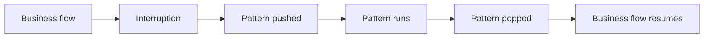

# Day 11 — Robustness: Repair, Error Handling, Validation, Evaluation
## Student Study Guide

This lesson explains how to keep a CALM assistant reliable when a conversation does not follow the expected path. It covers four areas:

1. conversation repair with built-in pattern flows;
2. input validation at the domain, flow, and action levels;
3. system-error handling and human handoff;
4. end-to-end testing and evaluation.

These areas address different problems:

| Problem | Meaning | Examples |
|---|---|---|
| Conversation interruption | The user changes the expected conversation path | Digression, correction, cancellation |
| Invalid input | The user provides unusable data | Invalid IBAN, amount above a limit |
| System error | The assistant's software or integrations fail | Action exception, unavailable backend |

The examples use a banking assistant that collects a recipient, an amount, and confirmation before executing a transfer.

---

## Chapter 1 — CALM repair patterns

### 1.1 Purpose of repair patterns

CALM treats common conversation interruptions as normal events. Users may change a value, cancel a task, ask an unrelated question, or start another task before finishing the current one. Rasa handles these events with built-in **pattern flows**.

A repair pattern provides deterministic behavior for a known interruption. It is not a fallback that requires more training examples.

### 1.2 How pattern flows work

Pattern flows have three important properties:

1. Their names use the reserved `pattern_` prefix.
2. Engine events and commands trigger them. Flow descriptions do not.
3. They use the same last-in-first-out dialogue stack as business flows [^1][^2].

When a pattern starts, Rasa pushes it onto the stack. When it completes, Rasa removes it and resumes the flow below it when appropriate.



### 1.3 Pattern reference

Rasa Pro provides built-in patterns for common conversation and system events [^1]. The patterns relevant to this lesson are:

| Pattern | Purpose |
|---|---|
| `pattern_continue_interrupted` | Offers to resume an interrupted flow |
| `pattern_correction` | Updates a previously filled slot |
| `pattern_cancel_flow` | Cancels the active flow |
| `pattern_chitchat` | Handles small talk |
| `pattern_completed` | Runs after the final flow completes |
| `pattern_clarification` | Resolves input that matches several flows |
| `pattern_internal_error` | Reports an internal system error |
| `pattern_external_agent_processing` | Handles messages received while a background agent is working |
| `pattern_cannot_handle` | Handles turns that produce no usable command |
| `pattern_human_handoff` | Transfers the conversation to a human |
| `pattern_session_start` | Initializes a session |
| `pattern_validate_slot` | Runs slot rejection rules |
| `pattern_repeat_bot_messages` | Repeats the previous assistant message |
| `pattern_customer_satisfaction` | Collects customer-satisfaction feedback |
| `pattern_user_silence` | Handles silence in voice channels |

Two related patterns have specialized roles:

- `pattern_collect_information` manages the ask-and-fill loop for `collect` steps.
- `pattern_search` supports knowledge-based answers.

### 1.4 Customizing a pattern

To replace a default pattern, define a flow with the same name in the project [^1]. Standard flow syntax applies.

Keep overrides short because repair patterns usually interrupt another task. Override only the required surface:

- Override a domain response to change wording.
- Override the pattern flow to change its steps or branching.
- Override a default action only when its returned events are fully understood.

For example, this override changes cancellation wording but preserves the built-in cancellation action:

```yaml
flows:
  pattern_cancel_flow:
    description: Cancel the active flow.
    steps:
      - action: action_cancel_flow
      - action: utter_flow_cancelled_rasa
```

```yaml
responses:
  utter_flow_cancelled_rasa:
    - text: "The transfer has been cancelled. Nothing was submitted."
```

Default actions such as `action_cancel_flow` return events that modify the dialogue stack and tracker. A same-name custom action replaces the built-in implementation; it does not extend it. Missing events therefore change behavior. Prefer to keep the default action and add steps around it.

---

## Chapter 2 — Handling conversation interruptions

Conversation logs expose the command produced from the user message and the pattern that handled it. Use both to explain the result:

```text
user behavior → command → pattern → outcome
```

### 2.1 Digressions and flow resumption

When a user starts another flow during the current flow, Rasa pushes the new flow onto the dialogue stack. After the new flow finishes, `pattern_continue_interrupted` can offer to resume the previous flow [^1][^2]. Its slots and current position remain available.

Example: during a transfer, the user asks for their balance.

```text
start flow check_balance
→ check_balance runs
→ pattern_continue_interrupted runs
→ transfer resumes with its collected slots
```

Preserved state has security consequences. An authentication slot remains set after a digression unless an action or override clears it. Re-authentication after an interruption is therefore an application policy.

A flow guard is not sufficient for sensitive operations. `call`, `link`, and `nlu_trigger` can enter a flow without evaluating its guard [^4]. Check authorization again inside the flow, close to the sensitive action:

```yaml
flows:
  transfer_money:
    description: Send money to a recipient.
    steps:
      - noop: true
        next:
          - if: not slots.authenticated
            then:
              - call: authenticate_user
                next: execute_transfer
          - else: execute_transfer
      - id: execute_transfer
        action: action_execute_transfer
```

This check applies regardless of how the flow was entered.

### 2.2 Clarifying multiple flow matches

If a request matches several flows, the command generator can emit a disambiguation command. Rasa then runs `pattern_clarification` and asks the user to select a flow [^1][^3].

Example:

```text
User: "I have a problem with my card."
Command: disambiguate flows block_card replace_card
Pattern: pattern_clarification
```

Buttons are often clearer than free-text answers for the available choices. Frequent clarification indicates that flow descriptions overlap. Improve the descriptions first; use the pattern as a safety mechanism.

### 2.3 Correcting slot values

A correction uses the same `set slot` command as an initial value. If the target slot is already filled, the engine runs `pattern_correction` [^1][^3]. The context variable `context.is_reset_only` distinguishes a new value from a request to clear the old one.

For consequential values, require confirmation after a correction. A user who confirmed a €200 transfer has not confirmed a later correction to €300. Enforce this rule in flow logic, not in a prompt.

The following override asks for confirmation before applying corrections [^1]:

```yaml
flows:
  pattern_correction:
    description: Confirm a correction before applying it.
    steps:
      - noop: true
        next:
          - if: context.is_reset_only
            then:
              - action: action_correct_flow_slot
                next: END
          - else: confirm_first
      - id: confirm_first
        collect: confirm_slot_correction
        next:
          - if: not slots.confirm_slot_correction
            then:
              - action: utter_not_corrected_previous_input
                next: END
          - else:
              - action: action_correct_flow_slot
              - action: utter_corrected_previous_input
                next: END
```

The override introduces a slot and a response, so declare them in the domain:

```yaml
slots:
  confirm_slot_correction:
    type: bool

responses:
  utter_ask_confirm_slot_correction:
    - text: "Apply this correction?"
  utter_not_corrected_previous_input:
    - text: "The previous value has been kept."
```

This override affects every correction. To confirm only sensitive changes, branch on `context.corrected_slots` and apply other corrections directly.

### 2.4 Cancellation and forced collection

The `cancel flow` command triggers `pattern_cancel_flow`. Its default action stops the active flow, removes its stack frame, and resets slots filled during that flow [^3][^9]. A cancellation response should state whether anything was submitted.

Use `force_slot_filling: true` when the process must suppress interruptions until the requested value is filled [^5]:

```yaml
- collect: dispute_reason
  description: The reason for the dispute.
  force_slot_filling: true
```

While forced collection is active, only commands that fill the requested slot are processed. Use it only for required data. Explain why the value is required and provide cancellation or human handoff as an exit.

### 2.5 Small talk

`pattern_chitchat` handles off-topic conversation [^1]. Chitchat is disabled by default. Without a configured chitchat policy, the request reaches `pattern_cannot_handle` with the reason `cannot_handle_chitchat` and receives a static response.

For a task-focused assistant, a short static response is usually sufficient:

> I can help with accounts, cards, and transfers. What would you like to do?

Free-form chitchat requires both a pattern override that uses `utter_free_chitchat_response` and the Contextual Response Rephraser:

```yaml
# endpoints.yml
nlg:
  type: rephrase
```

Without the rephraser, the response remains static. Generated chitchat adds content that the organization must evaluate and govern.

### 2.6 Flow completion and customer feedback

`pattern_completed` runs when the final flow on the stack completes. It usually asks whether the user needs more help [^1]. Override it with `noop` to finish without a follow-up question.

Flow completion does not end the session. A later message can start a new flow. A custom action returning `SessionEnded` ends the conversation and prevents further events [^6].

`pattern_customer_satisfaction` collects structured feedback. It can be reworded, connected to analytics, or disabled with `noop` when another feedback system is used.

---

## Chapter 3 — Input validation layers

Validation rules belong at the narrowest suitable layer:

| Layer | Use it for | Location |
|---|---|---|
| Domain | Rules that apply everywhere | Slot `validation.rejections` |
| Flow | Rules specific to one process | `collect` step `rejections` |
| Action | Checks that require code or external systems | `validate_<slot>` action |

The practical rule is: **format in the domain, context in the flow, external truth in an action**.

### 3.1 Domain-level validation

Put universal format rules on the slot under `validation.rejections` [^7].

```yaml
slots:
  recipient_iban:
    type: text
    mappings:
      - type: from_llm
    validation:
      rejections:
        - if: not (slots.recipient_iban matches "^IT[0-9]{2}[A-Z][0-9]{10}[0-9A-Z]{12}$")
          utter: utter_invalid_iban
      refill_utter: utter_refill_recipient_iban
```

When a rejection matches, Rasa clears the slot, sends the rejection message, and asks for the value again. The `from_llm` mapping fills the candidate value; it does not validate it.

The regex demonstrates where an Italian IBAN format rule belongs. Production rules should follow the official specification and should normalize input before testing it.

### 3.2 Flow-level validation

Put process-specific rules on the relevant `collect` step [^5]. For example, an instant-transfer limit does not apply to all uses of an amount slot:

```yaml
- collect: amount_of_money
  description: The transfer amount without a currency symbol.
  rejections:
    - if: slots.amount_of_money > 500
      utter: utter_instant_transfer_ceiling
```

Collect-step conditions use pypred expressions. A matching rejection sends its response and asks for the same slot again.

### 3.3 Validation actions

Use a custom validation action when a check requires code or an external system. In CALM, create a normal `Action` subclass whose `name()` returns `validate_<exact_slot_name>` [^8]. Rasa calls it automatically while collecting that slot.

```python
from typing import Any, Dict, List, Text

from rasa_sdk import Action, Tracker
from rasa_sdk.events import SlotSet
from rasa_sdk.executor import CollectingDispatcher
from rasa_sdk.types import DomainDict


class ValidateAmountOfMoney(Action):

    def name(self) -> Text:
        return "validate_amount_of_money"

    def run(
        self,
        dispatcher: CollectingDispatcher,
        tracker: Tracker,
        domain: DomainDict,
    ) -> List[Dict[Text, Any]]:
        amount = tracker.get_slot("amount_of_money")
        if isinstance(amount, (int, float)) and amount > 0:
            return []

        dispatcher.utter_message(text="Enter an amount greater than zero.")
        return [SlotSet("amount_of_money", None)]
```

Return an empty event list to keep an accepted value. Return a `SlotSet` event with `None` to clear a rejected value and ask again.

External checks need credentials from secure configuration, explicit timeouts, and controlled error handling. A backend failure is a system error, not an invalid user value.

### 3.4 Legacy validation code

NLU-era assistants may use `FormValidationAction` or `ValidationAction` with several `validate_<slot>` methods. Do not use this structure for new CALM validation. CALM uses one ordinary `Action` subclass named `validate_<slot>` [^8].

### 3.5 Collection and validation sequence

`pattern_collect_information` manages a `collect` step [^1][^9]:

1. ask for the slot;
2. run domain and collect-step rejection rules through `action_run_slot_rejections`;
3. run `validate_<slot>` when present;
4. ask again if the value was rejected.

`pattern_validate_slot` runs rejection rules when a slot is set, including writes outside a `collect` step. These patterns may appear in logs but normally do not require customization.

The LLM may extract a candidate value. Deterministic rules or external systems must decide whether the value is valid.

---

## Chapter 4 — System errors and human handoff

Two patterns handle different failure types:

| Pattern | Failure |
|---|---|
| `pattern_cannot_handle` | Dialogue understanding produced no usable command |
| `pattern_internal_error` | The application or infrastructure failed |

Use different messages because the causes and next steps differ.

### 4.1 Understanding failures

There is no `cannot handle` command. When command generation produces nothing usable, deterministic logic runs `pattern_cannot_handle` [^3]. The pattern branches on `context.reason` [^1]:

- `cannot_handle_not_supported`: no supported flow matches the request;
- `cannot_handle_no_relevant_answer`: a knowledge search found no relevant answer;
- `cannot_handle_chitchat`: chitchat is not configured;
- any other reason: ask the user to rephrase.

The default decision tree is usually sufficient. Override individual responses to name supported tasks or provide an appropriate support channel.

### 4.2 Runtime failures

`pattern_internal_error` handles runtime and input-constraint failures. It branches on `context.error_type` [^1]. Named branches cover empty and overlong user input. Other errors use the generic branch.

The default pattern uses `context.error_type` in an ordinary `noop` branch:

```yaml
flows:
  pattern_internal_error:
    description: Handle internal errors.
    steps:
      - noop: true
        next:
          - if: context.error_type is "rasa_internal_error_user_input_too_long"
            then:
              - action: utter_user_input_too_long_error_rasa
                next: END
          - if: context.error_type is "rasa_internal_error_user_input_empty"
            then:
              - action: utter_user_input_empty_error_rasa
                next: END
          - else:
              - action: utter_internal_error_rasa
                next: END
```

The value exists in the pattern's context only while that pattern is active. Use it in pattern conditions; it is not a domain slot. Agent and MCP tool failures use additional structured fields under `context.info`, such as `context.info.error_source`, while empty and overlong input continue to use `context.error_type` [^1].

If a custom action raises an exception, its server is unavailable, or its request times out, `FlowPolicy` cancels the active flow and runs `pattern_internal_error`.

A useful response states:

- what failed;
- whether the operation was submitted;
- what the user can do next.

```yaml
responses:
  utter_internal_error_rasa:
    - text: "Our systems could not complete the transfer. Nothing was submitted. Try again later or contact support."
```

`pattern_internal_error` is the only default pattern that does not support `link` steps [^1]. Keep its recovery self-contained.

### 4.3 Human handoff

`pattern_human_handoff` is a stub by default. A project must replace it with the steps that confirm and perform a transfer to its ticketing or live-agent system [^1]. Replacing the pattern defines **what happens after handoff starts**. It does not define **when handoff starts**.

The command generator has no handoff command, so it cannot invoke the pattern directly from a user message [^3]. The application needs an explicit route into it. The usual route is a startable business flow for requests such as "I want to speak to a person." That flow can then link to the pattern:

```yaml
flows:
  request_human_support:
    description: Start when the user asks to speak to a human agent or customer support.
    steps:
      - link: pattern_human_handoff
```

The command generator can start `request_human_support` because it is a normal business flow. The `link` step then transfers control to `pattern_human_handoff`. Other flows and repair patterns can link to the same pattern when an application rule requires escalation. For example, the official patterns documentation shows an overridden `pattern_clarification` linking to human handoff after a clarification counter exceeds a configured limit [^1].

Common entry routes are therefore:

- **Explicit request:** a startable support flow links to `pattern_human_handoff`.
- **Button or menu option:** its payload starts the support flow.
- **Repeated repair failure:** an overridden repair pattern counts failures and links to handoff at a defined threshold.
- **Sensitive system failure:** the error handler offers a support-flow button or calls escalation logic directly. `pattern_internal_error` itself cannot contain a `link` step [^1].

After one of these routes enters the pattern, the following override confirms the request and calls the integration action:

```yaml
flows:
  pattern_human_handoff:
    description: Transfer the conversation to a human agent.
    steps:
      - collect: confirm_human_handoff
        next:
          - if: slots.confirm_human_handoff
            then:
              - action: action_human_handoff
                next: END
          - else:
              - action: utter_human_handoff_cancelled
                next: END
```

`action_human_handoff` performs the external work: for example, it creates a support case, sends conversation context, or transfers the channel session. It should return a clear result and handle integration failures without leaving the user waiting.

Define the entry route, threshold, and confirmation policy separately. For example, an explicit request may require confirmation, repeated unsupported turns may offer handoff, and a failed dispute submission may escalate immediately.

### 4.4 Failure routing

| Failure | Route | Recommended result |
|---|---|---|
| Unsupported request | `pattern_cannot_handle` | List supported tasks; offer handoff after repeats |
| No relevant knowledge answer | `pattern_cannot_handle` | State that no answer was found; offer support |
| Empty or overlong input | `pattern_internal_error` | Explain the input constraint |
| Action exception or timeout | `pattern_internal_error` | State submission status and next step |
| Explicit request for a person | Handoff entry flow | Confirm and transfer |

---

## Chapter 5 — End-to-end testing and evaluation

Testing checks whether the assistant still follows its requirements after a change. In a Rasa end-to-end test, the test runner sends a sequence of user messages to the complete assistant and compares the resulting conversation events with expected results [^10]. It covers the path from a user message through dialogue understanding and flow execution to slots, actions, and responses.

A Rasa E2E test uses four basic concepts:

- A **test case** represents one conversation scenario, such as cancelling a transfer.
- A **user step** sends one message to the assistant.
- An **assertion** checks an observable result after that message, such as a started flow, a set slot, an executed action, or a response.
- A **fixture** sets required slot state before the conversation begins, such as an authenticated customer.

The runner executes each case independently. A case passes when its assertions match the events produced by the assistant. A mismatch reports the expected and actual events. Tests should describe required behavior, not every internal event. This keeps them useful when the implementation changes but the customer-facing contract does not.

Rasa supports three complementary forms of assessment [^10]:

1. Use **Inspector** to examine conversations manually while developing.
2. Use **E2E tests** for repeatable, scripted paths and regression checks in CI.
3. Use **simulation and evaluation** when an autonomous or generative path cannot be scripted turn by turn.

Store E2E tests in version control and run them when flows, descriptions, prompts, integrations, or models change.

### 5.1 Test structure

Test files contain user turns and assertions. Fixtures provide initial slot values [^10].

```yaml
fixtures:
  - premium:
      - membership_type: premium
      - logged_in: true

test_cases:
  - test_case: block_card
    fixtures:
      - premium
    steps:
      - user: "I need to block my card"
        assertions:
          - flow_started:
              operator: all
              flow_ids:
                - block_card
          - bot_uttered:
              utter_name: utter_confirm_block
      - user: "Yes, go ahead"
        assertions:
          - slot_was_set:
              - name: block_confirmed
                value: true
          - flow_completed:
              flow_id: block_card
```

Stub custom actions when a test should verify conversation logic without calling a backend:

```yaml
stub_custom_actions:
  action_fetch_balance:
    events:
      - event: slot
        name: account_balance
        value: 1250.00
    responses:
      - text: "Your account balance is €1,250.00."

test_cases:
  - test_case: check_balance
    steps:
      - user: "What's my balance?"
        assertions:
          - flow_started:
              operator: all
              flow_ids:
                - check_balance
          - bot_uttered:
              text_matches: "1,250.00"
```

Use a fast stubbed suite for conversation behavior and a smaller unstubbed suite for real integrations.

### 5.2 Assertions

Rasa provides assertions for the following behavior [^11]:

| Group | Assertions |
|---|---|
| Flows | `flow_started`, `flow_completed`, `flow_cancelled` |
| Slots | `slot_was_set`, `slot_was_not_set` |
| Actions | `action_executed` |
| Responses | `bot_uttered`, `bot_did_not_utter` |
| Clarification | `pattern_clarification_contains` |
| Generative answers | `generative_response_is_relevant`, `generative_response_is_grounded` |

Use deterministic assertions for deterministic behavior. Generated wording varies between runs, so exact-text matching is usually the wrong contract. Rasa provides two model-based assertions for this case: `generative_response_is_relevant` checks whether the answer addresses the user's message, while `generative_response_is_grounded` checks whether its factual statements are supported by a reference answer [^11].

A robust test for a rephrased domain response combines deterministic and model-based checks. The response name verifies that the assistant selected the intended domain response; relevance and groundedness then evaluate the generated wording:

```yaml
- user: "How much does an international transfer cost?"
  assertions:
    - bot_uttered:
        utter_name: utter_international_transfer_fee
    - generative_response_is_relevant:
        threshold: 0.9
        utter_source: ContextualResponseRephraser
    - generative_response_is_grounded:
        threshold: 0.9
        utter_source: ContextualResponseRephraser
```

`threshold` sets the minimum passing score between 0 and 1. `utter_source` identifies the component or custom action that generated the response. For a response produced by `ContextualResponseRephraser`, Rasa can recover the original domain response from response metadata and use it as the grounding reference. Set `ground_truth` explicitly when that reference is not available [^11]:

```yaml
- generative_response_is_grounded:
    threshold: 0.9
    ground_truth: "An international transfer costs €5."
    utter_source: ContextualResponseRephraser
```

The judge is configured in a project-root `conftest.yml`. Rasa discovers this file automatically [^11]:

```yaml
llm_judge:
  llm:
    provider: openai
    model: "gpt-4.1-mini-2025-04-14"
  embeddings:
    provider: openai
    model: "text-embedding-3-large"
```

These assertions grade relevance and factual preservation, not arbitrary qualities such as tone or writing style. Use human review or a separate rubric-based evaluation when those qualities form part of the requirement.

### 5.3 Running tests and validation

```bash
RASA_PRO_BETA_STUB_CUSTOM_ACTION=true rasa test e2e tests/ --coverage-report
rasa data validate
```

Stubbed custom actions require the beta feature flag shown in the command. Pass the test directory explicitly when it is not the default. Useful `rasa test e2e` options include [^13]:

- `--fail-fast`: stop after the first failure;
- `-f` or `--e2e-failed-tests`: export failed tests;
- `-o` or `--e2e-results`: write results to a file.

`--coverage-report` writes flow-step coverage, uncovered locations, command histograms, and passed and failed test groups to `e2e_coverage_results/` [^12]. Coverage identifies untested paths; it does not prove that the assertions are correct.

`rasa data validate` checks domain, flow, NLU, and conversation data for inconsistencies. It exits with status 1 when validation fails [^13]. Run it before the e2e suite in CI.

### 5.4 Evaluation methods

An **evaluation**, or **eval**, is a repeatable measurement of system quality. It has four parts:

1. an input or scenario to run;
2. a definition of successful behavior;
3. a grader that compares the result with that definition;
4. a recorded result that can be compared across versions.

An **evaluation set** is the versioned collection of these cases. It provides a stable basis for comparing a flow change, prompt revision, model upgrade, or new integration. Without a stable set, two versions are judged on different examples and the comparison is not reliable.

Rasa E2E tests are one form of evaluation. They script every user turn and apply assertions at specific points. This makes them appropriate for deterministic business flows and for blocking CI when behavior changes [^10][^14]. For example, an E2E case can require that cancelling a transfer produces `flow_cancelled` and never executes the transfer action.

Rasa simulation and evaluation addresses a different problem. A scenario describes the simulated user, optional initial slots, and successful outcomes. An LLM generates the user turns instead of following a fixed script. Rasa then evaluates the resulting conversation with deterministic assertions and natural-language criteria judged by an LLM [^14][^17]. This is useful when an agent chooses its own path or produces variable responses.

| Property | E2E test | Simulation and evaluation |
|---|---|---|
| Conversation path | Written turn by turn | Generated by a simulated user |
| Success checks | Assertions attached to scripted turns | Whole-conversation assertions and judged criteria |
| Best use | Deterministic flows and regression checks | Autonomous or variable conversation paths |
| Current workflow | Suitable for CI | Use in the local build loop; not a blocking CI gate [^14] |

Both approaches belong in the same quality process. Use E2E tests to protect exact business behavior. Use broader evals to measure outcomes whose path or wording can vary. Start with cases derived from the process map, including failure branches, and add cases when production conversations reveal new behavior.

Choose the simplest reliable grading method:

1. **Deterministic checks** for exact system behavior.
2. **Human review** for nuanced judgments that require domain expertise.
3. **LLM-based grading** for judgments that code cannot express at the required scale.

LLM judges may show position, verbosity, and self-preference biases [^15]. Reduce these risks by using a different model from the model under evaluation, a short rubric, and binary criteria where possible [^16][^18]. Validate the judge against human ratings before using it as a release gate.

### 5.5 Building the regression suite

Begin each test case with one requirement written as an observable statement: "cancelling a transfer prevents submission" is testable; "cancellation works correctly" is not. Then write the shortest conversation that reaches the behavior and assert the result that matters.

```yaml
test_cases:
  - test_case: cancelling a transfer prevents submission
    steps:
      - user: "Transfer 50 euros to Anna"
        assertions:
          - flow_started:
              operator: all
              flow_ids:
                - transfer_money
      - user: "Cancel the transfer"
        assertions:
          - flow_cancelled:
              flow_id: transfer_money
          - bot_uttered:
              utter_name: utter_flow_cancelled_rasa
          - bot_did_not_utter:
              utter_name: utter_transfer_completed
```

This case checks the business contract: the flow is cancelled, the user receives confirmation, and no completion response is sent. Rasa has no `action_not_executed` assertion. For an operation with an external side effect, assert the resulting slot and response state here, then use an integration test to verify that the backend operation was not performed.

Use these practices when expanding the suite:

- **Derive cases from requirements and branches.** Cover the happy path, each conditional branch, and each defined failure route.
- **Keep one main behavior per case.** A narrow failure identifies the broken requirement quickly.
- **Assert observable outcomes.** Prefer flow state, important slot values, actions with business effects, and named responses. Do not assert incidental events that the requirement does not depend on.
- **Include negative assertions.** Verify that rejected or unauthenticated input does not reach an execution action and that cancellation does not produce a success response.
- **Use fixtures only for real preconditions.** Authentication may be a fixture when authentication is outside the case. Do not pre-fill the value the case is meant to test.
- **Stub external boundaries deliberately.** Stub an action when testing conversation logic. Keep separate integration tests for the real action server and backend.
- **Use stable expectations.** Match a domain response name when exact wording is not the requirement. Match text only when the words themselves form part of the contract.
- **Test repair and security rules explicitly.** Cover corrections to sensitive values, rejection loops, cancellation, handoff thresholds, and unauthenticated entry through `nlu_trigger`, `call`, or `link`.
- **Add every reproduced defect.** A production failure should become a test before or alongside its fix.

Review coverage after the suite passes. Uncovered flow steps identify missing execution paths, but coverage alone does not show whether the correct outcomes were asserted [^12]. Run the suite on every relevant change. Treat a model or prompt update like a code change: evaluate it against the same regression set before release.

---

## Further reading

- [Patterns reference](https://rasa.com/docs/reference/primitives/patterns/)
- [Assertions reference](https://rasa.com/docs/reference/testing/assertions/)
- [Test coverage reference](https://rasa.com/docs/reference/testing/coverage/)
- [LLM-based Command Generators](https://rasa.com/docs/reference/config/components/llm-command-generators/)
- [Judging LLM-as-a-Judge with MT-Bench and Chatbot Arena](https://arxiv.org/abs/2306.05685)

---

### Sources

[^1]: [Rasa Docs — Patterns](https://rasa.com/docs/reference/primitives/patterns/).
[^2]: [Rasa Docs — Flow Policy](https://rasa.com/docs/reference/config/policies/flow-policy/).
[^3]: [Rasa Docs — LLM-based Command Generators](https://rasa.com/docs/reference/config/components/llm-command-generators/).
[^4]: [Rasa Docs — Starting Flows](https://rasa.com/docs/reference/primitives/starting-flows/).
[^5]: [Rasa Docs — Flow Steps](https://rasa.com/docs/reference/primitives/flow-steps/).
[^6]: [Rasa Docs — Session Lifecycle](https://rasa.com/docs/reference/config/session-management/session-lifecycle/).
[^7]: [Rasa Docs — Slots](https://rasa.com/docs/reference/primitives/slots/).
[^8]: [Rasa Docs — Slot Validation Actions](https://rasa.com/docs/reference/integrations/action-server/validation-action/).
[^9]: [Rasa Docs — Default Actions](https://rasa.com/docs/reference/primitives/default-actions/).
[^10]: [Rasa Docs — Evaluating Your Assistant](https://rasa.com/docs/pro/testing/evaluating-assistant/).
[^11]: [Rasa Docs — Assertions](https://rasa.com/docs/reference/testing/assertions/).
[^12]: [Rasa Docs — Test Coverage](https://rasa.com/docs/reference/testing/coverage/).
[^13]: [Rasa Docs — Command Line Interface](https://rasa.com/docs/reference/api/command-line-interface/).
[^14]: [Rasa Docs — Simulation and Evaluation Overview](https://rasa.com/docs/reference/testing/evals/overview/).
[^15]: Zheng et al., [Judging LLM-as-a-Judge with MT-Bench and Chatbot Arena](https://arxiv.org/abs/2306.05685), 2023.
[^16]: [Anthropic — Define success criteria and build evaluations](https://platform.claude.com/docs/en/docs/test-and-evaluate/develop-tests).
[^17]: [Rasa Docs — Evaluation Scenarios](https://rasa.com/docs/reference/testing/evals/scenarios/).
[^18]: Hamel Husain, [Using LLM-as-a-Judge for Evaluation](https://hamel.dev/blog/posts/llm-judge).
