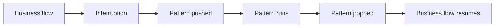

# Day 11 — Robustezza: Riparazione, Gestione degli Errori, Validazione, Valutazione
## Guida di Studio per lo Studente

Questa lezione spiega come mantenere affidabile un assistente CALM quando una conversazione non segue il percorso previsto. Copre quattro aree:

1. la riparazione della conversazione tramite i pattern flow integrati;
2. la validazione dell'input a livello di domain, di flow e di action;
3. la gestione degli errori di sistema e il passaggio a un operatore umano;
4. il test end-to-end e la valutazione.

Queste aree affrontano problemi diversi:

| Problema | Significato | Esempi |
|---|---|---|
| Interruzione della conversazione | L'utente cambia il percorso conversazionale previsto | Digressione, correzione, cancellazione |
| Input non valido | L'utente fornisce dati inutilizzabili | IBAN non valido, importo superiore a un limite |
| Errore di sistema | Il software dell'assistente o le sue integrazioni falliscono | Eccezione in un'action, backend non disponibile |

Gli esempi usano un assistente bancario che raccoglie un destinatario, un importo e una conferma prima di eseguire un bonifico.

---

## Capitolo 1 — I pattern di riparazione di CALM

### 1.1 Scopo dei pattern di riparazione

CALM tratta le interruzioni conversazionali più comuni come eventi normali. Gli utenti possono cambiare un valore, cancellare un task, porre una domanda non pertinente, o avviare un altro task prima di aver concluso quello corrente. Rasa gestisce questi eventi con i **pattern flow** integrati.

Un pattern di riparazione fornisce un comportamento deterministico per un'interruzione nota. Non è un fallback che richiede altri esempi di training.

### 1.2 Come funzionano i pattern flow

I pattern flow hanno tre proprietà importanti:

1. I loro nomi usano il prefisso riservato `pattern_`.
2. Sono attivati da eventi del motore e da command. Non dalle description dei flow.
3. Usano lo stesso dialogue stack last-in-first-out dei flow di business [^1][^2].

Quando un pattern parte, Rasa lo inserisce (push) sullo stack. Quando si completa, Rasa lo rimuove e riprende, quando opportuno, il flow sottostante.



### 1.3 Riferimento dei pattern

Rasa Pro fornisce pattern integrati per gli eventi conversazionali e di sistema più comuni [^1]. I pattern rilevanti per questa lezione sono:

| Pattern | Scopo |
|---|---|
| `pattern_continue_interrupted` | Propone di riprendere un flow interrotto |
| `pattern_correction` | Aggiorna uno slot già compilato |
| `pattern_cancel_flow` | Cancella il flow attivo |
| `pattern_chitchat` | Gestisce le chiacchiere informali |
| `pattern_completed` | Viene eseguito dopo il completamento dell'ultimo flow |
| `pattern_clarification` | Risolve un input che corrisponde a più flow |
| `pattern_internal_error` | Segnala un errore interno di sistema |
| `pattern_external_agent_processing` | Gestisce i messaggi ricevuti mentre un agente in background sta lavorando |
| `pattern_cannot_handle` | Gestisce i turni che non producono alcun command utilizzabile |
| `pattern_human_handoff` | Trasferisce la conversazione a un operatore umano |
| `pattern_session_start` | Inizializza una sessione |
| `pattern_validate_slot` | Esegue le regole di rifiuto (rejection) di uno slot |
| `pattern_repeat_bot_messages` | Ripete il messaggio precedente dell'assistente |
| `pattern_customer_satisfaction` | Raccoglie il feedback di soddisfazione del cliente |
| `pattern_user_silence` | Gestisce il silenzio nei canali vocali |

Due pattern correlati hanno ruoli specializzati:

- `pattern_collect_information` gestisce il ciclo di richiesta e compilazione (ask-and-fill) degli step `collect`.
- `pattern_search` supporta le risposte basate sulla conoscenza (knowledge-based).

### 1.4 Personalizzare un pattern

Per sostituire un pattern di default, si definisce nel progetto un flow con lo stesso nome [^1]. Vale la sintassi standard dei flow.

Conviene mantenere brevi gli override, perché i pattern di riparazione di norma interrompono un altro task. Va sovrascritta solo la superficie strettamente necessaria:

- Sovrascrivere una response del domain per cambiare la formulazione.
- Sovrascrivere il pattern flow per cambiarne gli step o le diramazioni.
- Sovrascrivere una default action solo quando si comprendono a fondo gli eventi che restituisce.

Per esempio, questo override cambia la formulazione della cancellazione ma preserva l'action di cancellazione integrata:

```yaml
flows:
  pattern_cancel_flow:
    description: Cancel the active flow.
    steps:
      - action: action_cancel_flow
      - action: utter_flow_cancelled_rasa
```

```yaml
responses:
  utter_flow_cancelled_rasa:
    - text: "The transfer has been cancelled. Nothing was submitted."
```

Le default action come `action_cancel_flow` restituiscono eventi che modificano il dialogue stack e il tracker. Una custom action con lo stesso nome sostituisce l'implementazione integrata; non la estende. Gli eventi mancanti cambiano dunque il comportamento. È preferibile mantenere la default action e aggiungere step attorno ad essa.

---

## Capitolo 2 — Gestire le interruzioni della conversazione

I log della conversazione espongono il command prodotto a partire dal messaggio dell'utente e il pattern che lo ha gestito. Si usano entrambi per spiegare il risultato:

```text
user behavior → command → pattern → outcome
```

### 2.1 Digressioni e ripresa del flow

Quando un utente avvia un altro flow durante quello corrente, Rasa inserisce il nuovo flow sul dialogue stack. Dopo che il nuovo flow è terminato, `pattern_continue_interrupted` può proporre di riprendere il flow precedente [^1][^2]. I suoi slot e la sua posizione corrente restano disponibili.

Esempio: durante un bonifico, l'utente chiede il proprio saldo.

```text
start flow check_balance
→ check_balance runs
→ pattern_continue_interrupted runs
→ transfer resumes with its collected slots
```

Lo stato preservato ha conseguenze di sicurezza. Uno slot di autenticazione resta impostato dopo una digressione, a meno che un'action o un override non lo azzeri. La ri-autenticazione dopo un'interruzione è quindi una politica applicativa.

Un flow guard non è sufficiente per le operazioni sensibili. `call`, `link` e `nlu_trigger` possono entrare in un flow senza valutarne il guard [^4]. L'autorizzazione va verificata nuovamente all'interno del flow, in prossimità dell'azione sensibile:

```yaml
flows:
  transfer_money:
    description: Send money to a recipient.
    steps:
      - noop: true
        next:
          - if: not slots.authenticated
            then:
              - call: authenticate_user
                next: execute_transfer
          - else: execute_transfer
      - id: execute_transfer
        action: action_execute_transfer
```

Questo controllo si applica indipendentemente da come si è entrati nel flow.

### 2.2 Chiarire corrispondenze multiple tra flow

Se una richiesta corrisponde a più flow, il command generator può emettere un command di disambiguazione. Rasa esegue allora `pattern_clarification` e chiede all'utente di selezionare un flow [^1][^3].

Esempio:

```text
User: "I have a problem with my card."
Command: disambiguate flows block_card replace_card
Pattern: pattern_clarification
```

I bottoni sono spesso più chiari di una risposta a testo libero per presentare le scelte disponibili. Un ricorso frequente alla clarification indica che le description dei flow si sovrappongono. Conviene migliorare prima le description e usare il pattern come meccanismo di sicurezza.

### 2.3 Correggere i valori degli slot

Una correzione usa lo stesso command `set slot` di un valore iniziale. Se lo slot di destinazione è già compilato, il motore esegue `pattern_correction` [^1][^3]. La variabile di contesto `context.is_reset_only` distingue un nuovo valore da una richiesta di azzerare quello precedente.

Per i valori che hanno conseguenze rilevanti, occorre richiedere una conferma dopo una correzione. Un utente che ha confermato un bonifico di 200 € non ha confermato una successiva correzione a 300 €. Questa regola va imposta nella logica del flow, non in un prompt.

Il seguente override chiede conferma prima di applicare le correzioni [^1]:

```yaml
flows:
  pattern_correction:
    description: Confirm a correction before applying it.
    steps:
      - noop: true
        next:
          - if: context.is_reset_only
            then:
              - action: action_correct_flow_slot
                next: END
          - else: confirm_first
      - id: confirm_first
        collect: confirm_slot_correction
        next:
          - if: not slots.confirm_slot_correction
            then:
              - action: utter_not_corrected_previous_input
                next: END
          - else:
              - action: action_correct_flow_slot
              - action: utter_corrected_previous_input
                next: END
```

L'override introduce uno slot e una response, che vanno quindi dichiarati nel domain:

```yaml
slots:
  confirm_slot_correction:
    type: bool

responses:
  utter_ask_confirm_slot_correction:
    - text: "Apply this correction?"
  utter_not_corrected_previous_input:
    - text: "The previous value has been kept."
```

Questo override incide su ogni correzione. Per richiedere conferma solo per le modifiche sensibili, si dirama su `context.corrected_slots` e si applicano direttamente le altre correzioni.

### 2.4 Cancellazione e raccolta forzata

Il command `cancel flow` attiva `pattern_cancel_flow`. La sua action di default interrompe il flow attivo, ne rimuove il frame dallo stack e azzera gli slot compilati durante quel flow [^3][^9]. Una response di cancellazione dovrebbe dichiarare se qualcosa è stato inoltrato o meno.

Si usa `force_slot_filling: true` quando il processo deve sopprimere le interruzioni finché il valore richiesto non è stato compilato [^5]:

```yaml
- collect: dispute_reason
  description: The reason for the dispute.
  force_slot_filling: true
```

Mentre la raccolta forzata è attiva, vengono elaborati soltanto i command che compilano lo slot richiesto. Va usata solo per i dati obbligatori. Occorre spiegare perché il valore è necessario e fornire come via d'uscita la cancellazione o il passaggio a un operatore umano.

### 2.5 Chiacchiere informali

`pattern_chitchat` gestisce la conversazione fuori tema [^1]. Il chitchat è disabilitato per default. In assenza di una policy di chitchat configurata, la richiesta raggiunge `pattern_cannot_handle` con motivazione `cannot_handle_chitchat` e riceve una risposta statica.

Per un assistente orientato ai task, una breve risposta statica è di norma sufficiente:

> I can help with accounts, cards, and transfers. What would you like to do?

Il chitchat in forma libera richiede sia un override del pattern che usi `utter_free_chitchat_response`, sia il Contextual Response Rephraser:

```yaml
# endpoints.yml
nlg:
  type: rephrase
```

Senza il rephraser, la risposta resta statica. Il chitchat generato aggiunge contenuti che l'organizzazione deve valutare e governare.

### 2.6 Completamento del flow e feedback del cliente

`pattern_completed` viene eseguito quando l'ultimo flow presente sullo stack si completa. Di norma chiede se l'utente ha bisogno di ulteriore assistenza [^1]. Lo si sovrascrive con `noop` per concludere senza una domanda di follow-up.

Il completamento di un flow non termina la sessione. Un messaggio successivo può avviare un nuovo flow. Una custom action che restituisce `SessionEnded` chiude la conversazione e impedisce ulteriori eventi [^6].

`pattern_customer_satisfaction` raccoglie feedback strutturato. Può essere riformulato, collegato all'analytics, oppure disabilitato con `noop` quando si usa un altro sistema di feedback.

---

## Capitolo 3 — I livelli di validazione dell'input

Le regole di validazione appartengono al livello più ristretto che sia adeguato:

| Livello | Da usare per | Collocazione |
|---|---|---|
| Domain | Regole valide ovunque | `validation.rejections` dello slot |
| Flow | Regole specifiche di un processo | `rejections` dello step `collect` |
| Action | Controlli che richiedono codice o sistemi esterni | Action `validate_<slot>` |

La regola pratica è: **il formato nel domain, il contesto nel flow, la verità esterna in un'action**.

### 3.1 Validazione a livello di domain

Le regole di formato universali vanno poste sullo slot, sotto `validation.rejections` [^7].

```yaml
slots:
  recipient_iban:
    type: text
    mappings:
      - type: from_llm
    validation:
      rejections:
        - if: not (slots.recipient_iban matches "^IT[0-9]{2}[A-Z][0-9]{10}[0-9A-Z]{12}$")
          utter: utter_invalid_iban
      refill_utter: utter_refill_recipient_iban
```

Quando una rejection scatta, Rasa azzera lo slot, invia il messaggio di rifiuto e richiede nuovamente il valore. Il mapping `from_llm` compila il valore candidato; non lo valida.

L'espressione regolare mostra dove collocare una regola sul formato dell'IBAN italiano. Le regole di produzione dovrebbero seguire la specifica ufficiale e normalizzare l'input prima di verificarlo.

### 3.2 Validazione a livello di flow

Le regole specifiche di un processo vanno poste sullo step `collect` pertinente [^5]. Per esempio, il limite di un bonifico istantaneo non si applica a tutti gli usi di uno slot che contiene un importo:

```yaml
- collect: amount_of_money
  description: The transfer amount without a currency symbol.
  rejections:
    - if: slots.amount_of_money > 500
      utter: utter_instant_transfer_ceiling
```

Le condizioni degli step `collect` usano espressioni pypred. Una rejection che scatta invia la propria response e richiede nuovamente lo stesso slot.

### 3.3 Le action di validazione

Si usa una custom action di validazione quando un controllo richiede codice o un sistema esterno. In CALM si crea una normale sottoclasse di `Action` il cui `name()` restituisce `validate_<exact_slot_name>` [^8]. Rasa la invoca automaticamente durante la raccolta di quello slot.

```python
from typing import Any, Dict, List, Text

from rasa_sdk import Action, Tracker
from rasa_sdk.events import SlotSet
from rasa_sdk.executor import CollectingDispatcher
from rasa_sdk.types import DomainDict


class ValidateAmountOfMoney(Action):

    def name(self) -> Text:
        return "validate_amount_of_money"

    def run(
        self,
        dispatcher: CollectingDispatcher,
        tracker: Tracker,
        domain: DomainDict,
    ) -> List[Dict[Text, Any]]:
        amount = tracker.get_slot("amount_of_money")
        if isinstance(amount, (int, float)) and amount > 0:
            return []

        dispatcher.utter_message(text="Enter an amount greater than zero.")
        return [SlotSet("amount_of_money", None)]
```

Restituire una lista di eventi vuota mantiene il valore accettato. Restituire un evento `SlotSet` con `None` azzera il valore rifiutato e ne richiede uno nuovo.

I controlli esterni richiedono credenziali provenienti da una configurazione sicura, timeout espliciti e una gestione controllata degli errori. Il fallimento di un backend è un errore di sistema, non un valore utente non valido.

### 3.4 Codice di validazione legacy

Gli assistenti dell'era NLU possono usare `FormValidationAction` o `ValidationAction` con vari metodi `validate_<slot>`. Questa struttura non va usata per una nuova validazione in CALM. CALM usa un'unica sottoclasse ordinaria di `Action` denominata `validate_<slot>` [^8].

### 3.5 La sequenza di raccolta e validazione

`pattern_collect_information` gestisce uno step `collect` [^1][^9]:

1. chiede lo slot;
2. esegue le regole di rejection del domain e dello step `collect` tramite `action_run_slot_rejections`;
3. esegue `validate_<slot>` quando è presente;
4. richiede nuovamente il valore se è stato rifiutato.

`pattern_validate_slot` esegue le regole di rejection quando uno slot viene impostato, incluse le scritture che avvengono al di fuori di uno step `collect`. Questi pattern possono comparire nei log ma di norma non richiedono personalizzazioni.

L'LLM può estrarre un valore candidato. Sono le regole deterministiche o i sistemi esterni a dover decidere se quel valore è valido.

---

## Capitolo 4 — Errori di sistema e passaggio a un operatore umano

Due pattern gestiscono tipi di fallimento diversi:

| Pattern | Fallimento |
|---|---|
| `pattern_cannot_handle` | Il dialogue understanding non ha prodotto alcun command utilizzabile |
| `pattern_internal_error` | L'applicazione o l'infrastruttura ha fallito |

Occorre usare messaggi diversi, perché le cause e i passi successivi sono diversi.

### 4.1 Fallimenti nella comprensione

Non esiste un command `cannot handle`. Quando la generazione dei command non produce nulla di utilizzabile, una logica deterministica esegue `pattern_cannot_handle` [^3]. Il pattern dirama su `context.reason` [^1]:

- `cannot_handle_not_supported`: nessun flow supportato corrisponde alla richiesta;
- `cannot_handle_no_relevant_answer`: una ricerca nella knowledge base non ha trovato una risposta pertinente;
- `cannot_handle_chitchat`: il chitchat non è configurato;
- qualsiasi altra motivazione: si chiede all'utente di riformulare.

L'albero decisionale di default è di norma sufficiente. Si sovrascrivono le singole response per elencare i task supportati o per indicare un canale di supporto appropriato.

### 4.2 Fallimenti a runtime

`pattern_internal_error` gestisce i fallimenti a runtime e quelli dovuti ai vincoli sull'input. Dirama su `context.error_type` [^1]. Le diramazioni nominate coprono l'input utente vuoto e quello troppo lungo. Gli altri errori usano la diramazione generica.

Il pattern di default usa `context.error_type` in una normale diramazione `noop`:

```yaml
flows:
  pattern_internal_error:
    description: Handle internal errors.
    steps:
      - noop: true
        next:
          - if: context.error_type is "rasa_internal_error_user_input_too_long"
            then:
              - action: utter_user_input_too_long_error_rasa
                next: END
          - if: context.error_type is "rasa_internal_error_user_input_empty"
            then:
              - action: utter_user_input_empty_error_rasa
                next: END
          - else:
              - action: utter_internal_error_rasa
                next: END
```

Il valore esiste nel contesto del pattern soltanto finché quel pattern è attivo. Va usato nelle condizioni del pattern; non è uno slot del domain. I fallimenti degli agenti e dei tool MCP usano ulteriori campi strutturati sotto `context.info`, come `context.info.error_source`, mentre l'input vuoto e quello troppo lungo continuano a usare `context.error_type` [^1].

Se una custom action solleva un'eccezione, se il suo server non è disponibile, o se la richiesta va in timeout, la `FlowPolicy` cancella il flow attivo ed esegue `pattern_internal_error`.

Una response utile dichiara:

- che cosa è fallito;
- se l'operazione è stata inoltrata;
- che cosa può fare l'utente a questo punto.

```yaml
responses:
  utter_internal_error_rasa:
    - text: "Our systems could not complete the transfer. Nothing was submitted. Try again later or contact support."
```

`pattern_internal_error` è l'unico pattern di default che non supporta gli step `link` [^1]. Il suo recupero va mantenuto autosufficiente.

### 4.3 Passaggio a un operatore umano

`pattern_human_handoff` è per default uno stub. Un progetto deve sostituirlo con gli step che confermano ed eseguono il trasferimento verso il proprio sistema di ticketing o di operatori in carne e ossa [^1]. Sostituire il pattern definisce **che cosa accade dopo l'avvio dell'handoff**. Non definisce **quando l'handoff si avvia**.

Il command generator non dispone di un command di handoff, quindi non può invocare il pattern direttamente a partire da un messaggio dell'utente [^3]. L'applicazione ha bisogno di una via d'accesso esplicita. La via consueta è un flow di business avviabile (startable) per richieste come "I want to speak to a person." Quel flow può poi collegarsi al pattern:

```yaml
flows:
  request_human_support:
    description: Start when the user asks to speak to a human agent or customer support.
    steps:
      - link: pattern_human_handoff
```

Il command generator può avviare `request_human_support` perché è un normale flow di business. Lo step `link` trasferisce poi il controllo a `pattern_human_handoff`. Altri flow e altri pattern di riparazione possono collegarsi allo stesso pattern quando una regola applicativa richiede un'escalation. Per esempio, la documentazione ufficiale sui pattern mostra un `pattern_clarification` sovrascritto che si collega all'handoff umano dopo che un contatore di clarification ha superato un limite configurato [^1].

Le vie d'accesso più comuni sono dunque:

- **Richiesta esplicita:** un flow di supporto avviabile si collega a `pattern_human_handoff`.
- **Bottone o voce di menu:** il suo payload avvia il flow di supporto.
- **Ripetuti fallimenti di riparazione:** un pattern di riparazione sovrascritto conta i fallimenti e si collega all'handoff a una soglia definita.
- **Fallimento di sistema su un'operazione sensibile:** il gestore dell'errore propone un bottone verso il flow di supporto oppure invoca direttamente la logica di escalation. `pattern_internal_error` non può contenere di per sé uno step `link` [^1].

Dopo che una di queste vie ha fatto entrare nel pattern, il seguente override conferma la richiesta e invoca l'action di integrazione:

```yaml
flows:
  pattern_human_handoff:
    description: Transfer the conversation to a human agent.
    steps:
      - collect: confirm_human_handoff
        next:
          - if: slots.confirm_human_handoff
            then:
              - action: action_human_handoff
                next: END
          - else:
              - action: utter_human_handoff_cancelled
                next: END
```

`action_human_handoff` svolge il lavoro esterno: per esempio, crea un caso di supporto, invia il contesto della conversazione, oppure trasferisce la sessione del canale. Dovrebbe restituire un risultato chiaro e gestire i fallimenti dell'integrazione senza lasciare l'utente in attesa.

La via d'accesso, la soglia e la politica di conferma vanno definite separatamente. Per esempio, una richiesta esplicita può richiedere una conferma, turni ripetutamente non supportati possono proporre l'handoff, e l'invio fallito di una contestazione può fare escalation immediatamente.

### 4.4 Instradamento dei fallimenti

| Fallimento | Instradamento | Risultato raccomandato |
|---|---|---|
| Richiesta non supportata | `pattern_cannot_handle` | Elencare i task supportati; proporre l'handoff dopo ripetuti tentativi |
| Nessuna risposta pertinente nella knowledge base | `pattern_cannot_handle` | Dichiarare che non è stata trovata alcuna risposta; proporre supporto |
| Input vuoto o troppo lungo | `pattern_internal_error` | Spiegare il vincolo sull'input |
| Eccezione o timeout di un'action | `pattern_internal_error` | Dichiarare lo stato dell'invio e il passo successivo |
| Richiesta esplicita di una persona | Flow di accesso all'handoff | Confermare e trasferire |

---

## Capitolo 5 — Test end-to-end e valutazione

Il testing verifica se l'assistente rispetta ancora i propri requisiti dopo una modifica. In un test end-to-end di Rasa, il test runner invia una sequenza di messaggi utente all'assistente completo e confronta gli eventi della conversazione risultante con i risultati attesi [^10]. Copre il percorso che va da un messaggio dell'utente, attraverso il dialogue understanding e l'esecuzione dei flow, fino a slot, action e response.

Un test E2E di Rasa si basa su quattro concetti fondamentali:

- Un **test case** rappresenta uno scenario conversazionale, per esempio la cancellazione di un bonifico.
- Uno **user step** invia un messaggio all'assistente.
- Un'**assertion** verifica un risultato osservabile dopo quel messaggio: un flow avviato, uno slot impostato, un'action eseguita, o una response.
- Una **fixture** imposta lo stato degli slot richiesto prima dell'inizio della conversazione, per esempio un cliente autenticato.

Il runner esegue ciascun caso in modo indipendente. Un caso passa quando le sue assertion corrispondono agli eventi prodotti dall'assistente. In caso di discrepanza vengono riportati gli eventi attesi e quelli effettivi. I test dovrebbero descrivere il comportamento richiesto, non ogni evento interno. Questo li mantiene utili quando l'implementazione cambia ma il contratto verso il cliente no.

Rasa supporta tre forme complementari di valutazione [^10]:

1. Usare l'**Inspector** per esaminare manualmente le conversazioni durante lo sviluppo.
2. Usare i **test E2E** per percorsi ripetibili e scriptati e per i controlli di regressione in CI.
3. Usare la **simulazione e valutazione** quando un percorso autonomo o generativo non può essere scriptato turno per turno.

I test E2E vanno conservati nel version control ed eseguiti quando cambiano flow, description, prompt, integrazioni o modelli.

### 5.1 Struttura di un test

I file di test contengono i turni dell'utente e le assertion. Le fixture forniscono i valori iniziali degli slot [^10].

```yaml
fixtures:
  - premium:
      - membership_type: premium
      - logged_in: true

test_cases:
  - test_case: block_card
    fixtures:
      - premium
    steps:
      - user: "I need to block my card"
        assertions:
          - flow_started:
              operator: all
              flow_ids:
                - block_card
          - bot_uttered:
              utter_name: utter_confirm_block
      - user: "Yes, go ahead"
        assertions:
          - slot_was_set:
              - name: block_confirmed
                value: true
          - flow_completed:
              flow_id: block_card
```

Le custom action vanno sostituite con degli stub quando un test deve verificare la logica conversazionale senza invocare un backend:

```yaml
stub_custom_actions:
  action_fetch_balance:
    events:
      - event: slot
        name: account_balance
        value: 1250.00
    responses:
      - text: "Your account balance is €1,250.00."

test_cases:
  - test_case: check_balance
    steps:
      - user: "What's my balance?"
        assertions:
          - flow_started:
              operator: all
              flow_ids:
                - check_balance
          - bot_uttered:
              text_matches: "1,250.00"
```

Conviene usare una suite veloce con stub per il comportamento conversazionale e una suite più piccola senza stub per le integrazioni reali.

### 5.2 Le assertion

Rasa fornisce assertion per i comportamenti seguenti [^11]:

| Gruppo | Assertion |
|---|---|
| Flow | `flow_started`, `flow_completed`, `flow_cancelled` |
| Slot | `slot_was_set`, `slot_was_not_set` |
| Action | `action_executed` |
| Response | `bot_uttered`, `bot_did_not_utter` |
| Clarification | `pattern_clarification_contains` |
| Risposte generative | `generative_response_is_relevant`, `generative_response_is_grounded` |

Per il comportamento deterministico si usano assertion deterministiche. La formulazione generata varia tra un'esecuzione e l'altra, quindi il confronto sul testo esatto è di norma il contratto sbagliato. Rasa fornisce due assertion basate su modello per questo caso: `generative_response_is_relevant` verifica se la risposta risponde effettivamente al messaggio dell'utente, mentre `generative_response_is_grounded` verifica se le sue affermazioni fattuali sono supportate da una risposta di riferimento [^11].

Un test robusto per una response del domain riformulata combina controlli deterministici e controlli basati su modello. Il nome della response verifica che l'assistente abbia selezionato la response del domain prevista; rilevanza e groundedness valutano poi la formulazione generata:

```yaml
- user: "How much does an international transfer cost?"
  assertions:
    - bot_uttered:
        utter_name: utter_international_transfer_fee
    - generative_response_is_relevant:
        threshold: 0.9
        utter_source: ContextualResponseRephraser
    - generative_response_is_grounded:
        threshold: 0.9
        utter_source: ContextualResponseRephraser
```

`threshold` imposta il punteggio minimo di superamento, compreso tra 0 e 1. `utter_source` identifica il componente o la custom action che ha generato la response. Per una response prodotta da `ContextualResponseRephraser`, Rasa può recuperare la response originale del domain dai metadata della response e usarla come riferimento di grounding. Quando quel riferimento non è disponibile, va impostato esplicitamente `ground_truth` [^11]:

```yaml
- generative_response_is_grounded:
    threshold: 0.9
    ground_truth: "An international transfer costs €5."
    utter_source: ContextualResponseRephraser
```

Il judge si configura in un file `conftest.yml` posto nella root del progetto. Rasa individua questo file automaticamente [^11]:

```yaml
llm_judge:
  llm:
    provider: openai
    model: "gpt-4.1-mini-2025-04-14"
  embeddings:
    provider: openai
    model: "text-embedding-3-large"
```

Queste assertion valutano la rilevanza e la conservazione dei fatti, non qualità arbitrarie come il tono o lo stile di scrittura. Quando quelle qualità fanno parte dei requisiti, occorre ricorrere alla revisione umana o a una valutazione separata basata su rubrica.

### 5.3 Eseguire i test e la validazione

```bash
RASA_PRO_BETA_STUB_CUSTOM_ACTION=true rasa test e2e tests/ --coverage-report
rasa data validate
```

Le custom action sostituite con stub richiedono il feature flag beta mostrato nel comando. La directory dei test va indicata esplicitamente quando non è quella di default. Tra le opzioni utili di `rasa test e2e` [^13]:

- `--fail-fast`: si ferma al primo fallimento;
- `-f` oppure `--e2e-failed-tests`: esporta i test falliti;
- `-o` oppure `--e2e-results`: scrive i risultati su file.

`--coverage-report` scrive in `e2e_coverage_results/` la copertura degli step dei flow, le posizioni non coperte, gli istogrammi dei command e i gruppi di test passati e falliti [^12]. La copertura individua i percorsi non testati; non dimostra che le assertion siano corrette.

`rasa data validate` verifica la presenza di incoerenze nei dati di domain, flow, NLU e conversazione. Esce con stato 1 quando la validazione fallisce [^13]. Va eseguito prima della suite e2e in CI.

### 5.4 Metodi di valutazione

Una **evaluation**, o **eval**, è una misurazione ripetibile della qualità del sistema. Si compone di quattro parti:

1. un input o uno scenario da eseguire;
2. una definizione di comportamento corretto;
3. un grader che confronta il risultato con quella definizione;
4. un risultato registrato che possa essere confrontato tra versioni diverse.

Un **evaluation set** è la collezione versionata di questi casi. Fornisce una base stabile per confrontare una modifica a un flow, una revisione di un prompt, l'aggiornamento di un modello o una nuova integrazione. Senza un insieme stabile, due versioni vengono giudicate su esempi diversi e il confronto non è affidabile.

I test E2E di Rasa sono una forma di valutazione. Scriptano ogni turno dell'utente e applicano assertion in punti specifici. Questo li rende adatti ai flow di business deterministici e a bloccare la CI quando il comportamento cambia [^10][^14]. Per esempio, un caso E2E può richiedere che la cancellazione di un bonifico produca `flow_cancelled` e non esegua mai l'action di bonifico.

La simulazione e valutazione di Rasa affronta un problema diverso. Uno scenario descrive l'utente simulato, gli eventuali slot iniziali e gli esiti considerati corretti. Un LLM genera i turni dell'utente invece di seguire uno script fisso. Rasa valuta poi la conversazione risultante con assertion deterministiche e con criteri in linguaggio naturale giudicati da un LLM [^14][^17]. Questo è utile quando un agente sceglie autonomamente il proprio percorso o produce risposte variabili.

| Proprietà | Test E2E | Simulazione e valutazione |
|---|---|---|
| Percorso conversazionale | Scritto turno per turno | Generato da un utente simulato |
| Verifiche di successo | Assertion agganciate a turni scriptati | Assertion sull'intera conversazione e criteri giudicati |
| Uso migliore | Flow deterministici e controlli di regressione | Percorsi conversazionali autonomi o variabili |
| Workflow attuale | Adatto alla CI | Da usare nel ciclo di build locale; non come gate bloccante in CI [^14] |

Entrambi gli approcci appartengono allo stesso processo di qualità. I test E2E vanno usati per proteggere il comportamento di business esatto. Le eval più ampie vanno usate per misurare esiti il cui percorso o la cui formulazione possono variare. Si comincia con casi derivati dalla mappa del processo, incluse le diramazioni di fallimento, e si aggiungono casi quando le conversazioni in produzione rivelano nuovi comportamenti.

Va scelto il metodo di grading affidabile più semplice:

1. **Controlli deterministici** per il comportamento esatto del sistema.
2. **Revisione umana** per i giudizi sfumati che richiedono competenza di dominio.
3. **Grading basato su LLM** per i giudizi che il codice non può esprimere alla scala richiesta.

I judge basati su LLM possono manifestare bias di posizione, di verbosità e di auto-preferenza [^15]. Questi rischi si riducono usando un modello diverso da quello sottoposto a valutazione, una rubrica breve e, ove possibile, criteri binari [^16][^18]. Il judge va validato rispetto a valutazioni umane prima di usarlo come gate di rilascio.

### 5.5 Costruire la suite di regressione

Ogni test case va iniziato da un requisito scritto come affermazione osservabile: "cancellare un bonifico ne impedisce l'invio" è testabile; "la cancellazione funziona correttamente" non lo è. Si scrive poi la conversazione più breve che raggiunge quel comportamento e si asserisce il risultato che conta.

```yaml
test_cases:
  - test_case: cancelling a transfer prevents submission
    steps:
      - user: "Transfer 50 euros to Anna"
        assertions:
          - flow_started:
              operator: all
              flow_ids:
                - transfer_money
      - user: "Cancel the transfer"
        assertions:
          - flow_cancelled:
              flow_id: transfer_money
          - bot_uttered:
              utter_name: utter_flow_cancelled_rasa
          - bot_did_not_utter:
              utter_name: utter_transfer_completed
```

Questo caso verifica il contratto di business: il flow viene cancellato, l'utente riceve conferma, e non viene inviata alcuna response di completamento. Rasa non dispone di un'assertion `action_not_executed`. Per un'operazione con un effetto collaterale esterno, qui si asseriscono lo stato dello slot e della response risultanti, e si usa poi un test di integrazione per verificare che l'operazione sul backend non sia stata eseguita.

Nell'espandere la suite conviene adottare queste pratiche:

- **Derivare i casi dai requisiti e dalle diramazioni.** Coprire l'happy path, ciascuna diramazione condizionale e ciascuna via di fallimento definita.
- **Mantenere un solo comportamento principale per caso.** Un fallimento circoscritto identifica rapidamente il requisito violato.
- **Asserire esiti osservabili.** È preferibile asserire lo stato del flow, i valori degli slot importanti, le action con effetti di business e le response nominate. Non vanno asseriti eventi accidentali da cui il requisito non dipende.
- **Includere assertion negative.** Verificare che un input rifiutato o non autenticato non raggiunga un'action di esecuzione e che la cancellazione non produca una response di successo.
- **Usare le fixture solo per precondizioni reali.** L'autenticazione può essere una fixture quando l'autenticazione è fuori dall'ambito del caso. Non va precompilato il valore che il caso deve testare.
- **Sostituire con stub i confini esterni in modo deliberato.** Sostituire un'action con uno stub quando si testa la logica conversazionale. Mantenere test di integrazione separati per l'action server reale e per il backend.
- **Usare aspettative stabili.** Confrontare il nome di una response del domain quando la formulazione esatta non è il requisito. Confrontare il testo solo quando le parole stesse fanno parte del contratto.
- **Testare esplicitamente le regole di riparazione e di sicurezza.** Coprire le correzioni ai valori sensibili, i cicli di rejection, la cancellazione, le soglie di handoff e l'ingresso non autenticato tramite `nlu_trigger`, `call` o `link`.
- **Aggiungere ogni difetto riprodotto.** Un fallimento in produzione dovrebbe diventare un test prima della sua correzione o insieme ad essa.

La copertura va rivista dopo che la suite è passata. Gli step di flow non coperti individuano percorsi di esecuzione mancanti, ma la copertura da sola non mostra se sono stati asseriti gli esiti corretti [^12]. La suite va eseguita a ogni modifica rilevante. L'aggiornamento di un modello o di un prompt va trattato come una modifica al codice: va valutato rispetto allo stesso insieme di regressione prima del rilascio.

---

## Further reading

- [Patterns reference](https://rasa.com/docs/reference/primitives/patterns/)
- [Assertions reference](https://rasa.com/docs/reference/testing/assertions/)
- [Test coverage reference](https://rasa.com/docs/reference/testing/coverage/)
- [LLM-based Command Generators](https://rasa.com/docs/reference/config/components/llm-command-generators/)
- [Judging LLM-as-a-Judge with MT-Bench and Chatbot Arena](https://arxiv.org/abs/2306.05685)

---

### Sources

[^1]: [Rasa Docs — Patterns](https://rasa.com/docs/reference/primitives/patterns/).
[^2]: [Rasa Docs — Flow Policy](https://rasa.com/docs/reference/config/policies/flow-policy/).
[^3]: [Rasa Docs — LLM-based Command Generators](https://rasa.com/docs/reference/config/components/llm-command-generators/).
[^4]: [Rasa Docs — Starting Flows](https://rasa.com/docs/reference/primitives/starting-flows/).
[^5]: [Rasa Docs — Flow Steps](https://rasa.com/docs/reference/primitives/flow-steps/).
[^6]: [Rasa Docs — Session Lifecycle](https://rasa.com/docs/reference/config/session-management/session-lifecycle/).
[^7]: [Rasa Docs — Slots](https://rasa.com/docs/reference/primitives/slots/).
[^8]: [Rasa Docs — Slot Validation Actions](https://rasa.com/docs/reference/integrations/action-server/validation-action/).
[^9]: [Rasa Docs — Default Actions](https://rasa.com/docs/reference/primitives/default-actions/).
[^10]: [Rasa Docs — Evaluating Your Assistant](https://rasa.com/docs/pro/testing/evaluating-assistant/).
[^11]: [Rasa Docs — Assertions](https://rasa.com/docs/reference/testing/assertions/).
[^12]: [Rasa Docs — Test Coverage](https://rasa.com/docs/reference/testing/coverage/).
[^13]: [Rasa Docs — Command Line Interface](https://rasa.com/docs/reference/api/command-line-interface/).
[^14]: [Rasa Docs — Simulation and Evaluation Overview](https://rasa.com/docs/reference/testing/evals/overview/).
[^15]: Zheng et al., [Judging LLM-as-a-Judge with MT-Bench and Chatbot Arena](https://arxiv.org/abs/2306.05685), 2023.
[^16]: [Anthropic — Define success criteria and build evaluations](https://platform.claude.com/docs/en/docs/test-and-evaluate/develop-tests).
[^17]: [Rasa Docs — Evaluation Scenarios](https://rasa.com/docs/reference/testing/evals/scenarios/).
[^18]: Hamel Husain, [Using LLM-as-a-Judge for Evaluation](https://hamel.dev/blog/posts/llm-judge).
