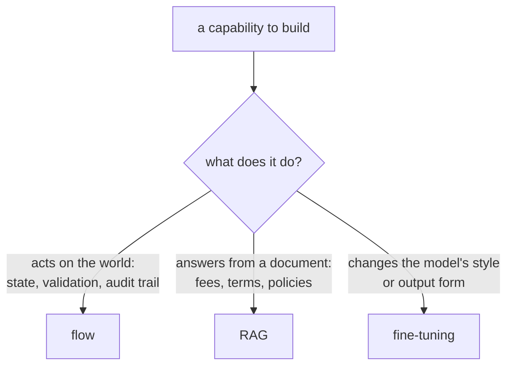
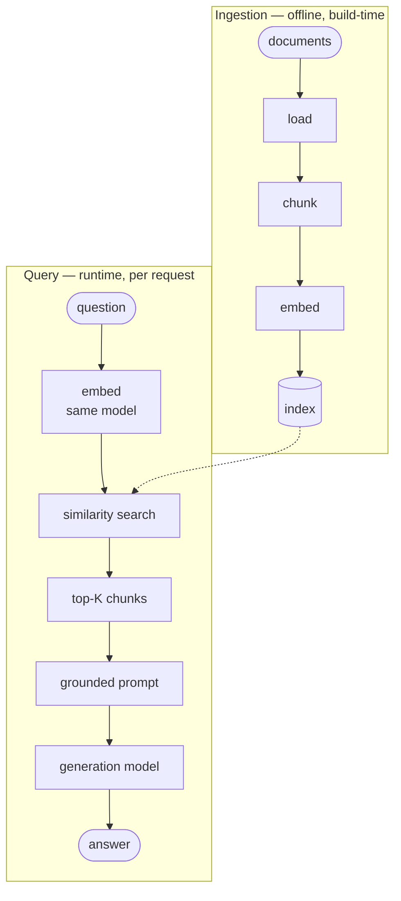
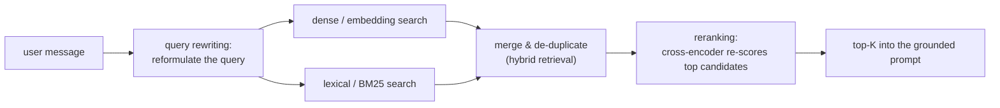
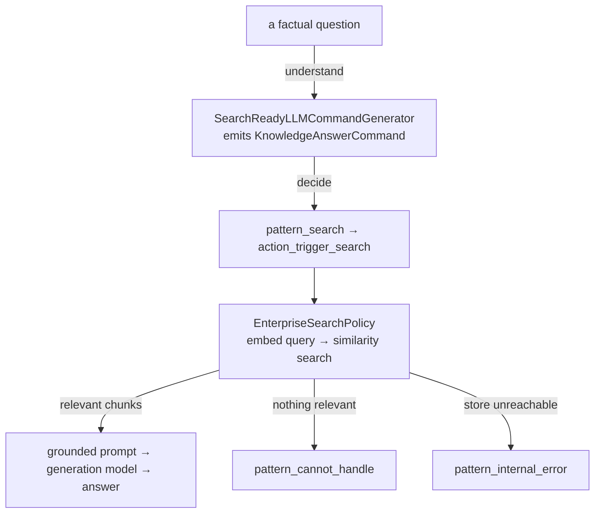

# Day 12 — RAG: Fundamentals
## Student Study Guide

Retrieval-augmented generation (RAG) answers a question by putting the relevant source documents in front of a language model and having it generate from them rather than from its own memory. This lesson builds the idea from first principles and then wires it into an assistant. Chapter 1 states the problem RAG solves and when it is the right tool. Chapter 2 lays out the pipeline — how documents get in and how a question retrieves them — and the design choices at each stage. Chapter 3 covers the levers that lift retrieval quality above the naive baseline: hybrid retrieval, reranking, and query rewriting. Chapter 4 names the characteristic failure modes and the vocabulary that makes RAG quality measurable. Chapter 5 goes beyond flat, chunk-and-embed RAG to graph RAG, for questions that require connecting facts across many documents. Chapters 6 and 7 turn to Rasa: knowledge answering through Enterprise Search, first as a development setup and then in a production shape. The first five chapters are framework-agnostic and describe RAG in any stack; the last two are specific to Rasa Pro.

---

## Chapter 1 — Why RAG: grounding answers in a knowledge source

A language model's internal knowledge is not a reliable source for an organization's facts. RAG supplies those facts from a store the organization controls.

### 1.1 The problem RAG addresses

A model's *parametric knowledge* — everything it absorbed during training — is:

- **Frozen.** Training has a cut-off date. The model cannot know that a fee changed last week, because that change happened after its parameters were fixed.
- **Unverifiable.** There is no way to ask the model *where* a claim came from. It emits the most plausible continuation of the text so far; it does not consult a source it can name.
- **Generic.** It was trained on broadly public text, not on any one organization's fee schedules, product terms, or policies. It has never seen those documents.

An organization's documents can instead be **current**, **versioned**, and **authoritative**. A model can phrase an answer about an account fee, but the current fee must come from an owned source.

### 1.2 The core idea: retrieve, ground, generate

RAG has three steps: **retrieve** relevant passages, **ground** the prompt with those passages, and **generate** an answer from them. Lewis et al. (2020) introduced the term for a system that combines **parametric memory** (knowledge in model weights) with **non-parametric memory** (an updateable retrieval index).[^1]

RAG establishes a **division of labour**: knowledge lives in the store, and language competence lives in the model. When a fact changes, you update a document, not a model. Currency and auditability therefore become a document-management problem rather than a machine-learning one.

Retrieval is a similarity search (the pipeline of [Chapter 2](#chapter-2--the-rag-pipeline-ingestion-and-retrieval)), not the model "looking something up" with judgment. The model conditions on the retrieved passages; it does not verify them.

### 1.3 Choosing the right tool

Choose the tool by the capability's effect:

- **A process with a side effect → a flow.** Moving money, changing a status, or booking an appointment needs state, validation, confirmation, and an audit trail. Retrieval does not execute work.
- **A question answered by a document → RAG.** Fees, product terms, policies, service rules. Nothing is executed and no record changes — there is only a correct, current, citable answer that lives in a document.
- **A change to the model's behaviour or form → fine-tuning.** Fine-tuning changes style or output format. It does not provide current, citable facts; embedding a fee schedule in model weights would require retraining after every change.

If the answer should change when a document changes, use RAG; if completing it should change a system of record, use a flow.

The capability's effect determines the choice:



### 1.4 Residual risk and accountability

RAG reduces but does not eliminate **hallucinations**: fluent claims unsupported by the evidence. Grounded generation remains generation, so its residual error rate must be measured ([Chapter 4](#chapter-4--when-rag-fails-and-how-to-measure-it)).

Accountability does not transfer to the model. In *Moffatt v. Air Canada* (2024), an airline chatbot incorrectly said that a bereavement discount could be claimed after travel. The tribunal held the airline responsible for the misinformation on its website.[^2] Users treat an assistant's answer as the organization speaking.

RAG grounds answers in owned, current documents and makes them auditable, but it must be measured and guarded because grounding reduces rather than removes unsupported claims.

---

## Chapter 2 — The RAG pipeline: ingestion and retrieval

Every RAG system separates offline ingestion from per-request querying. The same pipeline applies to vendor products, internal platforms, and Rasa's Enterprise Search ([Chapter 6](#chapter-6--enterprise-search-knowledge-answering-in-rasa)).

### 2.1 Ingestion and query phases



**Ingestion is offline.** The pipeline loads documents, splits them into **chunks**, converts each chunk into a vector with an **embedding model**, and stores the vectors with their source text in an **index**.

**Querying runs per request.** The same model embeds the question. The index returns the **top K** nearest chunks, where K is the configured result count, and the generation model receives those chunks in its prompt.

The same embedding model must process documents and questions so that their vectors share a space. Ingestion is a data-pipeline problem; querying constructs a prompt in which retrieved passages are delimited as data, separate from instructions.

### 2.2 Embeddings

An **embedding model** maps text to vectors so that semantic similarity becomes geometric closeness. For example, "wire transfer charges" and "fees for sending money abroad" can be close despite sharing few words.

**Hosted and self-hosted embedding models** differ along three axes:

- **Quality, especially across languages.** Multilingual quality must be measured on real queries. OpenAI's `text-embedding-3-large` produces 3072-dimensional vectors at $0.13 per million tokens and scores 54.9% on MIRACL, compared with 31.4% for `ada-002`.[^3] Use the metrics in [Chapter 4](#chapter-4--when-rag-fails-and-how-to-measure-it) before selecting a model for a non-English corpus.
- **Cost and footprint.** A self-hosted model can be small: `sentence-transformers/all-MiniLM-L6-v2` has 22.7M parameters, produces 384-dimensional vectors, and accepts up to 256 word-pieces of input — serviceable for lightweight or data-sovereign deployments.[^4]
- **The data boundary.** A hosted embedding API sends the corpus to a third party. A self-hosted model keeps it within the deployment boundary.

### 2.3 Chunking

Chunk size strongly affects retrieval quality:

- **Chunks too large dilute the match.** The one relevant sentence is buried in a page of unrelated text; the embedding averages it away, and the retrieved chunk spends prompt budget on noise.
- **Chunks too small lose their context.** A fee amount is retrieved without the clause saying which account it applies to.

A menu of strategies, with typical sizes:[^5]

| Strategy | What it is | When |
|---|---|---|
| **Fixed-size with overlap** | ~1000 characters with ~200 overlap, or 200–500 tokens with 10–20% overlap | The baseline for standard prose |
| **Structure-aware / semantic** | Split at paragraph, section, and heading boundaries, keeping related content together | Documents with real structure, such as policies |
| Recursive / adaptive / LLM-driven | Progressively finer or content-dependent splitting | Only where measurement justifies the cost |

Start with fixed-size chunks, overlap, and preserved sentence boundaries. Attach title, date, and section metadata for citation and filtering. Refine the strategy only when measurement shows a retrieval problem.

### 2.4 Vector stores

A **vector store** indexes embeddings for fast retrieval at corpus scale. **Approximate nearest-neighbour (ANN) search** trades some recall for speed. Stores may be process-local libraries or independent databases:

| Store | What it is | Role |
|---|---|---|
| **FAISS** | An in-memory similarity-search library from Meta | Development — zero infrastructure, but a library a process loads, not a server |
| **Milvus** | A distributed-native vector database (Apache 2.0, under the LF AI & Data Foundation) | Production — scales to tens of billions of vectors[^6] |
| **Qdrant** | A vector database (Apache 2.0), self-hosted or managed | Production — its ANN index applies metadata filters *during* graph traversal rather than after, which matters when retrieval is restricted by a field such as customer segment[^7] |

FAISS is loaded into an application process. Milvus and Qdrant store the corpus independently, so it can be updated without rebuilding the assistant ([Chapter 7](#chapter-7--production-rag-with-rasa-vector-stores-tuning-and-extension)).

---

## Chapter 3 — Improving retrieval quality: the levers

Hybrid retrieval, reranking, and query rewriting address different weaknesses in dense retrieval. Each adds latency and cost, so add it only for a measured failure.

### 3.1 Why the naive baseline underperforms

Dense search can miss **exact surface forms** such as identifiers, product codes, and rare names. Short or vague user phrasing may also fall far from an otherwise relevant passage.

### 3.2 Hybrid retrieval

Hybrid retrieval merges dense search with **lexical** search. **BM25** ranks documents by term overlap, gives more weight to rare terms, and discounts very long documents. It recovers literal error codes or product names that embeddings may miss. The system merges and de-duplicates both result sets before selecting the top K.[^8] In one controlled evaluation, adding lexical matching roughly halved failed retrievals.[^8]

### 3.3 Reranking

**Reranking** re-scores the first-stage candidates and keeps the best few. A typical **cross-encoder** reads the question and each candidate together. This is more accurate than comparing independent embeddings but too slow for the whole corpus, so it runs only on the initial top results. It improves prompt precision at the cost of another model call.[^8]

### 3.4 Query rewriting

**Query rewriting** reformulates the raw message before search. It can turn "what about for business accounts?" into a self-contained query or replace vague wording with document terms. This **rewrite-retrieve-read** pattern improves the input without changing the retriever or generation model.[^9]

### 3.5 The common trade-off

Start with the baseline, measure it with the vocabulary of [Chapter 4](#chapter-4--when-rag-fails-and-how-to-measure-it), and add only the technique that addresses the observed failure.

The three levers attach at different points of the baseline query path — the query before retrieval, the search during it, the candidate ordering after — each switched on only where measurement warrants:



---

## Chapter 4 — When RAG fails, and how to measure it

RAG failures require different mitigations. Metrics identify which part of the system needs work.

### 4.1 The failure modes and their mitigations

- **Retrieval misses.** The right passage ranks too low. Use hybrid retrieval for exact-term misses, reranking for precision, or better chunking, according to measurement ([Chapter 3](#chapter-3--improving-retrieval-quality-the-levers)).
- **Stale corpus.** The store is not refreshed after a source changes. Corpus updates need an owner, a trigger, and verification. An external store supports re-indexing without retraining ([Chapter 7](#chapter-7--production-rag-with-rasa-vector-stores-tuning-and-extension)).
- **Hallucination despite retrieval.** The model makes a claim that the passages do not support. Specialist RAG-based legal-research tools still produced unsupported statements on a meaningful share of queries.[^10] Use citations, relevancy checks, and grounding evaluation, while accepting a residual rate.
- **Poisoned corpus.** A malicious document enters the store and steers later answers. *PoisonedRAG* achieved a 90% attack success rate by inserting five malicious texts per target question into a store of millions.[^11] Treat corpus write access as a security boundary and require an owner and approval for every source.

### 4.2 Citations

Citations provide **auditability**, not prevention. A reader or transcript reviewer can inspect a chunk-level source, although the citation itself may still be wrong. Rasa enables them with `citation_enabled` ([§6.4](#64-generative-versus-extractive-answering)).

### 4.3 Measuring RAG quality

RAG evaluation has a standard metric vocabulary, formalized by the RAGAS framework:[^12][^13]

| Metric | The question it answers | The failure it catches |
|---|---|---|
| **Faithfulness** | Is every claim in the answer supported by the retrieved context? | Hallucination despite retrieval |
| **Context precision** | Are the relevant chunks ranked high in what was retrieved? | Retrieval noise |
| **Context recall** | Did retrieval surface everything needed to answer? | Retrieval misses |
| **Answer relevancy** | Does the answer actually address the question? | Evasive or off-target generation |

These metrics isolate retrieval and generation failures. RAGAS evaluation can be **reference-free**: an LLM judge scores the question, context, and answer without a labelled answer for every case.[^13] Use a different model for judging, prefer coarse supported/not-supported decisions, and spot-check against human review.[^14]

---

## Chapter 5 — Beyond naive RAG: graph RAG and advanced retrieval

Graph RAG addresses questions that flat top-K retrieval cannot answer, at the cost of more complex indexing.

### 5.1 Where the baseline reaches its limit

Top-K retrieval returns chunks that are individually similar to the query. Two kinds of question defeat that:

- **Connect-the-dots questions** require assembling facts scattered across many documents through their shared attributes — no single chunk contains the answer, so no single chunk retrieves well.
- **Holistic questions** ask about a whole corpus at once ("what are the main themes here?"). There is no local passage to retrieve; the answer is a property of the collection.

### 5.2 Graph RAG indexing model

Graph RAG extracts **entities and relationships** into a **knowledge graph**, clusters related entities into **communities**, and generates a summary for each community. The resulting hierarchy contains entities, relationships, and pre-computed summaries. Microsoft's GraphRAG is the reference implementation.[^15][^16]

### 5.3 Querying the graph

The graph supports two query modes that answer the two hard question types:[^16]

- **Local search** reasons about specific entities by fanning out to their neighbours in the graph — following relationships to assemble facts that no single chunk holds together. This is the connect-the-dots case.
- **Global search** answers corpus-wide questions by combining the pre-computed community summaries rather than any individual passage. This is the holistic case.

### 5.4 The trade-off

Graph RAG adds model-driven entity extraction, relationship extraction, clustering, and summary generation. Use flat RAG for point questions answered by individual documents. Use graph RAG when questions genuinely connect or summarize the corpus.

---

## Chapter 6 — Enterprise Search: knowledge answering in Rasa

Rasa implements RAG through **Enterprise Search**. In CALM, a **command generator** emits structured commands, a **policy** selects the next action, **flows** and **patterns** execute it, and the **tracker** records the conversation. Enterprise Search uses this architecture through a knowledge-answering command.

### 6.1 The architecture



For a knowledge question, the command generator emits **`KnowledgeAnswerCommand`**. This starts **`pattern_search`**, which runs **`action_trigger_search`** and invokes **`EnterpriseSearchPolicy`** to embed the query, search the store, and generate an answer.[^17][^18] The tracker records the chain. A flow can also call `action_trigger_search` as a step.[^18]

`SearchReadyLLMCommandGenerator` uses command DSL v3, while `CompactLLMCommandGenerator` uses DSL v2. Both provide the process commands `start flow`, `cancel flow`, `disambiguate flows`, `set slot`, and `repeat message`. Their free-form answer commands differ:[^19]

| Command | Generator | When it is emitted |
|---|---|---|
| `provide info` | Compact only | The user asks for a knowledge-based free-form answer |
| `offtopic reply` | Compact only | The user sends a casual or social message unrelated to a flow |
| `search and reply` | SearchReady only | No flow fits; one command covers knowledge questions, FAQs, and off-topic or social messages |

SearchReady therefore replaces two Compact response commands with one search-backed command. The command reference retains the same process-command set. The generators can still make different routing decisions because their prompts differ.

### 6.2 Minimal configuration

Configure the search-ready command generator and add `EnterpriseSearchPolicy` beside `FlowPolicy`:

```yaml
# config.yml (excerpt)
pipeline:
  - name: SearchReadyLLMCommandGenerator
    llm:
      model_group: command-generator-llm
policies:
  - name: FlowPolicy
  - name: EnterpriseSearchPolicy
    llm:
      model_group: search-generation-llm
    embeddings:
      model_group: search-embeddings
    vector_store:
      type: faiss
      source: ./docs
    citation_enabled: true
    check_relevancy: true
```

**Model group** ids keep providers and model names in `endpoints.yml` rather than `config.yml`:

```yaml
# endpoints.yml (excerpt)
model_groups:
  - id: command-generator-llm
    models:
      - provider: openai
        model: gpt-5.1-2025-11-13
  - id: search-generation-llm
    models:
      - provider: openai
        model: gpt-5-mini-2025-08-07
  - id: search-embeddings
    models:
      - provider: openai
        model: text-embedding-3-large
```

`SearchReadyLLMCommandGenerator` is tuned to trigger knowledge answering while prioritizing matching flows over knowledge questions and small talk.[^19] Its prompt calls the command `search and reply` and uses it when no flow fits. The defaults are `gpt-5-mini-2025-08-07` for generation and `text-embedding-3-large` for embeddings; explicit model groups avoid relying on defaults.[^17][^20]

### 6.3 Development ingestion

For development, place plain-text files under `./docs`; subdirectories are read recursively. `rasa train` builds a FAISS index, writes it to disk, and the assistant loads it at startup.[^17][^21]

The built-in indexer reads only `.txt` files.[^17] Preprocess PDFs, Word files, and intranet pages into clean text, or populate an external store (Chapter 7). `rasa train` sends the corpus to the configured embedding model, so the [embedding data boundary](#22-embeddings) applies during training.

### 6.4 Generative versus extractive answering

Enterprise Search provides generative and extractive answering modes.

**Generative search** (`use_generative_llm: true`, the default) composes an answer from retrieved chunks and conversation context. With `citation_enabled: true`, it appends a `Sources:` list from document metadata.[^20] It can synthesize across passages but retains hallucination risk.

**Extractive search** (`use_generative_llm: false`) returns a curated answer verbatim. It uses a structured **QnA format**: the question is embedded and matched, while a pre-authored answer is returned. A required `vector_store.threshold` rejects low-confidence matches.[^21]

```yaml
policies:
  - name: EnterpriseSearchPolicy
    use_generative_llm: false
    vector_store:
      type: faiss
      source: ./docs
      threshold: 0.75
```

```json
[
  {
    "metadata": {
      "title": "maintenance_fee",
      "type": "faq",
      "answer": "The current-account maintenance fee is €2.50 per month, waived when the average balance exceeds €5,000."
    },
    "page_content": "What is the account maintenance fee?"
  }
]
```

`page_content` holds the embedded **question** and `metadata.answer` holds the returned reply. `title` and `type` organize the corpus; they are neither matched nor returned.

Generative search handles unanticipated questions. Extractive search handles curated questions with approved wording. An assistant can use extractive search for regulated FAQs and generative search with citations for the long tail.

### 6.5 The no-answer path

If retrieval finds nothing above the threshold, or `check_relevancy: true` rejects an answer, the turn routes to **`pattern_cannot_handle`** and `utter_no_relevant_answer_found`.[^17][^22] An unreachable vector store routes to `pattern_internal_error`.

| Situation | Pattern | What the user gets |
|---|---|---|
| Nothing relevant found | `pattern_cannot_handle` | `utter_no_relevant_answer_found`, overridable with a branded, next-step message |
| Vector store unreachable | `pattern_internal_error` | The standard internal-error response |

Relevancy checking prefers a no-answer response to an unsupported claim, reducing the accountability risk described in [§1.4](#14-residual-risk-and-accountability).

---

## Chapter 7 — Production RAG with Rasa: vector stores, tuning, and extension

A production Enterprise Search deployment needs an external corpus, measured retrieval settings, an extension strategy, and automated tests.

### 7.1 From FAISS to an external store

Configure the built-in Milvus or Qdrant external store in `endpoints.yml`:

```yaml
# endpoints.yml — Milvus
vector_store:
  type: milvus
  host: localhost
  port: 19530
  collection: rasa
```

```yaml
# endpoints.yml — Qdrant
vector_store:
  type: qdrant
  collection: rasa
  host: 0.0.0.0
  port: 6333
  content_payload_key: page_content
  metadata_payload_key: metadata
```

The built-in types are `faiss`, `milvus`, and `qdrant`; other databases require a custom retriever.[^17] External documents are indexed outside Rasa, so the corpus can be refreshed without `rasa train` or an assistant redeployment.[^17]

The scale and filtering distinction introduced in [§2.4](#24-vector-stores) becomes an operational choice here:

- **Milvus** provides standalone and distributed deployments, several index types, and hardware-aware scaling. It fits teams that already operate Milvus or need a large distributed vector platform.[^6]
- **Qdrant** supports self-hosted and managed deployments. Its payload indexes apply metadata filters during vector search, which fits retrieval that frequently restricts results by attributes such as product, language, or customer segment.[^7]

Within `EnterpriseSearchPolicy`, both stores fill the same retrieval role. Both must already contain the document embeddings, and both must use the same embedding model that Rasa uses for the query. Rasa documents its Milvus connector for a self-hosted instance. Its Qdrant connector supports local or cloud connections and exposes payload-key settings for mapping stored content and metadata.[^17] Choose from the existing infrastructure, filtering needs, scale, security boundary, and measured latency and recall.

### 7.2 Tuning by failure mode

The remaining knobs sit on `EnterpriseSearchPolicy`:

```yaml
policies:
  - name: EnterpriseSearchPolicy
    use_generative_llm: true
    citation_enabled: true
    check_relevancy: true
    include_date_time: true
    timezone: "Europe/Rome"
    max_messages_in_query: 4
    prompt_template: prompts/enterprise-search-policy-template.jinja2
    vector_store:
      type: qdrant
      threshold: 0.5
    embeddings:
      model_group: search-embeddings
    llm:
      model_group: search-generation-llm
```

- **`vector_store.threshold`** sets the minimum similarity from 0 to 1. Raising it trades coverage for confidence; tune it with context-precision measurements.
- **`max_messages_in_query`** adds recent user messages to the query so follow-ups retain context. The default is 2; the example uses 4.[^20]
- **`citation_enabled` and `check_relevancy`** add source auditability and the no-answer guard.
- **`include_date_time` and `timezone`** inject a timestamp with an IANA timezone into the prompt for date-sensitive documents.[^17]
- **`prompt_template`** points to a Jinja2 template with `{{docs}}`, `{{slots}}`, `{{current_conversation}}`, and `{{current_datetime}}`.[^20] Customize it only for a tested requirement such as tone, answer format, or document-only grounding.

### 7.3 The extension point

For an existing search platform or segment-aware filtering, subclass `rasa.core.information_retrieval.InformationRetrieval`. Implement `connect()`, which receives the `endpoints.yml` store block, and `async search(query, tracker_state, threshold)`, which returns `SearchResultList`. Set `vector_store.type` to the class path:[^23]

```yaml
policies:
  - name: EnterpriseSearchPolicy
    vector_store:
      type: "addons.custom_information_retrieval.MyRetriever"
```

The class at `addons/custom_information_retrieval.py` implements the two required methods. The backend-specific connection and query remain inside this adapter:

```python
from typing import Any

from rasa.core.information_retrieval import InformationRetrieval, SearchResultList
from rasa.utils.endpoints import EndpointConfig


class MyRetriever(InformationRetrieval):
    def connect(self, config: EndpointConfig) -> None:
        # Initialize the search client from config.kwargs.
        self.config = config.kwargs

    async def search(
        self,
        query: str,
        tracker_state: dict[str, Any],
        threshold: float = 0.0,
    ) -> SearchResultList:
        # Query the backend and return its matches as a SearchResultList.
        raise NotImplementedError
```

Because `search` receives `tracker_state`, including slots, it can filter documents by customer segment. Use this extension point only when the built-in stores cannot meet the requirement.

### 7.4 Testing the knowledge layer

End-to-end tests provide two LLM-judged assertions. `generative_response_is_grounded` checks support against a reference; `generative_response_is_relevant` checks whether the answer addresses the question. `utter_source: EnterpriseSearchPolicy` scopes the assertion to search output.[^24]

```yaml
# e2e_tests/knowledge/maintenance_fee.yml
test_cases:
  - test_case: maintenance fee answered from the fee schedule
    steps:
      - user: "What is the monthly maintenance fee on a current account?"
        assertions:
          - generative_response_is_grounded:
              threshold: 0.90
              ground_truth: "The current-account maintenance fee is €2.50 per month, waived above €5,000 average balance."
              utter_source: EnterpriseSearchPolicy
          - generative_response_is_relevant:
              threshold: 0.6
              utter_source: EnterpriseSearchPolicy
```

Configure the judge in the project-root `conftest.yml`:[^24]

```yaml
# conftest.yml
llm_judge:
  llm:
    provider: openai
    model: "gpt-5-mini-2025-08-07"
```

Use a different provider for the judge than for generation, and prefer coarse supported/not-supported thresholds. The assertions make corpus and prompt changes regression-testable.

The two scores measure different relationships. **Relevance** compares the final generated answer with the user's message. The judge derives three questions from the answer and reports the average cosine similarity between those questions and the user's message. **Groundedness** compares the answer's factual claims with a trusted reference. The judge splits the answer into individual claims and reports the fraction supported by that reference.[^24]

`threshold` is the minimum accepted score, not a shared definition of quality. A groundedness threshold of `0.90` requires at least 90% of the extracted claims to be supported. A relevance threshold of `0.60` requires an average similarity of at least `0.60`. Calibrate each threshold on representative passing and failing conversations because the scores come from different calculations.

When `ground_truth` is omitted, the test runner can read the factual source from response metadata. Enterprise Search results and rephrased domain responses can provide this metadata automatically. If the response has no such reference, supply `ground_truth`; groundedness cannot be evaluated without either source.[^24]

### 7.5 Corpus lifecycle and ownership

Treat the corpus as a production artifact. Its lifecycle includes preprocessing, source approval, an update cadence, and versioning that identifies which corpus produced an answer. External stores make updates operational; ownership keeps the corpus current and auditable.

---

## Further reading

- **[Lewis et al. (2020) — *Retrieval-Augmented Generation for Knowledge-Intensive NLP Tasks*](https://arxiv.org/abs/2005.11401).** The original RAG paper; the parametric / non-parametric memory framing is still the clearest mental model.
- **[Anthropic — *Introducing Contextual Retrieval*](https://www.anthropic.com/news/contextual-retrieval).** A concrete treatment of hybrid retrieval and reranking, with the failed-retrieval reduction figures.
- **[Microsoft — *GraphRAG*](https://microsoft.github.io/graphrag/).** The reference implementation of graph RAG, with the index and query stages and the local/global search modes.
- **[RAGAS — Available Metrics](https://docs.ragas.io/en/stable/concepts/metrics/available_metrics/).** Operational definitions of faithfulness, context precision and recall, and answer relevancy.
- **[Rasa — Integrate RAG in Rasa](https://rasa.com/docs/learn/guides/integrating-rag/).** The Enterprise Search material in the vendor's tutorial form.

---

### Sources

[^1]: Lewis, P., et al., "Retrieval-Augmented Generation for Knowledge-Intensive NLP Tasks." NeurIPS 2020. arXiv:2005.11401. <https://arxiv.org/abs/2005.11401>. Source of the parametric / non-parametric memory framing and the "more specific, diverse and factual language" quote.
[^2]: Moffatt v. Air Canada, 2024 BCCRT 149 — British Columbia Civil Resolution Tribunal. <https://www.canlii.org/en/bc/bccrt/doc/2024/2024bccrt149/2024bccrt149.html>. Source of the bereavement-fare facts and the "responsible for all the information on its website" holding.
[^3]: OpenAI, "text-embedding-3-large" model documentation. <https://developers.openai.com/api/docs/models/text-embedding-3-large>. Source of the 3072-dimension size, the $0.13-per-million-token price, and the MIRACL scores (54.9% vs 31.4% for ada-002).
[^4]: Hugging Face, "sentence-transformers/all-MiniLM-L6-v2" model card. <https://huggingface.co/sentence-transformers/all-MiniLM-L6-v2>. Source of the 22.7M parameters, 384-dimensional output, and 256 word-piece input cap.
[^5]: Sinha, D. (Databricks), "The Ultimate Guide to Chunking Strategies for RAG Applications." Databricks Community Technical Blog. <https://community.databricks.com/t5/technical-blog/the-ultimate-guide-to-chunking-strategies-for-rag-applications/ba-p/113089>. Source of the chunking strategies and the size/overlap defaults.
[^6]: Milvus, "What is Milvus." <https://milvus.io/docs/overview.md>. Source of the Apache 2.0 license, LF AI & Data Foundation governance, and scaling to tens of billions of vectors.
[^7]: Qdrant, "Documentation overview." <https://qdrant.tech/documentation/overview/>. Source of the filter-during-traversal ANN behaviour and the Apache 2.0 license.
[^8]: Anthropic, "Introducing Contextual Retrieval." <https://www.anthropic.com/news/contextual-retrieval>. Source of the BM25 / lexical-matching description, the dense-plus-lexical hybrid merge, the reranking second stage, and the failed-retrieval reduction figures (roughly halved by hybrid, reduced further by reranking).
[^9]: Ma, X., Gong, Y., He, P., Zhao, H., & Duan, N., "Query Rewriting for Retrieval-Augmented Large Language Models." EMNLP 2023. arXiv:2305.14283. <https://arxiv.org/abs/2305.14283>. Source of the rewrite-retrieve-read framing.
[^10]: Magesh, V., Surani, F., Dahl, M., Suzgun, M., Manning, C. D., & Ho, D. E., "Hallucination-Free? Assessing the Reliability of Leading AI Legal Research Tools." Stanford University, 2024. arXiv:2405.20362. <https://arxiv.org/abs/2405.20362>. Source of the finding that specialist RAG-based legal tools still produce unsupported statements on a meaningful share of queries.
[^11]: Zou, W., Geng, R., Wang, B., & Jia, J., "PoisonedRAG: Knowledge Corruption Attacks to Retrieval-Augmented Generation of Large Language Models." 2024. arXiv:2402.07867. <https://arxiv.org/abs/2402.07867>. Source of the five-malicious-texts / 90%-attack-success finding.
[^12]: RAGAS Documentation, "Available Metrics." <https://docs.ragas.io/en/stable/concepts/metrics/available_metrics/>. Operational definitions of the metrics.
[^13]: Es, S., James, J., Espinosa-Anke, L., & Schockaert, S., "Ragas: Automated Evaluation of Retrieval Augmented Generation." EACL 2024 System Demonstrations. arXiv:2309.15217. <https://arxiv.org/abs/2309.15217>. Source of the reference-free, LLM-judged evaluation approach.
[^14]: Zheng, L., et al., "Judging LLM-as-a-Judge with MT-Bench and Chatbot Arena." 2023. arXiv:2306.05685. <https://arxiv.org/abs/2306.05685>. Source of the LLM-as-judge caveats (a distinct judge model, coarse decisions, human spot-checks).
[^15]: Edge, D., et al., "From Local to Global: A Graph RAG Approach to Query-Focused Summarization." 2024. arXiv:2404.16130. <https://arxiv.org/abs/2404.16130>. Source of the graph-RAG approach — entity/relationship extraction, community summaries, and query-focused summarization.
[^16]: Microsoft, "GraphRAG." <https://microsoft.github.io/graphrag/>. Source of the index steps (entity/relationship extraction, community clustering, community summaries) and the local- and global-search query modes.
[^17]: Rasa Documentation, "Enterprise Search Policy" (reference). <https://rasa.com/docs/reference/config/policies/enterprise-search-policy/>. Source of the FAISS "testing, development, and small internal deployments only" positioning, the supported vector-store types, the `.txt`-only recursive `./docs` indexing, the default models, the no-answer / internal-error routing, the Milvus/Qdrant endpoint blocks, and the `include_date_time` behaviour.
[^18]: Rasa Documentation, "Integrate RAG in Rasa" (guide). <https://rasa.com/docs/learn/guides/integrating-rag/>. Source of the `KnowledgeAnswerCommand` → `pattern_search` → `action_trigger_search` → `EnterpriseSearchPolicy` chain and the callable-from-any-flow property.
[^19]: Rasa Documentation, "LLM Command Generators." <https://rasa.com/docs/reference/config/components/llm-command-generators/>. Source of `SearchReadyLLMCommandGenerator`, its flow-priority behaviour, and the DSL v2/v3 command reference that distinguishes `provide info` and `offtopic reply` from `search and reply`.
[^20]: Rasa Documentation, "Generative Search" (reference). <https://rasa.com/docs/reference/config/policies/generative-search/>. Source of `citation_enabled`, `check_relevancy`, the `Sources:` citation format, the `prompt_template` Jinja2 variables, the `max_messages_in_query` default of 2, and the default generation model.
[^21]: Rasa Documentation, "Extractive Search" (reference). <https://rasa.com/docs/reference/config/policies/extractive-search/>. Source of `use_generative_llm: false`, the QnA document format, the automatic `rasa train` indexing of `./docs`, and the required threshold.
[^22]: Rasa Documentation, "Patterns" (reference). <https://rasa.com/docs/reference/primitives/patterns/>. Source of `pattern_cannot_handle` routing for a no-relevant-answer result and the `utter_no_relevant_answer_found` response.
[^23]: Rasa Documentation, "Custom Information Retrieval with Enterprise Search Policy." <https://rasa.com/docs/reference/config/policies/custom-information-retrievers/>. Source of the `InformationRetrieval` base class and the `connect()` / `async search()` signatures.
[^24]: Rasa Documentation, "Assertions" (end-to-end testing reference). <https://rasa.com/docs/reference/testing/assertions/>. Source of the groundedness and relevance calculations, thresholds, automatic ground-truth extraction from response metadata, `utter_source`, the `conftest.yml` `llm_judge` block, and the different-provider-for-judge recommendation.
