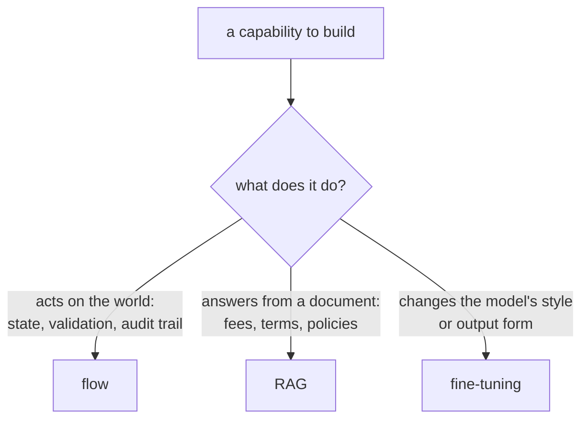
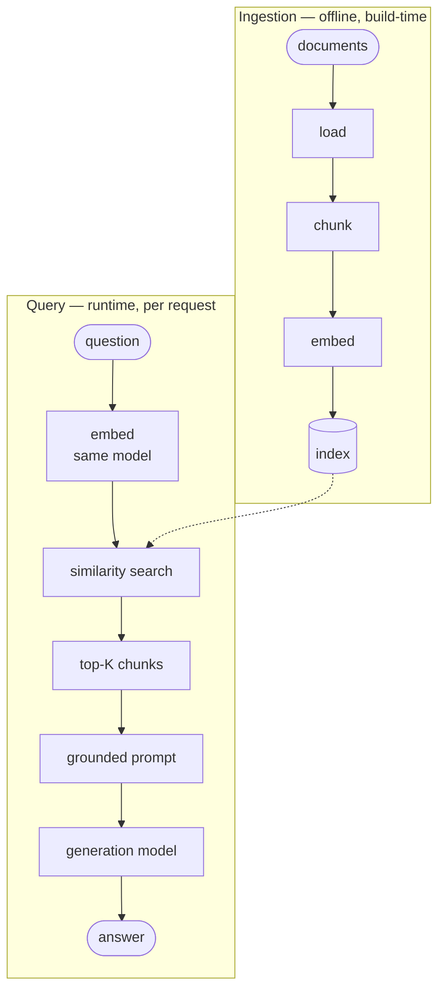
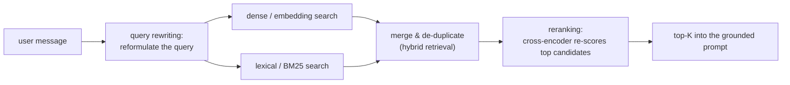
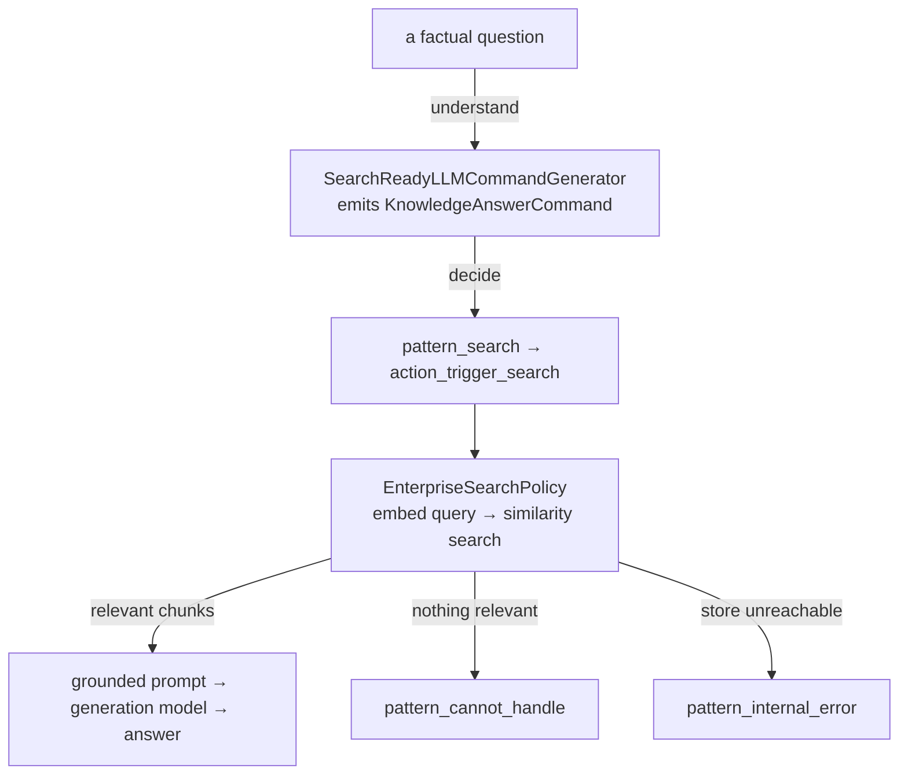

# Day 12 — RAG: Fondamenti
## Guida di Studio per lo Studente

La retrieval-augmented generation (RAG) risponde a una domanda mettendo i documenti di origine rilevanti davanti a un language model e facendo sì che questo generi a partire da essi anziché dalla propria memoria. Questa lezione costruisce l'idea a partire dai principi primi e poi la integra in un assistente. Il Capitolo 1 enuncia il problema che RAG risolve e quando sia lo strumento giusto. Il Capitolo 2 espone la pipeline — come i documenti vi entrano e come una domanda li recupera — e le scelte progettuali a ciascuno stadio. Il Capitolo 3 tratta le leve che innalzano la qualità del retrieval al di sopra della baseline ingenua: hybrid retrieval, reranking e query rewriting. Il Capitolo 4 nomina le modalità di fallimento caratteristiche e il vocabolario che rende misurabile la qualità di RAG. Il Capitolo 5 va oltre la RAG piatta, basata su chunk ed embedding, verso la graph RAG, per domande che richiedono di collegare fatti sparsi in molti documenti. I Capitoli 6 e 7 si rivolgono a Rasa: la risposta basata sulla conoscenza tramite Enterprise Search, prima come setup di sviluppo e poi in una forma adatta alla produzione. I primi cinque capitoli sono indipendenti dal framework e descrivono RAG in qualsiasi stack; gli ultimi due sono specifici di Rasa Pro.

---

## Capitolo 1 — Perché RAG: ancorare le risposte a una fonte di conoscenza

La conoscenza interna di un language model non è una fonte affidabile per i fatti di un'organizzazione. RAG fornisce quei fatti a partire da un archivio che l'organizzazione controlla.

### 1.1 Il problema che RAG affronta

La *conoscenza parametrica* di un modello — tutto ciò che ha assorbito durante il training — è:

- **Congelata.** Il training ha una data di cut-off. Il modello non può sapere che una commissione è cambiata la settimana scorsa, perché quel cambiamento è avvenuto dopo che i suoi parametri erano già stati fissati.
- **Non verificabile.** Non c'è modo di chiedere al modello *da dove* provenga un'affermazione. Esso emette la continuazione più plausibile del testo fin lì prodotto; non consulta una fonte che possa nominare.
- **Generica.** È stato addestrato su testo ampiamente pubblico, non sui tariffari, sulle condizioni di prodotto o sulle policy di una specifica organizzazione. Quei documenti non li ha mai visti.

I documenti di un'organizzazione possono invece essere **aggiornati**, **versionati** e **autorevoli**. Un modello può formulare una risposta su una commissione di conto, ma la commissione corrente deve provenire da una fonte di proprietà.

### 1.2 L'idea di fondo: retrieve, ground, generate

RAG ha tre passi: **recuperare** (retrieve) i passaggi rilevanti, **ancorare** (ground) il prompt con quei passaggi, e **generare** (generate) una risposta a partire da essi. Lewis et al. (2020) hanno introdotto il termine per un sistema che combina **memoria parametrica** (la conoscenza nei pesi del modello) con **memoria non parametrica** (un indice di retrieval aggiornabile).[^1]

RAG stabilisce una **divisione del lavoro**: la conoscenza risiede nell'archivio, e la competenza linguistica risiede nel modello. Quando un fatto cambia, si aggiorna un documento, non un modello. Attualità e verificabilità diventano quindi un problema di gestione documentale piuttosto che di machine learning.

Il retrieval è una ricerca per similarità (la pipeline del [Capitolo 2](#capitolo-2--la-pipeline-rag-ingestion-e-retrieval)), non il modello che "va a cercare qualcosa" con discernimento. Il modello si condiziona sui passaggi recuperati; non li verifica.

### 1.3 Scegliere lo strumento giusto

Lo strumento si sceglie in base all'effetto della capacità:

- **Un processo con un effetto collaterale → un flow.** Spostare denaro, cambiare uno stato o prenotare un appuntamento richiede stato, validazione, conferma e una traccia di audit. Il retrieval non esegue lavoro.
- **Una domanda a cui risponde un documento → RAG.** Commissioni, condizioni di prodotto, policy, regole di servizio. Nulla viene eseguito e nessun record cambia — c'è soltanto una risposta corretta, aggiornata e citabile che vive in un documento.
- **Una modifica al comportamento o alla forma del modello → fine-tuning.** Il fine-tuning cambia lo stile o il formato dell'output. Non fornisce fatti aggiornati e citabili; incorporare un tariffario nei pesi del modello richiederebbe di riaddestrarlo dopo ogni modifica.

Se la risposta deve cambiare quando cambia un documento, si usa RAG; se il suo completamento deve modificare un sistema di registrazione, si usa un flow.

L'effetto della capacità determina la scelta:



### 1.4 Rischio residuo e responsabilità

RAG riduce ma non elimina le **hallucination**: affermazioni fluenti non supportate dall'evidenza. La generazione ancorata resta pur sempre generazione, quindi il suo tasso di errore residuo deve essere misurato ([Capitolo 4](#capitolo-4--quando-rag-fallisce-e-come-misurarlo)).

La responsabilità non si trasferisce al modello. In *Moffatt v. Air Canada* (2024), il chatbot di una compagnia aerea affermò erroneamente che uno sconto per lutto potesse essere richiesto dopo il viaggio. Il tribunale ha ritenuto la compagnia responsabile delle informazioni errate presenti sul proprio sito.[^2] Gli utenti trattano la risposta di un assistente come se fosse l'organizzazione a parlare.

RAG ancora le risposte a documenti aggiornati e di proprietà e le rende verificabili, ma va misurata e presidiata, perché l'ancoraggio riduce anziché rimuovere le affermazioni non supportate.

---

## Capitolo 2 — La pipeline RAG: ingestion e retrieval

Ogni sistema RAG separa l'ingestion offline dall'interrogazione per singola richiesta. La stessa pipeline si applica ai prodotti dei vendor, alle piattaforme interne e all'Enterprise Search di Rasa ([Capitolo 6](#capitolo-6--enterprise-search-la-risposta-basata-sulla-conoscenza-in-rasa)).

### 2.1 Le fasi di ingestion e di query



**L'ingestion è offline.** La pipeline carica i documenti, li suddivide in **chunk**, converte ciascun chunk in un vettore mediante un **embedding model**, e memorizza i vettori insieme al loro testo di origine in un **index**.

**L'interrogazione avviene a ogni richiesta.** Lo stesso modello produce l'embedding della domanda. L'index restituisce i **top K** chunk più vicini, dove K è il numero di risultati configurato, e il generation model riceve quei chunk nel proprio prompt.

Lo stesso embedding model deve elaborare sia i documenti sia le domande, affinché i loro vettori condividano uno spazio comune. L'ingestion è un problema di data pipeline; l'interrogazione costruisce un prompt in cui i passaggi recuperati sono delimitati come dati, separati dalle istruzioni.

### 2.2 Embedding

Un **embedding model** mappa il testo in vettori in modo che la similarità semantica diventi prossimità geometrica. Per esempio, "wire transfer charges" e "fees for sending money abroad" possono risultare vicini pur condividendo poche parole.

Gli **embedding model ospitati (hosted) e self-hosted** differiscono lungo tre assi:

- **Qualità, specialmente tra le lingue.** La qualità multilingue va misurata su query reali. Il modello `text-embedding-3-large` di OpenAI produce vettori a 3072 dimensioni al costo di $0.13 per milione di token e ottiene 54.9% su MIRACL, contro il 31.4% di `ada-002`.[^3] Si usino le metriche del [Capitolo 4](#capitolo-4--quando-rag-fallisce-e-come-misurarlo) prima di selezionare un modello per un corpus non in lingua inglese.
- **Costo e footprint.** Un modello self-hosted può essere piccolo: `sentence-transformers/all-MiniLM-L6-v2` ha 22,7M di parametri, produce vettori a 384 dimensioni e accetta fino a 256 word-piece in input — adeguato per deployment leggeri o soggetti a sovranità del dato.[^4]
- **Il confine dei dati.** Una API di embedding ospitata invia il corpus a una terza parte. Un modello self-hosted lo mantiene entro il confine del deployment.

### 2.3 Chunking

La dimensione dei chunk incide fortemente sulla qualità del retrieval:

- **Chunk troppo grandi diluiscono la corrispondenza.** L'unica frase rilevante resta sepolta in una pagina di testo non pertinente; l'embedding la annacqua in una media, e il chunk recuperato spende budget di prompt in rumore.
- **Chunk troppo piccoli perdono il proprio contesto.** L'importo di una commissione viene recuperato senza la clausola che indica a quale conto si applichi.

Un ventaglio di strategie, con le dimensioni tipiche:[^5]

| Strategia | Di cosa si tratta | Quando |
|---|---|---|
| **Fixed-size con overlap** | ~1000 caratteri con ~200 di overlap, oppure 200–500 token con 10–20% di overlap | La baseline per la prosa standard |
| **Structure-aware / semantica** | Suddivide ai confini di paragrafo, sezione e heading, mantenendo insieme i contenuti correlati | Documenti con una struttura reale, come le policy |
| Ricorsiva / adattiva / guidata da LLM | Suddivisione progressivamente più fine o dipendente dal contenuto | Solo dove la misurazione ne giustifichi il costo |

Si parta da chunk a dimensione fissa, con overlap e confini di frase preservati. Si allegino metadati di titolo, data e sezione per la citazione e il filtraggio. La strategia va raffinata solo quando la misurazione evidenzia un problema di retrieval.

### 2.4 Vector store

Un **vector store** indicizza gli embedding per un retrieval veloce alla scala di un corpus. La **ricerca approximate nearest-neighbour (ANN)** baratta un po' di recall in cambio di velocità. Gli store possono essere librerie locali al processo oppure database indipendenti:

| Store | Di cosa si tratta | Ruolo |
|---|---|---|
| **FAISS** | Una libreria in-memory per la ricerca per similarità, di Meta | Sviluppo — zero infrastruttura, ma è una libreria che un processo carica, non un server |
| **Milvus** | Un vector database distributed-native (Apache 2.0, sotto la LF AI & Data Foundation) | Produzione — scala fino a decine di miliardi di vettori[^6] |
| **Qdrant** | Un vector database (Apache 2.0), self-hosted o gestito | Produzione — il suo indice ANN applica i filtri sui metadati *durante* l'attraversamento del grafo anziché dopo, il che conta quando il retrieval è ristretto da un campo come il segmento di clientela[^7] |

FAISS viene caricato nel processo dell'applicazione. Milvus e Qdrant memorizzano il corpus in modo indipendente, così che possa essere aggiornato senza ricostruire l'assistente ([Capitolo 7](#capitolo-7--rag-in-produzione-con-rasa-vector-store-tuning-ed-estensione)).

---

## Capitolo 3 — Migliorare la qualità del retrieval: le leve

Hybrid retrieval, reranking e query rewriting affrontano debolezze diverse del dense retrieval. Ciascuna aggiunge latenza e costo, quindi va introdotta solo a fronte di un fallimento misurato.

### 3.1 Perché la baseline ingenua rende meno del dovuto

La ricerca dense può mancare le **forme superficiali esatte**, come identificatori, codici di prodotto e nomi rari. Anche una formulazione dell'utente breve o vaga può cadere lontano da un passaggio che sarebbe altrimenti rilevante.

### 3.2 Hybrid retrieval

L'hybrid retrieval fonde la ricerca dense con la ricerca **lessicale**. **BM25** ordina i documenti in base alla sovrapposizione dei termini, dà più peso ai termini rari e penalizza i documenti molto lunghi. Recupera codici di errore o nomi di prodotto letterali che gli embedding potrebbero mancare. Il sistema unisce e deduplica entrambi gli insiemi di risultati prima di selezionare i top K.[^8] In una valutazione controllata, l'aggiunta della corrispondenza lessicale ha all'incirca dimezzato i retrieval falliti.[^8]

### 3.3 Reranking

Il **reranking** riassegna un punteggio ai candidati del primo stadio e ne trattiene i migliori. Un tipico **cross-encoder** legge insieme la domanda e ciascun candidato. Questo è più accurato che confrontare embedding indipendenti, ma troppo lento per l'intero corpus, quindi viene eseguito solo sui risultati iniziali di testa. Migliora la precisione del prompt al prezzo di un'ulteriore chiamata a un modello.[^8]

### 3.4 Query rewriting

Il **query rewriting** riformula il messaggio grezzo prima della ricerca. Può trasformare "what about for business accounts?" in una query autosufficiente, oppure sostituire una formulazione vaga con i termini presenti nei documenti. Questo pattern **rewrite-retrieve-read** migliora l'input senza cambiare né il retriever né il generation model.[^9]

### 3.5 Il compromesso comune

Si parta dalla baseline, la si misuri con il vocabolario del [Capitolo 4](#capitolo-4--quando-rag-fallisce-e-come-misurarlo), e si aggiunga soltanto la tecnica che affronta il fallimento osservato.

Le tre leve si innestano in punti diversi del percorso di query della baseline — la query prima del retrieval, la ricerca durante, l'ordinamento dei candidati dopo — e ciascuna va attivata solo dove la misurazione lo giustifichi:



---

## Capitolo 4 — Quando RAG fallisce, e come misurarlo

I fallimenti di RAG richiedono mitigazioni diverse. Le metriche identificano quale parte del sistema necessiti di lavoro.

### 4.1 Le modalità di fallimento e le loro mitigazioni

- **Retrieval mancati.** Il passaggio giusto si posiziona troppo in basso. Si usi l'hybrid retrieval per i mancati riscontri sui termini esatti, il reranking per la precisione, o un chunking migliore, secondo quanto indica la misurazione ([Capitolo 3](#capitolo-3--migliorare-la-qualità-del-retrieval-le-leve)).
- **Corpus obsoleto.** L'archivio non viene aggiornato dopo che una fonte è cambiata. Gli aggiornamenti del corpus hanno bisogno di un responsabile, di un innesco e di una verifica. Un archivio esterno consente la re-indicizzazione senza riaddestramento ([Capitolo 7](#capitolo-7--rag-in-produzione-con-rasa-vector-store-tuning-ed-estensione)).
- **Hallucination nonostante il retrieval.** Il modello formula un'affermazione che i passaggi non supportano. Strumenti specialistici di ricerca giuridica basati su RAG hanno continuato a produrre affermazioni non supportate su una quota significativa di query.[^10] Si usino citazioni, controlli di rilevanza e valutazione dell'ancoraggio, accettando al contempo un tasso residuo.
- **Corpus avvelenato.** Un documento malevolo entra nell'archivio e orienta le risposte successive. *PoisonedRAG* ha raggiunto un tasso di successo dell'attacco del 90% inserendo cinque testi malevoli per ciascuna domanda bersaglio in un archivio di milioni di documenti.[^11] L'accesso in scrittura al corpus va trattato come un confine di sicurezza, richiedendo un responsabile e un'approvazione per ogni fonte.

### 4.2 Citazioni

Le citazioni forniscono **verificabilità**, non prevenzione. Un lettore o un revisore di trascrizioni può ispezionare una fonte a livello di chunk, benché la citazione stessa possa comunque essere errata. Rasa le abilita con `citation_enabled` ([§6.4](#64-risposta-generativa-contro-risposta-estrattiva)).

### 4.3 Misurare la qualità di RAG

La valutazione di RAG dispone di un vocabolario standard di metriche, formalizzato dal framework RAGAS:[^12][^13]

| Metrica | La domanda a cui risponde | Il fallimento che intercetta |
|---|---|---|
| **Faithfulness** | Ogni affermazione nella risposta è supportata dal contesto recuperato? | Hallucination nonostante il retrieval |
| **Context precision** | I chunk rilevanti sono posizionati in alto tra quelli recuperati? | Rumore nel retrieval |
| **Context recall** | Il retrieval ha portato alla luce tutto ciò che serviva per rispondere? | Retrieval mancati |
| **Answer relevancy** | La risposta affronta davvero la domanda? | Generazione evasiva o fuori bersaglio |

Queste metriche isolano i fallimenti di retrieval da quelli di generazione. La valutazione RAGAS può essere **reference-free**: un giudice LLM assegna un punteggio alla domanda, al contesto e alla risposta senza una risposta etichettata per ogni caso.[^13] Si usi un modello diverso per il giudizio, si preferiscano decisioni grossolane supportato/non supportato, e si effettuino controlli a campione contro la revisione umana.[^14]

---

## Capitolo 5 — Oltre la RAG ingenua: graph RAG e retrieval avanzato

La graph RAG affronta domande a cui il retrieval piatto top-K non può rispondere, al prezzo di un'indicizzazione più complessa.

### 5.1 Dove la baseline raggiunge il proprio limite

Il retrieval top-K restituisce chunk che sono individualmente simili alla query. Due tipi di domanda mandano in crisi questo schema:

- **Le domande connect-the-dots** richiedono di assemblare fatti sparsi in molti documenti attraverso i loro attributi condivisi — nessun singolo chunk contiene la risposta, quindi nessun singolo chunk viene recuperato bene.
- **Le domande olistiche** interrogano un intero corpus in una volta ("quali sono i temi principali qui?"). Non esiste un passaggio locale da recuperare; la risposta è una proprietà dell'insieme.

### 5.2 Il modello di indicizzazione della graph RAG

La graph RAG estrae **entità e relazioni** in un **knowledge graph**, raggruppa le entità correlate in **community**, e genera un riassunto per ciascuna community. La gerarchia risultante contiene entità, relazioni e riassunti precalcolati. GraphRAG di Microsoft ne è l'implementazione di riferimento.[^15][^16]

### 5.3 Interrogare il grafo

Il grafo supporta due modalità di query che rispondono ai due tipi di domanda difficile:[^16]

- La **local search** ragiona su entità specifiche espandendosi verso i loro vicini nel grafo — seguendo le relazioni per assemblare fatti che nessun singolo chunk tiene insieme. È il caso connect-the-dots.
- La **global search** risponde a domande sull'intero corpus combinando i riassunti precalcolati delle community anziché un singolo passaggio. È il caso olistico.

### 5.4 Il compromesso

La graph RAG aggiunge estrazione di entità guidata dal modello, estrazione di relazioni, clustering e generazione di riassunti. Si usi la RAG piatta per domande puntuali a cui rispondono singoli documenti. Si usi la graph RAG quando le domande connettono o riassumono genuinamente il corpus.

---

## Capitolo 6 — Enterprise Search: la risposta basata sulla conoscenza in Rasa

Rasa implementa RAG attraverso **Enterprise Search**. In CALM, un **command generator** emette command strutturati, una **policy** seleziona l'action successiva, **flow** e **pattern** la eseguono, e il **tracker** registra la conversazione. Enterprise Search si serve di questa architettura tramite un command di risposta basata sulla conoscenza.

### 6.1 L'architettura



Per una domanda di conoscenza, il command generator emette **`KnowledgeAnswerCommand`**. Questo avvia **`pattern_search`**, che esegue **`action_trigger_search`** e invoca **`EnterpriseSearchPolicy`** per produrre l'embedding della query, cercare nell'archivio e generare una risposta.[^17][^18] Il tracker registra la catena. Un flow può anche chiamare `action_trigger_search` come step.[^18]

`SearchReadyLLMCommandGenerator` usa la command DSL v3, mentre `CompactLLMCommandGenerator` usa la DSL v2. Entrambi forniscono i command di processo `start flow`, `cancel flow`, `disambiguate flows`, `set slot` e `repeat message`. I loro command di risposta in forma libera differiscono:[^19]

| Command | Generator | Quando viene emesso |
|---|---|---|
| `provide info` | Solo Compact | L'utente chiede una risposta in forma libera basata sulla conoscenza |
| `offtopic reply` | Solo Compact | L'utente invia un messaggio informale o sociale, non collegato a un flow |
| `search and reply` | Solo SearchReady | Nessun flow è adatto; un unico command copre domande di conoscenza, FAQ e messaggi off-topic o sociali |

SearchReady sostituisce quindi due command di risposta di Compact con un unico command supportato dalla ricerca. Il riferimento dei command mantiene lo stesso insieme di command di processo. I generator possono comunque prendere decisioni di routing diverse, perché i loro prompt differiscono.

### 6.2 Configurazione minima

Si configuri il command generator search-ready e si aggiunga `EnterpriseSearchPolicy` accanto a `FlowPolicy`:

```yaml
# config.yml (excerpt)
pipeline:
  - name: SearchReadyLLMCommandGenerator
    llm:
      model_group: command-generator-llm
policies:
  - name: FlowPolicy
  - name: EnterpriseSearchPolicy
    llm:
      model_group: search-generation-llm
    embeddings:
      model_group: search-embeddings
    vector_store:
      type: faiss
      source: ./docs
    citation_enabled: true
    check_relevancy: true
```

Gli id dei **model group** tengono i provider e i nomi dei modelli in `endpoints.yml` anziché in `config.yml`:

```yaml
# endpoints.yml (excerpt)
model_groups:
  - id: command-generator-llm
    models:
      - provider: openai
        model: gpt-5.1-2025-11-13
  - id: search-generation-llm
    models:
      - provider: openai
        model: gpt-5-mini-2025-08-07
  - id: search-embeddings
    models:
      - provider: openai
        model: text-embedding-3-large
```

`SearchReadyLLMCommandGenerator` è calibrato per innescare la risposta basata sulla conoscenza, dando al contempo priorità ai flow corrispondenti rispetto alle domande di conoscenza e allo small talk.[^19] Il suo prompt chiama il command `search and reply` e lo usa quando nessun flow è adatto. I default sono `gpt-5-mini-2025-08-07` per la generazione e `text-embedding-3-large` per gli embedding; model group espliciti evitano di dover fare affidamento sui default.[^17][^20]

### 6.3 Ingestion in sviluppo

Per lo sviluppo, si collochino file di testo semplice sotto `./docs`; le sottodirectory vengono lette ricorsivamente. `rasa train` costruisce un indice FAISS, lo scrive su disco, e l'assistente lo carica all'avvio.[^17][^21]

L'indicizzatore integrato legge soltanto file `.txt`.[^17] PDF, file Word e pagine intranet vanno preprocessati in testo pulito, oppure si popola un archivio esterno (Capitolo 7). `rasa train` invia il corpus all'embedding model configurato, quindi il [confine dei dati degli embedding](#22-embedding) si applica durante il training.

### 6.4 Risposta generativa contro risposta estrattiva

Enterprise Search offre modalità di risposta generativa ed estrattiva.

La **generative search** (`use_generative_llm: true`, il default) compone una risposta a partire dai chunk recuperati e dal contesto della conversazione. Con `citation_enabled: true`, accoda un elenco `Sources:` costruito dai metadati dei documenti.[^20] Può sintetizzare attraverso più passaggi, ma conserva il rischio di hallucination.

La **extractive search** (`use_generative_llm: false`) restituisce verbatim una risposta curata. Usa un **formato QnA** strutturato: la domanda viene incorporata (embedded) e messa in corrispondenza, mentre viene restituita una risposta redatta in anticipo. Una `vector_store.threshold` obbligatoria rifiuta le corrispondenze a bassa confidenza.[^21]

```yaml
policies:
  - name: EnterpriseSearchPolicy
    use_generative_llm: false
    vector_store:
      type: faiss
      source: ./docs
      threshold: 0.75
```

```json
[
  {
    "metadata": {
      "title": "maintenance_fee",
      "type": "faq",
      "answer": "The current-account maintenance fee is €2.50 per month, waived when the average balance exceeds €5,000."
    },
    "page_content": "What is the account maintenance fee?"
  }
]
```

`page_content` contiene la **domanda** incorporata e `metadata.answer` contiene la replica restituita. `title` e `type` organizzano il corpus; non vengono né messi in corrispondenza né restituiti.

La generative search gestisce le domande non previste. La extractive search gestisce le domande curate con una formulazione approvata. Un assistente può usare la extractive search per le FAQ regolamentate e la generative search con citazioni per la coda lunga.

### 6.5 Il percorso della mancata risposta

Se il retrieval non trova nulla al di sopra della soglia, oppure `check_relevancy: true` rifiuta una risposta, il turno viene instradato verso **`pattern_cannot_handle`** e `utter_no_relevant_answer_found`.[^17][^22] Un vector store irraggiungibile instrada verso `pattern_internal_error`.

| Situazione | Pattern | Cosa riceve l'utente |
|---|---|---|
| Nessun risultato rilevante trovato | `pattern_cannot_handle` | `utter_no_relevant_answer_found`, sovrascrivibile con un messaggio brandizzato che indichi il passo successivo |
| Vector store irraggiungibile | `pattern_internal_error` | La risposta standard di errore interno |

Il controllo di rilevanza preferisce una risposta di mancata risposta a un'affermazione non supportata, riducendo il rischio di responsabilità descritto in [§1.4](#14-rischio-residuo-e-responsabilità).

---

## Capitolo 7 — RAG in produzione con Rasa: vector store, tuning ed estensione

Un deployment di Enterprise Search in produzione ha bisogno di un corpus esterno, di impostazioni di retrieval misurate, di una strategia di estensione e di test automatizzati.

### 7.1 Da FAISS a un archivio esterno

Si configuri in `endpoints.yml` l'archivio esterno integrato Milvus o Qdrant:

```yaml
# endpoints.yml — Milvus
vector_store:
  type: milvus
  host: localhost
  port: 19530
  collection: rasa
```

```yaml
# endpoints.yml — Qdrant
vector_store:
  type: qdrant
  collection: rasa
  host: 0.0.0.0
  port: 6333
  content_payload_key: page_content
  metadata_payload_key: metadata
```

I tipi integrati sono `faiss`, `milvus` e `qdrant`; altri database richiedono un retriever custom.[^17] I documenti esterni vengono indicizzati al di fuori di Rasa, quindi il corpus può essere aggiornato senza un `rasa train` né un nuovo deployment dell'assistente.[^17]

La distinzione di scala e filtraggio introdotta in [§2.4](#24-vector-store) diventa qui una scelta operativa:

- **Milvus** offre deployment standalone e distribuiti, diversi tipi di indice e uno scaling consapevole dell'hardware. È adatto a team che già gestiscono Milvus o che necessitano di una grande piattaforma vettoriale distribuita.[^6]
- **Qdrant** supporta deployment self-hosted e gestiti. I suoi payload index applicano i filtri sui metadati durante la ricerca vettoriale, il che si adatta a un retrieval che restringe frequentemente i risultati in base ad attributi come prodotto, lingua o segmento di clientela.[^7]

All'interno di `EnterpriseSearchPolicy`, entrambi gli store ricoprono lo stesso ruolo di retrieval. Entrambi devono già contenere gli embedding dei documenti, ed entrambi devono usare lo stesso embedding model che Rasa usa per la query. Rasa documenta il proprio connettore Milvus per un'istanza self-hosted. Il suo connettore Qdrant supporta connessioni locali o cloud ed espone impostazioni di payload-key per mappare il contenuto e i metadati memorizzati.[^17] La scelta si fa a partire dall'infrastruttura esistente, dalle esigenze di filtraggio, dalla scala, dal confine di sicurezza e da latenza e recall misurate.

### 7.2 Il tuning in base alla modalità di fallimento

Le manopole rimanenti si trovano su `EnterpriseSearchPolicy`:

```yaml
policies:
  - name: EnterpriseSearchPolicy
    use_generative_llm: true
    citation_enabled: true
    check_relevancy: true
    include_date_time: true
    timezone: "Europe/Rome"
    max_messages_in_query: 4
    prompt_template: prompts/enterprise-search-policy-template.jinja2
    vector_store:
      type: qdrant
      threshold: 0.5
    embeddings:
      model_group: search-embeddings
    llm:
      model_group: search-generation-llm
```

- **`vector_store.threshold`** imposta la similarità minima, da 0 a 1. Alzarla baratta copertura in cambio di confidenza; va calibrata con misurazioni di context precision.
- **`max_messages_in_query`** aggiunge alla query i messaggi utente recenti, così che le domande di follow-up conservino il contesto. Il default è 2; l'esempio usa 4.[^20]
- **`citation_enabled` e `check_relevancy`** aggiungono la verificabilità delle fonti e la protezione della mancata risposta.
- **`include_date_time` e `timezone`** iniettano nel prompt un timestamp con un fuso orario IANA, per i documenti sensibili alla data.[^17]
- **`prompt_template`** punta a un template Jinja2 con `{{docs}}`, `{{slots}}`, `{{current_conversation}}` e `{{current_datetime}}`.[^20] Va personalizzato solo a fronte di un requisito verificato, come il tono, il formato della risposta o l'ancoraggio ai soli documenti.

### 7.3 Il punto di estensione

Per una piattaforma di ricerca già esistente o per un filtraggio consapevole del segmento, si crei una sottoclasse di `rasa.core.information_retrieval.InformationRetrieval`. Si implementino `connect()`, che riceve il blocco dello store di `endpoints.yml`, e `async search(query, tracker_state, threshold)`, che restituisce una `SearchResultList`. Si imposti `vector_store.type` al path della classe:[^23]

```yaml
policies:
  - name: EnterpriseSearchPolicy
    vector_store:
      type: "addons.custom_information_retrieval.MyRetriever"
```

La classe in `addons/custom_information_retrieval.py` implementa i due metodi richiesti. La connessione e l'interrogazione specifiche del backend restano all'interno di questo adapter:

```python
from typing import Any

from rasa.core.information_retrieval import InformationRetrieval, SearchResultList
from rasa.utils.endpoints import EndpointConfig


class MyRetriever(InformationRetrieval):
    def connect(self, config: EndpointConfig) -> None:
        # Initialize the search client from config.kwargs.
        self.config = config.kwargs

    async def search(
        self,
        query: str,
        tracker_state: dict[str, Any],
        threshold: float = 0.0,
    ) -> SearchResultList:
        # Query the backend and return its matches as a SearchResultList.
        raise NotImplementedError
```

Poiché `search` riceve `tracker_state`, inclusi gli slot, può filtrare i documenti per segmento di clientela. Questo punto di estensione va usato solo quando gli store integrati non possono soddisfare il requisito.

### 7.4 Testare il livello di conoscenza

I test end-to-end mettono a disposizione due assertion giudicate da un LLM. `generative_response_is_grounded` verifica il supporto rispetto a un riferimento; `generative_response_is_relevant` verifica se la risposta affronti la domanda. `utter_source: EnterpriseSearchPolicy` restringe l'assertion all'output della ricerca.[^24]

```yaml
# e2e_tests/knowledge/maintenance_fee.yml
test_cases:
  - test_case: maintenance fee answered from the fee schedule
    steps:
      - user: "What is the monthly maintenance fee on a current account?"
        assertions:
          - generative_response_is_grounded:
              threshold: 0.90
              ground_truth: "The current-account maintenance fee is €2.50 per month, waived above €5,000 average balance."
              utter_source: EnterpriseSearchPolicy
          - generative_response_is_relevant:
              threshold: 0.6
              utter_source: EnterpriseSearchPolicy
```

Il giudice si configura nel `conftest.yml` alla radice del progetto:[^24]

```yaml
# conftest.yml
llm_judge:
  llm:
    provider: openai
    model: "gpt-5-mini-2025-08-07"
```

Si usi per il giudice un provider diverso da quello usato per la generazione, e si preferiscano soglie grossolane supportato/non supportato. Le assertion rendono le modifiche al corpus e al prompt testabili per regressione.

I due punteggi misurano relazioni diverse. La **rilevanza** (relevance) confronta la risposta generata finale con il messaggio dell'utente. Il giudice deriva tre domande dalla risposta e riporta la similarità coseno media tra quelle domande e il messaggio dell'utente. L'**ancoraggio** (groundedness) confronta le affermazioni fattuali della risposta con un riferimento fidato. Il giudice scompone la risposta in singole affermazioni e riporta la frazione di esse supportata da quel riferimento.[^24]

`threshold` è il punteggio minimo accettato, non una definizione condivisa di qualità. Una soglia di groundedness di `0.90` richiede che almeno il 90% delle affermazioni estratte sia supportato. Una soglia di relevance di `0.60` richiede una similarità media di almeno `0.60`. Ogni soglia va calibrata su conversazioni rappresentative, sia passanti sia fallenti, perché i punteggi provengono da calcoli diversi.

Quando `ground_truth` viene omesso, il test runner può leggere la fonte fattuale dai metadati della risposta. I risultati di Enterprise Search e le risposte del domain riformulate possono fornire automaticamente questi metadati. Se la risposta non ha un simile riferimento, si fornisca `ground_truth`; senza una delle due fonti l'ancoraggio non può essere valutato.[^24]

### 7.5 Ciclo di vita e proprietà del corpus

Il corpus va trattato come un artefatto di produzione. Il suo ciclo di vita comprende il preprocessing, l'approvazione delle fonti, una cadenza di aggiornamento e un versionamento che identifichi quale corpus abbia prodotto una data risposta. Gli archivi esterni rendono operativi gli aggiornamenti; la proprietà mantiene il corpus aggiornato e verificabile.

---

## Further reading

- **[Lewis et al. (2020) — *Retrieval-Augmented Generation for Knowledge-Intensive NLP Tasks*](https://arxiv.org/abs/2005.11401).** The original RAG paper; the parametric / non-parametric memory framing is still the clearest mental model.
- **[Anthropic — *Introducing Contextual Retrieval*](https://www.anthropic.com/news/contextual-retrieval).** A concrete treatment of hybrid retrieval and reranking, with the failed-retrieval reduction figures.
- **[Microsoft — *GraphRAG*](https://microsoft.github.io/graphrag/).** The reference implementation of graph RAG, with the index and query stages and the local/global search modes.
- **[RAGAS — Available Metrics](https://docs.ragas.io/en/stable/concepts/metrics/available_metrics/).** Operational definitions of faithfulness, context precision and recall, and answer relevancy.
- **[Rasa — Integrate RAG in Rasa](https://rasa.com/docs/learn/guides/integrating-rag/).** The Enterprise Search material in the vendor's tutorial form.

---

### Sources

[^1]: Lewis, P., et al., "Retrieval-Augmented Generation for Knowledge-Intensive NLP Tasks." NeurIPS 2020. arXiv:2005.11401. <https://arxiv.org/abs/2005.11401>. Source of the parametric / non-parametric memory framing and the "more specific, diverse and factual language" quote.
[^2]: Moffatt v. Air Canada, 2024 BCCRT 149 — British Columbia Civil Resolution Tribunal. <https://www.canlii.org/en/bc/bccrt/doc/2024/2024bccrt149/2024bccrt149.html>. Source of the bereavement-fare facts and the "responsible for all the information on its website" holding.
[^3]: OpenAI, "text-embedding-3-large" model documentation. <https://developers.openai.com/api/docs/models/text-embedding-3-large>. Source of the 3072-dimension size, the $0.13-per-million-token price, and the MIRACL scores (54.9% vs 31.4% for ada-002).
[^4]: Hugging Face, "sentence-transformers/all-MiniLM-L6-v2" model card. <https://huggingface.co/sentence-transformers/all-MiniLM-L6-v2>. Source of the 22.7M parameters, 384-dimensional output, and 256 word-piece input cap.
[^5]: Sinha, D. (Databricks), "The Ultimate Guide to Chunking Strategies for RAG Applications." Databricks Community Technical Blog. <https://community.databricks.com/t5/technical-blog/the-ultimate-guide-to-chunking-strategies-for-rag-applications/ba-p/113089>. Source of the chunking strategies and the size/overlap defaults.
[^6]: Milvus, "What is Milvus." <https://milvus.io/docs/overview.md>. Source of the Apache 2.0 license, LF AI & Data Foundation governance, and scaling to tens of billions of vectors.
[^7]: Qdrant, "Documentation overview." <https://qdrant.tech/documentation/overview/>. Source of the filter-during-traversal ANN behaviour and the Apache 2.0 license.
[^8]: Anthropic, "Introducing Contextual Retrieval." <https://www.anthropic.com/news/contextual-retrieval>. Source of the BM25 / lexical-matching description, the dense-plus-lexical hybrid merge, the reranking second stage, and the failed-retrieval reduction figures (roughly halved by hybrid, reduced further by reranking).
[^9]: Ma, X., Gong, Y., He, P., Zhao, H., & Duan, N., "Query Rewriting for Retrieval-Augmented Large Language Models." EMNLP 2023. arXiv:2305.14283. <https://arxiv.org/abs/2305.14283>. Source of the rewrite-retrieve-read framing.
[^10]: Magesh, V., Surani, F., Dahl, M., Suzgun, M., Manning, C. D., & Ho, D. E., "Hallucination-Free? Assessing the Reliability of Leading AI Legal Research Tools." Stanford University, 2024. arXiv:2405.20362. <https://arxiv.org/abs/2405.20362>. Source of the finding that specialist RAG-based legal tools still produce unsupported statements on a meaningful share of queries.
[^11]: Zou, W., Geng, R., Wang, B., & Jia, J., "PoisonedRAG: Knowledge Corruption Attacks to Retrieval-Augmented Generation of Large Language Models." 2024. arXiv:2402.07867. <https://arxiv.org/abs/2402.07867>. Source of the five-malicious-texts / 90%-attack-success finding.
[^12]: RAGAS Documentation, "Available Metrics." <https://docs.ragas.io/en/stable/concepts/metrics/available_metrics/>. Operational definitions of the metrics.
[^13]: Es, S., James, J., Espinosa-Anke, L., & Schockaert, S., "Ragas: Automated Evaluation of Retrieval Augmented Generation." EACL 2024 System Demonstrations. arXiv:2309.15217. <https://arxiv.org/abs/2309.15217>. Source of the reference-free, LLM-judged evaluation approach.
[^14]: Zheng, L., et al., "Judging LLM-as-a-Judge with MT-Bench and Chatbot Arena." 2023. arXiv:2306.05685. <https://arxiv.org/abs/2306.05685>. Source of the LLM-as-judge caveats (a distinct judge model, coarse decisions, human spot-checks).
[^15]: Edge, D., et al., "From Local to Global: A Graph RAG Approach to Query-Focused Summarization." 2024. arXiv:2404.16130. <https://arxiv.org/abs/2404.16130>. Source of the graph-RAG approach — entity/relationship extraction, community summaries, and query-focused summarization.
[^16]: Microsoft, "GraphRAG." <https://microsoft.github.io/graphrag/>. Source of the index steps (entity/relationship extraction, community clustering, community summaries) and the local- and global-search query modes.
[^17]: Rasa Documentation, "Enterprise Search Policy" (reference). <https://rasa.com/docs/reference/config/policies/enterprise-search-policy/>. Source of the FAISS "testing, development, and small internal deployments only" positioning, the supported vector-store types, the `.txt`-only recursive `./docs` indexing, the default models, the no-answer / internal-error routing, the Milvus/Qdrant endpoint blocks, and the `include_date_time` behaviour.
[^18]: Rasa Documentation, "Integrate RAG in Rasa" (guide). <https://rasa.com/docs/learn/guides/integrating-rag/>. Source of the `KnowledgeAnswerCommand` → `pattern_search` → `action_trigger_search` → `EnterpriseSearchPolicy` chain and the callable-from-any-flow property.
[^19]: Rasa Documentation, "LLM Command Generators." <https://rasa.com/docs/reference/config/components/llm-command-generators/>. Source of `SearchReadyLLMCommandGenerator`, its flow-priority behaviour, and the DSL v2/v3 command reference that distinguishes `provide info` and `offtopic reply` from `search and reply`.
[^20]: Rasa Documentation, "Generative Search" (reference). <https://rasa.com/docs/reference/config/policies/generative-search/>. Source of `citation_enabled`, `check_relevancy`, the `Sources:` citation format, the `prompt_template` Jinja2 variables, the `max_messages_in_query` default of 2, and the default generation model.
[^21]: Rasa Documentation, "Extractive Search" (reference). <https://rasa.com/docs/reference/config/policies/extractive-search/>. Source of `use_generative_llm: false`, the QnA document format, the automatic `rasa train` indexing of `./docs`, and the required threshold.
[^22]: Rasa Documentation, "Patterns" (reference). <https://rasa.com/docs/reference/primitives/patterns/>. Source of `pattern_cannot_handle` routing for a no-relevant-answer result and the `utter_no_relevant_answer_found` response.
[^23]: Rasa Documentation, "Custom Information Retrieval with Enterprise Search Policy." <https://rasa.com/docs/reference/config/policies/custom-information-retrievers/>. Source of the `InformationRetrieval` base class and the `connect()` / `async search()` signatures.
[^24]: Rasa Documentation, "Assertions" (end-to-end testing reference). <https://rasa.com/docs/reference/testing/assertions/>. Source of the groundedness and relevance calculations, thresholds, automatic ground-truth extraction from response metadata, `utter_source`, the `conftest.yml` `llm_judge` block, and the different-provider-for-judge recommendation.
