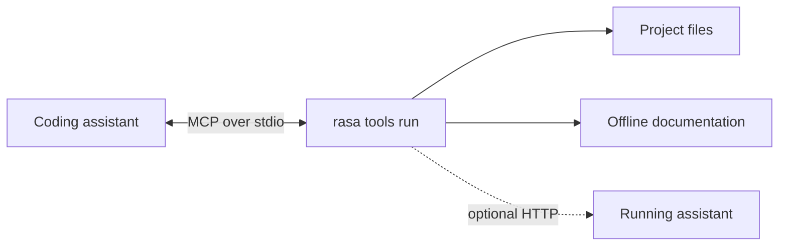
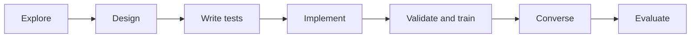
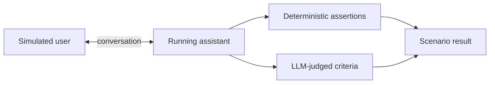
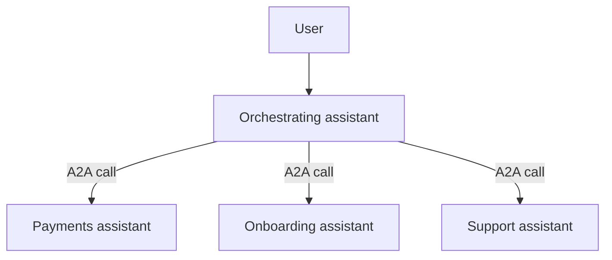

# Day 13 — AI-Assisted Development, and Agents Inside the Assistant

## Student Study Guide

This lesson explains how to use AI coding assistants to build and maintain Rasa flows. Chapter 1 defines coding agents and the review discipline they require. Chapter 2 covers the development harness: MCP, project-context files, skills, and subagents. Chapters 3 and 4 apply these techniques through Rasa MCP Tools and a test-first flow-development workflow. Chapter 5 covers Rasa's runtime sub agents: built-in ReAct agents, external A2A agents, orchestration, and multi-assistant architectures. Production deployment and data-handling practices remain outside this lesson.

---

## Chapter 1 — Using coding assistants safely

### 1.1 Coding agents and workflows

An **AI coding assistant** reads a codebase, edits files, runs commands, and may delegate work. Its harness provides these capabilities; it is more than a chat interface.[^1]

The term **agent** has no universal definition. A useful distinction is control flow:[^1]

- In a **workflow**, the developer fixes the sequence and the model performs bounded steps.
- In an **agent**, the model chooses its next tool or action and decides when the task is complete.

A coding assistant operates toward the agent end of this spectrum because it can choose whether to search, edit, test, or delegate.

### 1.2 General code and framework-specific configuration

Coding assistants are usually stronger at common Python, tests, and HTTP code than at framework-specific YAML, component names, and CLI syntax. They may recall obsolete framework versions or invent plausible configuration keys. Rasa identifies this lack of Rasa-specific knowledge as the main problem its MCP tooling addresses.[^2]

Project files, schemas, and current documentation are more reliable than model memory. Give the assistant access to those sources, then validate its output.

### 1.3 Review and context discipline

Treat generated code and configuration as drafts. A coding assistant can produce useful work quickly, but a developer remains responsible for review. Generated artifacts pass the same validation, tests, and approval process as human-authored artifacts.

Agents amplify the process around them. A test-first team can obtain reviewed changes faster. A team without tests can obtain incorrect changes faster.

Context must also be selective. Curated project instructions can improve performance, while generated or bloated context can reduce task success and increase cost.[^3] Provide constraints the assistant cannot infer; let it inspect discoverable facts directly.

---

## Chapter 2 — Building the development harness

### 2.1 Model Context Protocol

Anthropic introduced the **Model Context Protocol (MCP)** in November 2024 as an open standard for connecting AI applications to external systems.[^4][^5] In December 2025, Anthropic donated MCP to the Agentic AI Foundation, a Linux Foundation fund, while the protocol kept its community-led governance.[^5]

MCP standardizes the boundary between an AI application and the systems that provide it with context or actions. It does not define how an agent reasons, chooses a model, or manages its context. An MCP **host**, such as an IDE assistant, creates one MCP **client** for each MCP **server** it uses. The client maintains the connection and discovers what that server offers.[^4]

Servers expose three main primitives:

- **tools**: functions the model may execute;
- **resources**: data the model may read;
- **prompts**: reusable prompt workflows.

The interface has a JSON-RPC data layer and a separate transport layer. A local server normally communicates over standard input/output (`stdio`); a remote server normally uses Streamable HTTP. At connection time, client and server negotiate protocol versions and capabilities. The client can then discover primitives with methods such as `tools/list`, read resources, or invoke a tool with `tools/call`. MCP also supports server requests for model sampling or user input when the host declares those capabilities.[^4]

One server can therefore expose the same integration to several MCP-compatible hosts. The main implementation path is an official SDK. TypeScript, Python, C#, and Go are Tier 1 SDKs; Java and Rust are Tier 2. The Python SDK provides the high-level `FastMCP` interface, while the TypeScript SDK provides `McpServer`. These frameworks generate protocol schemas and handle transport details around application code.[^4]

### 2.2 Project-context files

A project-context file records persistent instructions such as build commands, architectural constraints, and repository conventions. The assistant reads it at the start of a session. `CLAUDE.md` serves this purpose in Claude Code; `AGENTS.md` is a cross-tool convention.[^3][^6]

Include information the assistant cannot reliably derive from the repository. Examples include forbidden directories, required validation commands, and intentional architectural exceptions. Avoid copying the README or listing files the assistant can inspect.

### 2.3 Skills

A **skill** is a named procedure loaded when relevant rather than held in every session's context.[^7] It is suitable for repeated, multi-step work such as:

1. inspect existing flows;
2. draft a flow;
3. write its tests;
4. validate the project.

Project-context files hold persistent facts and constraints. Skills hold reusable procedures.

Promote instructions to a skill when the same procedure is repeatedly pasted into a session or when a project-context file starts describing a procedure rather than persistent facts.[^7]

### 2.4 Development subagents

A **development subagent** is a scoped worker with its own context, instructions, tools, and permissions. It performs a bounded task and returns its result to the main assistant.[^8] Subagents keep large searches or test output out of the main context. Parallel agents are appropriate only when their work is genuinely independent.

For flow development, separate workers might inspect the current portfolio, draft an isolated flow, or review tests. The main assistant still coordinates dependencies and reviews the combined result.

These development subagents are different from Rasa's runtime **sub agents**. Development subagents help build the assistant; runtime sub agents handle delegated work during a user conversation.

---

## Chapter 3 — Connecting an assistant with Rasa MCP Tools

### 3.1 Local MCP server

**Rasa MCP Tools** is a local MCP server included with Rasa Pro. It reads project files directly, provides an offline documentation bundle, and communicates with an IDE over standard input/output (`stdio`). No separate package is required.[^2][^9]



Most tools work from project files alone. Runtime and evaluation tools also connect to an assistant started with `rasa run --inspect`.[^2][^9]

### 3.2 Tool groups

The server exposes 19 tools in six groups:[^9]

| Group | Count | Representative tools | Purpose |
|---|---:|---|---|
| Documentation | 1 | `search_rasa_documentation` | Search current syntax and concepts |
| Project introspection | 9 | `list_project_flow_definitions`, `get_flow`, `get_slot`, `get_response` | Read actual project artifacts |
| Schema retrieval | 3 | `get_flow_schema`, `get_domain_schema`, `get_e2e_schema` | Retrieve valid artifact shapes |
| Build and validation | 2 | `validate_project`, `train_rasa_assistant` | Check and train the project |
| Runtime testing | 2 | `talk_to_assistant`, `get_assistant_logs` | Exercise and inspect a running assistant |
| Simulation and evaluation | 2 | `validate_scenario`, `evaluate_agent` | Validate scenarios and run evaluations |

Documentation, introspection, schema, and build tools do not require a running server. `talk_to_assistant`, `get_assistant_logs`, and `evaluate_agent` do.[^2][^9]

### 3.3 Setup

Run the setup wizard from the project root:[^2][^9]

```bash
rasa tools init
```

The command creates `.rasa/tools.yaml`, downloads the offline documentation and Rasa skills under `.rasa/`, and generates IDE configuration. `rasa tools init -y` accepts the defaults.

Each IDE then registers `rasa tools run` as an MCP server. For example, Claude Code can use:

```bash
claude mcp add rasa-tools -- /path/to/.venv/bin/rasa tools run --mode stdio
```

An IDE may launch MCP servers in a non-interactive shell that does not read `~/.zshrc`. Put the license variable in a file that the shell always reads, such as `~/.zshenv`, or in the MCP configuration's `env` block.[^2]

### 3.4 Development-time boundary

Rasa MCP Tools assists authoring, inspection, validation, testing, and evaluation. A deployed assistant does not depend on `rasa tools` at runtime.

---

## Chapter 4 — Applying a test-first AI workflow

### 4.1 Flow-development sequence

Rasa's prompt-driven workflow has seven stages:[^10]



1. **Explore** the existing project.
2. **Design** the feature against the current state.
3. **Write end-to-end tests** before implementation.
4. **Implement** flows and domain entries against retrieved schemas.
5. **Validate and train** the project.
6. **Converse** with the running assistant.
7. **Evaluate** the result with simulation.

Use one prompt per stage so each result can be reviewed before the next stage. Tests precede implementation, and validation precedes training.[^10]

The prompts can stay short because Rasa MCP Tools supplies the project-specific context:

```text
1. Explore
   Use rasa-tools to list the existing flows, slots, and responses.
   Summarize what the assistant can already do.

2. Design
   Design a "check order status" feature against the current project.
   List the user goal, reused and new slots, happy path, one edge case,
   and two test scenarios. Do not edit files yet.

3. Write tests
   Retrieve the end-to-end test schema. Add a happy-path test and a
   cancellation test without changing the implementation.

4. Implement
   Retrieve the flow and domain schemas. Implement the feature, reuse
   existing artifacts where possible, and follow the schemas exactly.

5. Validate and train
   Validate the project. Fix validation errors, then train only after
   validation passes.

6. Converse
   Talk to the running assistant through the new path. If it fails,
   inspect the assistant logs and explain the cause.

7. Evaluate
   Create a scenario in which the user does not know the order number
   initially. Validate it, then run it three times and compare the results.
```

Each prompt has one reviewable outcome. In particular, the design can be corrected before files change, and the tests can be inspected before they are made to pass.

### 4.2 Simulation and evaluation

Simulation uses an LLM-generated user to conduct a multi-turn conversation with the running assistant. Evaluation then checks the transcript against deterministic assertions and LLM-judged quality criteria.[^11]



A scenario is one YAML file under `eval/scenarios/`. `simulation_context` defines the user role across the conversation. Optional `setup` values establish the initial state. `goals.assertions` inspect tracker events, while `goals.criteria` judge requirements that need the full transcript.[^11]

```yaml
# eval/scenarios/order_without_number.yml
scenario:
  name: User checks an order without knowing its number

  simulation_context: >
    You want to check an order status, but you do not know the order number.
    You can retrieve it from your email after the assistant explains where to look.
    Answer one question at a time.

  goals:
    criteria:
      - The assistant helps the user continue without inventing an order number
      - The assistant does not ask for information the user already provided
    assertions:
      - flow_completed:
          flow_id: check_order_status
      - slot_was_set:
          - name: order_id
```

The coding assistant can run the scenario through Rasa MCP Tools:

```text
Validate eval/scenarios/order_without_number.yml.
If it is valid, evaluate it three times and compare the assertion and
criterion results. Return the transcript link for every failed run.
```

Several runs expose non-determinism in the simulated user and judge. Simulation is useful for variable paths, such as a user who cannot provide required information immediately. Scripted end-to-end tests remain the repeatable CI regression gate; simulation belongs in the development feedback loop.[^11]

### 4.3 Guardrails

Apply three controls:

1. **Keep tooling at development time.** Production behavior must not depend on Rasa MCP Tools.
2. **Apply the normal quality gates.** Review generated YAML, run project validation, and execute end-to-end tests.
3. **Trust MCP servers explicitly.** A server contributes executable code and context. A malicious third-party server can hide instructions in tool descriptions, so server provenance and review are security requirements.[^12]

---

## Chapter 5 — Delegating runtime work to agents

### 5.1 Runtime sub-agent types

Rasa's beta sub-agents layer lets a flow delegate a bounded conversational task to an autonomous worker and resume when it finishes.[^13] Each sub agent has a directory under `sub_agents/` and a `config.yml` containing a unique `name`, a `description`, and a protocol. Flow and sub-agent names share one namespace.

```text
sub_agents/
└── branch_finder/
    └── config.yml
```

Rasa supports two runtime types:[^13]

- A **ReAct sub agent** (`protocol: RASA`) runs inside Rasa and uses tools.
- An **external sub agent** (`protocol: A2A`) runs elsewhere and exposes an A2A agent card.

The protocol defaults to `RASA`. Every sub agent requires `agent.name` and `agent.description`; the remaining configuration depends on its protocol. The description is operational: it defines the ReAct agent's task or describes an external agent's capability.

### 5.2 ReAct sub agents

A ReAct sub agent repeats a reasoning-and-acting loop: the model selects a tool, reads its result, and continues until completion. Tools come from MCP servers configured in `endpoints.yml` and may also include custom Python tools.[^14]

```yaml
# endpoints.yml
mcp_servers:
  - name: branch_server
    url: http://localhost:8080
    type: http
```

The sub agent refers to the server by its `name`. When the connection opens, the MCP server advertises its tools through the protocol. The sub-agent configuration can expose all advertised tools or filter them by name:

```yaml
# sub_agents/branch_finder/config.yml
agent:
  name: branch_finder
  protocol: RASA
  description: Help the user compare branches and opening hours.

configuration:
  llm:
    model_group: openai-gpt-5-1
  module: sub_agents.branch_finder.custom_agent.BranchFinderAgent
  prompt_template: sub_agents/branch_finder/prompt_template.jinja2
  timeout: 30
  enable_filler_messages: true

connections:
  mcp_servers:
    - name: branch_server
      include_tools:
        - search_branches
        - get_opening_hours
```

`connections.mcp_servers` is required and must contain at least one server. `include_tools` and `exclude_tools` are mutually exclusive. The filter is also a permission boundary: a read-only agent should not receive a write tool merely because the server provides it.[^14]

Rasa supplies a prompt for each ReAct type. A general-purpose prompt receives `agent.description` as `{{ description }}`; a task-specific prompt also receives the slot names derived from `exit_if`. `configuration.prompt_template` replaces the supplied Jinja2 template when the task needs more precise instructions.[^14]

```jinja2
{# sub_agents/branch_finder/prompt_template.jinja2 #}
You help users compare service branches.

### Primary task
{{ description }}

### Rules
- Use only the available tools for branch facts and opening hours.
- Ask one question at a time when location or time is missing.
- Never invent a branch, address, or opening time.
- Before a tool call, send one brief acknowledgement of the action.
- When the task is complete, call `task_completed` exactly once and include
  one short closing message for the user in the same response.
```

The completion instruction is required in a custom general-purpose prompt because `task_completed` returns control to the flow. A custom prompt can also read slot values through the `slots` namespace. Conversation history does not belong in the template; Rasa adds recent turns as separate messages to the model request.[^14]

Custom Python tools extend the same tool set. A general-purpose implementation subclasses `MCPOpenAgent`, defines an asynchronous executor and its function-calling schema, and selects the class with `configuration.module`:

```python
# sub_agents/branch_finder/custom_agent.py
from typing import Any, Dict, List

from rasa.agents.protocol.mcp.mcp_open_agent import MCPOpenAgent
from rasa.agents.schemas import AgentToolContext, AgentToolResult


class BranchFinderAgent(MCPOpenAgent):
    async def _estimate_wait(
        self, arguments: Dict[str, Any], _context: AgentToolContext
    ) -> AgentToolResult:
        minutes = arguments["people_ahead"] * arguments["minutes_per_person"]
        return AgentToolResult(
            tool_name="estimate_wait",
            result=f"Estimated wait: {minutes} minutes",
        )

    def get_custom_tool_definitions(self) -> List[Dict[str, Any]]:
        return [{
            "type": "function",
            "function": {
                "name": "estimate_wait",
                "description": "Estimate a branch waiting time",
                "parameters": {
                    "type": "object",
                    "properties": {
                        "people_ahead": {"type": "integer"},
                        "minutes_per_person": {"type": "integer"},
                    },
                    "required": ["people_ahead", "minutes_per_person"],
                    "additionalProperties": False,
                },
                "strict": True,
            },
            "tool_executor": self._estimate_wait,
        }]
```

Rasa exposes this in-process tool to the model alongside the MCP tools allowed by `connections.mcp_servers`. `tool_executor` binds the model-visible schema to the Python method. The executor receives the model-supplied arguments and an `AgentToolContext`, and it must return an `AgentToolResult`. A task-specific implementation follows the same pattern with `MCPTaskAgent`.[^14]

The Python tool is independent of the MCP server, but it does not replace the connection in the current ReAct configuration. `connections.mcp_servers` remains mandatory and must contain at least one server. A ReAct sub agent with only Python tools and no MCP server is therefore not a supported configuration.[^14]

Completion differs by agent type:[^14]

- A **general-purpose** agent handles open-ended work. It calls the built-in `task_completed` tool and sends a short user-facing message in the same model response.
- A **task-specific** agent fills declared slots. Rasa gives it a `set_slot_<slot_name>` tool for every slot in `exit_if` and completes it silently when all exit conditions hold.

Task-specific agents keep completion deterministic even though the model directs the conversation.

### 5.3 Invocation, user messages, and returned results

A flow invokes a sub agent with an autonomous `call` step:[^15]

```yaml
flows:
  find_branch:
    description: Find a suitable branch.
    steps:
      - call: branch_finder
```

A call without `exit_if` creates a general-purpose run. The agent can ask the user questions, report tool results, and send intermediate tool acknowledgements. When it calls `task_completed`, Rasa sends its closing message to the user and continues with the next flow step.[^14][^15]

A task-specific agent uses the same directory and connection structure. Its description defines the information it collects; the `exit_if` condition in the flow supplies its completion target:

```yaml
# sub_agents/booking_agent/config.yml
agent:
  name: booking_agent
  protocol: RASA
  description: Collect an appointment time that the user accepts.

connections:
  mcp_servers:
    - name: branch_server
      include_tools:
        - list_available_appointments
```

A call with `exit_if` creates the task-specific run:

```yaml
flows:
  book_appointment:
    description: Book an appointment with an advisor.
    steps:
      - call: booking_agent
        exit_if:
          - slots.appointment_time is not null
      - collect: final_confirmation
```

`exit_if` applies only to ReAct sub agents and can refer only to slots declared in the domain.[^15] In this example Rasa generates `set_slot_appointment_time`. The agent asks the user for missing information and calls that tool when it obtains a value. Rasa updates the slot immediately, checks the exit condition, completes the agent without a final agent message, and continues to `collect: final_confirmation`.[^14]

ReAct sub agents therefore run autonomously but not invisibly. They converse with the user while they control the autonomous step. The Rasa orchestrator forwards their messages and integrates their events; there is no separate peer-to-peer conversation between a “main agent” and a sub agent.

Normal flow selection chooses the flow and therefore the sub agent. No separate agent router is required.

Rasa shares the current message, conversation history, non-system slots, and events with the agent. It retries recoverable failures up to three times with exponential backoff, then handles the returned status:[^13][^15]

| Status | Orchestrator behavior |
|---|---|
| `INPUT_REQUIRED` | Send the agent's question and wait for the user's reply |
| `COMPLETED` | Apply returned events, send a response if present, and continue the flow |
| `FATAL_ERROR` | Cancel the flow and invoke internal-error handling |

If the user digresses while an agent is active, Rasa stores the agent state, handles the new flow, and can resume the agent afterward.[^13]

`process_input` and `process_output` are common customization hooks, but their base class depends on the protocol:[^13][^14][^16]

| Sub-agent type | Customization base class |
|---|---|
| General-purpose ReAct | `MCPOpenAgent` |
| Task-specific ReAct | `MCPTaskAgent` |
| External A2A | `A2AAgent` |

`process_input` filters or enriches context before delegation. `process_output` can convert structured results into `SlotSet` events for later flow steps. An `A2AAgent` example is therefore correct only for an external agent; a ReAct customization must use one of the MCP base classes.

While a sub agent is executing a tool, unrelated new user requests cannot be handled. The user can send the next turn after the sub agent reaches `INPUT_REQUIRED` or completes. Short intermediate messages can report progress, but they do not release control.[^13][^14]

### 5.4 External A2A agents and multi-assistant systems

An external sub agent provides a capability deployed in another system. Its configuration points to an A2A agent card by file path or URL. The same `call` step, context sharing, statuses, and interruption behavior apply.[^16][^17]

```yaml
# sub_agents/analytics_agent/config.yml
agent:
  name: analytics_agent
  protocol: A2A
  description: Analyze product and service usage.

configuration:
  agent_card: https://analytics.example.com/.well-known/agent-card.json
  max_polling_time: 60
```

An **Agent Card** is the external agent's discovery document. It identifies the agent, describes its capabilities and authentication requirements, declares its service interface and content types, and lists its skills. A compact card has this shape:[^17]

```json
{
  "name": "Analytics Agent",
  "description": "Analyzes product and service usage",
  "supportedInterfaces": [
    {
      "url": "https://analytics.example.com/a2a",
      "protocolBinding": "JSONRPC",
      "protocolVersion": "1.0"
    }
  ],
  "capabilities": {
    "streaming": true,
    "pushNotifications": false
  },
  "defaultInputModes": ["text/plain"],
  "defaultOutputModes": ["text/plain", "application/json"],
  "skills": [
    {
      "id": "usage-analysis",
      "name": "Usage analysis",
      "description": "Summarize usage for a requested product and period",
      "tags": ["analytics", "usage"]
    }
  ]
}
```

`supportedInterfaces` tells Rasa where and how to call the agent. `capabilities` declares optional behavior such as streaming, the default modes describe exchanged content, and `skills` describes routable work. A production card can also declare authentication schemes. Rasa loads the card, creates the client, and sends user turns and context to the selected interface. An external agent returns `INPUT_REQUIRED` when it needs another user turn and `COMPLETED` when it releases control.[^13][^17]

The orchestrating assistant owns the conversation and business rules. Filter context before sending it across the deployment boundary.

A Rasa assistant can also expose itself as an A2A agent:[^18]

```yaml
# endpoints.yml
a2a_server:
  url: "http://localhost:5005"
  description: "Assistant for transfers and appointments"
```

Only `description` is required; `url` is the public base URL that an external orchestrator can reach. Rasa serves the Agent Card at `GET /.well-known/agent-card.json` and A2A JSON-RPC operations at `POST /` on the same port as its other HTTP routes. User-facing flows become advertised skills, and their descriptions become the routing contract used by an external orchestrator.[^18]

The external orchestrator first reads the Agent Card, then sends a turn with `message/send` or `message/stream`. It reuses the same `contextId` across a multi-turn conversation. Rasa maps that context to one sender, runs the selected flow, and returns A2A task states such as `input_required` or `completed`.[^18]

The Rasa domain must keep an A2A context on the same session:

```yaml
# domain.yml
session_config:
  session_expiration_time: 60
  start_session_after_expiry: false
```

`start_session_after_expiry: false` prevents a resumed A2A context from resetting its slot state after inactivity.[^18]

One orchestrating assistant can therefore delegate to several role-specific assistants:



An exposed Rasa assistant requires one server worker per pod. Multiple replicas require sticky routing by `contextId`. In Rasa 3.17, using the same deployment both as an exposed A2A sub agent and as an orchestrator of external sub agents is not a tested architecture.[^18]

### 5.5 Choosing the delegation unit

| Work | Appropriate unit | Reason |
|---|---|---|
| Declared, auditable process | Flow | Steps and decisions remain deterministic |
| Open-ended, tool-driven task | General-purpose ReAct agent | The path depends on tool results |
| Structured information collection | Task-specific ReAct agent | Dialogue varies, but completion is a slot condition |
| Capability in another deployed system | External A2A agent | Delegation follows a real system boundary |

An open-ended agent follows a prompted rather than declared path. Auditability therefore remains in the surrounding flow: its guard, inputs, and return to deterministic steps.

Descriptions route work at both levels. The command generator uses flow descriptions inside one assistant; an A2A orchestrator uses agent-card skill descriptions across assistants.

---

## Further reading

- [Building Effective Agents](https://www.anthropic.com/research/building-effective-agents)
- [MCP architecture](https://modelcontextprotocol.io/docs/learn/architecture)
- [Official MCP SDKs](https://modelcontextprotocol.io/docs/sdk)
- [Rasa MCP Tools installation](https://rasa.com/docs/pro/installation/rasa-mcp-tools/)
- [Rasa MCP Tools API](https://rasa.com/docs/reference/api/rasa-mcp-tools/)
- [AI-assisted development tutorial](https://rasa.com/docs/learn/ai-assisted-development/)
- [Simulation and evaluation](https://rasa.com/docs/reference/testing/evals/overview/)
- [Sub agents overview](https://rasa.com/docs/reference/config/agents/overview-agents/)
- [ReAct sub agents](https://rasa.com/docs/reference/config/agents/react-sub-agents/)
- [External A2A sub agents](https://rasa.com/docs/reference/config/agents/external-sub-agents/)
- [Exposing Rasa as an A2A sub-agent](https://rasa.com/docs/pro/build/exposing-rasa-as-a2a-sub-agent/)

---

### Sources

[^1]: [Anthropic — Building Effective Agents](https://www.anthropic.com/research/building-effective-agents).
[^2]: [Rasa Docs — Rasa MCP Tools installation](https://rasa.com/docs/pro/installation/rasa-mcp-tools/).
[^3]: [Augment Code — How to Build Your AGENTS.md](https://www.augmentcode.com/guides/how-to-build-agents-md).
[^4]: Model Context Protocol — [Introduction](https://modelcontextprotocol.io/docs/getting-started/intro), [architecture](https://modelcontextprotocol.io/docs/learn/architecture), [official SDKs](https://modelcontextprotocol.io/docs/sdk), and [server tutorial](https://modelcontextprotocol.io/docs/develop/build-server).
[^5]: Anthropic — [Introducing the Model Context Protocol](https://www.anthropic.com/news/model-context-protocol) and [donating MCP to the Agentic AI Foundation](https://www.anthropic.com/news/donating-the-model-context-protocol-and-establishing-of-the-agentic-ai-foundation).
[^6]: [Claude Code Docs — Manage Claude's memory](https://code.claude.com/docs/en/memory).
[^7]: [Claude Code Docs — Extend Claude with skills](https://code.claude.com/docs/en/skills).
[^8]: [Claude Code Docs — Create custom subagents](https://code.claude.com/docs/en/sub-agents).
[^9]: [Rasa Docs — Rasa MCP Tools API](https://rasa.com/docs/reference/api/rasa-mcp-tools/).
[^10]: [Rasa Docs — AI-assisted development tutorial](https://rasa.com/docs/learn/ai-assisted-development/).
[^11]: [Rasa Docs — Simulation and evaluation](https://rasa.com/docs/reference/testing/evals/overview/).
[^12]: [Invariant Labs — MCP tool poisoning attacks](https://invariantlabs.ai/blog/mcp-security-notification-tool-poisoning-attacks).
[^13]: [Rasa Docs — Sub agents overview](https://rasa.com/docs/reference/config/agents/overview-agents/).
[^14]: [Rasa Docs — ReAct sub agents](https://rasa.com/docs/reference/config/agents/react-sub-agents/).
[^15]: [Rasa Docs — Autonomous flow steps](https://rasa.com/docs/reference/primitives/flow-steps/).
[^16]: [Rasa Docs — Integrating external agents via A2A](https://rasa.com/docs/pro/build/integrating-external-agents/).
[^17]: [Rasa Docs — External sub agents](https://rasa.com/docs/reference/config/agents/external-sub-agents/) and [A2A Protocol — specification](https://a2a-protocol.org/latest/specification/).
[^18]: Rasa Docs — [Exposing Rasa as an A2A sub-agent](https://rasa.com/docs/pro/build/exposing-rasa-as-a2a-sub-agent/) and [A2A server reference](https://rasa.com/docs/reference/integrations/a2a-server/).
