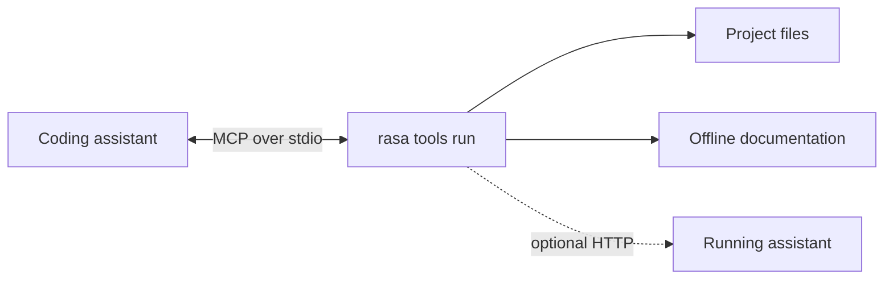
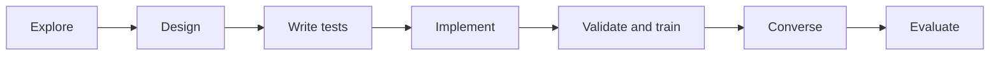
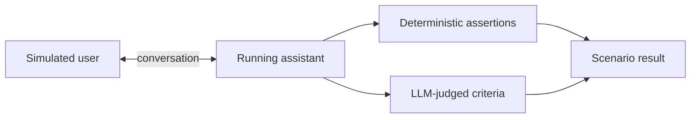
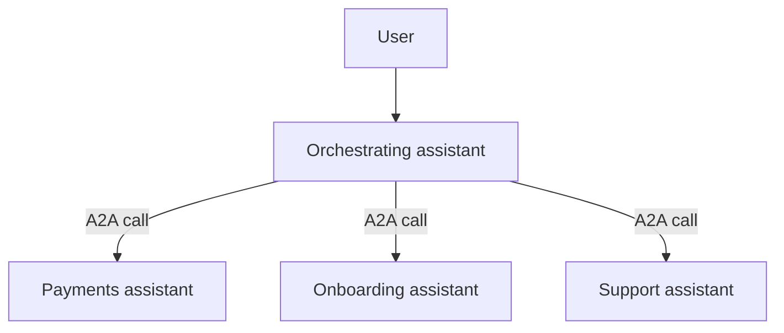

# Day 13 — AI-Assisted Development, e Agenti Dentro l'Assistente

## Guida di Studio per lo Studente

Questa lezione spiega come usare gli assistenti di codifica AI per costruire e mantenere i flow di Rasa. Il Capitolo 1 definisce i coding agent e la disciplina di revisione che essi richiedono. Il Capitolo 2 tratta l'harness di sviluppo: MCP, file di contesto del progetto, skill e subagent. I Capitoli 3 e 4 applicano queste tecniche tramite i Rasa MCP Tools e un workflow di sviluppo dei flow test-first. Il Capitolo 5 tratta i sub agent runtime di Rasa: gli agenti ReAct integrati, gli agenti A2A esterni, l'orchestrazione e le architetture multi-assistente. Il deployment in produzione e le pratiche di gestione dei dati restano al di fuori di questa lezione.

---

## Capitolo 1 — Usare gli assistenti di codifica in sicurezza

### 1.1 Coding agent e workflow

Un **AI coding assistant** legge un codebase, modifica file, esegue comandi e può delegare lavoro. Il suo harness fornisce queste capacità; è più di una semplice interfaccia di chat.[^1]

Il termine **agent** non ha una definizione universale. Una distinzione utile è quella del control flow:[^1]

- In un **workflow**, lo sviluppatore fissa la sequenza e il modello esegue passi delimitati.
- In un **agent**, il modello sceglie il proprio tool o azione successiva e decide quando il task è completo.

Un coding assistant opera verso l'estremità agent di questo spettro perché può scegliere se cercare, modificare, testare o delegare.

### 1.2 Codice generico e configurazione specifica del framework

Gli assistenti di codifica sono di solito più forti con il Python comune, i test e il codice HTTP che non con lo YAML specifico del framework, i nomi dei componenti e la sintassi della CLI. Possono ricordare versioni obsolete del framework o inventare chiavi di configurazione plausibili. Rasa identifica questa mancanza di conoscenza specifica di Rasa come il problema principale che il suo tooling MCP affronta.[^2]

I file di progetto, gli schemi e la documentazione corrente sono più affidabili della memoria del modello. Dai all'assistente l'accesso a queste fonti, poi valida il suo output.

### 1.3 Disciplina di revisione e di contesto

Tratta il codice e la configurazione generati come bozze. Un coding assistant può produrre lavoro utile rapidamente, ma la responsabilità della revisione resta dello sviluppatore. Gli artefatti generati passano lo stesso processo di validazione, test e approvazione degli artefatti scritti da esseri umani.

Gli agenti amplificano il processo che li circonda. Un team test-first può ottenere modifiche revisionate più velocemente. Un team senza test può ottenere modifiche errate più velocemente.

Anche il contesto deve essere selettivo. Istruzioni di progetto curate possono migliorare le prestazioni, mentre un contesto generato o gonfiato può ridurre il successo del task e aumentare i costi.[^3] Fornisci i vincoli che l'assistente non può dedurre; lascia che ispezioni direttamente i fatti individuabili.

---

## Capitolo 2 — Costruire l'harness di sviluppo

### 2.1 Model Context Protocol

Anthropic ha introdotto il **Model Context Protocol (MCP)** a novembre 2024 come standard aperto per connettere le applicazioni AI a sistemi esterni.[^4][^5] A dicembre 2025, Anthropic ha donato MCP alla Agentic AI Foundation, un fondo della Linux Foundation, mentre il protocollo ha mantenuto la sua governance guidata dalla comunità.[^5]

MCP standardizza il confine tra un'applicazione AI e i sistemi che le forniscono contesto o azioni. Non definisce come un agente ragiona, sceglie un modello o gestisce il proprio contesto. Un **host** MCP, come un assistente in un IDE, crea un **client** MCP per ogni **server** MCP che usa. Il client mantiene la connessione e scopre cosa quel server offre.[^4]

I server espongono tre primitive principali:

- **tools**: funzioni che il modello può eseguire;
- **resources**: dati che il modello può leggere;
- **prompts**: workflow di prompt riutilizzabili.

L'interfaccia ha un data layer JSON-RPC e un transport layer separato. Un server locale comunica normalmente su standard input/output (`stdio`); un server remoto usa normalmente Streamable HTTP. Al momento della connessione, client e server negoziano le versioni del protocollo e le capacità. Il client può poi scoprire le primitive con metodi come `tools/list`, leggere resources, o invocare un tool con `tools/call`. MCP supporta anche le richieste del server per il model sampling o l'input dell'utente quando l'host dichiara quelle capacità.[^4]

Un unico server può quindi esporre la stessa integrazione a diversi host MCP-compatibili. Il percorso di implementazione principale è un SDK ufficiale. TypeScript, Python, C# e Go sono SDK Tier 1; Java e Rust sono Tier 2. L'SDK Python fornisce l'interfaccia di alto livello `FastMCP`, mentre l'SDK TypeScript fornisce `McpServer`. Questi framework generano gli schemi del protocollo e gestiscono i dettagli del transport attorno al codice applicativo.[^4]

### 2.2 File di contesto del progetto

Un file di contesto del progetto registra istruzioni persistenti come i comandi di build, i vincoli architetturali e le convenzioni del repository. L'assistente lo legge all'inizio di una sessione. `CLAUDE.md` svolge questo scopo in Claude Code; `AGENTS.md` è una convenzione trasversale ai vari tool.[^3][^6]

Includi le informazioni che l'assistente non può derivare in modo affidabile dal repository. Esempi includono directory vietate, comandi di validazione richiesti ed eccezioni architetturali intenzionali. Evita di copiare il README o di elencare file che l'assistente può ispezionare.

### 2.3 Skill

Una **skill** è una procedura con un nome, caricata quando è rilevante anziché tenuta nel contesto di ogni sessione.[^7] È adatta a lavori ripetuti e a più passi come:

1. ispezionare i flow esistenti;
2. abbozzare un flow;
3. scriverne i test;
4. validare il progetto.

I file di contesto del progetto contengono fatti e vincoli persistenti. Le skill contengono procedure riutilizzabili.

Promuovi delle istruzioni a skill quando la stessa procedura viene incollata ripetutamente in una sessione o quando un file di contesto del progetto inizia a descrivere una procedura anziché fatti persistenti.[^7]

### 2.4 Subagent di sviluppo

Un **development subagent** è un worker con ambito limitato dotato di proprio contesto, istruzioni, tool e permessi. Esegue un task delimitato e restituisce il suo risultato all'assistente principale.[^8] I subagent tengono le grandi ricerche o l'output dei test fuori dal contesto principale. Gli agenti in parallelo sono appropriati solo quando il loro lavoro è genuinamente indipendente.

Per lo sviluppo dei flow, worker separati potrebbero ispezionare il portafoglio corrente, abbozzare un flow isolato, o revisionare i test. L'assistente principale coordina comunque le dipendenze e revisiona il risultato combinato.

Questi development subagent sono diversi dai **sub agent** runtime di Rasa. I development subagent aiutano a costruire l'assistente; i sub agent runtime gestiscono il lavoro delegato durante una conversazione con l'utente.

---

## Capitolo 3 — Connettere un assistente con i Rasa MCP Tools

### 3.1 Server MCP locale

**Rasa MCP Tools** è un server MCP locale incluso in Rasa Pro. Legge direttamente i file di progetto, fornisce un bundle di documentazione offline, e comunica con un IDE su standard input/output (`stdio`). Non è richiesto alcun pacchetto separato.[^2][^9]



La maggior parte dei tool funziona a partire dai soli file di progetto. I tool di runtime e valutazione si connettono anche a un assistente avviato con `rasa run --inspect`.[^2][^9]

### 3.2 Gruppi di tool

Il server espone 19 tool in sei gruppi:[^9]

| Gruppo | Numero | Tool rappresentativi | Scopo |
|---|---:|---|---|
| Documentation | 1 | `search_rasa_documentation` | Cercare sintassi e concetti correnti |
| Project introspection | 9 | `list_project_flow_definitions`, `get_flow`, `get_slot`, `get_response` | Leggere gli artefatti effettivi del progetto |
| Schema retrieval | 3 | `get_flow_schema`, `get_domain_schema`, `get_e2e_schema` | Recuperare le forme valide degli artefatti |
| Build and validation | 2 | `validate_project`, `train_rasa_assistant` | Verificare e addestrare il progetto |
| Runtime testing | 2 | `talk_to_assistant`, `get_assistant_logs` | Esercitare e ispezionare un assistente in esecuzione |
| Simulation and evaluation | 2 | `validate_scenario`, `evaluate_agent` | Validare scenari ed eseguire valutazioni |

I tool di documentation, introspection, schema e build non richiedono un server in esecuzione. `talk_to_assistant`, `get_assistant_logs` ed `evaluate_agent` lo richiedono.[^2][^9]

### 3.3 Setup

Esegui il wizard di setup dalla root del progetto:[^2][^9]

```bash
rasa tools init
```

Il comando crea `.rasa/tools.yaml`, scarica la documentazione offline e le Rasa skill sotto `.rasa/`, e genera la configurazione dell'IDE. `rasa tools init -y` accetta i valori di default.

Ciascun IDE registra poi `rasa tools run` come server MCP. Per esempio, Claude Code può usare:

```bash
claude mcp add rasa-tools -- /path/to/.venv/bin/rasa tools run --mode stdio
```

Un IDE può avviare i server MCP in una shell non interattiva che non legge `~/.zshrc`. Metti la variabile di licenza in un file che la shell legge sempre, come `~/.zshenv`, o nel blocco `env` della configurazione MCP.[^2]

### 3.4 Il confine del development-time

I Rasa MCP Tools assistono l'authoring, l'ispezione, la validazione, il test e la valutazione. Un assistente distribuito non dipende da `rasa tools` a runtime.

---

## Capitolo 4 — Applicare un workflow AI test-first

### 4.1 Sequenza di sviluppo dei flow

Il workflow prompt-driven di Rasa ha sette fasi:[^10]



1. **Explore** il progetto esistente.
2. **Design** della feature rispetto allo stato corrente.
3. **Write end-to-end tests** prima dell'implementazione.
4. **Implement** dei flow e delle voci del domain rispetto agli schemi recuperati.
5. **Validate and train** del progetto.
6. **Converse** con l'assistente in esecuzione.
7. **Evaluate** del risultato tramite simulazione.

Usa un prompt per ogni fase in modo che ciascun risultato possa essere revisionato prima della fase successiva. I test precedono l'implementazione, e la validazione precede il training.[^10]

I prompt possono restare brevi perché i Rasa MCP Tools forniscono il contesto specifico del progetto:

```text
1. Explore
   Use rasa-tools to list the existing flows, slots, and responses.
   Summarize what the assistant can already do.

2. Design
   Design a "check order status" feature against the current project.
   List the user goal, reused and new slots, happy path, one edge case,
   and two test scenarios. Do not edit files yet.

3. Write tests
   Retrieve the end-to-end test schema. Add a happy-path test and a
   cancellation test without changing the implementation.

4. Implement
   Retrieve the flow and domain schemas. Implement the feature, reuse
   existing artifacts where possible, and follow the schemas exactly.

5. Validate and train
   Validate the project. Fix validation errors, then train only after
   validation passes.

6. Converse
   Talk to the running assistant through the new path. If it fails,
   inspect the assistant logs and explain the cause.

7. Evaluate
   Create a scenario in which the user does not know the order number
   initially. Validate it, then run it three times and compare the results.
```

Ogni prompt ha un unico esito revisionabile. In particolare, il design può essere corretto prima che i file cambino, e i test possono essere ispezionati prima che vengano fatti passare.

### 4.2 Simulazione e valutazione

La simulazione usa un utente generato da un LLM per condurre una conversazione multi-turno con l'assistente in esecuzione. La valutazione verifica poi il transcript rispetto ad assertion deterministiche e a criteri di qualità giudicati da un LLM.[^11]



Uno scenario è un unico file YAML sotto `eval/scenarios/`. `simulation_context` definisce il ruolo dell'utente lungo tutta la conversazione. I valori opzionali di `setup` stabiliscono lo stato iniziale. Le `goals.assertions` ispezionano gli eventi del tracker, mentre i `goals.criteria` giudicano requisiti che necessitano dell'intero transcript.[^11]

```yaml
# eval/scenarios/order_without_number.yml
scenario:
  name: User checks an order without knowing its number

  simulation_context: >
    You want to check an order status, but you do not know the order number.
    You can retrieve it from your email after the assistant explains where to look.
    Answer one question at a time.

  goals:
    criteria:
      - The assistant helps the user continue without inventing an order number
      - The assistant does not ask for information the user already provided
    assertions:
      - flow_completed:
          flow_id: check_order_status
      - slot_was_set:
          - name: order_id
```

Il coding assistant può eseguire lo scenario tramite i Rasa MCP Tools:

```text
Validate eval/scenarios/order_without_number.yml.
If it is valid, evaluate it three times and compare the assertion and
criterion results. Return the transcript link for every failed run.
```

Diverse esecuzioni espongono il non-determinismo nell'utente simulato e nel giudice. La simulazione è utile per i percorsi variabili, come un utente che non può fornire immediatamente le informazioni richieste. I test end-to-end scriptati restano il gate di regressione ripetibile in CI; la simulazione appartiene al ciclo di feedback dello sviluppo.[^11]

### 4.3 Guardrail

Applica tre controlli:

1. **Mantieni il tooling al development time.** Il comportamento in produzione non deve dipendere dai Rasa MCP Tools.
2. **Applica i normali quality gate.** Revisiona lo YAML generato, esegui la validazione del progetto ed esegui i test end-to-end.
3. **Fidati dei server MCP esplicitamente.** Un server contribuisce codice eseguibile e contesto. Un server di terze parti malevolo può nascondere istruzioni nelle descrizioni dei tool, quindi la provenienza e la revisione del server sono requisiti di sicurezza.[^12]

---

## Capitolo 5 — Delegare il lavoro runtime agli agenti

### 5.1 Tipi di sub-agent runtime

Il layer beta dei sub-agent di Rasa permette a un flow di delegare un task conversazionale delimitato a un worker autonomo e di riprendere quando esso ha finito.[^13] Ciascun sub agent ha una directory sotto `sub_agents/` e un `config.yml` contenente un `name` univoco, una `description` e un protocollo. I nomi dei flow e dei sub-agent condividono un unico namespace.

```text
sub_agents/
└── branch_finder/
    └── config.yml
```

Rasa supporta due tipi runtime:[^13]

- Un **ReAct sub agent** (`protocol: RASA`) viene eseguito dentro Rasa e usa dei tool.
- Un **external sub agent** (`protocol: A2A`) viene eseguito altrove ed espone un A2A agent card.

Il protocollo di default è `RASA`. Ogni sub agent richiede `agent.name` e `agent.description`; la restante configurazione dipende dal suo protocollo. La description è operativa: definisce il task dell'agente ReAct o descrive la capacità di un agente esterno.

### 5.2 ReAct sub agent

Un ReAct sub agent ripete un loop di ragionamento-e-azione: il modello seleziona un tool, ne legge il risultato, e continua fino al completamento. I tool provengono da server MCP configurati in `endpoints.yml` e possono anche includere tool Python custom.[^14]

```yaml
# endpoints.yml
mcp_servers:
  - name: branch_server
    url: http://localhost:8080
    type: http
```

Il sub agent si riferisce al server tramite il suo `name`. Quando la connessione si apre, il server MCP pubblicizza i propri tool attraverso il protocollo. La configurazione del sub-agent può esporre tutti i tool pubblicizzati o filtrarli per nome:

```yaml
# sub_agents/branch_finder/config.yml
agent:
  name: branch_finder
  protocol: RASA
  description: Help the user compare branches and opening hours.

configuration:
  llm:
    model_group: openai-gpt-5-1
  module: sub_agents.branch_finder.custom_agent.BranchFinderAgent
  prompt_template: sub_agents/branch_finder/prompt_template.jinja2
  timeout: 30
  enable_filler_messages: true

connections:
  mcp_servers:
    - name: branch_server
      include_tools:
        - search_branches
        - get_opening_hours
```

`connections.mcp_servers` è obbligatorio e deve contenere almeno un server. `include_tools` ed `exclude_tools` sono mutuamente esclusivi. Il filtro è anche un confine di permessi: un agente a sola lettura non dovrebbe ricevere un tool di scrittura solo perché il server lo fornisce.[^14]

Rasa fornisce un prompt per ciascun tipo ReAct. Un prompt general-purpose riceve `agent.description` come `{{ description }}`; un prompt task-specific riceve anche i nomi degli slot derivati da `exit_if`. `configuration.prompt_template` sostituisce il template Jinja2 fornito quando il task necessita di istruzioni più precise.[^14]

```jinja2
{# sub_agents/branch_finder/prompt_template.jinja2 #}
You help users compare service branches.

### Primary task
{{ description }}

### Rules
- Use only the available tools for branch facts and opening hours.
- Ask one question at a time when location or time is missing.
- Never invent a branch, address, or opening time.
- Before a tool call, send one brief acknowledgement of the action.
- When the task is complete, call `task_completed` exactly once and include
  one short closing message for the user in the same response.
```

L'istruzione di completamento è obbligatoria in un prompt general-purpose custom perché `task_completed` restituisce il controllo al flow. Un prompt custom può anche leggere i valori degli slot attraverso il namespace `slots`. La cronologia della conversazione non va nel template; Rasa aggiunge i turni recenti come messaggi separati alla richiesta al modello.[^14]

I tool Python custom estendono lo stesso insieme di tool. Un'implementazione general-purpose fa il subclass di `MCPOpenAgent`, definisce un executor asincrono e il suo schema di function-calling, e seleziona la classe con `configuration.module`:

```python
# sub_agents/branch_finder/custom_agent.py
from typing import Any, Dict, List

from rasa.agents.protocol.mcp.mcp_open_agent import MCPOpenAgent
from rasa.agents.schemas import AgentToolContext, AgentToolResult


class BranchFinderAgent(MCPOpenAgent):
    async def _estimate_wait(
        self, arguments: Dict[str, Any], _context: AgentToolContext
    ) -> AgentToolResult:
        minutes = arguments["people_ahead"] * arguments["minutes_per_person"]
        return AgentToolResult(
            tool_name="estimate_wait",
            result=f"Estimated wait: {minutes} minutes",
        )

    def get_custom_tool_definitions(self) -> List[Dict[str, Any]]:
        return [{
            "type": "function",
            "function": {
                "name": "estimate_wait",
                "description": "Estimate a branch waiting time",
                "parameters": {
                    "type": "object",
                    "properties": {
                        "people_ahead": {"type": "integer"},
                        "minutes_per_person": {"type": "integer"},
                    },
                    "required": ["people_ahead", "minutes_per_person"],
                    "additionalProperties": False,
                },
                "strict": True,
            },
            "tool_executor": self._estimate_wait,
        }]
```

Rasa espone questo tool in-process al modello insieme ai tool MCP consentiti da `connections.mcp_servers`. `tool_executor` collega lo schema visibile al modello al metodo Python. L'executor riceve gli argomenti forniti dal modello e un `AgentToolContext`, e deve restituire un `AgentToolResult`. Un'implementazione task-specific segue lo stesso pattern con `MCPTaskAgent`.[^14]

Il tool Python è indipendente dal server MCP, ma non sostituisce la connessione nell'attuale configurazione ReAct. `connections.mcp_servers` resta obbligatorio e deve contenere almeno un server. Un ReAct sub agent con solo tool Python e nessun server MCP non è quindi una configurazione supportata.[^14]

Il completamento differisce a seconda del tipo di agente:[^14]

- Un agente **general-purpose** gestisce lavoro aperto. Chiama il tool integrato `task_completed` e invia un breve messaggio rivolto all'utente nella stessa risposta del modello.
- Un agente **task-specific** compila gli slot dichiarati. Rasa gli fornisce un tool `set_slot_<slot_name>` per ogni slot in `exit_if` e lo completa silenziosamente quando tutte le condizioni di uscita sono soddisfatte.

Gli agenti task-specific mantengono il completamento deterministico anche se il modello dirige la conversazione.

### 5.3 Invocazione, messaggi dell'utente e risultati restituiti

Un flow invoca un sub agent con un passo `call` autonomo:[^15]

```yaml
flows:
  find_branch:
    description: Find a suitable branch.
    steps:
      - call: branch_finder
```

Una call senza `exit_if` crea un'esecuzione general-purpose. L'agente può porre domande all'utente, riportare i risultati dei tool, e inviare acknowledgement intermedi dei tool. Quando chiama `task_completed`, Rasa invia il suo messaggio di chiusura all'utente e continua con il passo di flow successivo.[^14][^15]

Un agente task-specific usa la stessa struttura di directory e di connessione. La sua description definisce le informazioni che raccoglie; la condizione `exit_if` nel flow fornisce il suo obiettivo di completamento:

```yaml
# sub_agents/booking_agent/config.yml
agent:
  name: booking_agent
  protocol: RASA
  description: Collect an appointment time that the user accepts.

connections:
  mcp_servers:
    - name: branch_server
      include_tools:
        - list_available_appointments
```

Una call con `exit_if` crea l'esecuzione task-specific:

```yaml
flows:
  book_appointment:
    description: Book an appointment with an advisor.
    steps:
      - call: booking_agent
        exit_if:
          - slots.appointment_time is not null
      - collect: final_confirmation
```

`exit_if` si applica solo ai ReAct sub agent e può riferirsi solo a slot dichiarati nel domain.[^15] In questo esempio Rasa genera `set_slot_appointment_time`. L'agente chiede all'utente le informazioni mancanti e chiama quel tool quando ottiene un valore. Rasa aggiorna lo slot immediatamente, verifica la condizione di uscita, completa l'agente senza un messaggio finale dell'agente, e continua a `collect: final_confirmation`.[^14]

I ReAct sub agent quindi vengono eseguiti in modo autonomo ma non invisibile. Conversano con l'utente mentre controllano il passo autonomo. L'orchestratore di Rasa inoltra i loro messaggi e integra i loro eventi; non c'è alcuna conversazione peer-to-peer separata tra un "main agent" e un sub agent.

La normale selezione dei flow sceglie il flow e quindi il sub agent. Non è richiesto alcun agent router separato.

Rasa condivide con l'agente il messaggio corrente, la cronologia della conversazione, gli slot non di sistema e gli eventi. Ritenta i fallimenti recuperabili fino a tre volte con backoff esponenziale, poi gestisce lo status restituito:[^13][^15]

| Status | Comportamento dell'orchestratore |
|---|---|
| `INPUT_REQUIRED` | Invia la domanda dell'agente e attende la risposta dell'utente |
| `COMPLETED` | Applica gli eventi restituiti, invia una risposta se presente, e continua il flow |
| `FATAL_ERROR` | Annulla il flow e invoca la gestione degli errori interni |

Se l'utente divaga mentre un agente è attivo, Rasa memorizza lo stato dell'agente, gestisce il nuovo flow, e può riprendere l'agente successivamente.[^13]

`process_input` e `process_output` sono hook di personalizzazione comuni, ma la loro classe base dipende dal protocollo:[^13][^14][^16]

| Tipo di sub-agent | Classe base di personalizzazione |
|---|---|
| General-purpose ReAct | `MCPOpenAgent` |
| Task-specific ReAct | `MCPTaskAgent` |
| External A2A | `A2AAgent` |

`process_input` filtra o arricchisce il contesto prima della delega. `process_output` può convertire risultati strutturati in eventi `SlotSet` per i passi di flow successivi. Un esempio di `A2AAgent` è quindi corretto solo per un agente esterno; una personalizzazione ReAct deve usare una delle classi base MCP.

Mentre un sub agent sta eseguendo un tool, non è possibile gestire nuove richieste dell'utente non correlate. L'utente può inviare il turno successivo dopo che il sub agent ha raggiunto `INPUT_REQUIRED` o si è completato. Brevi messaggi intermedi possono riportare l'avanzamento, ma non rilasciano il controllo.[^13][^14]

### 5.4 Agenti A2A esterni e sistemi multi-assistente

Un sub agent esterno fornisce una capacità distribuita in un altro sistema. La sua configurazione punta a un A2A agent card tramite percorso di file o URL. Si applicano lo stesso passo `call`, la stessa condivisione del contesto, gli stessi status e lo stesso comportamento in caso di interruzione.[^16][^17]

```yaml
# sub_agents/analytics_agent/config.yml
agent:
  name: analytics_agent
  protocol: A2A
  description: Analyze product and service usage.

configuration:
  agent_card: https://analytics.example.com/.well-known/agent-card.json
  max_polling_time: 60
```

Un **Agent Card** è il documento di discovery dell'agente esterno. Identifica l'agente, ne descrive le capacità e i requisiti di autenticazione, dichiara la sua service interface e i content type, ed elenca le sue skill. Un card compatto ha questa forma:[^17]

```json
{
  "name": "Analytics Agent",
  "description": "Analyzes product and service usage",
  "supportedInterfaces": [
    {
      "url": "https://analytics.example.com/a2a",
      "protocolBinding": "JSONRPC",
      "protocolVersion": "1.0"
    }
  ],
  "capabilities": {
    "streaming": true,
    "pushNotifications": false
  },
  "defaultInputModes": ["text/plain"],
  "defaultOutputModes": ["text/plain", "application/json"],
  "skills": [
    {
      "id": "usage-analysis",
      "name": "Usage analysis",
      "description": "Summarize usage for a requested product and period",
      "tags": ["analytics", "usage"]
    }
  ]
}
```

`supportedInterfaces` dice a Rasa dove e come chiamare l'agente. `capabilities` dichiara comportamenti opzionali come lo streaming, i default mode descrivono il contenuto scambiato, e `skills` descrive il lavoro instradabile. Un card di produzione può anche dichiarare gli schemi di autenticazione. Rasa carica il card, crea il client, e invia i turni dell'utente e il contesto all'interface selezionata. Un agente esterno restituisce `INPUT_REQUIRED` quando necessita di un altro turno dell'utente e `COMPLETED` quando rilascia il controllo.[^13][^17]

L'assistente orchestratore possiede la conversazione e le regole di business. Filtra il contesto prima di inviarlo oltre il confine del deployment.

Un assistente Rasa può anche esporsi come agente A2A:[^18]

```yaml
# endpoints.yml
a2a_server:
  url: "http://localhost:5005"
  description: "Assistant for transfers and appointments"
```

Solo `description` è obbligatorio; `url` è l'URL base pubblico che un orchestratore esterno può raggiungere. Rasa serve l'Agent Card su `GET /.well-known/agent-card.json` e le operazioni A2A JSON-RPC su `POST /` sulla stessa porta delle sue altre route HTTP. I flow rivolti all'utente diventano skill pubblicizzate, e le loro descrizioni diventano il contratto di routing usato da un orchestratore esterno.[^18]

L'orchestratore esterno legge prima l'Agent Card, poi invia un turno con `message/send` o `message/stream`. Riutilizza lo stesso `contextId` lungo tutta una conversazione multi-turno. Rasa mappa quel contesto a un unico sender, esegue il flow selezionato, e restituisce stati di task A2A come `input_required` o `completed`.[^18]

Il domain di Rasa deve mantenere un contesto A2A sulla stessa sessione:

```yaml
# domain.yml
session_config:
  session_expiration_time: 60
  start_session_after_expiry: false
```

`start_session_after_expiry: false` impedisce a un contesto A2A ripreso di resettare lo stato dei suoi slot dopo un periodo di inattività.[^18]

Un unico assistente orchestratore può quindi delegare a diversi assistenti specifici per ruolo:



Un assistente Rasa esposto richiede un server worker per pod. Repliche multiple richiedono un routing sticky in base a `contextId`. In Rasa 3.17, usare lo stesso deployment sia come sub agent A2A esposto sia come orchestratore di sub agent esterni non è un'architettura testata.[^18]

### 5.5 Scegliere l'unità di delega

| Lavoro | Unità appropriata | Motivazione |
|---|---|---|
| Processo dichiarato e verificabile | Flow | I passi e le decisioni restano deterministici |
| Task aperto e guidato dai tool | Agente ReAct general-purpose | Il percorso dipende dai risultati dei tool |
| Raccolta strutturata di informazioni | Agente ReAct task-specific | Il dialogo varia, ma il completamento è una condizione su slot |
| Capacità in un altro sistema distribuito | Agente A2A esterno | La delega segue un confine reale di sistema |

Un agente aperto segue un percorso guidato dal prompt anziché dichiarato. La verificabilità resta quindi nel flow circostante: nella sua guard, nei suoi input, e nel ritorno ai passi deterministici.

Le descrizioni instradano il lavoro a entrambi i livelli. Il command generator usa le descrizioni dei flow all'interno di un unico assistente; un orchestratore A2A usa le descrizioni delle skill nell'agent-card tra gli assistenti.

---

## Ulteriori letture

- [Building Effective Agents](https://www.anthropic.com/research/building-effective-agents)
- [MCP architecture](https://modelcontextprotocol.io/docs/learn/architecture)
- [Official MCP SDKs](https://modelcontextprotocol.io/docs/sdk)
- [Rasa MCP Tools installation](https://rasa.com/docs/pro/installation/rasa-mcp-tools/)
- [Rasa MCP Tools API](https://rasa.com/docs/reference/api/rasa-mcp-tools/)
- [AI-assisted development tutorial](https://rasa.com/docs/learn/ai-assisted-development/)
- [Simulation and evaluation](https://rasa.com/docs/reference/testing/evals/overview/)
- [Sub agents overview](https://rasa.com/docs/reference/config/agents/overview-agents/)
- [ReAct sub agents](https://rasa.com/docs/reference/config/agents/react-sub-agents/)
- [External A2A sub agents](https://rasa.com/docs/reference/config/agents/external-sub-agents/)
- [Exposing Rasa as an A2A sub-agent](https://rasa.com/docs/pro/build/exposing-rasa-as-a2a-sub-agent/)

---

### Sources

[^1]: [Anthropic — Building Effective Agents](https://www.anthropic.com/research/building-effective-agents).
[^2]: [Rasa Docs — Rasa MCP Tools installation](https://rasa.com/docs/pro/installation/rasa-mcp-tools/).
[^3]: [Augment Code — How to Build Your AGENTS.md](https://www.augmentcode.com/guides/how-to-build-agents-md).
[^4]: Model Context Protocol — [Introduction](https://modelcontextprotocol.io/docs/getting-started/intro), [architecture](https://modelcontextprotocol.io/docs/learn/architecture), [official SDKs](https://modelcontextprotocol.io/docs/sdk), and [server tutorial](https://modelcontextprotocol.io/docs/develop/build-server).
[^5]: Anthropic — [Introducing the Model Context Protocol](https://www.anthropic.com/news/model-context-protocol) and [donating MCP to the Agentic AI Foundation](https://www.anthropic.com/news/donating-the-model-context-protocol-and-establishing-of-the-agentic-ai-foundation).
[^6]: [Claude Code Docs — Manage Claude's memory](https://code.claude.com/docs/en/memory).
[^7]: [Claude Code Docs — Extend Claude with skills](https://code.claude.com/docs/en/skills).
[^8]: [Claude Code Docs — Create custom subagents](https://code.claude.com/docs/en/sub-agents).
[^9]: [Rasa Docs — Rasa MCP Tools API](https://rasa.com/docs/reference/api/rasa-mcp-tools/).
[^10]: [Rasa Docs — AI-assisted development tutorial](https://rasa.com/docs/learn/ai-assisted-development/).
[^11]: [Rasa Docs — Simulation and evaluation](https://rasa.com/docs/reference/testing/evals/overview/).
[^12]: [Invariant Labs — MCP tool poisoning attacks](https://invariantlabs.ai/blog/mcp-security-notification-tool-poisoning-attacks).
[^13]: [Rasa Docs — Sub agents overview](https://rasa.com/docs/reference/config/agents/overview-agents/).
[^14]: [Rasa Docs — ReAct sub agents](https://rasa.com/docs/reference/config/agents/react-sub-agents/).
[^15]: [Rasa Docs — Autonomous flow steps](https://rasa.com/docs/reference/primitives/flow-steps/).
[^16]: [Rasa Docs — Integrating external agents via A2A](https://rasa.com/docs/pro/build/integrating-external-agents/).
[^17]: [Rasa Docs — External sub agents](https://rasa.com/docs/reference/config/agents/external-sub-agents/) and [A2A Protocol — specification](https://a2a-protocol.org/latest/specification/).
[^18]: Rasa Docs — [Exposing Rasa as an A2A sub-agent](https://rasa.com/docs/pro/build/exposing-rasa-as-a2a-sub-agent/) and [A2A server reference](https://rasa.com/docs/reference/integrations/a2a-server/).
