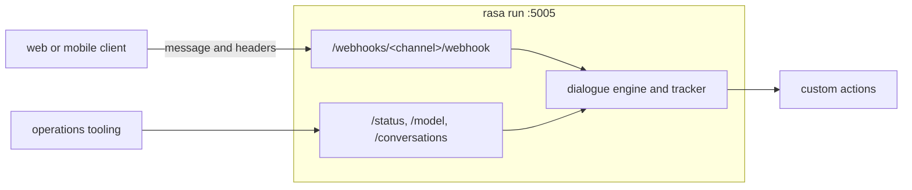
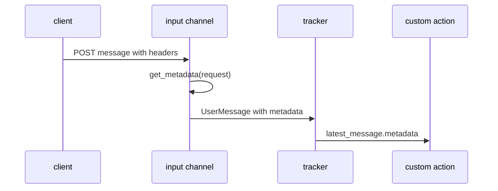

# How Rasa serves HTTP requests

`rasa run` starts Rasa's HTTP server, built with Sanic. It listens on port 5005
by default. A separate application server is not required, although production
deployments commonly place Rasa behind a gateway or reverse proxy.

`rasa run actions` starts a second HTTP service on port 5055 by default. The
main Rasa server calls it when custom actions run. Projects configured with
`actions_module` can instead execute actions in the main process.

## HTTP routes



Rasa exposes two types of HTTP routes:

- **Channel webhooks** receive user messages. Each channel configured in
  `credentials.yml` adds routes under `/webhooks/<channel>/`. These routes are
  available without `--enable-api`.
- **Management API routes** support status checks, model management, and
  tracker inspection. `--enable-api` adds these routes; it does not create the
  HTTP server itself.

Management routes can use Rasa's token or JWT options. Webhook authentication
must be implemented by the channel or by infrastructure in front of Rasa.

## Channels

An input channel receives platform requests, creates a Rasa `UserMessage`, and
passes it to the dialogue engine; its output channel formats and sends the
assistant's replies. To add a custom channel, create a Python class that extends
`InputChannel` or an existing connector, then register its module path in the
`credentials.yml` loaded by `rasa run`. A direct `InputChannel` subclass must
implement `name()` (the `/webhooks/<name>/` prefix) and `blueprint()` (the
routes that receive messages). A `RestInput` subclass inherits those routes, so
it only needs to override changed hooks such as `name()`, `get_metadata()`, or
`from_credentials()`; use an `OutputChannel` subclass when replies need a
different transport or format.

For example, this configuration enables the built-in REST channel:

```yaml
rest:
```

The client can then send a message with:

```bash
curl -X POST http://localhost:5005/webhooks/rest/webhook \
  -H "Content-Type: application/json" \
  -d '{"sender": "user-42", "message": "hi"}'
```

Messages with the same `sender` value use the same conversation tracker.

## Passing headers to custom actions

Only the input channel receives the raw HTTP request. To preserve selected
headers, the channel copies them into the `UserMessage` metadata:



The built-in REST channel reads metadata from the request body's `metadata`
field. If the values must come from HTTP headers, subclass the channel and
override `get_metadata(request)`. This example does that in
`header-assistant/channels/header_rest.py` and registers the custom channel in
`credentials.yml`.

Actions read the result from:

```python
metadata = tracker.latest_message.get("metadata", {})
```

Metadata belongs to the individual user message. Validate authentication data
before trusting it, and allow-list only the headers the assistant needs.

## Streaming responses

Add `?stream=true` to a REST-style webhook request to keep the HTTP response
open. Rasa sends each result as a newline-delimited JSON object when it becomes
available.

This supports:

- message-level streaming, where complete bot messages arrive immediately;
- chunk-level streaming, where an action emits partial text with
  `dispatcher.stream_start()`, `stream_chunk()`, and `stream_end()`.

The example channel marks partial output with `"chunk": true`, allowing its
clients to distinguish text to append from a new complete message.

## Deployment

Rasa can run as a process on a virtual machine, in a container, or on
Kubernetes. A gateway or reverse proxy commonly handles TLS, authentication,
rate limits, and trusted header injection.

The default in-memory tracker store is suitable for local development. A
multi-replica deployment needs shared tracker and lock stores configured in
`endpoints.yml`; otherwise replicas cannot share conversation state or
coordinate concurrent messages.
